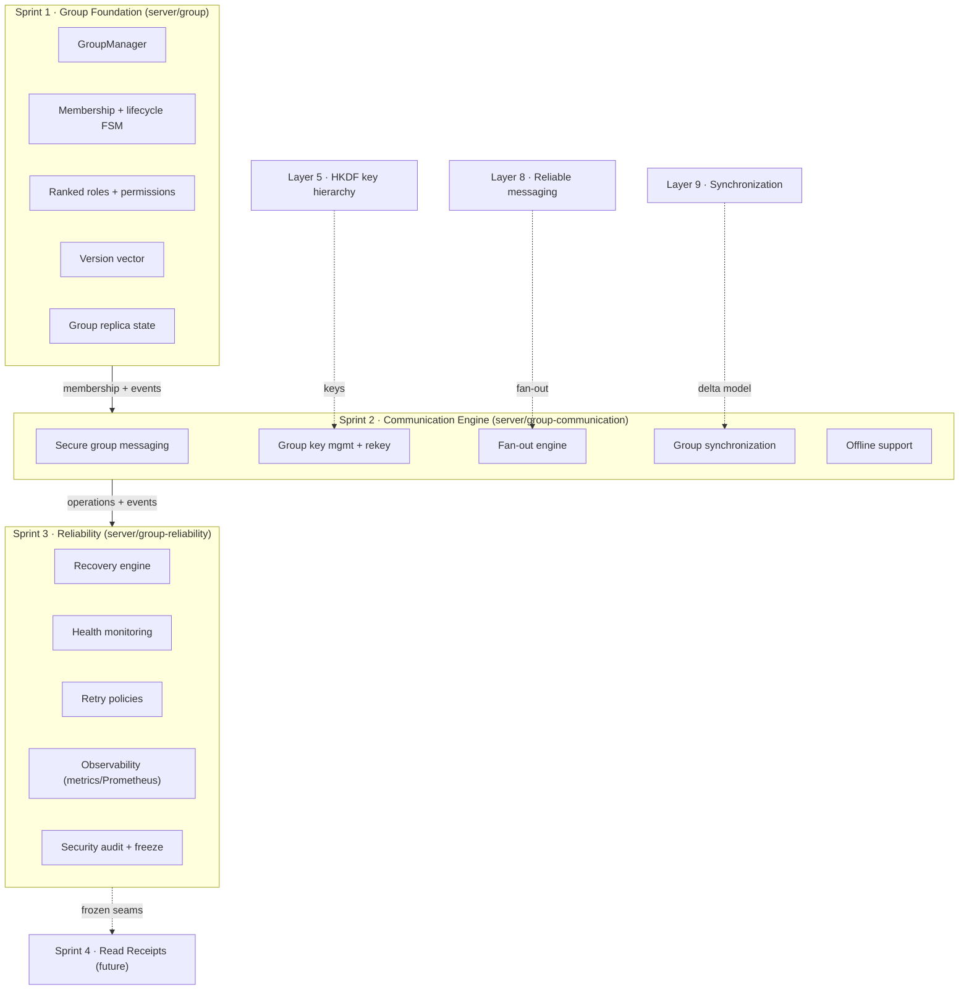
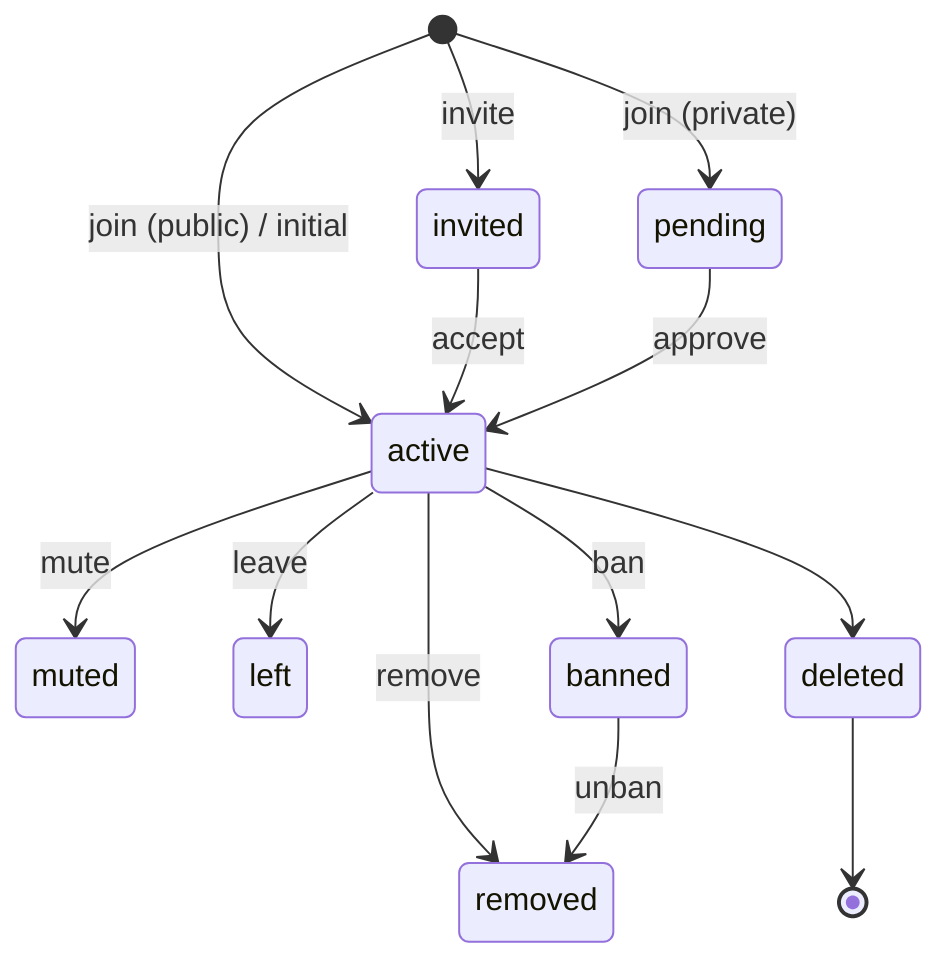
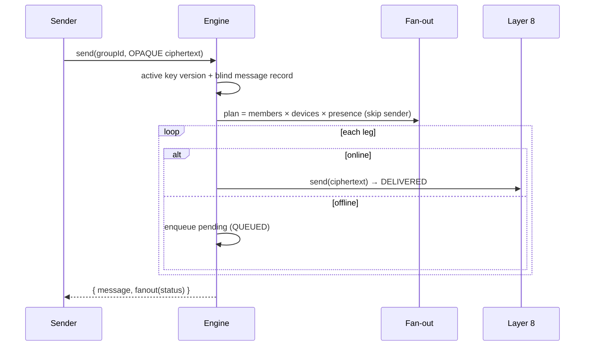
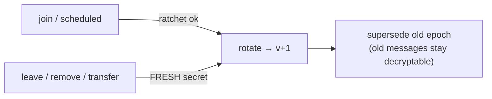
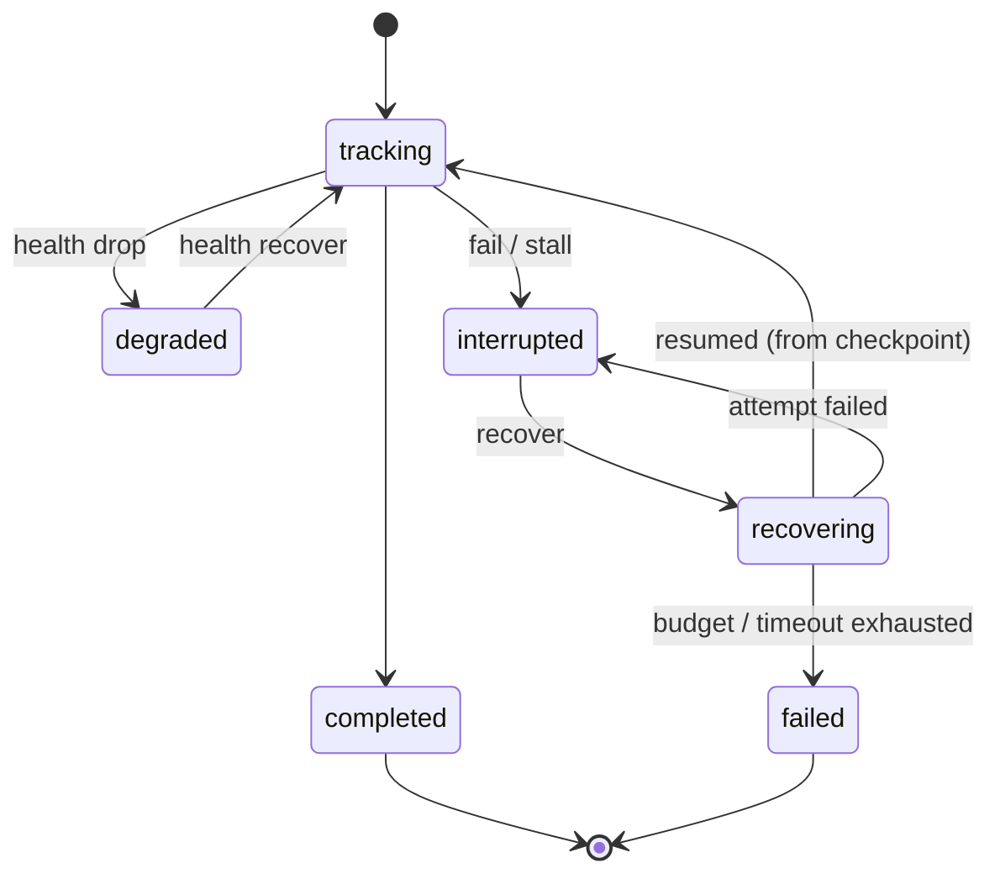

# Layer 10 — Secure Group Communication · FINAL

> **Status:** ✅ COMPLETE + FROZEN v1.0 · **Tests:** 1625 total, all green · **Sprints:** 1 (Foundation)
> · 2 (Communication Engine) · 3 (Production Hardening)
> **Boundary:** NO group read receipts / delivery aggregation / per-member delivery tracking / blue-tick
> logic (Sprint 4), NO voice/video (Layer 11). Those build on the **frozen** interfaces documented here.

Layer 10 delivers a **production-grade, end-to-end-encrypted group communication platform** on top of the
single-user secure-messaging stack (Layers 1–9). A group is a first-class distributed entity with
identity, membership, roles, versioned metadata, and replica state (Sprint 1); it is a live encrypted
channel with group key management, membership rekeying, multi-device fan-out, synchronization, and
offline support (Sprint 2); and it is reliable, recoverable, observable, and secure under production load
(Sprint 3).

---

## 1. Complete Group Architecture

Reused prior layers (studied, never modified): **Layer 5** HKDF key hierarchy (group keys are
device-local), **Layer 8** reliable-messaging engine (fan-out transport), **Layer 9** synchronization
delta model + reliability pattern. All integration is via **injected seams** — the platform is
transport-, discovery-, and connectivity-independent.

| Sprint | Module | Mount | New collections |
|---|---|---|---|
| 1 | `server/group/` | `/api/group-management` | managedgroups, groupmemberships, groupreplicastates, grouphistories |
| 2 | `server/group-communication/` | `/api/group-communication` | groupkeys, groupmessages, groupfanoutplans, groupcommreplicas, groupcommhistories |
| 3 | `server/group-reliability/` | `/api/group-reliability` | groupreliabilities, grouprecoveryrecords, groupreliabilityalerts |

---

## 2. Membership, Roles & Permissions (Sprint 1)

Membership is a validated state machine — `invited → active`, `active → muted/left/removed/banned`, etc.
Roles are **ranked** (`owner > administrator > moderator > member > guest`); an actor may only manage
strictly-lower-ranked members. Permissions are a per-group override layer over role defaults, with
owner-only permissions (delete/transfer/manage-permissions) that can never be granted away.

---

## 3. Group Messaging & Keys (Sprint 2)

The engine is a **blind relay**: it stores key **metadata** (versions + opaque SHA-256 fingerprints) and
**opaque ciphertext** — never key bytes or plaintext. Group keys are versioned epoch keys derived
device-local (`epochSecret(v) --HKDF--> Group Key(v)`), the fingerprint is the public commitment.

### Fan-out workflow

### Rekey workflow

A **departure** rotates with fresh randomness so the departed member cannot derive the next epoch; benign
rotations ratchet. Rotation supersedes (never deletes) the old epoch.

### Group synchronization

Reuses the Layer 9 delta model at group scope: compute the per-facet delta (`key-version` first so a
device can decrypt, then membership / metadata / replica), emit a resumable plan, apply monotonically.
Offline members reconnect → sync + resume deferred deliveries.

---

## 4. Reliability, Recovery & Retry (Sprint 3)

Sprint 3 wraps every **group operation** (group-message / fan-out / rekey / membership-update /
replica-sync / offline-delivery) in a reliability record with a monotonic **checkpoint**, a health
score, and a recovery lifecycle.

### Recovery workflow

Triggers → actions: interrupted-messaging / failed-fanout / replica / sync / offline / stall →
**resume-from-checkpoint**; rekey-failure / connection-loss → **retry**; membership-failure /
repository-failure → **replan**; exhaustion → **graceful-fail** (checkpoint intact, resumable later).
Retry policies: immediate / exponential-backoff (deterministic jitter) / fixed / none, with a bounded
max-attempt count **and** a lifetime retry budget **and** a recovery timeout. **Recovery never corrupts
state** — the checkpoint is read, never mutated; a resume re-runs only the remaining targets.

---

## 5. Monitoring & Observability (Sprint 3)

- **Per-operation health** (progress / reliability / backlog / freshness → `[0,1]` + status) and
  **per-group aggregate health** (`scoreGroupHealth`, per operation type).
- **Metrics registry** (`GroupMetrics`): messages per group, fan-out latency + targets, group throughput,
  replica drift, sync latency, membership changes, key-rotation count, offline queue size, pending
  operations, recovery success rate, resume/retry counts, concurrent operations, health score. Exposes
  `snapshot()`, `prometheus()`, and `registerExporter()` (OpenTelemetry/Prometheus hook).
- **Monitor + alerts** (`GroupMonitor`): operation-failure spikes, repeated recovery failures, unhealthy
  groups, stall timeouts, high fan-out failure, high replica drift, large offline backlogs, retry storms.
- **Background stall monitor**: an `unref`'d sweep flags no-progress operations as interrupted.
- **Diagnostics**: state + health + checkpoint + resume plan + recovery history per operation.

---

## 6. Security & Threat Model

Every group API is JWT-authenticated + owner/member-scoped; **every mutating reliability operation is
audited** (append-only, no content/keys). The platform's `securityAudit()` publishes the posture +
assumptions.

| Threat | Mitigation |
|---|---|
| Non-member reads/writes | Active-membership check on every op (Sprint-1 RBAC) |
| Privilege escalation | Ranked roles; owner-only permissions cannot be granted away |
| Departed member reads future messages | Fresh-secret rekey on leave/remove/transfer |
| New member reads history | Rotate on join; old epochs not distributed to joiners |
| Server key exposure | Keys device-local; server sees only fingerprints |
| Replay / progress forgery | At-most-once delivery (DeliveryGuard); monotonic checkpoint (no rewind) |
| Recovery hijack | Owner-scoped recovery; a resume is initiated by the owning device only |
| Group-storm abuse | Retry budget + rate-limit extension points |
| Metadata leakage | Control-plane metadata + numeric aggregates only; deep no-secret scan before every persist |

Out of scope (delegated): cryptographic replay resistance (Layer 5), ciphertext integrity in transit
(Layer 8).

---

## 7. Performance & Scalability

- **Large groups (1000+):** fan-out is a single linear pass; a 1200-member broadcast → 1199 legs in one
  plan; a 5000-target fan-out checkpoints to completion monotonically.
- **Concurrent operations:** 100 concurrent operations tracked without loss; 50 concurrent rekeys recover
  independently; per-group mutex serializes rekeys → monotonic key versions.
- **Cheap divergence** via replica fingerprints; opaque payloads are never parsed.
- **Horizontal scaling:** storage-independent repositories (in-memory + Mongo); the reliability layer is
  stateless beyond its records, so instances share the Mongo-backed stores. Metrics are per-instance;
  wire an exporter to aggregate.

---

## 8. Testing

| Suite | Sprint | Tests |
|---|---|---|
| `group/tests` | 1 | 66 |
| `group-communication/tests` | 2 | 41 |
| `group-reliability/tests` | 3 | 47 |

Coverage includes: group creation/membership/roles/permissions/versioning/replica; messaging/keys/rekey/
fan-out/sync/offline; recovery (every trigger)/health/retry/observability/security/freeze; large groups,
concurrent operations, massive fan-out, key rotation under load, replica/offline recovery, failure
injection, and **fuzz testing** of group protocol messages (randomized bounded checkpoints preserve
monotonicity + health-score invariants). **Full project suite: 1625 tests, all green.**

---

## 9. Protocol Freeze & Extension Points

Layer 10 is **frozen at v1.0** (`group-reliability/freeze/protocolFreeze.js`, served at
`/api/group-reliability/protocol`). Frozen public interfaces: `GroupManager` + `createGroupApi`;
`GroupCommunicationEngine` + `createGroupCommunicationApi` + `GroupKeyManager` + fan-out planner +
delivery legs; `GroupReliabilityManager` + `createGroupReliabilityApi` + `RecoveryCoordinator` +
`GroupMetrics` + event buses.

**Sprint 4 (Group Delivery & Read Receipt Engine) extension points:**
- `group-communication/delivery` — per-device delivery legs + `DELIVERY_UPDATED` events → aggregate into
  ✓ / ✓✓ / ✓✓-blue receipts.
- `group-communication/events` + `group-reliability/events` — drive receipt state off delivery +
  completion events without polling.
- `group-reliability/manager` — reuse the target/checkpoint model to track per-member delivery at scale.
- `group-reliability/monitoring` — `GroupMetrics.registerExporter` for receipt metrics.

---

## 10. Known Limitations

- **Presence/device resolution** on the server uses simple defaults (one logical device per member,
  explicit reconnect for offline recovery); a deployment injects real multi-device + presence resolvers.
- **Metrics are per-instance**; cross-instance aggregation needs an external collector via the exporter
  hook.
- **Group key distribution** is modeled as metadata (fingerprints + who-needs-it); the actual pairwise
  key delivery rides the existing Layer 4/5 channels and is the device's responsibility.
- No read receipts / delivery aggregation / blue ticks yet — that is Sprint 4, by design.

---

## 11. Future: Sprint 4 — Group Delivery & Read Receipt Engine

Sprint 4 will implement WhatsApp-style aggregated ✓ (sent), ✓✓ (delivered), and ✓✓-blue (read) receipts
with efficient per-member delivery tracking and scalable aggregation, built entirely on the frozen
delivery-leg + event + checkpoint seams above — **without modifying** the Layer 10 group platform.
