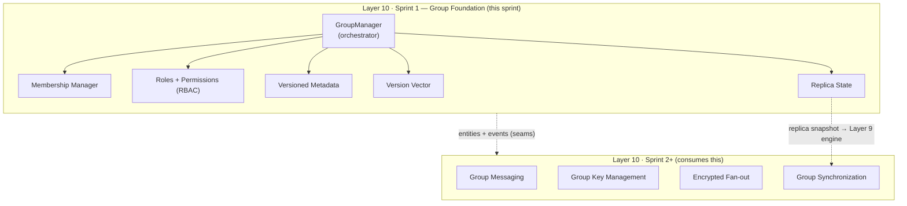
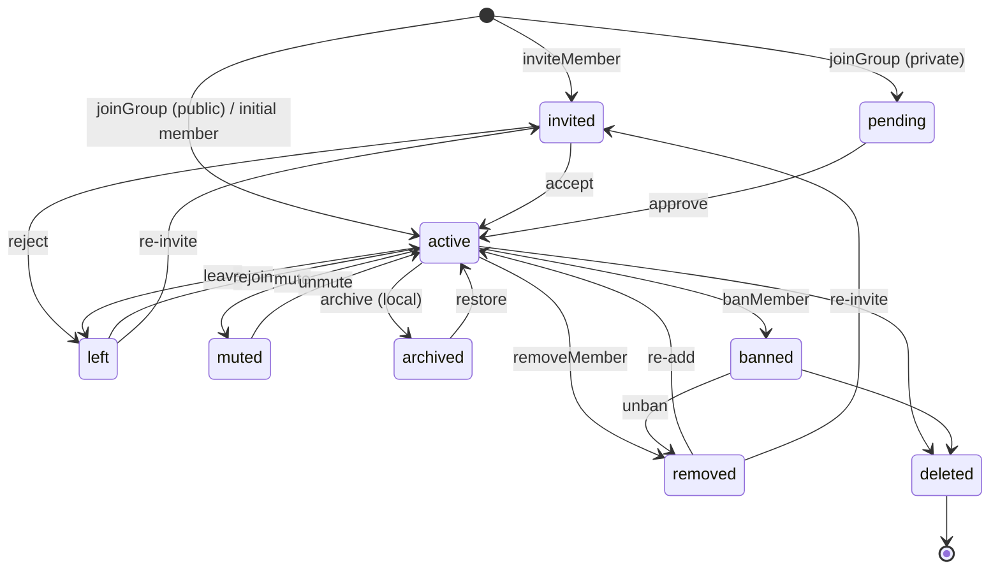
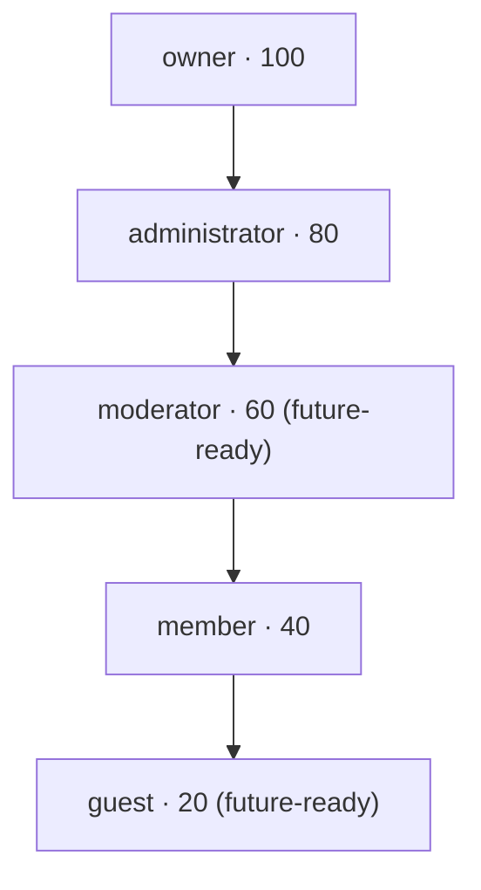
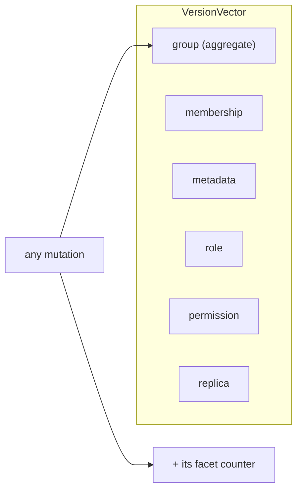

# Layer 10 · Sprint 1 — Group Foundation & Membership Management

> **Status:** ✅ Complete · **Tests:** 66 new (1537 total, all green) · **Location:** `server/group/`
> **Scope guard:** NO group messaging, encryption, rekeying, fan-out, delivery tracking, or read
> receipts — this sprint establishes Groups as **first-class distributed entities**. Sprint 2 consumes
> this foundation.

---

## 1. Overview

Layer 10 makes a **Group** a first-class distributed entity — an entity with its own identity,
lifecycle, membership, roles, permissions, versioned metadata, a per-facet version vector, and a
reconcilable replica snapshot. Everything a future secure-group-messaging layer needs to know *who is in
a group, what they may do, and what version of the group each device has seen* lives here, in a
subsystem that is **independent of transport, encryption, networking, and the synchronization
implementation**.

This is a **control plane**. It reasons over ids, roles, states, versions, and non-secret metadata
only. It never touches message plaintext, ciphertext, or key material — group encryption keys are
derived in a later sprint and never stored here.



### Independence & prior layers (studied, not modified)

| Reused concept | Where it comes from | How Layer 10 mirrors it |
|---|---|---|
| Typed error hierarchy (`.code` + `.status`) | Layer 9 replication / sync | `group/errors.js` |
| In-memory + Mongo repository pair | Every layer | `group/repository/*` |
| Event bus (`on`/`emit`/`*`) | Layer 6–9 | `group/events/events.js` |
| Version stamping + history | Layer 9 replication | `group/versions/versionManager.js` |
| Replica snapshot + fingerprint | Layer 9 replication | `group/replicas/replicaState.js` (`toReplicationEntities` seam) |
| `protectedRoute` JWT middleware | Layer 1 | `routes/groupManagementRoute.js` |

The existing Layer 1 chat group (`models/Group.model.js`, `/api/groups`) is **untouched**. Layer 10 is
additive: new collections (`managedgroups`, `groupmemberships`, `groupreplicastates`, `grouphistories`)
and a new mount `/api/group-management`.

---

## 2. Architecture

```
server/group/
├── index.js                     # barrel — public surface
├── errors.js                    # typed error hierarchy
├── types/types.js               # enums, transitions, permission defaults, typedefs
├── events/events.js             # GroupEventBus
├── versions/versionManager.js   # per-facet version vector + history
├── roles/roles.js               # ranked roles + RBAC predicates
├── permissions/permissions.js   # default + override permission resolution
├── lifecycle/lifecycle.js       # membership + group state machines
├── metadata/metadata.js         # versioned metadata facet
├── membership/membership.js     # membership record model + pure transitions
├── replicas/replicaState.js     # replica snapshot + fingerprint + drift
├── validators/validators.js     # request + invariant validation (no-secret scan)
├── serializers/serializers.js   # public DTOs (out)
├── dto/dto.js                   # request normalizers (in)
├── repository/
│   ├── inMemoryGroupRepository.js
│   └── mongoGroupRepository.js
├── models/                      # Mongoose schemas (additive collections)
│   ├── ManagedGroup.model.js
│   ├── GroupMembership.model.js
│   ├── GroupReplicaState.model.js
│   └── GroupHistory.model.js
├── manager/groupManager.js      # the orchestrator
├── api/groupApi.js              # DTO-normalizing facade
└── tests/                       # 6 DB-free suites (66 tests)

server/controllers/groupManagementController.js   # HTTP handlers
server/routes/groupManagementRoute.js             # /api/group-management
client/src/lib/groupManagement.js                 # GroupManagementClient
```

The manager is the only stateful component; every other module is pure (no I/O) and independently
testable. The manager depends on an injected **repository bundle** (storage-independent) and an injected
**clock + id generator** (deterministic tests).

---

## 3. Group Identity

Every group is the immutable-except-where-versioned entity:

| Field | Meaning |
|---|---|
| `groupId` | stable identity |
| `ownerId` | the single owner (moves only via ownership transfer) |
| `state` | `active` / `archived` / `deleted` (group lifecycle) |
| `metadata` | versioned facet: `name`, `description`, `avatar` descriptor, `tags`, `visibility`, `announcement`, `custom`, `version`, `updatedAt` |
| `visibility` | `private` / `public` / `hidden` / `invite-only` |
| `versions` | the **version vector** (see §8) |
| `permissionOverrides` | per-role `{ grant, revoke }` layer |
| `audit` | `createdBy`, `createdAt` |
| `createdAt` / `updatedAt` / `schemaVersion` | provenance |

Identity (`groupId`, `ownerId`, `createdAt`) is immutable. Everything mutable is versioned.

---

## 4. Membership Manager

The `GroupManager` exposes the full membership surface. Each operation is permission-checked,
lifecycle-validated, version-bumped, audited, and announced on the event bus.

| Operation | Rule |
|---|---|
| `createGroup` | creator becomes `owner` (active); optional `initialMembers` added active |
| `deleteGroup` | owner only (soft-delete + tombstone memberships) |
| `archiveGroup` / `restoreGroup` | `EDIT_METADATA`; freezes/unfreezes mutations |
| `inviteMember` | `INVITE_MEMBERS`; creates/renews an `invited` membership |
| `acceptInvitation` / `rejectInvitation` | self-service (`invited → active` / `left`) |
| `joinGroup` | public → `active`; else → `pending` request |
| `approveJoinRequest` | `APPROVE_JOIN_REQUESTS` (`pending → active`) |
| `leaveGroup` | self-service; owner must transfer first |
| `removeMember` / `banMember` | `REMOVE_MEMBERS` + strict rank over target |
| `muteMember` / `unmuteMember` | `MUTE_MEMBERS` + rank |
| `transferOwnership` | owner only; old owner → `administrator` |
| `changeRole` | `MANAGE_ROLES` + rank rules |

Validation covered: duplicate members, duplicate invitations, invalid ownership, circular ownership,
invalid roles, permission violations, invalid metadata, version conflicts, repository consistency,
unauthorized operations, and capacity limits.

---

## 5. Membership Lifecycle

Every membership moves through a **validated state machine** (`group/lifecycle/lifecycle.js`). Illegal
jumps are impossible by construction.



- **Counted** (a "real" member): `active`, `muted`, `archived`.
- **Pending** (awaiting a decision): `invited`, `pending`.
- **Terminal:** `deleted`. `banned` can only go to `removed` or `deleted`.

---

## 6. Roles & Permissions

Roles are **ranked**; an actor may only manage / assign roles **strictly below** their own.



**Effective permissions** are computed deterministically:

```
effective(role) = DEFAULT_ROLE_PERMISSIONS[role] − overrides[role].revoke + overrides[role].grant
```

- `owner` always holds every permission (overrides cannot lock the owner out).
- `manage-permissions`, `delete-group`, `transfer-ownership` are **structurally owner-only** — an
  override can never grant them to another role.
- Overrides are per-group (`{ [role]: { grant: [...], revoke: [...] } }`) — tune what each role may do
  without code changes.

Permission keys: `view-group`, `view-members`, `invite-members`, `remove-members`,
`approve-join-requests`, `mute-members`, `edit-metadata`, `manage-roles`, `manage-permissions`,
`transfer-ownership`, `delete-group`. Future messaging permissions (post / pin / react) extend this set
without breaking callers.

---

## 7. Group Metadata

Metadata is an independently **versioned sub-entity** (`group/metadata/metadata.js`). Each edit produces
a new immutable metadata object with a bumped `version`, records a history entry (which fields changed,
by whom), and supports an optimistic `expectedVersion` guard. The avatar is a **descriptor**
(url / mime / size / checksum) — never raw bytes. A `custom` bag is reserved for future extension.

---

## 8. Version Management

A group carries a **version vector** of independent monotonic counters:



Any mutation bumps the aggregate `group` counter **plus** the specific facet's counter, so a device (or
a future synchronizer) can tell exactly which facet changed. `compareVersionVectors` returns
`equal` / `ahead` / `behind` / `diverged` — the seam a future vector-clock / group-replication hybrid
drops onto without changing callers. Version history records every aggregate bump with actor + reason.

---

## 9. Group Replica State

Every device keeps a **replica snapshot** of a group's control plane
(`group/replicas/replicaState.js`), rebuilt + persisted on every mutation:

| Field | Meaning |
|---|---|
| `replicaId` / `groupId` / `replicaVersion` | identity |
| `membershipSnapshot` | `memberId → { role, state, version, counted }` |
| `metadataSnapshot` | the metadata facet + version |
| `versions` | the full version vector |
| `pendingUpdates` | locally-queued offline changes |
| `syncMetadata` | `{ lastBuiltAt, lastSyncedGroupVersion, fingerprint }` |
| `diagnostics` | member counts + drift |

The **fingerprint** is an order-independent SHA-256 over the material state — a cheap divergence
detector. `diffReplica(stored, fresh)` reports `{ diverged, drift, reason }`. `toReplicationEntities`
maps the snapshot into Layer 9 Sprint 1's `entityId → version` maps, so a future group-sync sprint
reuses the existing replication engine unchanged.

---

## 10. Repositories

Storage-independent contracts, with in-memory (reference + tests) and Mongo (production) implementations:

- **`groups`** — `create · findById · update · delete · listByOwner · exists`
- **`memberships`** — `upsert · findById · findByGroupAndMember · listByGroup · listByMember · update · delete · countByGroup` (all state-filterable)
- **`replicaState`** — `upsert · findByGroup · update`
- **history** (`versionHistory`, `metadataHistory`, `roleHistory`, `permissionHistory`,
  `membershipHistory`, `audit`) — `record · listByGroup · list`

Mongo collections are additive; history shares one `GroupHistory` collection keyed by `kind`.

---

## 11. API Endpoints

Mounted at **`/api/group-management`**, all JWT-protected (`req.user._id` = acting caller).

| Method | Path | Operation |
|---|---|---|
| `POST` | `/groups` | create group |
| `GET` | `/groups/mine` | my groups |
| `GET` | `/groups/:id` | group details (public) |
| `GET` | `/groups/:id/details` | full details (members + roles + permissions) |
| `DELETE` | `/groups/:id` | delete group |
| `POST` | `/groups/:id/archive` · `/restore` | lifecycle |
| `POST` | `/groups/:id/invite` · `/accept` · `/reject` | invitations |
| `POST` | `/groups/:id/join` · `/approve` · `/leave` | join / leave |
| `POST` | `/groups/:id/remove` · `/ban` · `/mute` · `/unmute` | moderation |
| `POST` | `/groups/:id/transfer-ownership` | ownership |
| `POST` | `/groups/:id/roles` | change role |
| `PATCH` | `/groups/:id/metadata` | update metadata |
| `PUT` | `/groups/:id/permissions` | permission overrides |
| `GET` | `/groups/:id/members` · `/roles` · `/permissions` · `/versions` · `/replica` | reads |
| `POST` | `/groups/:id/replica/refresh` | rebuild replica + report drift |
| `GET` | `/groups/:id/history/:kind` | `versions` / `metadata` / `membership` / `audit` |
| `GET` | `/health` | control-plane health |

---

## 12. Client Integration

`client/src/lib/groupManagement.js` — `GroupManagementClient` wraps the API with subscribable hooks:
`onMembershipChange`, `onMetadataChange`, `onRoleChange`, `onVersionChange`, `onReplicaChange`, and the
inert `onGroupMessaging` seam. It supports the full create → invite → accept flow, role/metadata/
permission updates, version + replica refresh, and per-group `startAutoRefresh` for drift detection.

---

## 13. Events

The manager emits typed events a future Sprint 2 consumes:

`GROUP_CREATED`, `GROUP_DELETED`, `GROUP_ARCHIVED`, `GROUP_RESTORED`, `MEMBER_INVITED`,
`INVITATION_ACCEPTED`, `INVITATION_REJECTED`, `JOIN_REQUESTED`, `MEMBER_JOINED`, `MEMBER_LEFT`,
`MEMBER_REMOVED`, `MEMBER_BANNED`, `MEMBER_MUTED`, `MEMBERSHIP_STATE_CHANGED`, `OWNERSHIP_TRANSFERRED`,
`METADATA_UPDATED`, `ROLE_CHANGED`, `PERMISSION_CHANGED`, `GROUP_VERSION_UPDATED`, `REPLICA_UPDATED`.

Events carry ids + roles + states + versions + counts only — never content or keys.

---

## 14. Performance & Concurrency

- **Per-group async mutex** serializes mutating operations so concurrent membership updates + version
  bumps never interleave or lose a write (proven by the 50-concurrent-join test → exactly N+1 members,
  monotonic versions).
- **Indexed lookups:** `findByGroupAndMember` is O(1) in memory (composite key) and unique-indexed in
  Mongo; member lists are paginated.
- **Cheap divergence checks** via replica fingerprints instead of full-state diffs.
- Pure, immutable domain functions keep reconciliation deterministic + allocation-light.

---

## 15. Testing

Six DB-free suites (`node --test`), 66 tests:

| Suite | Covers |
|---|---|
| `group-creation` | identity, initial members, visibility, deletion, archive/restore, version bumps |
| `membership-lifecycle` | state machine, invitations, join/approve, leave, moderation, capacity, history |
| `roles-permissions` | RBAC predicates, permission resolution + overrides, ownership transfer |
| `metadata-versioning` | metadata patch/version, version vector, optimistic guard, history |
| `replica-repository` | replica snapshot/fingerprint/drift, repository contracts, deep-copy isolation |
| `concurrency-stress` | 50-concurrent joins, duplicate-join races, 500-member group, validation hardening |

Full project suite: **1537 tests, all green** (no regressions).

---

## 16. Future Group Messaging Integration (Sprint 2)

Sprint 2 (secure group messaging, group key management, encrypted fan-out, group synchronization) builds
**on top of** this foundation, consuming — not modifying — it:

- **Membership** answers *who receives a fan-out* (counted members) and *who may post* (mute/role).
- **Events** (`MEMBER_JOINED`, `MEMBER_LEFT`, `ROLE_CHANGED`, …) drive **group rekeying** triggers.
- **Version vector** + **replica snapshot** (`toReplicationEntities` seam) feed **group synchronization**
  onto the frozen Layer 9 replication engine.
- **Permissions** gain messaging keys (post / pin / react) with zero schema change.
- Group encryption keys are derived in Sprint 2 and **never** enter this control plane.
