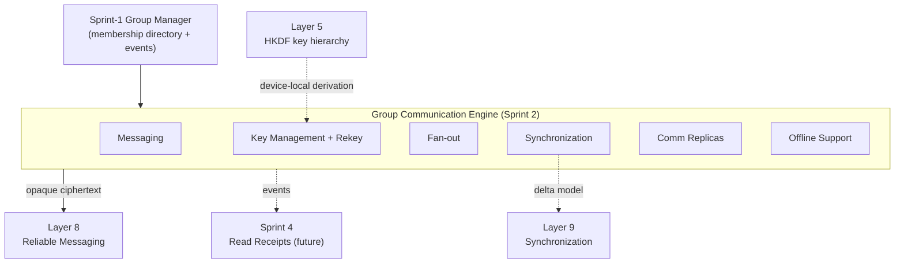
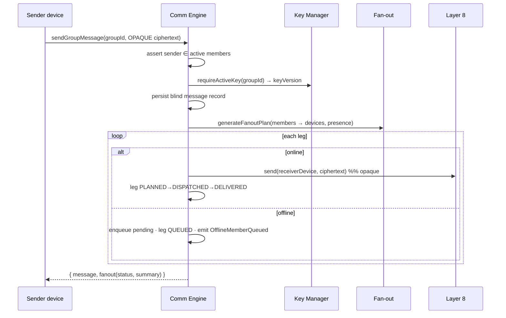
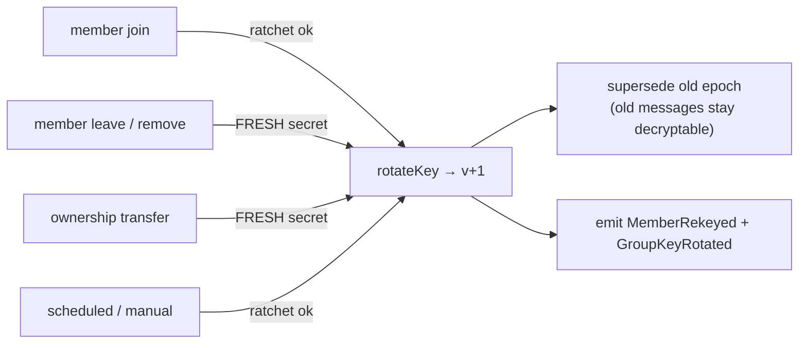
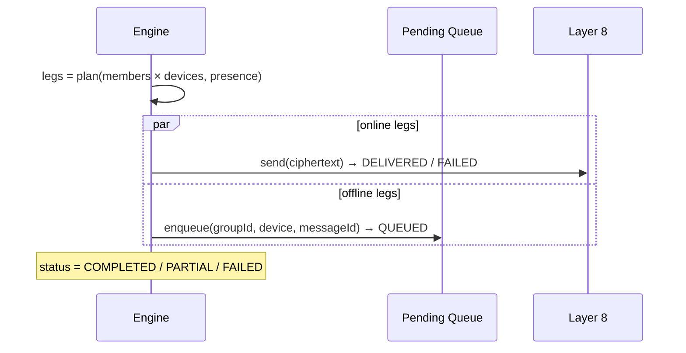
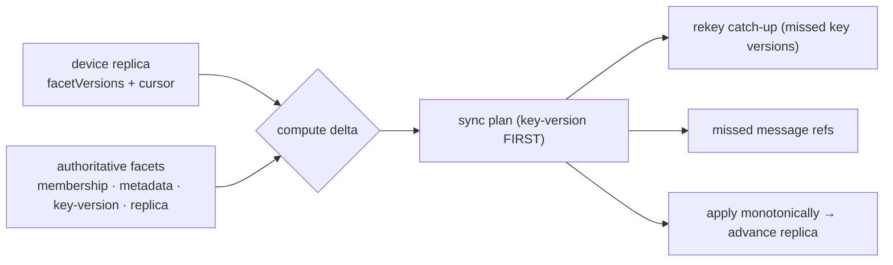

# Layer 10 · Sprint 2 — Group Communication Engine

> **Status:** ✅ Complete · **Tests:** 41 new (1578 total, all green) · **Location:** `server/group-communication/`
> **Scope guard:** NO production monitoring / hardening / observability (Sprint 3), NO group read
> receipts / delivery aggregation (Sprint 4), NO voice/video. This sprint delivers secure group
> communication, group key management, membership rekeying, fan-out, synchronization, and offline
> support — reusing Layers 5, 8, and 9 and the Sprint-1 Group Foundation.

---

## 1. Overview

Sprint 1 established a **Group** as a first-class distributed entity (identity + membership + roles +
versioned metadata + replica state). Sprint 2 turns that foundation into a **live, end-to-end-encrypted
communication channel**. The Group Communication Engine composes six responsibilities and **reuses
earlier layers rather than reinventing them**:

| Responsibility | Reuses |
|---|---|
| Secure group messaging | opaque ciphertext model (Layers 2–5 already encrypted it) |
| Group key management | **Layer 5** key-hierarchy HKDF-SHA256 primitives (device-local) |
| Membership rekeying | **Sprint-1** group membership events |
| Fan-out delivery | **Layer 8** reliable-messaging engine (injected `send` hook) |
| Group synchronization | **Layer 9** delta model (compute → plan → apply monotonically) |
| Offline-member support | **Layer 9** resume/cursor concepts + a pending queue |



### Security model — a blind relay

The engine is a **control plane + blind relay**. It stores group-key **metadata** (versions + opaque
SHA-256 **fingerprints**) and **opaque ciphertext** — never key bytes or plaintext. Group keys are
derived and held **device-local**; the device posts only the *fingerprint* (a commitment) so the engine
can confirm key agreement without ever seeing a key. Every persisted object passes a deep no-secret
scan.

---

## 2. Architecture

```
server/group-communication/
├── index.js                     # barrel — public surface
├── errors.js · events/ · types/ # typed errors, event bus, enums
├── key-management/
│   ├── groupKey.js              # device-local HKDF derivation + fingerprints + createLocalKeyProvider
│   ├── keyManager.js            # epoch lifecycle: create/rotate/expire/distribute/audit
│   └── rekey.js                 # trigger → rotation decision (fresh vs ratchet) + catch-up
├── messaging/groupMessage.js    # opaque group-message model
├── fanout/fanoutPlanner.js      # per-device delivery plan (online/offline/priority/partial)
├── delivery/delivery.js         # leg lifecycle + DeliveryGuard (at-most-once)
├── synchronization/groupSync.js # facet-delta sync plan (key-first, resumable)
├── replicas/groupCommReplica.js # comm replica (facet versions + cursor + recovery)
├── validators/ · serializers/ · dto/
├── repository/                  # in-memory + mongo (storage-independent)
├── models/                      # GroupKey, GroupMessage, GroupFanoutPlan, GroupCommReplica, GroupCommHistory
├── manager/groupCommunicationEngine.js   # the orchestrator + createGroupDirectoryFromManager
├── api/groupCommunicationApi.js
└── tests/                       # 4 DB-free suites (41 tests)

server/controllers/groupCommunicationController.js   # HTTP handlers
server/routes/groupCommunicationRoute.js             # /api/group-communication
client/src/lib/groupCommunication.js                 # GroupCommunicationClient
```

The engine depends only on **injected seams** (directory, device resolver, presence resolver, messaging
send hook, key provider) — it is transport-, discovery-, and connectivity-independent, so future media /
voice / video reuse it unchanged.

---

## 3. Group Communication Engine

`GroupCommunicationEngine` is the orchestrator. Key methods: `establishGroupKey`, `rotateGroupKey`,
`handleMembershipChange`, `sendGroupMessage`, `receiveGroupMessage`, `synchronizeGroup`,
`registerReplica`, `resumeDelivery`, `getDeliveryStatus`, `fanoutDiagnostics`. `attachToGroupEvents(bus)`
auto-wires rekeying to the Sprint-1 group event bus.

### Group messaging workflow



---

## 4. Group Key Management

Each group has a **versioned epoch key** (sender-key style). The device derives it locally with the
Layer 5 HKDF primitives; the engine stores only metadata:

```
epochSecret(v) ──HKDF("group-key|gid=G|v=V")──▶ Group Key(v)  [32 bytes, DEVICE-LOCAL]
                                                     │
                                          groupKeyFingerprint (SHA-256)  ──▶ stored server-side
```

`GroupKeyManager` owns the lifecycle: `createInitialKey`, `rotateKey` (supersedes the prior epoch),
`markDistributed`/`pendingDistribution`, `expireKey`/`revokeKey`/`sweepExpired`, and a key audit trail.
Key state machine: `pending → active → superseded → expired/revoked`.

---

## 5. Membership Rekeying



The forward-secrecy rule: a **departure** (`leave` / `remove` / `ownership-transfer` / `compromise`)
rotates with **fresh randomness** so the departed member — who holds `epochSecret(v)` — cannot derive
`epochSecret(v+1)`. Benign rotations (join / scheduled) may **ratchet** (`HKDF(prev)`, one-way).
Rotation **supersedes** (never deletes) the old epoch, so in-flight/older messages stay decryptable —
minimizing disruption to active conversations. `handleMembershipChange` maps a Sprint-1 event to the
right trigger automatically.

---

## 6. Fan-out Engine

`generateFanoutPlan` builds one **leg per target device** (a user may have several), skips the sender's
own device, classifies each leg online/offline, priority-sorts (high → low, reachable first), and caps at
`maxFanout` (partial fan-out beyond it). The engine dispatches **online** legs through the injected
**Layer 8** `send` hook and **defers offline** legs to the pending queue. Delivery is **at-most-once per
device** (`DeliveryGuard`).



Leg lifecycle: `planned → queued/dispatched → delivered/failed`.

---

## 7. Group Synchronization

`createGroupSyncPlan` reuses the Layer 9 delta model at group scope: it computes the per-facet delta a
device is missing and emits an ordered, resumable plan.



Facets sync **key-version first** (so the device can decrypt), then membership, metadata, replica. The
plan is partial-friendly (`cursor` resumes an interrupted sync). Missed **messages** are returned as
**refs** only; their ciphertext resumes over Layer 8.

---

## 8. Group Replica Manager

The comm replica **extends** the Sprint-1 replica with communication facets: `facetVersions`,
`keyVersion`, `deliveryCursor`, `pendingUpdates`, `recovery`, `diagnostics`, and an opaque
`fingerprint`. `registerReplica` / `synchronizeGroup` / `getReplica` / `listReplicas` manage them;
`applyReplicaUpdate` advances monotonically (rejects a regressing authoritative version →
`ReplicaMismatchError`).

---

## 9. Offline Member Support

```mermaid
sequenceDiagram
  participant Off as Offline device
  participant Eng as Engine
  participant Q as Pending Queue
  Note over Eng,Q: while offline — legs QUEUED, rekeys tracked by version
  Off->>Eng: reconnect → synchronizeGroup(deviceId)
  Eng->>Eng: advance facets + rekey catch-up + missed-message refs
  Eng->>Q: drainDevice → resume deferred deliveries over Layer 8
  Eng-->>Off: OfflineMemberResumed
```

Deferred delivery plans, a pending-member queue, sync-on-reconnect, rekey catch-up, missed
metadata/membership updates, and resume-delivery all reuse the Layer 9 resume/cursor approach.

---

## 10. Repositories

Storage-independent contracts (in-memory reference + Mongo):

- **`keys`** — `create · findActive · findByVersion · listByGroup · update`
- **`messages`** — `create · findById · listByGroup · listAfter · count`
- **`fanoutPlans`** — `create · findById · findByMessage · listByGroup · update`
- **`replicas`** — `upsert · findByDevice · listByGroup · update`
- **`pendingQueue`** — `enqueue · listByDevice · listByGroup · drainDevice · count`
- history (`keyAudit`, `deliveryAudit`, `syncHistory`, `audit`)

New Mongo collections (additive): `groupkeys`, `groupmessages`, `groupfanoutplans`, `groupcommreplicas`,
`groupcommhistories`.

---

## 11. API Endpoints

Mounted at **`/api/group-communication`**, all JWT-protected (`req.user._id` = caller/sender).

| Method | Path | Operation |
|---|---|---|
| `POST` | `/groups/:id/keys/establish` · `/keys/rotate` | establish / rotate key |
| `GET` | `/groups/:id/keys` · `/keys/version` · `/keys/audit` | key reads |
| `POST` | `/groups/:id/keys/sweep` | expire past-TTL keys |
| `POST` | `/groups/:id/messages` | send group message |
| `GET` | `/groups/:id/messages` · `/messages/:mid` | read messages |
| `POST` | `/groups/:id/messages/:mid/receive` | confirm receipt |
| `GET` | `/groups/:id/messages/:mid/fanout` · `/delivery` | fan-out plan / delivery status |
| `GET` | `/groups/:id/fanout/diagnostics` | fan-out roll-up |
| `POST` | `/groups/:id/resume` · `GET /pending` | offline recovery |
| `POST` | `/groups/:id/sync` · `/replicas` | synchronize / register replica |
| `GET` | `/groups/:id/replicas` · `/replicas/:deviceId` | replica reads |
| `GET` | `/health` | health |

---

## 12. Client Integration

`client/src/lib/groupCommunication.js` — `GroupCommunicationClient` with injected `encryptForGroup` /
`decryptFromGroup` / `deriveKeyFingerprint` hooks (the app owns crypto; the engine only sees ciphertext +
fingerprints). Supports group messaging, automatic rekey, membership updates, `synchronize`/`resume` on
reconnect, replica refresh, background auto-sync, and an inert `onReceiptHook` Sprint-4 seam.

---

## 13. Events

`GroupMessageSent`, `GroupMessageReceived`, `FanoutStarted`, `FanoutCompleted`, `DeliveryUpdated`,
`MemberRekeyed`, `GroupKeyRotated`, `GroupKeyExpired`, `ReplicaUpdated`, `SynchronizationStarted`,
`SynchronizationCompleted`, `OfflineMemberQueued`, `OfflineMemberResumed`. Sprint 4 consumes these.

---

## 14. Validation

Invalid/expired keys, stale key versions, unauthorized members, invalid fan-out plans (duplicate
devices), replica mismatch, synchronization failure, duplicate delivery, repository consistency,
unauthorized operations, and the no-secret invariant (deep scan rejects `groupKey`, `epochSecret`,
`plaintext`, … anywhere in a record).

---

## 15. Performance & Concurrency

- **Per-group mutex** serializes key rotations → monotonic versions under concurrent rekeys (proven:
  10 concurrent rotations → versions 1…11, exactly one active).
- **Concurrent sends** run lock-free (each message is independent) — 40 concurrent sends, no loss.
- **Large groups (1000+):** fan-out is a single linear pass; a 1200-member broadcast produces 1199 legs
  in one plan.
- **Cheap divergence** via replica fingerprints; opaque payloads are never parsed.

---

## 16. Testing

Four DB-free suites (`node --test`), 41 tests:

| Suite | Covers |
|---|---|
| `key-management` | derivation, ratchet-vs-fresh, rekey policy, key lifecycle, join/leave rekey, auto-rekey from Sprint-1 events |
| `messaging-fanout` | fan-out planning, sender-skip, online/offline split, delivery status, priorities, duplicate guard |
| `offline-sync` | comm replica delta/apply, sync plan (key-first, resumable), pending queue, resume-on-reconnect, missed messages |
| `concurrency-repo-stress` | validation hardening, repository contracts, 40 concurrent sends, 10 concurrent rekeys, 1200-member fan-out |

Full project suite: **1578 tests, all green** (no regressions).

---

## 17. Future: Group Delivery & Read Receipt Engine (Sprint 4)

Sprint 3 hardens this subsystem for production (monitoring, observability, recovery, protocol freeze).
Sprint 4 builds the Group Delivery & Read Receipt Engine (WhatsApp-style ✓ / ✓✓ / ✓✓ blue aggregation)
**on the events + delivery legs defined here** — `DeliveryUpdated` + the per-leg delivery records are the
exact seam it aggregates. Neither modifies this engine.
