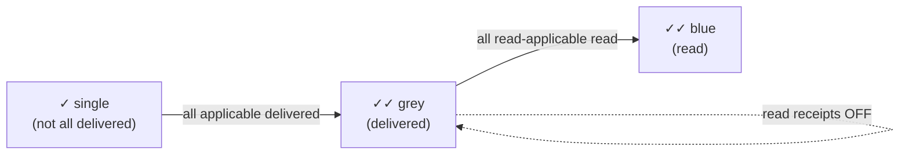
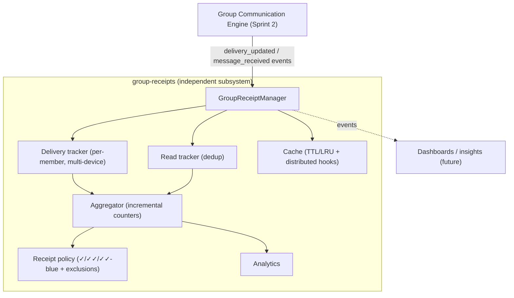
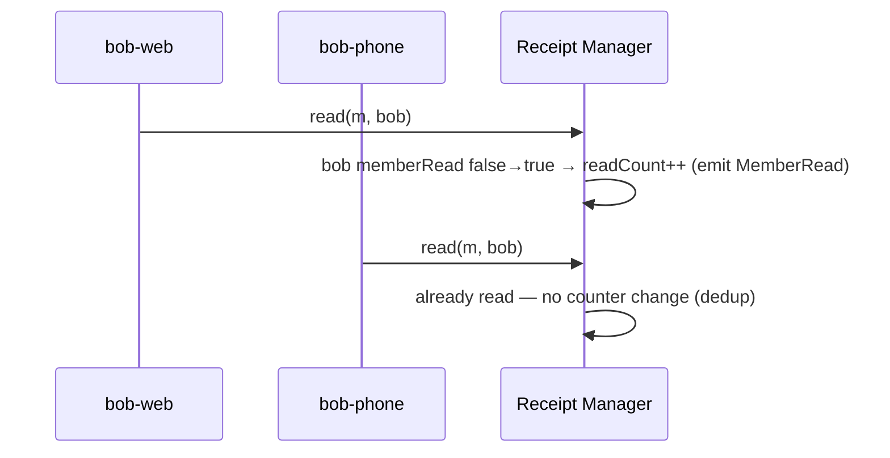
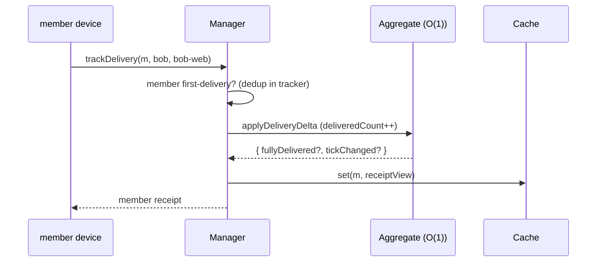

# Layer 10 · Sprint 4 — Group Delivery Intelligence & Receipt Aggregation

> **Status:** ✅ Complete · **Tests:** 35 new (1660 total, all green) · **Location:** `server/group-receipts/`
> An **independent** subsystem on top of the frozen Group Communication platform (Sprints 1–3). It does
> NOT modify messaging, fan-out, or synchronization — it consumes their events.

---

## 1. Overview

Sprint 4 adds **delivery intelligence**: per-member delivery + read tracking, incremental receipt
aggregation, and WhatsApp-style delivery indicators — computed **efficiently for groups of 1000+
members**.

### WhatsApp receipt semantics

| Indicator | Meaning |
|---|---|
| **✓ Single tick** | Message exists but is **not yet delivered to every applicable member** |
| **✓✓ Grey double** | **Delivered** to every applicable member |
| **✓✓ Blue double** | **Read** by every read-applicable member |



### The scalability guarantee

> **Receipt reads are O(1).** Each per-member transition applies a constant-time delta to a single
> incremental **aggregate**; a receipt query reads the aggregate (cache-fronted) and **never scans the
> member set**. Only explicit list queries (readers / pending) are O(applicable), inherent to returning
> a list.



---

## 2. Architecture

```
server/group-receipts/
├── index.js · errors.js · types/types.js · events/events.js · dto/dto.js
├── delivery/deliveryTracker.js     # per-member delivery, multi-device roll-up
├── reads/readTracker.js            # per-member read, duplicate-read prevention
├── aggregation/
│   ├── aggregator.js               # incremental counters (O(1) deltas)
│   └── receiptPolicy.js            # WhatsApp tick logic + applicable-set + exclusions
├── analytics/analytics.js          # latency / percentages (O(1) from the aggregate)
├── cache/receiptCache.js           # TTL + LRU + distributed (L2) hooks
├── validators/ · serializers/
├── repository/ (inMemory + mongo)  # aggregates · memberReceipts · analytics · history
├── models/ (GroupReceiptAggregate, GroupMemberReceipt, GroupReceiptHistory)
├── manager/groupReceiptManager.js  # the orchestrator (+ attachToGroupComm seam)
└── api/receiptApi.js

server/controllers/groupReceiptController.js   # HTTP handlers
server/routes/groupReceiptRoute.js             # /api/group-receipts
client/src/lib/groupReceipts.js                # GroupReceiptsClient + TICK
```

New Mongo collections (additive): `groupreceiptaggregates`, `groupmemberreceipts`,
`groupreceipthistories`.

---

## 3. Per-Member Delivery Tracking

Each `(message, member)` has one record with a `devices` map (multi-device). The member-level status is
the **max across devices** — a member is *delivered* as soon as **any** device confirms. Supports
`pending / sent / delivered / expired / failed`, retries, delivery timestamp + latency, device metadata,
and a bounded history. The tracker returns a `memberBecameDelivered` flag that is true **only on the
member's first delivery**, so the aggregate counter moves exactly once per member.

## 4. Per-Member Read Tracking

Reading is **deduplicated per user**: a member counts as *read* exactly once even if several devices
report a read. Reading implies delivery. Supports `unread / read`, read timestamp, reading device(s),
read latency, and **privacy-policy hooks** (`readReceiptHook(memberId)` decides whether a member's reads
are counted at all).



---

## 5. Receipt Aggregation Engine

The aggregate holds counts + latency sums + an applicable-member snapshot + the computed tick.
`applyDeliveryDelta` / `applyReadDelta` are **O(1)** and return `fullyDelivered` / `fullyRead` milestone
flags. Counts view: `delivered / read / pending / waiting / unread / failed`.



---

## 6. WhatsApp Receipt Logic (configurable)

`computeTick(aggregate, policy)` — single until `deliveredCount == applicableCount`; grey when fully
delivered; blue when `readCount == readApplicableCount`. **Configurable policy** is the seam for future
privacy + business rules **without architecture changes**:

- `excludeSender` (default true) — sender never counts toward their own receipt.
- `readReceiptsEnabled: false` — caps the indicator at grey (blue never shown).
- `readApplicableCount < applicableCount` — per-member privacy exclusions (a member who disabled read
  receipts) drop out of the blue requirement.
- Member exclusions (left / not-member / business rule) applied when the applicable set is built.

---

## 7. Delivery Analytics

Derived **O(1)** from the aggregate's running counters/sums: delivery + read latency (averaged),
delivery %, read %, pending + offline members, and a compact stats block for dashboards. Offline
enumeration uses an injected presence resolver (optional) and never scans members in the core path.

---

## 8. Caching

`ReceiptCache` — TTL + LRU of computed receipt views, refreshed in place on each aggregate update (no
periodic recompute). **Distributed cache hooks** (`{ get, set, del }`, e.g. Redis) make the local cache
an L1 in front of a shared L2, fail-open (a cache error never breaks the receipt path).

---

## 9. API Endpoints

Mounted at **`/api/group-receipts`**, all JWT-protected. A member reports only their **own**
delivery/read.

| Method | Path | Operation |
|---|---|---|
| `POST` | `/messages` | register a message for receipt tracking |
| `POST` | `/messages/:id/delivered` · `/read` | report this device's delivery / read |
| `GET` | `/messages/:id` | receipt status (tick + counts) |
| `GET` | `/messages/:id/readers` · `/pending` · `/offline` | member lists |
| `GET` | `/messages/:id/member/:memberId` | one member's receipt |
| `GET` | `/messages/:id/analytics` · `/delivery-stats` · `/read-stats` · `/diagnostics` | analytics |
| `GET` | `/groups/:groupId/receipts` | recent group receipts (dashboard) |
| `GET` | `/health` | health |

---

## 10. Client Integration

`client/src/lib/groupReceipts.js` — `GroupReceiptsClient` + `TICK` + `tickIndicator()`. Register on send,
`markDelivered` / `markRead` for the local device, `getReceipt` / `getReaders` / `getPending` /
`getOffline` / `getAnalytics`, and `onTick` / `onReceipt` subscriptions (+ `ingestEvent` for
socket-pushed live updates).

---

## 11. Events

`MessageRegistered`, `MemberDelivered`, `MemberRead`, `ReceiptUpdated`, `AggregationUpdated`,
`DeliveryCompleted`, `GroupFullyDelivered`, `GroupFullyRead`, `AnalyticsUpdated`. Events carry ids +
states + counts + ticks only — never content or keys.

---

## 12. Validation

Duplicate reads/deliveries (idempotent via once-per-member flags), invalid aggregates (count bounds),
unauthorized access (a member reports only their own state), repository consistency, replay (monotonic
first-delivery/first-read flags can't rewind), malformed metadata + privacy-policy exclusions, and the
no-content deep scan before every persist.

---

## 13. Performance & Testing

- **O(1) receipt reads** proven for 2000-member groups (counts correct without member enumeration).
- **1500-member** group aggregated to blue; **200 concurrent deliveries** with no loss; **20 concurrent
  multi-device reads** for one member counted exactly once.
- Delayed delivery/reads, privacy rules, cache TTL/LRU/L2, and the group-comm adapter.

35 new tests across 4 suites (tick logic, delivery/read tracking, aggregation/cache/analytics,
large-group/stress). **Full suite: 1660 tests, all green.**

---

## 14. Integration & Independence

The Group Communication Engine (Sprint 2) is **never modified**. `attachToGroupComm(bus, { resolveMember })`
subscribes to `group-comm.delivery_updated` (→ `trackDelivery`) and `group-comm.message_received` (→
`trackRead`); the injected `resolveMember(deviceId)` maps a Sprint-2 device id to a member id. Registration
(`registerMessage`, with the applicable member set) happens at send time. The subsystem is otherwise fully
standalone and reusable for future analytics, dashboards, and administrative features **without changes to
the messaging or synchronization architecture**.

---

## 15. Future Privacy Extensions

The configurable receipt policy + per-member `readReceiptHook` already model **read-receipts-disabled**
and **per-member privacy exclusions**. Future business rules (e.g. broadcast semantics, admin-only
receipts, retention windows) plug into the same policy seam — no aggregation or tracking redesign
required. This completes Layer 10: a production-grade secure group communication platform with scalable
delivery intelligence.
