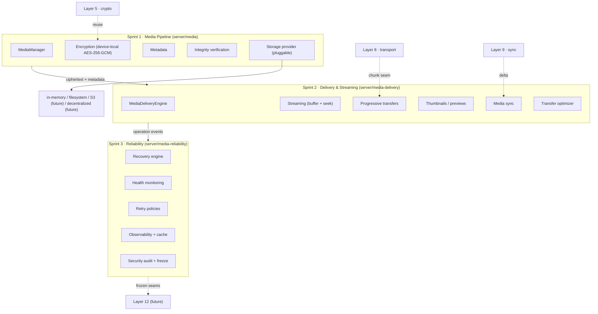
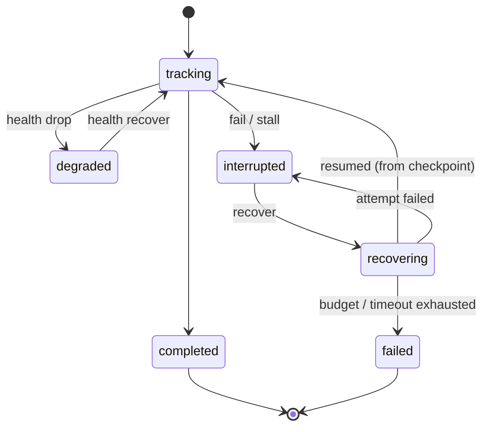
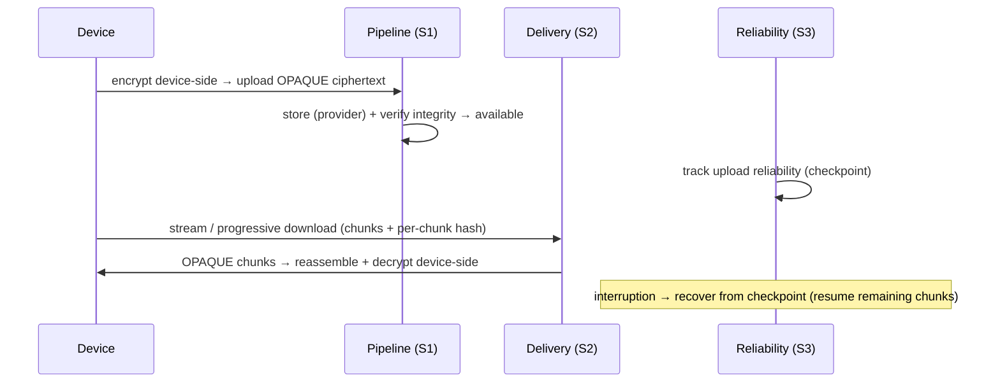
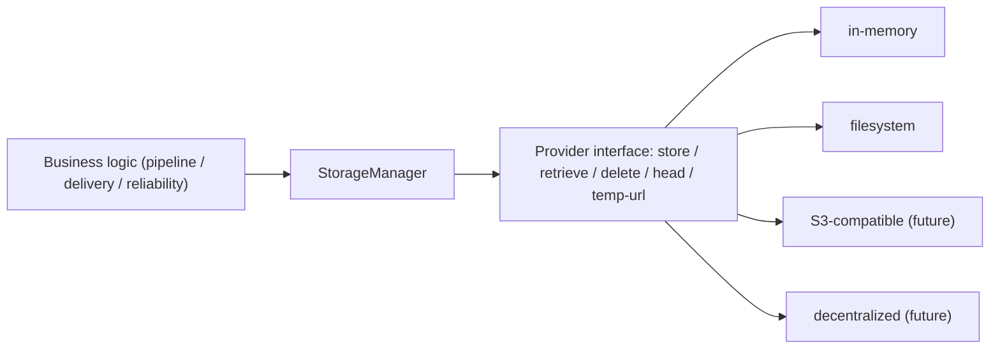

# Layer 11 — Secure Media Platform · FINAL

> **Status:** ✅ COMPLETE + FROZEN v1.0 · **Tests:** 1751 total, all green · **Sprints:** 1 (Pipeline) ·
> 2 (Delivery & Streaming) · 3 (Production Hardening)
> **Boundary:** NO voice/video calls, screen sharing, real-time media, media codecs, or WebRTC media
> (Layer 12). Those build on the **frozen** interfaces documented here.

Layer 11 delivers a **production-grade, end-to-end-encrypted media platform**: secure upload/download,
progressive transfers, streaming, thumbnails/previews, multi-device synchronization, and full reliability
(recovery, observability, monitoring), all **independent of any specific storage provider**.

---

## 1. Complete Media Architecture

| Sprint | Module | Mount | New collections |
|---|---|---|---|
| 1 | `server/media/` | `/api/media` | mediametadatas, mediaoperations, mediaintegrityreports |
| 2 | `server/media-delivery/` | `/api/media-delivery` | streamingsessions, deliverytransfers, mediapreviews, mediaavailabilities, mediaofflinequeues |
| 3 | `server/media-reliability/` | `/api/media-reliability` | mediareliabilities, mediarecoveryrecords, mediareliabilityalerts |

### Security model — a blind relay

The server is a **blind relay** across all three sprints. The client encrypts media **device-side** (a
per-file media key that never leaves the device) and uploads **opaque ciphertext** + non-secret
`{ iv, authTag }` + a key fingerprint + the plaintext hash. The server stores the ciphertext blob (via
the pluggable storage provider) + metadata, verifies integrity, delivers it in chunks (each with a
per-chunk hash), and tracks reliability — **never seeing plaintext or a key**.

---

## 2. Media Pipeline (Sprint 1)

Device-local **AES-256-GCM** (reuses the Layer 5 primitive). Whole-object hash + per-file key fingerprint.
Upload pipeline `validate → store → verify`; download `retrieve → verify → deliver`. The **storage
provider is pluggable** (`store/retrieve/delete/head` + temp-URL hook) — swapping in-memory → filesystem →
S3-compatible → decentralized changes **no business logic**.

## 3. Delivery & Streaming (Sprint 2)

Streaming sessions (buffer window + seek + pause/resume), progressive downloads/uploads (windowed chunks +
resume that re-fetches only gaps), async pluggable thumbnail/preview generation, multi-device media
synchronization (Layer 9 delta + offline queue), and a priority transfer optimizer. Reads ciphertext
through a storage-independent **media gateway**; the device reassembles + decrypts.

## 4. Reliability, Recovery & Retry (Sprint 3)

Every **media operation** (upload / download / streaming / synchronization / pipeline) gets a reliability
record with a monotonic **checkpoint** (chunks + bytes), a health score, and a recovery lifecycle.

### Recovery workflow

Triggers → actions: interrupted-upload/download / streaming / sync / stall → **resume-from-checkpoint**;
storage-failure / connection-loss → **retry**; pipeline-failure → **replan**; exhaustion →
**graceful-fail** (checkpoint intact, resumable later — already-stored chunks + verified hashes stay
valid). **Recovery preserves integrity + metadata consistency** — the checkpoint is read, never rewound;
a resume re-transfers only the remaining chunks (byte-accurate `bytesRemaining`).

---

## 5. Media Lifecycle

---

## 6. Storage Architecture

The reliability layer never touches the provider directly — it drives recovery via **injected hooks**, so
it is fully storage-provider-independent. Layer 12 plugs hybrid/edge/decentralized providers behind the
same interface.

---

## 7. Monitoring & Observability

- **Health**: per-operation (progress / reliability / backlog / freshness) + per-media aggregate.
- **`MediaMetrics`**: upload/download/streaming throughput, upload/download success rate, average
  upload/download time, recovery success rate, **cache hit rate**, sync latency, bytes transferred,
  storage errors — with Prometheus rendering + OpenTelemetry `registerExporter`.
- **`MediaCache`**: hot-metadata TTL/LRU cache with hit-rate feeding metrics + distributed hooks.
- **`MediaMonitor`**: alerts (failure spikes, repeated recovery failures, unhealthy media, stalls,
  storage-failure spikes, backlogs, retry storms).
- **Background stall monitor**: unref'd sweep flags no-progress operations as interrupted.

---

## 8. Security & Threat Model

Every media API is JWT-authenticated + owner/member-scoped; **every mutating reliability op is audited**.

| Threat | Mitigation |
|---|---|
| Server reads media plaintext / key | Device-local encryption; server stores opaque ciphertext + fingerprint only |
| Tampered / corrupted media | Whole-object hash (S1) + per-chunk hashes (S2) verified end-to-end |
| Metadata leakage | Metadata carries sizes/hashes/MIME/iv/tag/fingerprint only; no-content deep scan before every persist |
| Unauthorized media access | Owner-scoped; conversation/group media gated by membership (Layer 10) |
| Storage-provider compromise | Provider sees only opaque blobs under opaque locators; no plaintext/keys |
| Replay / progress forgery | Monotonic checkpoint (no rewind); idempotent chunk receipt |
| Recovery hijack | Owner-scoped recovery; a resume is initiated by the owning device only |
| Media-storm abuse | Retry budget + rate-limit extension points |

Delegated: cryptographic replay resistance (Layer 5); ciphertext integrity in transit (Layer 8).

---

## 9. Performance & Scalability

- **Very large files:** a 10 GB / 40 000-chunk upload checkpoints monotonically to completion; resume is
  byte-accurate.
- **Concurrency:** 100 concurrent operations tracked without loss; concurrent uploads + downloads recover
  independently.
- **Caching:** hot-metadata cache (hit-rate observable) fronts the read paths; the delivery gateway caches
  ciphertext once per source (N chunks = 1 storage fetch).
- **Horizontal scaling:** storage-independent repositories (in-memory + Mongo); the reliability layer is
  stateless beyond its records. Metrics are per-instance; wire an exporter to aggregate.

---

## 10. Testing

| Suite | Sprint | Tests |
|---|---|---|
| `media/tests` | 1 | 27 |
| `media-delivery/tests` | 2 | 23 |
| `media-reliability/tests` | 3 | 41 |

Coverage: encryption/integrity/tamper-detection; storage-provider pluggability; streaming reassembly +
decrypt, seek/pause/resume; progressive download/upload round-trips; thumbnails/previews (async
pluggable); media sync; recovery (every trigger); health/retry/observability/cache/security/freeze; very
large files (10 GB), concurrent operations, storage/streaming failure injection, and **fuzz testing** of
media protocol messages (randomized bounded checkpoints preserve monotonicity + health invariants).
**Full project suite: 1751 tests, all green.**

---

## 11. Protocol Freeze & Extension Points

Layer 11 is **frozen at v1.0** (`media-reliability/freeze/protocolFreeze.js`, served at
`/api/media-reliability/protocol`). Frozen interfaces: `MediaManager` + `createMediaApi` + encryption +
`StorageManager`/provider interface + integrity verifier; `MediaDeliveryEngine` + `createDeliveryApi` +
streaming/progressive/thumbnail/preview/sync/optimizer + media gateway; `MediaReliabilityManager` +
`createMediaReliabilityApi` + `RecoveryCoordinator` + `MediaMetrics` + `MediaCache` + event buses.

**Layer 12 (Distributed Hybrid Architecture) extension points:**
- `media/storage` — the pluggable storage-provider interface → plug decentralized / hybrid / edge-cache
  providers without changing media business logic.
- `media-delivery/mediaGateway` — the ciphertext → chunk gateway → fetch chunks from any hybrid source
  (peer / edge / origin) through the same gateway.
- `media-reliability/recovery` — the RecoveryCoordinator + checkpoint model → recover a hybrid transfer
  across sources.
- `media-reliability/events` + `monitoring` + `cache` — drive hybrid-routing decisions, export metrics,
  and back the cache with a distributed edge cache.

---

## 12. Known Limitations

- **Whole-object GCM** (Sprint 1): the device decrypts once the ciphertext is fully reassembled — true
  per-chunk *playback* of encrypted media needs chunked crypto (a future codec/real-time concern). The
  streaming session FSM + buffer are the stable seam for it.
- **Preview/thumbnail generation** is pluggable + async, defaulting to **metadata-only** placeholders (no
  codecs) — a deployment injects a real device/worker generator.
- **Presence/multi-device resolution** in delivery uses simple server defaults; a deployment injects real
  resolvers.
- **Metrics are per-instance**; cross-instance aggregation needs an external collector via the exporter
  hook.

---

## 13. Future: Layer 12 — Distributed Hybrid Architecture

Layer 12 builds a distributed hybrid architecture (peer/edge/origin routing, decentralized storage,
hybrid transfers) on this mature media foundation, reusing the storage-provider interface, the ciphertext
gateway, the recovery/checkpoint model, the event buses, the metrics exporter, and the distributed cache
hooks — **without modifying** the networking, transport, synchronization, group communication, or media
platform layers. Voice/video calls, screen sharing, and real-time media (Layer 12+) reuse the streaming
session FSM + buffer + chunk model as the live-media transport seam.
