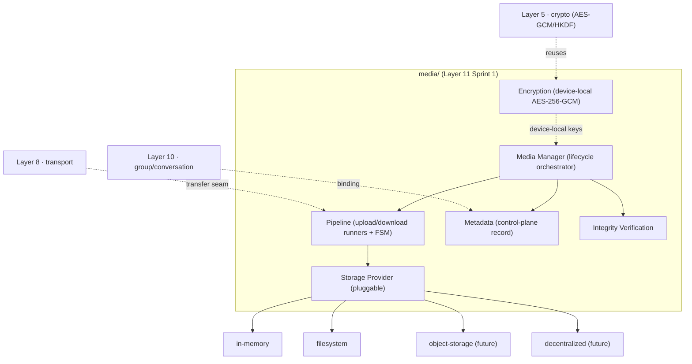
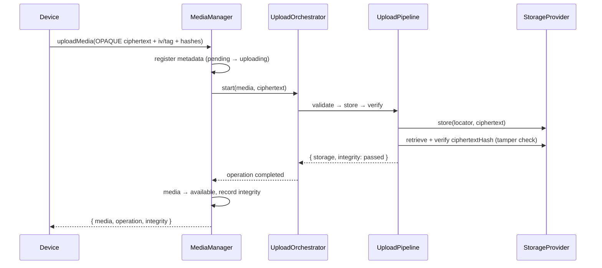
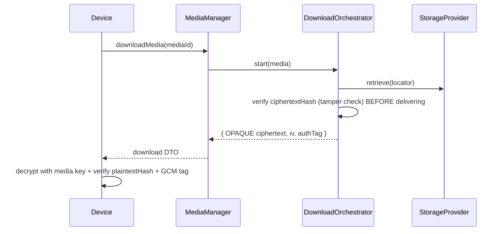

# Layer 11 · Sprint 1 — Secure Media Pipeline

> **Status:** ✅ Complete · **Tests:** 27 new (1687 total, all green) · **Location:** `server/media/`
> A reusable, secure media pipeline with pluggable storage. Reuses Layers 5/8/9/10 — does NOT modify
> them. NO streaming / progressive transfers / thumbnails / previews (Sprint 2).

---

## 1. Overview

Layer 11 begins the **Secure Media Platform**. Sprint 1 delivers a reusable **media pipeline** that
securely handles ENCRYPTED media through its whole lifecycle — upload, download, per-file encryption,
metadata, integrity verification, and upload/download orchestration — with a **pluggable storage
provider**.

The architecture strictly separates five single-responsibility subsystems:



### Security model — a blind relay

The server is a **blind relay**. The client encrypts media **device-side** (a per-file media key that
**never leaves the device**) and uploads **OPAQUE ciphertext** + the non-secret `{ iv, authTag }` + a key
**fingerprint** + the plaintext hash. The server stores the ciphertext blob (via the storage provider) +
metadata, verifies integrity, and serves the opaque ciphertext back for device-side decryption. **It
never sees plaintext or the media key** (proven by the test suite).

---

## 2. Architecture

```
server/media/
├── index.js · errors.js · types/types.js · events/events.js · dto/dto.js
├── encryption/mediaEncryption.js   # device-local AES-256-GCM + HKDF key derivation + fingerprints
├── metadata/mediaMetadata.js       # control-plane metadata model (no plaintext)
├── verification/integrityVerifier.js  # hash/size verification + tamper detection + reports
├── storage/storageProvider.js      # provider INTERFACE + StorageManager (pluggable seam)
├── providers/                      # concrete providers
│   ├── inMemoryStorageProvider.js
│   └── filesystemStorageProvider.js
├── pipeline/
│   ├── pipelineState.js            # operation + media FSMs
│   ├── operation.js                # operation record model + transitions + progress
│   ├── uploadPipeline.js           # validate → store → verify
│   └── downloadPipeline.js         # retrieve → verify → deliver
├── uploads/uploadOrchestrator.js   # upload operation lifecycle (start/cancel/retry)
├── downloads/downloadOrchestrator.js
├── validators/ · serializers/
├── repository/ (inMemory + mongo)  # media · operations · integrity · history
├── models/ (MediaMetadata, MediaOperation, MediaIntegrityReport)
├── manager/mediaManager.js         # the lifecycle orchestrator
└── api/mediaApi.js

server/controllers/mediaController.js   # HTTP handlers (filesystem provider by default)
server/routes/mediaRoute.js             # /api/media
client/src/lib/media.js                 # MediaClient (device-side encrypt/decrypt hooks)
```

New Mongo collections (additive): `mediametadatas`, `mediaoperations`, `mediaintegrityreports`. The
ciphertext **blobs** live in the storage provider, never the DB.

---

## 3. Media Manager

`MediaManager` coordinates the lifecycle by composing the five subsystems: `uploadMedia`,
`downloadMedia`, `deleteMedia`, `cancelUpload` / `cancelDownload`, `retryUpload` / `retryDownload`,
`getMetadata`, `verifyMedia`, `getOperation(s)`, `getDiagnostics`. It never encrypts/decrypts — it stores
+ verifies + serves opaque bytes. Per-media mutations are serialized by an async mutex.

---

## 4. Media Encryption (reuses Layer 5)

Device-local AES-256-GCM (the same primitive as Secure Transport):

```
mediaKey (32B, device-local) ──AES-256-GCM(iv)──▶ { ciphertext, authTag }
plaintextHash  = SHA-256(plaintext)   // end-to-end, client-verifiable
ciphertextHash = SHA-256(ciphertext)  // storage integrity, server-verifiable (tamper detection)
keyFingerprint = SHA-256(mediaKey)    // public commitment — the server stores this, never the key
```

`generateMediaKey` (random) or `deriveMediaKey(rootSecret, {mediaId})` (HKDF from a conversation/group
key). `buildEncryptionMetadata` produces the **non-secret** descriptor the server stores
(`{ algorithm, version, keyId, keyFingerprint, iv, authTag, keyVersion }`). `rotateEncryptionKeyMetadata`
is the key-rotation hook.

---

## 5. Media Metadata

The control-plane record — `mediaId`, owner, conversation/group binding, filename, MIME, sizes, integrity
hashes, the non-secret encryption descriptor, the storage locator, and inert placeholders
(`thumbnail` / `duration` / `resolution`) for Sprint 2. It **never exposes plaintext**; sensitive fields
(e.g. filename) may be carried as an opaque `encryptedMetadata` blob.

---

## 6. Pipeline & Orchestration

### Upload workflow



### Download workflow



**Operation FSM:** `pending → active → verifying → completed / failed / cancelled`; `failed → active`
(retry). **Media FSM:** `pending → uploading → available → deleted`.

---

## 7. Integrity Verification

`verifyIntegrity` checks metadata shape + blob size + **ciphertext hash** (constant-time), producing an
integrity report (`passed`/`failed` + `tampered` flag + per-check detail) persisted as validation
history. Tamper detection runs on upload (re-read after store), on download (before delivery), and
on-demand (`verifyMedia`). The end-to-end plaintext hash + GCM tag are verified device-side after
decryption.

---

## 8. Storage Provider Abstraction

The pluggable seam. Every provider implements `store · retrieve · delete · head` (+ optional
`getTemporaryUrl` future hook + `diagnostics`). `StorageManager` wraps a provider (locator generation,
typed error wrapping, temp-URL delegation) and is the **only** thing the pipeline talks to.

| Provider | Status | Use |
|---|---|---|
| `inMemoryStorageProvider` | ✅ | tests / device / reference |
| `filesystemStorageProvider` | ✅ | local disk (traversal-safe) |
| object-storage (S3-compatible) | seam | future — `getTemporaryUrl` returns a pre-signed URL |
| decentralized (IPFS/…) | seam | future |

> Swapping the provider changes **no business logic** — proven by a test that runs the identical
> upload/download against both the in-memory and filesystem providers.

---

## 9. API Endpoints

Mounted at **`/api/media`**, all JWT-protected.

| Method | Path | Operation |
|---|---|---|
| `POST` | `/media` | upload encrypted media |
| `GET` | `/media/:id/download` | download (opaque ciphertext + iv/tag) |
| `GET` | `/media/:id` · `/media` | metadata · list |
| `DELETE` | `/media/:id` | delete |
| `GET` | `/media/:id/verify` | on-demand integrity verification |
| `POST` | `/media/uploads/:opId/cancel` · `/retry` | upload control |
| `POST` | `/media/downloads/:opId/cancel` · `/retry` | download control |
| `GET` | `/media/operations/:opId` · `/media/:id/operations` | operation status |
| `GET` | `/media/:id/diagnostics` · `/media/health` | diagnostics |

---

## 10. Client, Events, Validation

- **Client** (`client/src/lib/media.js`) — `MediaClient` with injected `encryptFile` / `decryptFile`
  crypto hooks (Web Crypto in the app); `upload`/`download` with progress, `verify`, `delete`, cancel /
  retry, and an inert `onStreamChunk` Sprint-2 seam.
- **Events** — `MediaRegistered`, `UploadStarted/Completed/Cancelled`, `DownloadStarted/Completed/
  Cancelled`, `MediaDeleted`, `IntegrityVerified/Failed`, `PipelineFailed/Recovered`, `OperationProgress`.
- **Validation** — invalid metadata, corrupted media / hash mismatch, unauthorized access, repository
  consistency, duplicate upload (idempotency), malformed payload, integrity failure, size limits, and a
  no-key/no-plaintext deep scan before every metadata persist.

---

## 11. Performance & Testing

- Concurrent uploads (60 distinct objects, no loss), concurrent downloads (30 of one object), a **20 MB**
  encrypted payload end-to-end, per-media serialization, and provider pluggability.
- 27 new tests across 4 suites (encryption/integrity, upload/download, storage/pipeline, concurrency/
  stress). **Full suite: 1687 tests, all green.**

---

## 12. Future Streaming Integration (Sprint 2)

Sprint 2 adds streaming, progressive up/downloads, chunk streaming, thumbnail generation, previews, and
efficient large-media transport. The seams are already in place: the pipeline's `store` / `retrieve`
steps become per-chunk (range) operations, the `thumbnail` / `duration` / `resolution` metadata slots
fill in, the `stream` client seam wires up, and the Layer 8 transport engine's fragmentation is reused —
**all without changing the manager, encryption, metadata, verification, or storage-provider contracts**
frozen here.
