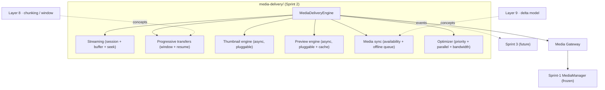
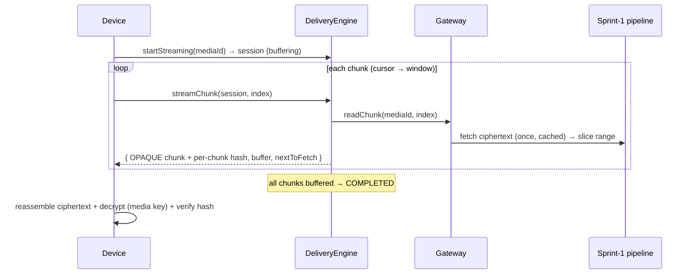
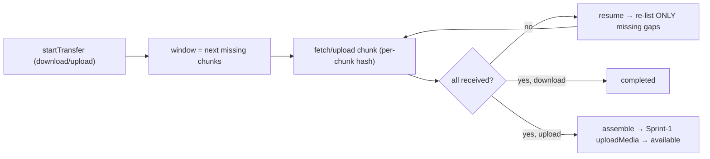
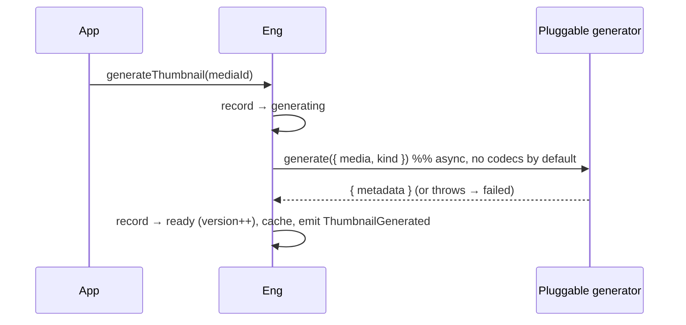
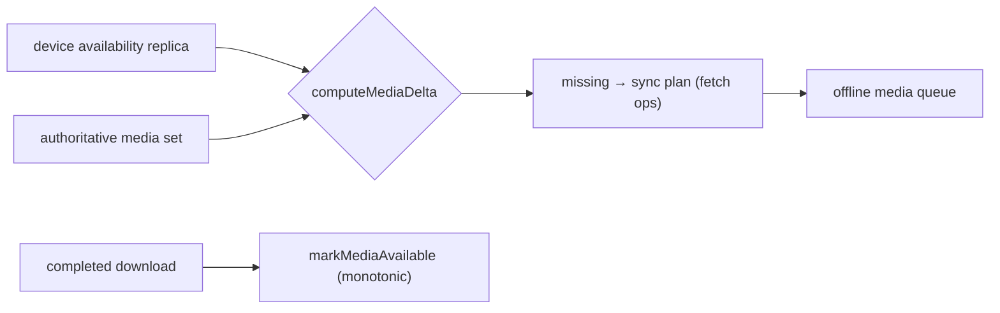

# Layer 11 · Sprint 2 — Distributed Media Delivery & Streaming

> **Status:** ✅ Complete · **Tests:** 23 new (1710 total, all green) · **Location:** `server/media-delivery/`
> An independent delivery engine on top of the frozen Sprint-1 pipeline. Reuses Layers 8/9 + Sprint 1 —
> does NOT modify them. NO voice/video/screen-share/real-time/codecs (Sprint 3 / Layer 12).

---

## 1. Overview

Sprint 2 adds a **Media Delivery Engine** that delivers encrypted media efficiently: progressive
downloads/uploads, streaming with a buffer + seek, async thumbnail/preview generation, multi-device
media synchronization, and transfer optimization — all over the **opaque ciphertext** the Sprint-1
pipeline stores.



### Security & the encrypted-media reality

The engine is a **blind relay**: it moves **opaque ciphertext in chunks** (each with a per-chunk
SHA-256, so integrity is preserved across the transport) + control-plane metadata **only** — it never
decrypts or handles keys. It reads ciphertext through the **media gateway** (built over the Sprint-1
`MediaManager`), so it is **storage-independent**. The device reassembles the ciphertext and decrypts it
locally; the whole-object hash is still verified by Sprint 1.

> Sprint-1 encrypts whole-payload (AES-256-GCM), so the device decrypts once the ciphertext is fully
> reassembled. This sprint delivers the **bytes** progressively (with buffering, seek, resume, and
> optimization); true per-chunk *playback* of encrypted media needs chunked crypto (a future
> codec/real-time concern). The session FSM + buffer are the stable seam for that.

---

## 2. Architecture

```
server/media-delivery/
├── index.js · errors.js · types/types.js · events/events.js · dto/dto.js
├── buffering/buffer.js              # sliding buffer window + adaptive placeholder
├── streaming/streamingSession.js    # session record + FSM
├── progressive/progressiveTransfer.js # transfer record + FSM + window + recovery (missing chunks)
├── thumbnails/thumbnailEngine.js     # async pluggable thumbnail generation + versions + history
├── previews/previewEngine.js         # async pluggable preview generation + TTL cache
├── synchronization/mediaSync.js      # availability replica + delta + sync plan (Layer 9 model)
├── optimization/transferOptimizer.js # priority scheduler + parallel slots + bandwidth metrics
├── validators/ · serializers/
├── repository/ (inMemory + mongo)    # sessions · transfers · previews · availability · offline queue
├── models/ (StreamingSession, DeliveryTransfer, MediaPreview, MediaAvailability + offline queue)
├── manager/
│   ├── mediaGateway.js               # storage-independent bridge to Sprint-1 (ciphertext → chunks)
│   └── mediaDeliveryEngine.js        # the orchestrator
└── api/deliveryApi.js

server/controllers/mediaDeliveryController.js   # HTTP handlers (reuses the Sprint-1 mediaManager)
server/routes/mediaDeliveryRoute.js             # /api/media-delivery
client/src/lib/mediaDelivery.js                 # MediaDeliveryClient (progressive download/stream + decrypt)
```

New Mongo collections (additive): `streamingsessions`, `deliverytransfers`, `mediapreviews`,
`mediaavailabilities`, `mediaofflinequeues`.

---

## 3. Streaming Engine

### Streaming workflow



Session FSM: `idle → buffering → playing ⇄ paused / seeking → completed / failed / cancelled`. The
`StreamBuffer` tracks the contiguous buffered prefix, the window ahead of the cursor, `nextToFetch`, and
a fill ratio (buffer health). Seek repositions the cursor; pause/resume gate delivery.

---

## 4. Progressive Transfers



- **Progressive download** — windowed chunk fetch; `receiveChunk` is idempotent (a duplicate never
  double-counts); resume re-fetches only the gaps (recovery metadata = received indices).
- **Progressive upload** — accepts opaque ciphertext chunks (each verified against a client-provided
  per-chunk hash), assembles them, and hands the whole to the **Sprint-1 pipeline** on completion (proven
  by a test: the assembled media decrypts back to the original).
- **Transfer window** bounds chunks in flight; an **adaptive-buffer placeholder** is the seam for a
  bandwidth-aware policy.

---

## 5. Thumbnail & Preview Engine

Generation is **async + pluggable** — a `generator` hook (device / worker) produces the thumbnail/preview;
the default is a deterministic **metadata-only** placeholder (no codecs). Records carry the kind, an
async state (`pending → generating → ready / failed`), a **version** (regeneration bumps it), a metadata
descriptor (dimensions / format / an optional encrypted-thumbnail media id), and a generation **history**.
A TTL **preview cache** fronts reads. Kinds: image/video thumbnail, document preview, audio-artwork
placeholder.



---

## 6. Media Synchronization (reuses Layer 9)

A per-device **availability replica** (a media-scoped `entityId → version` map) is compared against the
authoritative set to compute what's **missing**, producing a deterministic, resumable **sync plan** + an
**offline media queue** for reconnect-time fetches. `markMediaAvailable` advances the replica
monotonically after a completed download.



---

## 7. Transfer Optimization

`TransferScheduler` — priorities (`high / normal / low / prefetch`), a bounded **parallel** slot count,
age-tie-breaking (no starvation), **prefetch** metadata, and **bandwidth** metrics (bytes/sec over a
window). `optimizeTransfers()` fills free slots with the highest-priority pending tasks.

---

## 8. API, Events, Validation

- **API** (`/api/media-delivery`): streaming (`/streaming` + `/chunk` + `/seek` + `/pause` + `/resume`),
  transfers (`/transfers` + `/chunk` GET/POST + `/complete` + `/resume`), previews (`/media/:id/thumbnail`
  · `/preview`), sync (`/sync` + `/availability` + `/offline-queue`), optimization (`/optimize` +
  `/prefetch` + `/bandwidth`), diagnostics + health.
- **Events**: `StreamingStarted/Paused/Resumed/Seeked/Completed`, `ChunkDelivered`, `BufferUpdated`,
  `TransferStarted/Progress/Completed/Resumed`, `ThumbnailGenerated`, `PreviewGenerated/Failed`,
  `MediaSynchronized`, `MediaAvailable`, `OfflineMediaQueued`, `TransferOptimized`.
- **Validation**: corrupted preview/thumbnail (generator outcome), streaming failure, sync failure,
  unauthorized streaming, repository consistency, malformed metadata, and **integrity preservation**
  (per-chunk hash), plus the no-content deep scan.

---

## 9. Performance & Testing

- 10 MB streaming, concurrent chunk fetches (no loss/double-count), priority scheduling with parallel
  slots, and the ciphertext cached once per source (N chunks = 1 storage fetch).
- 23 new tests across 4 suites (streaming, progressive + previews, sync/optimization/stress) run against
  the **real Sprint-1 pipeline**. **Full suite: 1710 tests, all green.**

---

## 10. Future Voice & Video Integration (Sprint 3 / Layer 12)

Sprint 3 hardens the media platform (recovery, observability, monitoring, scalability). Voice/video
calls, screen sharing, and real-time media (Layer 12) reuse these seams: the **streaming session FSM +
buffer** become the live-media transport, the **chunk model** + **transfer window** carry codec frames,
the **optimizer** schedules real-time flows, and the pluggable generators produce live previews — all
without changing the manager, streaming, progressive-transfer, sync, or storage-gateway contracts frozen
here. The client's `onLiveMedia` hook is the inert seam.
