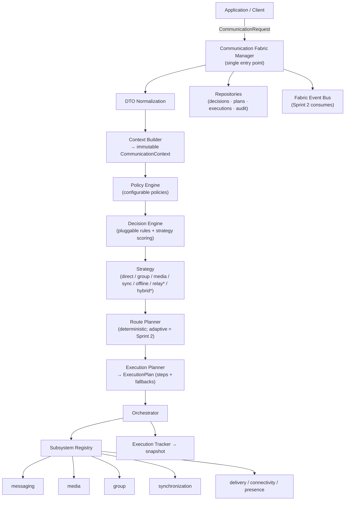
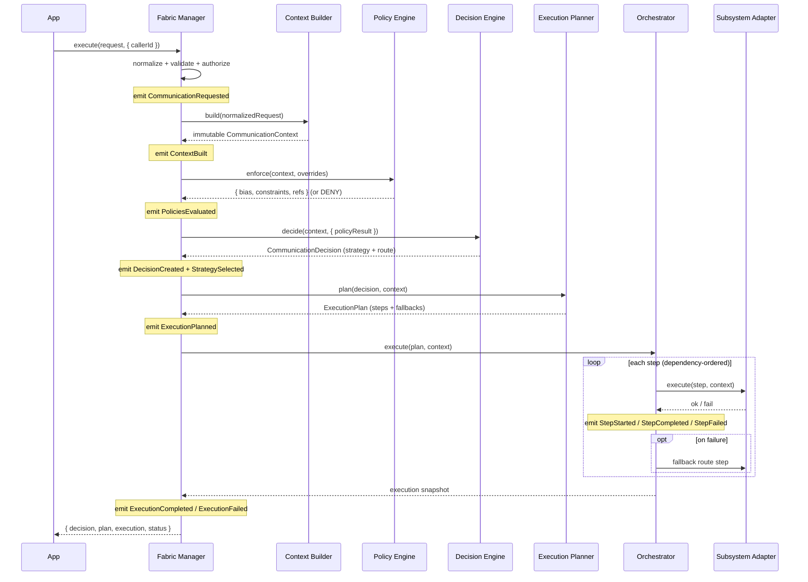
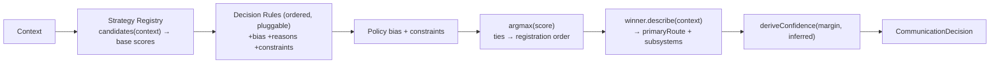
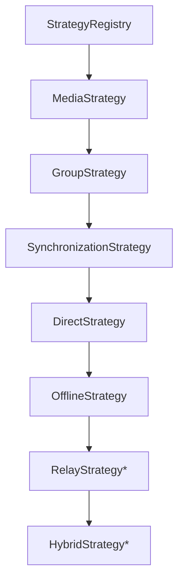
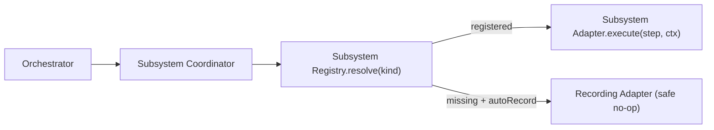

# Layer 12 · Sprint 1 — Distributed Communication Fabric (Foundation)

> **Status:** ✅ Complete · **Scope:** Orchestration framework only — Decision Engine, Context Model,
> Strategy Framework, Policy Framework, Routing Framework, Subsystem Registry, Repositories, API, Client,
> Events, Tests, Docs. **Explicitly deferred to Sprint 2:** adaptive/intelligent routing, network scoring,
> transport optimization, resource optimization, scheduling. **Deferred to later layers:** voice, video.

The **Communication Fabric** is the orchestration layer of the entire platform — the *single entry point*
for every communication request. It coordinates the eleven frozen layers below it (security, connectivity,
messaging, media, synchronization, groups, delivery) **without reimplementing any of them**. Application
code no longer calls transport, media, group messaging, or synchronization directly; it hands a
*communication request* to the Fabric, which **decides how** communication should occur and **delegates**
the work to the right subsystem.

```
Application → Communication Fabric → Decision Engine → Strategy Selection
            → Subsystem Orchestration → Execution
```

Every subsystem remains independent and reusable. The Fabric adds coordination *above* them, never inside
them.

---

## 1. Architecture



> `*` relay + hybrid strategies and adaptive routing are declared **placeholders** — registered but inert
> in Sprint 1 so the architecture is complete for Sprint 2 to fill in.

**Directory layout** (`server/communication-fabric/`):

| Directory | Responsibility |
|---|---|
| `manager/` | The Fabric Manager (single entry point) + decision cache |
| `decision-engine/` | Decision Engine, pluggable decision rules, Communication Decision object |
| `contexts/` | Immutable `CommunicationContext` + context builder |
| `strategies/` | Strategy interface + registry + 7 strategies (direct/relay/offline/media/group/sync/hybrid) |
| `routing/` | Route model + deterministic route planner + static fallback framework |
| `planners/` | Execution Planner (assembles the delegatable plan + fallbacks) |
| `policies/` | Policy interface + Policy Engine + 6 default configurable policy sets |
| `registry/` | Subsystem Registry + adapter contract (no hard subsystem imports) |
| `coordinators/` | Subsystem Coordinator (step → adapter bridge) |
| `orchestration/` | Orchestrator + Execution Tracker |
| `repository/` | In-memory + Mongo repositories (storage-independent) |
| `models/` | 3 Mongo models (decision, execution plan, audit log) |
| `validators/` · `serializers/` · `dto/` · `events/` · `types/` · `api/` | Supporting framework |

**Independence guarantee:** the Fabric imports **nothing** from transport, crypto, media, or sync. It knows
subsystems only through registered *adapters*. A new communication system (voice, video, a smarter relay)
plugs in by registering an adapter — the manager, engine, strategies, and existing subsystems never change.

---

## 2. Communication Request Lifecycle



The manager **orchestrates but contains no lower-layer business logic** — it never encrypts, transports,
fans out, or syncs. It decides *which* registered subsystem does, and in *what* order.

---

## 3. Decision Engine

The Decision Engine determines **how** communication should occur *without executing it*. It is
declarative — no `if/switch` cascade on communication type:



- **Candidates** come from the strategy registry via each strategy's `supports()` + `baseScore()`.
- **Rules** (`decisionRules.js`) are pure, ordered, pluggable functions contributing additive bias +
  human-readable reasons + constraints. This is the seam Sprint 2 extends with network/battery/bandwidth
  rules — *no engine change*.
- **Policy** bias + constraints are folded in.
- **Selection** is `argmax` with deterministic tie-breaks, so the same inputs always produce the same
  decision (which is what makes decision caching safe).
- The output records **reasons**, **confidence** (`definitive` / `likely` / `tentative`), **policy refs**,
  and **constraints** — every decision is fully explainable.

**Inputs evaluated:** communication type, conversation type, media type, priority, recipient availability,
group context, synchronization state, policy rules. **Future inputs** (network quality, battery, bandwidth,
storage, connection health) drop into the rule seam in Sprint 2.

---

## 4. Communication Context

Each request builds **one complete, deeply-frozen** context, decomposed into independent facets:

| Facet | Contents |
|---|---|
| `conversation` | direct / group / broadcast / self + ids |
| `group` | group id + fan-out hints (group conversations) |
| `media` | media type + **opaque** payload reference (no bytes) |
| `recipient` | recipient set + resolved availability (from presence) |
| `synchronization` | replica / sync posture |
| `security` | advisory secure-session posture |
| `transport` | priority-derived routing seed |
| `metadata` · `execution` · `diagnostics` | non-secret metadata · bookkeeping · how the context was assembled |

Optional resolvers (`availability`, `sync`, `security`) let a deployment enrich a facet from a lower layer
(presence, sync, secure session) **without the Fabric depending on it**; absent a resolver, the facet falls
back to a conservative `UNKNOWN` default, so the Fabric is fully functional standalone.

---

## 5. Strategy Framework

Strategies are selected **through an interface**, never a conditional. Each implements
`supports · baseScore · describe · plan`.



| Strategy | Wins when | Delegates to |
|---|---|---|
| **Direct** | 1:1 / broadcast text, recipients reachable | messaging |
| **Offline** | recipients offline / unknown | messaging (store-and-forward) + sync |
| **Media** | any media type | media → group/messaging (ref fan-out) |
| **Group** | group conversation, no media | group + delivery |
| **Synchronization** | self / explicit sync | synchronization |
| **Relay** \* | *forced only* (Sprint 2 adaptive) | connectivity + messaging |
| **Hybrid** \* | *forced only* (Sprint 2 composition) | multi-subsystem |

\* placeholders — registered but inert unless explicitly forced, so they never win by accident.

---

## 6. Routing Framework

Sprint 1 defines routing **architecture** only — deterministic, no scoring.

- `RouteKind` — direct-transport · relayed-transport · store-and-forward · media-pipeline · group-fanout ·
  sync-channel · local.
- The **Route Planner** reads the decision's `primaryRoute` and attaches a **static fallback chain**
  (`DEFAULT_FALLBACK_ROUTES`). `diagnostics.adaptive = false` marks this as the Sprint-1 deterministic path.
- The **Execution Planner** re-homes each step's fallback routes onto alternative plan steps; the
  orchestrator walks them on failure but never re-scores.

Sprint 2 replaces `planRoute` with adaptive scoring — the return shape is unchanged, so nothing downstream
moves.

---

## 7. Policy Framework

Six configurable, pluggable policy families (`policies/defaultPolicies.js`), all reading a config bag:

| Policy | Kind | Effect |
|---|---|---|
| `messaging.recipient-cap` | messaging | caps recipient fan-out |
| `media.type-and-size` | media | restricts allowed media types / size |
| `group.fanout-guard` | group | requires group id, caps fan-out |
| `sync.attach-on-diverge` | sync | attaches a sync step when diverged |
| `security.session-guard` | security | optionally requires a ready secure session |
| `priority.urgent-guard` | priority | urgent biases direct + forbids bulk queuing |

A policy may **bias** strategy scores, add a **constraint**, or **deny** the request. Per-request
`policyOverrides` shallow-merge over the deployment base config, so tuning needs no code change. A future
`enterprise` kind is declared as the extension seam.

---

## 8. Subsystem Registry & Orchestration

The registry is the Fabric's service-discovery table — subsystems register as **adapters** keyed by kind,
with **no hard import**.



- **Adapter contract:** `kind · actions · execute(step, context)`. `createSubsystemAdapter` wraps a real
  subsystem facade; `createRecordingAdapter` is a safe stub (the default for un-wired subsystems + the test
  double).
- **Orchestrator** walks steps in dependency order, delegates each via the coordinator, drives the
  **Execution Tracker**, and applies the static fallback chain on failure. Required-step failure → `failed`;
  optional-step failure → tolerated (`partial`/`completed`); a recovered step → `fell-back`.
- **Server wiring** (`controllers/communicationFabricController.js`) registers one adapter per frozen layer.
  In Sprint 1 an adapter is a control-plane **handoff** (the encrypted work still runs through the
  subsystem's own frozen API); Sprint 2 swaps these for adaptive, measured delegation.

---

## 9. Repositories

Storage-independent stores (`repository/`), both implementing the same four-store contract:

| Store | Methods | Backing |
|---|---|---|
| `decisions` | `create · findById · listByRequest` | `FabricDecision` |
| `plans` | `create · findById · update` | `FabricExecutionPlan` |
| `executions` | `create · findById · listRecent` | `FabricExecutionPlan` (result folded on) |
| `audit` | `append · listByRequest` | `FabricAuditLog` |

In-memory (deep-copy, DB-free — powers the whole test suite) and Mongo (3 collections) are drop-in
interchangeable.

---

## 10. Events

An internal bus emits one typed event per lifecycle stage: `CommunicationRequested · ContextBuilt ·
PoliciesEvaluated · DecisionCreated · StrategySelected · RoutePlanned · ExecutionPlanned · ExecutionStarted
· StepStarted · StepCompleted · StepFailed · ExecutionCompleted · ExecutionFailed`. Every event is
control-plane only (ids + classifications + bookkeeping). **Sprint 2 (intelligent routing) consumes this
bus** to observe decisions + step outcomes and feed adaptive scoring — without modifying the pipeline.

---

## 11. Validation (STEP 14)

`validators/validators.js` covers: invalid request/context, unknown strategy, no-strategy-matched, missing
policy, policy denial, invalid decision, execution-plan consistency (dependency graph, subsystems, ≥1
required step), repository consistency, unauthorized operations (caller must be sender), unsupported
(voice/video) types, configuration errors, and the platform-wide **no-content invariant** — a deep scan
(`assertNoContent`) rejects any plaintext / ciphertext / key material before every persist.

---

## 12. API Endpoints

Mounted at `/api/communication-fabric` (all JWT-protected; caller = sender):

| Method | Path | Purpose |
|---|---|---|
| `POST` | `/execute` | **the single entry point** — run the full pipeline |
| `POST` | `/plan` | dry run — decision + plan, no orchestration |
| `POST` | `/context` | build the immutable context |
| `POST` | `/policies` | evaluate policies |
| `POST` | `/strategy` | get the decision (strategy + route) |
| `POST` | `/execution-plan` | get the execution plan |
| `GET` | `/diagnostics/:requestId` | decision diagnostics + audit trail |
| `GET` | `/health` | fabric health (strategies · subsystems · policies · cache · metrics) |

---

## 13. Client Integration (STEP 12)

`client/src/lib/communicationFabric.js` exposes `CommunicationFabricClient` — the client's **single entry
point for all communication**. The app calls `execute()` (or the `sendDirect` / `sendGroup` / `sendMedia` /
`synchronize` convenience wrappers) instead of the messaging/media/group libs directly; the Fabric decides
the path and delegates. Inspection methods (`buildContext`, `evaluatePolicies`, `getStrategy`,
`getExecutionPlan`, `getDiagnostics`) let a UI show *why* a communication took a given route. The client
exchanges control-plane metadata + an opaque payload reference only — encrypted bytes still travel through
the underlying subsystem libs.

---

## 14. Performance (STEP 15)

- **Decision cache** (`DecisionCache`, TTL + LRU) memoizes semantically-identical decision inputs; a hit
  re-stamps a fresh `decisionId`/`requestId` so identities are never conflated. Cache key deliberately
  excludes live signals (Sprint 2 extends or bypasses it for adaptive requests).
- Context building + decision + planning are **pure, synchronous, O(steps)** table math.
- Concurrent requests are independent (no shared mutable state beyond the bounded cache + repo) — verified
  under 100 concurrent + a 160-request mixed workload.

---

## 15. Testing

DB-free suite (`communication-fabric/tests/`, `node --test`) — **39 tests, all passing**:

- `decision-context.test.js` — context completeness + immutability, strategy selection across every
  conversation/media/availability/sync/priority shape, inference.
- `strategy-policy.test.js` — registry ordering, placeholder inertness, policy bias/denial/config,
  validation surface, authorization, no-content invariant.
- `orchestration-registry.test.js` — end-to-end delegation, lifecycle event ordering, fallback recovery,
  required vs optional failure, auto-record, persistence + diagnostics, dry-run, health.
- `concurrency-stress.test.js` — decision-cache hit/TTL/LRU, 100 concurrent + 160-request mixed workload
  consistency, dry-run-under-concurrency.

---

## 16. Future Intelligent Routing Integration (Sprint 2)

Sprint 2 extends this foundation **without redesigning it**:

- **Adaptive routing / connection scoring** → new `RoutePlanner` implementation (same return shape).
- **Network / battery / bandwidth signals** → new decision rules in the pluggable rule seam.
- **Dynamic policy evaluation** → runtime policy config driven by the event bus.
- **Transport optimization + scheduling** → the relay + hybrid strategy placeholders become real.
- **Runtime optimization** → consumes the Fabric event bus (already emitting) for closed-loop adaptation.

Every one of these is a *plug-in point that already exists*. Sprint 1 delivered the framework; Sprint 2
makes it intelligent.
