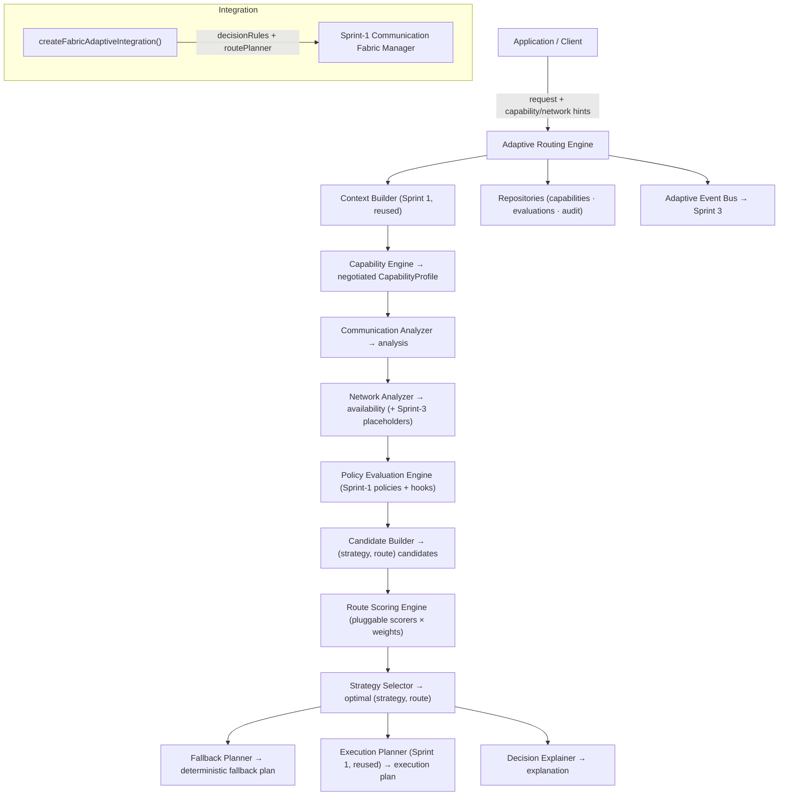
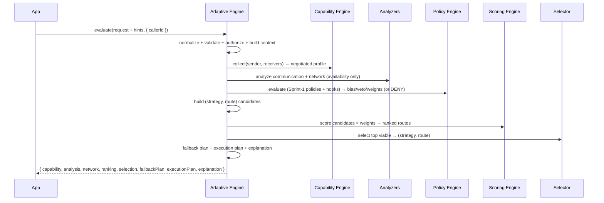
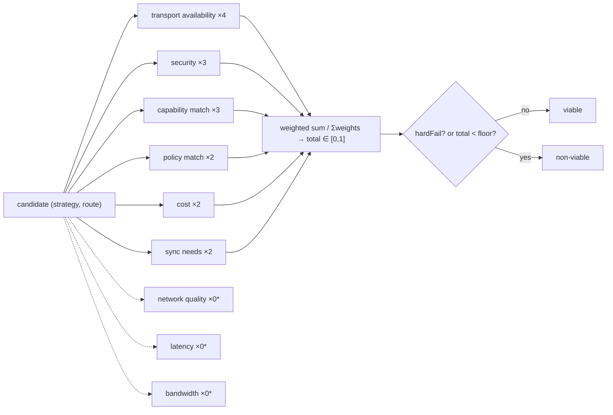
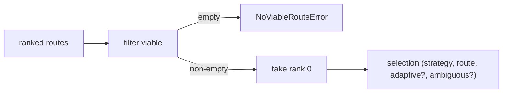
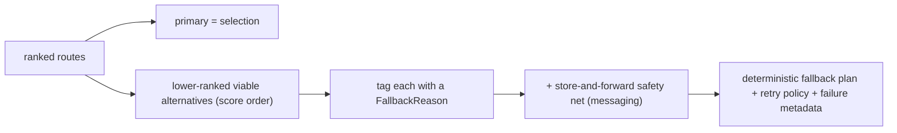

# Layer 12 · Sprint 2 — Intelligent Routing & Adaptive Communication

> **Status:** ✅ Complete · **Scope:** intelligent decision making — Capability Engine, Communication
> Analyzer, Network Analyzer, Route Scoring, Adaptive Strategy Selection, Policy Evaluation (+ hooks),
> Fallback Planning, explainable decisions. **Explicitly deferred to Sprint 3:** real network probing,
> resource optimization, QoS scheduling, bandwidth management, ML. **Deferred to later layers:** voice, video.

Sprint 1 gave the platform a Communication Fabric that made **deterministic** routing decisions. Sprint 2
turns that into an **adaptive** one: the Fabric now decides *which transport, which strategy, which
delivery policy* — direct vs relayed vs offline, whether to synchronize, whether media should stream —
**from weighted route scores, not hardcoded conditionals**. It is an INDEPENDENT subsystem
(`server/adaptive-routing/`) built ON TOP of the frozen Sprint-1 Fabric, and it also plugs INTO the Fabric
so the existing `/api/communication-fabric/execute` becomes intelligent automatically.

```
request → context (Sprint 1) → capabilities → communication analysis → network analysis
       → policy evaluation → candidate routes → route scoring → strategy selection
       → fallback planning → execution plan (Sprint 1 planner) → explanation
```

---

## 1. Architecture



**Directory layout** (`server/adaptive-routing/`): `capability/` · `analyzers/` · `routing/` (candidates) ·
`scoring/` · `selectors/` · `evaluators/` (policy + hooks) · `fallback/` · `planners/` (adaptive route
planner + explainer) · `manager/` (engine) · `repository/` · `models/` · `validators/` · `serializers/` ·
`integration/` · `api/` · `events/` · `dto/` · `types/`.

**Independence + reuse:** the adaptive layer imports the frozen Sprint-1 building blocks (context builder,
strategy registry, execution planner, decision object, policy engine) through an internal re-export and
adds only the intelligence on top — **no Sprint-1 redesign**. The one additive Sprint-1 change is an
optional `routePlanner` injection point on the manager (anticipated by Sprint 1's own docs).

---

## 2. Decision Flow



---

## 3. Capability Engine

Collects sender + receiver + device capabilities and returns an **immutable, negotiated**
`CapabilityProfile` (app + protocol versions, supported transports, supported media, feature flags, future
codecs). It **never queries a service directly** — a deployment injects a `capabilityProvider(identityId)`
(backed by Layer 3 device-trust / Layer 6 capability exchange); a per-request declaration overrides it;
the permissive baseline fills the rest. Negotiation is the **intersection** of transports/media/features
and the **minimum** version — the weakest party bounds the negotiation. Profiles are cached (TTL/LRU) by
party. The Decision Engine consumes the *profile*, decoupling routing from live services.

---

## 4. Communication Analyzer

Projects the Sprint-1 context into a normalized, frozen **analysis**: type, conversation shape, group
size, media type, payload class (small/medium/large by declared size), priority, sync posture, offline
state, and derived flags (`isGroup`, `isMedia`, `isLarge`, `needsSync`, `isRealtime=false`). One pure
projection so every scorer reads a single consistent view.

---

## 5. Network Analyzer

Reports the **availability** of each substrate (connection / transport / p2p / relay / sync) as a frozen
analysis. **Availability is declared, not probed** — a deployment injects a `networkStateProvider(context)`
or passes a per-request hint; absent both, substrates default to *available*.

> **No probing in Sprint 2.** Runtime QUALITY — quality, latency, bandwidth, stability — are `null`
> **placeholders**. Sprint 3 supplies a real provider that fills them; the scorers already reserve
> zero-weight dimensions for them.

---

## 6. Route Scoring



The **Route Scoring Engine** runs every pluggable scorer over every candidate, folds normalized `[0,1]`
sub-scores with **configurable weights**, marks viability (a scorer `hardFail` — e.g. substrate
unavailable or capability missing — vetoes the candidate), and returns candidates **ranked best-first**
(ties break deterministically by candidate order). Scorers + weights are both pluggable, so behaviour is
tuned without code. `*` the three future dimensions ship as inert scorers (weight 0) for Sprint 3.

---

## 7. Adaptive Strategy Selection

The **Strategy Selector** picks the highest-ranked **viable** candidate — no hardcoded transport logic.
It surfaces ambiguity (a tie between different strategies) and raises `NoViableRouteError` when nothing is
viable. This is how "should this be direct / relayed / offline / streamed?" is answered by scores:



The **adaptive relay** candidate is injected for eligible messaging even though Sprint-1's relay strategy
only self-selects when forced — so the layer can *decide* to relay (e.g. recipient online but p2p down)
without modifying Sprint 1.

---

## 8. Fallback Planning



Given the same ranking it always produces the same plan (deterministic, no randomness), tags each fallback
with a machine-readable reason (`relay-fallback`, `offline-fallback`, `sync-fallback`, …), and appends a
store-and-forward safety net so a message is never simply dropped.

---

## 9. Policy Evaluation Engine

Extends the frozen Sprint-1 `PolicyEngine` (composes, not replaces). It runs the Sprint-1
messaging/media/group/sync/security/priority policies **and** adaptive **hooks** that *influence scoring*:

| Hook | Effect |
|---|---|
| **data-saver** | veto relayed transport for large payloads; up-weight cost; bias offline |
| **battery-saver** | prefer batched delivery over eager p2p (bypassed for urgent) |
| **enterprise** | force-relay / block-p2p / block-offline organizational controls |
| **security** | direct-only posture (veto relay); require-secure-session (deny) |

A hook produces per-strategy `bias`, route/strategy `vetoes`, and scoring-`weight` overrides. A conflict
that vetoes every route/strategy raises `PolicyConflictError`. Vetoes feed the `policy-match` scorer as
hard fails; bias nudges the score.

---

## 10. Repositories

Storage-independent stores (in-memory + Mongo), both implementing one contract:

| Store | Methods | Backing |
|---|---|---|
| `capabilities` | `upsert · findByFingerprint` | `AdaptiveCapabilityProfile` |
| `evaluations` | `create · findByRequest · listRecent` | `AdaptiveRouteEvaluation` (bundles analysis + ranked scores + selection + execution/fallback plans + policy refs) |
| `audit` | `append · listByRequest` | `AdaptiveAuditLog` |

The "Route Scores / Communication Analysis / Execution Plans / Fallback Plans / Policy Decisions" are
fields of the one addressable evaluation record — the same way Sprint 1 folds execution onto its plan doc.

---

## 11. Events

`CapabilitiesCollected · CommunicationAnalyzed · NetworkAnalyzed · PoliciesEvaluated · RoutesScored ·
StrategySelected · FallbackGenerated · ExecutionPlanned · DecisionExplained` — control-plane only (ids +
classifications + scores). **Sprint 3 consumes these** to drive resource optimization / QoS without
modifying this pipeline.

---

## 12. Validation

Invalid capabilities, unknown routes, policy conflicts, strategy conflicts, missing analysis, repository
consistency, unauthorized decisions (caller = sender), configuration errors (weights/bounds), and the
platform-wide **no-content invariant** — a deep scan rejects any plaintext/ciphertext/key material before
every persist.

---

## 13. API Endpoints

Mounted at `/api/adaptive-routing` (JWT-protected; caller = sender):

| Method | Path | Purpose |
|---|---|---|
| `POST` | `/evaluate` | **full intelligent evaluation** (the primary entry point) |
| `POST` | `/best-route` | best route only (dry run) |
| `POST` | `/capability-profile` | negotiated capability profile |
| `POST` | `/route-scores` | ranked route scores |
| `POST` | `/explain` | decision explanation |
| `POST` | `/fallback-plan` | deterministic fallback plan |
| `GET` | `/diagnostics/:requestId` | evaluation diagnostics + audit |
| `GET` | `/health` | strategies · weights · hooks · caches · metrics |

---

## 14. Client Integration

`client/src/lib/adaptiveRouting.js` — `AdaptiveRoutingClient` previews / explains / audits a routing
decision (`evaluate`, `getBestRoute`, `getRouteScores`, `explain`, `getFallbackPlan`, `getCapabilityProfile`,
`getDiagnostics`). The app still **sends** through the Communication Fabric (Sprint 1), which this sprint
makes adaptive automatically via `createFabricAdaptiveIntegration()` — the Fabric's decision is now ordered
by route scores, and every plan carries `adaptive: true` diagnostics + ranked fallback routes.

---

## 15. Performance

- Pure + synchronous pipeline (no probing / I/O) → fast + concurrency-safe.
- Capability profiles cached (TTL/LRU) per party; rankings memoized by a (capability, analysis, network,
  policy, weights) fingerprint.
- O(candidates × scorers) constant-time weighted sums.
- Verified under 100 concurrent + a 120-request mixed workload with no cross-talk.

---

## 16. Testing

DB-free suite (`adaptive-routing/tests/`, `node --test`) — **41 tests, all passing** (full project: 1831):

- `capability-analysis.test.js` — negotiation (intersection/min-version), immutability, provider + cache,
  communication analysis, network availability (+ placeholders / hints / provider).
- `scoring-selection.test.js` — direct-when-p2p-up, **adaptive relay** when p2p down + online, offline
  fallback, media/group/sync selection, hard-veto on unavailable substrate + capability mismatch,
  configurable weights, deterministic + pure ranking.
- `fallback-policy.test.js` — deterministic fallback + safety net, data-saver / battery-saver / enterprise
  / security hooks, Sprint-1 policy denial preserved.
- `engine-concurrency.test.js` — end-to-end explainable evaluation, full event lifecycle, persistence +
  diagnostics, authorization, cache, 100 concurrent + mixed workload, **Fabric integration** (makes the
  Sprint-1 Fabric adaptive).

---

## 17. Future Resource-Optimization Integration (Sprint 3)

Sprint 3 builds on this foundation without redesigning it:

- **Real network signals** → a `networkStateProvider` fills the `null` quality/latency/bandwidth
  placeholders; the reserved zero-weight scoring dimensions activate by setting their weights.
- **QoS scheduling + bandwidth management** → new scorers + policy hooks in the existing seams.
- **Adaptive workload / cross-device coordination** → consumes the adaptive event bus (already emitting).

Every extension point already exists. Sprint 2 delivered the intelligence; Sprint 3 makes it
resource-aware and globally optimized.
