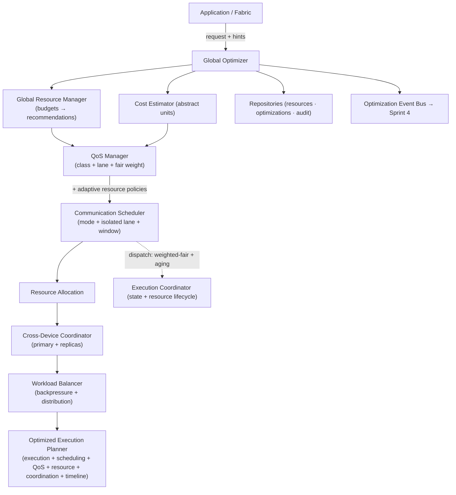
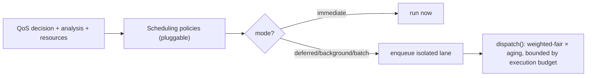
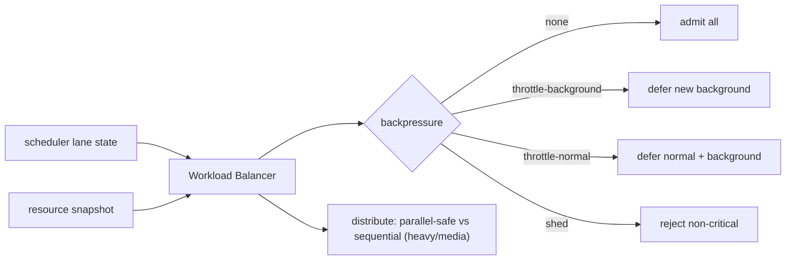

# Layer 12 · Sprint 3 — Resource Optimization & Global Coordination

> **Status:** ✅ Complete · **Scope:** global optimization — Global Resource Manager, Communication
> Scheduler, QoS Framework, Adaptive Resource Policies, Cross-Device Coordination, Workload Balancing,
> Execution Planner. **Explicitly deferred to Sprint 4:** production monitoring, observability, runtime
> auto-tuning, ML, production hardening. **Deferred to later layers:** voice, video.

Sprint 2 made the Fabric decide *how* to route one request. Sprint 3 optimizes the platform **globally**:
it decides *when* a communication runs, *with what resources*, *at what quality of service*, and *on which
device* — coordinating scheduling, resource allocation, QoS, workload balancing, and cross-device behavior
**without modifying any lower communication layer**. It is an INDEPENDENT subsystem (`server/optimization/`)
that sits above the frozen Sprint 1 (Fabric) + Sprint 2 (adaptive routing) and plugs into the Fabric via a
single additive `executionHook`.

```
Application → Communication Fabric → Global Optimizer → QoS Manager → Scheduler → Execution
```

---

## 1. Architecture



**Directory layout** (`server/optimization/`): `resources/` (manager · cost · policies) · `qos/` · `scheduler/`
(lanes · policies · scheduler) · `balancing/` · `coordination/` · `planners/` (optimized plan · timeline) ·
`execution/` · `manager/` (optimizer) · `repository/` · `models/` · `validators/` · `serializers/` ·
`integration/` · `api/` · `events/` · `dto/` · `types/`.

**Independence:** the optimizer imports only the frozen Sprint-1 context builder + execution-plan shape
(via an internal re-export) and never touches transport / storage / media / sync / networking. Everything
it tracks is an ABSTRACT accounting UNIT — it makes allocation *recommendations*, never OS/kernel calls.

---

## 2. Scheduling Workflow

```mermaid
sequenceDiagram
  participant App
  participant Opt as Global Optimizer
  participant RM as Resource Manager
  participant QoS as QoS Manager
  participant Sch as Scheduler
  participant Ex as Execution Coordinator
  App->>Opt: optimize(request, { callerId })
  Opt->>RM: snapshot() → budgets + constrained
  Opt->>Opt: estimateCost(context)
  Opt->>QoS: evaluate (class + lane + policies) (or DENY)
  Opt->>Sch: schedule(mode, lane, window)
  alt immediate
    Sch-->>Opt: status=immediate, proceed=true
    Opt->>RM: allocate(cost)
  else deferred / background / batch
    Sch-->>Opt: enqueue lane, proceed=false
  end
  Opt->>Opt: coordinate devices + balance workload + build optimized plan
  Opt-->>App: optimization result (+ timeline)
  Note over Ex,Sch: later — dispatch() drains lanes<br/>(weighted-fair + aging, bounded by execution budget)
```

---

## 3. Global Resource Manager

Tracks abstract budgets — **bandwidth, cpu, memory, storage, connection, transfer, queue, execution** —
and provides:

- `snapshot()` — total / allocated / available / utilization per kind + which are **constrained** (≥ 90%).
- `recommend(cost)` — grantability + which kinds constrain it + a throttled recommendation (never a kernel
  call).
- `allocate(id, cost)` / `release(id)` — exact per-request reservation accounting.

The **cost estimator** derives a cost from control-plane descriptors only (declared payload size, media,
fan-out) — no measurement.

---

## 4. Communication Scheduler & QoS



**QoS Framework** — four priority classes (**critical / high / normal / background**) each mapped to an
**isolated lane** with a **fair-scheduling weight** (8 / 4 / 2 / 1). A CRITICAL classification is a sticky
floor a downgrade policy can never demote. **Aging** raises a waiting item's effective priority over time,
so a long-queued background item eventually overtakes fresh higher-class work — **starvation prevention**.

**Scheduler** — picks a {@link SchedulingMode} through **pluggable scheduling policies** (never a hardcoded
conditional): immediate / deferred / background / batch, honouring execution **windows**. `dispatch()` is
the global step — it drains queued work across lanes by weighted-fair + aged priority, bounded by the
execution budget and per-item resource grantability.

---

## 5. Adaptive Resource Policies

Pluggable hooks that **dynamically influence scheduling** (STEP 7): bandwidth, memory, **battery**,
storage, synchronization, communication, and **enterprise** hooks. Each may override the QoS class, prefer
a scheduling mode, cap concurrency, or deny admission — e.g. under bandwidth pressure large media is
batched; battery-saver backgrounds non-urgent traffic; enterprise can force-background or deny a class.

---

## 6. Cross-Device Coordination

For a user with multiple devices, the coordinator selects a **deterministic primary** (highest score →
most-recently-seen → lowest id, so every device computes the same result independently), designates
**replicas**, and produces a per-facet plan across **delivery / synchronization / media / execution**. It
never queries a device service directly — devices are injected or passed. Collaborative multi-device
execution is a future extension the plan shape already accommodates.

---

## 7. Workload Balancing



Flags saturated lanes, raises **graded backpressure**, makes admission decisions (critical always
admitted), performs adaptive queue selection, and splits a dispatch batch into parallel-safe groups vs a
sequential tail. Cluster-ready (`node` placement is a future field; single-node in Sprint 3).

---

## 8. Execution Planner

Assembles the single **optimized execution plan** from all upstream outputs — the frozen Sprint-1 execution
plan + scheduling plan + QoS plan + resource allocation plan + coordination plan + fallback plan + an
**execution timeline** (per-step start offsets honouring the plan's dependency edges; independent steps
share an offset → parallel). It validates consistency (proceed ⇔ immediate; a deferred plan must name a
lane). The **Execution Coordinator** owns the optimizer's state machine (pending → scheduled/deferred →
running → completed/failed) and the adaptive dispatch → allocate → release lifecycle.

---

## 9. Repositories

Storage-independent stores (in-memory + Mongo), one contract:

| Store | Methods | Backing |
|---|---|---|
| `resources` | `recordSnapshot · latest · list` | `OptimizationResourceSnapshot` |
| `optimizations` | `create · findByRequest · listRecent` | `OptimizationRecord` (bundles QoS + scheduling + allocation + coordination + balance + optimized plan) |
| `audit` | `append · listByRequest` | `OptimizationAuditLog` |

---

## 10. Events

`ResourcesCollected · QoSEvaluated · ExecutionScheduled · ExecutionDeferred · ResourcesAllocated ·
DevicesCoordinated · WorkloadBalanced · ExecutionStarted · ExecutionCompleted · OptimizationCompleted` —
control-plane only (ids + classifications + budget/queue numbers). **Sprint 4 consumes these** for
monitoring + observability + a dispatch worker.

---

## 11. Validation

Invalid resource plans, scheduler conflicts (mode/status/proceed), QoS conflicts (unknown class/lane),
queue overflow, policy conflicts, optimized-plan consistency, repository consistency, configuration errors
(budgets/weights), unauthorized (caller = sender), and the platform-wide **no-content invariant**.

---

## 12. API Endpoints

Mounted at `/api/optimization` (JWT-protected; caller = sender):

| Method | Path | Purpose |
|---|---|---|
| `POST` | `/schedule` | **full global optimization** (the primary entry point) |
| `POST` | `/execution-plan` | optimized execution plan (dry run) |
| `POST` | `/qos` | QoS profile (dry run) |
| `POST` | `/resource-allocation` | resource allocation recommendation (dry run) |
| `POST` | `/dispatch` | drain ready queued work (adaptive dispatch) |
| `GET` | `/scheduler-state` | scheduler + workload state |
| `GET` | `/diagnostics/:requestId` | optimization diagnostics + audit |
| `GET` | `/status` | budgets · lanes · metrics |

---

## 13. Client Integration

`client/src/lib/optimization.js` — `OptimizationClient` previews scheduling, inspects the scheduler/queue
state, drains deferred work, and drives an optimization dashboard. The app still **sends** through the
Communication Fabric, which this sprint makes globally optimized automatically via
`createFabricOptimizationIntegration({ optimizer })` — an `executionHook` consulted between planning and
orchestration. Immediate traffic proceeds; deferred/background traffic is queued in the optimizer and
returns a `deferred` status (drained later via `/api/optimization/dispatch`).

---

## 14. Performance

- Pure + synchronous decision path (no probing / I/O); bounded lane queues; O(policies + lanes + steps).
- Global resource accounting is O(1) recommend / allocate / release.
- Verified under 100 concurrent + a 75-request mixed workload with correct per-class classification and no
  cross-talk; large-media handling routed to the batch path.

---

## 15. Testing

DB-free suite (`optimization/tests/`, `node --test`) — **40 tests, all passing** (full project: 1871):

- `qos-scheduler.test.js` — QoS classification + lane isolation, sticky critical floor, scheduling modes,
  weighted-fair dispatch, **aging / starvation prevention**.
- `resources-balancing.test.js` — resource allocate/release/recommend/constrained, cost estimation, graded
  backpressure, admission, parallel/sequential distribution, battery + enterprise policies.
- `coordination-planner.test.js` — deterministic primary + replica plan, per-facet coordination, timeline
  dependency ordering, optimized-plan assembly + validation.
- `optimizer-concurrency.test.js` — end-to-end pipeline + events, diagnostics, dispatch lifecycle, 100
  concurrent + mixed workload, **Fabric integration** (immediate proceeds, background deferred).

---

## 16. Future Production-Hardening Integration (Sprint 4)

Sprint 4 completes the platform on this foundation without redesigning it:

- **Monitoring + observability** → subscribe to the optimization event bus + resource snapshots (already
  emitted) for metrics / Prometheus / alerts.
- **Dispatch worker** → a background loop around `dispatch()` (kept out of Sprint 3 — no runtime tuning).
- **Reliability + performance tuning + API stabilization + security validation + operational tooling** →
  layered on the frozen scheduler / QoS / resource interfaces.

Sprint 3 delivered global optimization; Sprint 4 makes it production-grade.
