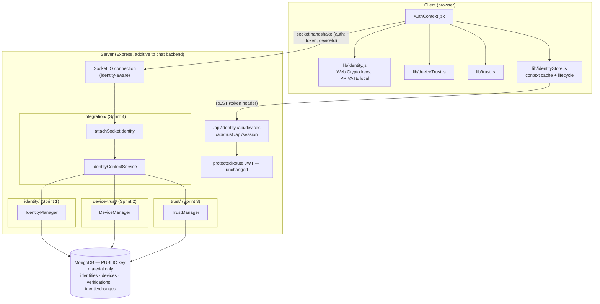
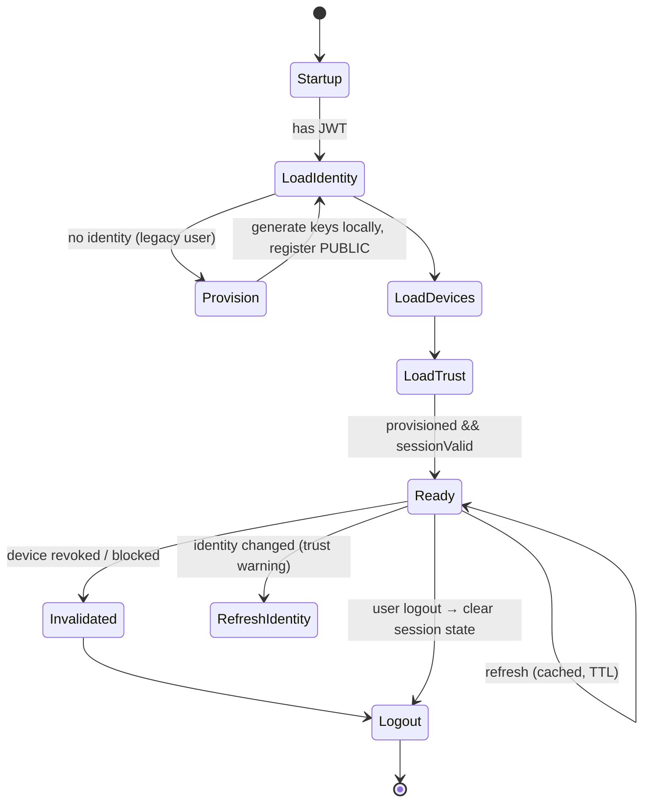

# LAYER 3 — FINAL: Secure Identity (Complete)

> **Status: Layer 3 complete.** Sprint 4 integrates the entire identity system
> (Sprints 1–3) into the running chat application: authentication, WebSockets,
> REST, and client — plus lifecycle, migration, performance, and a security
> review. Every authenticated user, device, API request, and socket now operates
> through the identity architecture.
>
> No Secure Handshake, ECDH sessions, forward secrecy, double ratchet, P2P, or
> encrypted messaging/media — those begin in **Layer 4**, which can start without
> redesigning any Layer 3 component.

Per-sprint docs: [`LAYER3_SPRINT1_IDENTITY.md`](./LAYER3_SPRINT1_IDENTITY.md) ·
[`LAYER3_SPRINT2_DEVICE_TRUST.md`](./LAYER3_SPRINT2_DEVICE_TRUST.md) ·
[`LAYER3_SPRINT3_TRUST.md`](./LAYER3_SPRINT3_TRUST.md). Foundations:
[`PROJECT_KNOWLEDGE.md`](./PROJECT_KNOWLEDGE.md) ·
[`crypto-sdk/CRYPTO_SDK.md`](./crypto-sdk/CRYPTO_SDK.md).

---

## 1. Complete Layer 3 architecture



**Subsystems (all reusable, DB-agnostic via repositories):**

| Sprint | Package | Owns |
|---|---|---|
| 1 | `server/identity/` | user + device identities, fingerprints, public-key registry |
| 2 | `server/device-trust/` | trusted-device lifecycle, trust states, events |
| 3 | `server/trust/` | user-to-user verification, safety numbers, QR, change detection |
| 4 | `server/integration/` | consolidated identity context, socket identity, session validity |

Sprint 4 added `server/integration/` + `/api/session` + identity-aware sockets +
client `identityStore.js`, and modified **only** `server.js` (route mount + socket
block) and `server/package.json` (test glob) among existing tracked files.

---

## 2. Authentication integration (JWT unchanged)

JWT issuance/verification is untouched. After JWT, the client loads the
consolidated context; the server assembles it from the three managers.

```mermaid
sequenceDiagram
    participant Cl as Client
    participant Auth as /api/auth (unchanged)
    participant Sess as /api/session
    participant ICS as IdentityContextService
    Cl->>Auth: login → { userData, token }  %% JWT unchanged
    Cl->>Cl: provision identity + device (Web Crypto; private keys local)
    Cl->>Sess: GET /context?deviceId=…  (token header)
    Sess->>ICS: loadContext(userId, deviceId)
    ICS->>ICS: Load Identity → Load Devices → Load Trust
    ICS-->>Cl: { identity, devices, currentDevice, verification, sessionValid, ready }
    Note over Cl: ready === true → Application Ready
```

`ready = provisioned && sessionValid`. An un-provisioned legacy user gets a valid
(if `ready:false`) context and is provisioned automatically on login (§6).

---

## 3. WebSocket integration (identity-aware, not encrypted)

The socket handshake now carries the JWT + deviceId. `attachSocketIdentity`
verifies the token (authoritative id over the legacy spoofable `query.userId`),
loads the context, attaches it to `socket.data.identity`, and emits
`identityContext` to the client. Presence, rooms, and delivery are **unchanged**.

```mermaid
sequenceDiagram
    participant Cl as Client
    participant IO as Socket.IO
    participant A as attachSocketIdentity
    Cl->>IO: connect (auth: token, deviceId; query.userId legacy)
    IO->>A: attachSocketIdentity(socket)
    A->>A: verify JWT → authenticated userId (else fall back to query.userId)
    A->>A: loadContext → identity, device trust, verification, sessionValid
    A-->>IO: socket.data.identity = { userId, authenticated, deviceTrust, fingerprint, ready }
    IO-->>Cl: emit "identityContext"
    Note over Cl: device revoked → sessionValid=false → client signs out
```

Backward compatible: a client sending only `query.userId` still connects
(unauthenticated, `authenticated:false`).

---

## 4. API integration

Additive endpoints (all behind `protectedRoute`; no private keys exposed):

| Method | Route | Purpose |
|---|---|---|
| GET | `/api/session/context` | Consolidated identity context ("Application Ready") |
| GET | `/api/session/validate` | Is this (user, device) session valid? |
| GET | `/api/session/directory` | Caller's verification state per contact (badging) |

These compose the existing `/api/identity/*`, `/api/devices/*`, and `/api/trust/*`
surfaces (Sprints 1–3) — which remain unchanged.

---

## 5. Client integration

`client/src/lib/identityStore.js` loads and caches the context
(`securechat.session.v1.<userId>`), with offline fallback and lifecycle helpers.
`AuthContext` (additive):

- **Startup / login / checkAuth:** provision identity+device, then
  `refreshIdentityContext` → exposes `identityContext` in context state.
- **Logout:** `clearIdentityContext` + reset state (device keys are retained so a
  later re-login on the same device reuses its identity).
- **Device revoked → invalidate session:** if the loaded/pushed context has a
  registered-but-untrusted current device (`sessionValid:false`), the client signs
  out automatically.
- **Sockets:** handshake carries `{ token, deviceId }`; listens for
  `identityContext`.

Sprint-1–3 client modules (`identity.js`, `deviceTrust.js`, `trust.js`) are reused.

---

## 6. Identity lifecycle



---

## 7. Migration (backward compatible, no data loss)

Identity introduced only NEW collections; existing `User`/`Message`/`Group`
documents are untouched — chat works with or without identity. The server cannot
generate identities (private keys are device-only), so migration is
**client-driven and automatic**: the next login of an identity-aware client
generates keys locally and registers the public material. Until then, the context
returns `provisioned:false` (non-breaking).

- **Visibility:** `reportIdentityAdoption` (Sprint 1) lists users still missing an
  identity; `verificationReport` (Sprint 3) reports verification adoption.
- **Idempotent:** re-provisioning is a no-op (same keys) or a safe refresh.

---

## 8. Performance

- **Consolidated context in one round trip** (`/api/session/context`) instead of
  three; assembled with `Promise.all` over the three managers.
- **TTL cache** in `IdentityContextService` (default 5 s) for the per-user base
  context; `invalidate(userId)` busts it on mutation.
- **Indexes** (from Sprints 1–3): `identities.user` (unique), `devices.deviceId`
  (unique) + `trustStatus`, `verifications (verifierUser, subjectUser)` (unique).
- **Client caching** of the context + trust warnings in `localStorage`
  (offline-friendly; avoids refetching on every mount).
- The directory endpoint avoids N per-subject queries (reads the caller's stored
  verifications only).

---

## 9. Security review

| Area | Posture |
|---|---|
| **Authentication** | JWT unchanged; sockets can now be **authenticated** via a verified JWT (id no longer only from the spoofable `query.userId`). |
| **Identity** | Server stores/serves PUBLIC keys only; private keys are generated and kept in the browser. Fingerprints are verified server-side (client-supplied fingerprint must equal `SHA-256(publicKey)`). |
| **Trust** | User-to-user verification via symmetric safety numbers; identity-change detection → `CHANGED` + warnings + events. Future handshake gates on these. |
| **Device management** | Trusted-device lifecycle + `canEstablishSession`; revoked/blocked devices invalidate the session (server `validateSession`, client auto-logout). |
| **Public-key distribution** | `/api/identity/users/:id/public-key`, `/api/trust/users/:id/fingerprint`, QR payloads — all public, integrity-checked (checksum + fingerprint↔key). |
| **API exposure** | Every route behind `protectedRoute`; DTOs whitelist public fields; asserted in tests that responses contain no private material. |
| **Storage** | Two/four new collections, public data only. `SecureStorage` (Layer 2 KMS) available for at-rest encryption of any key blobs if needed later. |

**Known limitations (by design this layer):** trust is out-of-band assertion (not
a cryptographic handshake — Layer 4); change detection is on-read (event-driven
push is future); CORS remains `*` and JWTs remain non-expiring (pre-existing
backend posture, documented in `PROJECT_KNOWLEDGE.md`, out of scope to change here).

---

## 10. Testing

**129 server tests** via Node's built-in runner (`cd server && npm test`), zero
external deps, in-memory repositories (no MongoDB):

| Suite | Tests | Focus |
|---|---|---|
| identity | 37 | identities, fingerprints, private-key isolation, Web-Crypto interop |
| device-trust | 45 | trusted-device lifecycle, state machine, events, migration |
| trust | 34 | safety numbers, QR, verification, identity-change detection |
| **integration** | **13** | **context assembly, socket identity, session validity, migration lifecycle** |

Sprint 4's integration tests cover: existing (un-provisioned) vs new users, the
auto-provision → ready path, device-revoked → session invalidated, verified/trusted
summaries + directory, context caching/invalidation, and identity-aware sockets
(authenticated JWT vs legacy `query.userId` fallback). Production Mongo/JSX files
are validated with `node --check` / an esbuild JSX parse.

---

## 11. Future Layer 4 integration points

Layer 4 (Secure Handshake / E2E) builds directly on Layer 3 with no redesign:

- **Gate sessions on trust & device state:** call `IdentityContextService`
  (`sessionValid`, `currentDevice`), `TrustManager.getVerificationStatus`, and
  `DeviceManager.canEstablishSession` before a handshake; subscribe to
  `trust.identity_changed` / `device.revoked` to tear sessions down.
- **Key material:** verified identity public keys (registry) are the long-term
  keys a handshake authenticates; devices carry per-device keys for device-scoped
  sessions.
- **Identity-aware transport:** `socket.data.identity` already tells each socket
  who/what it is — the substrate for routing encrypted frames per device.
- **Crypto:** Layer 4 consumes the Layer 2 Crypto SDK (`crypto-engine` X25519
  agreement + `SignatureEngine`) — see `crypto-sdk/INTEGRATION.md`.

Layer 3 is complete: **every user and device can be cryptographically identified,
trusted, and verified.**
