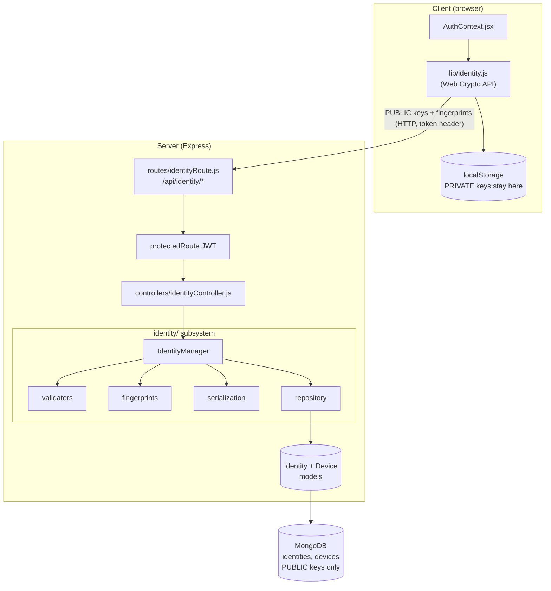
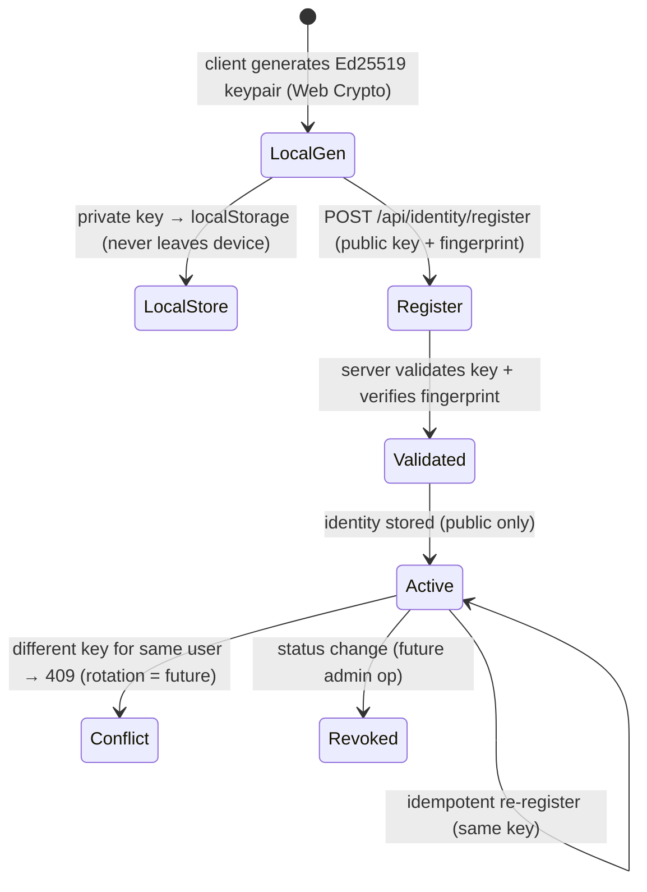
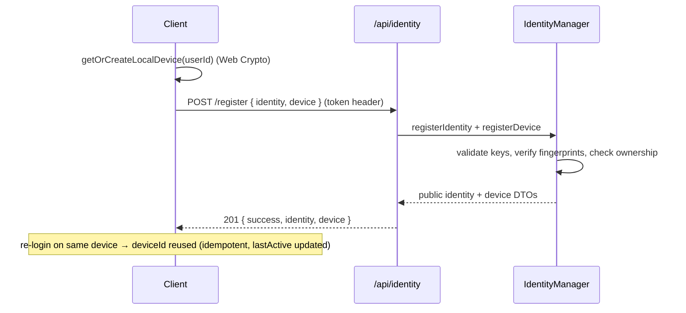
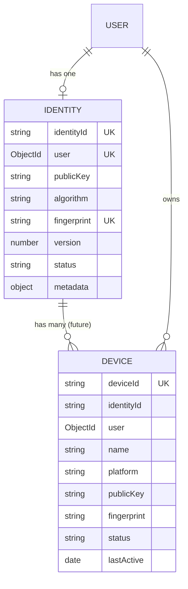
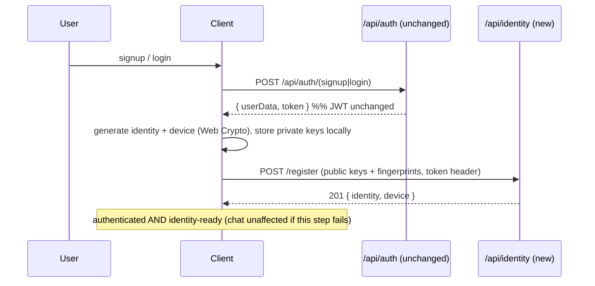
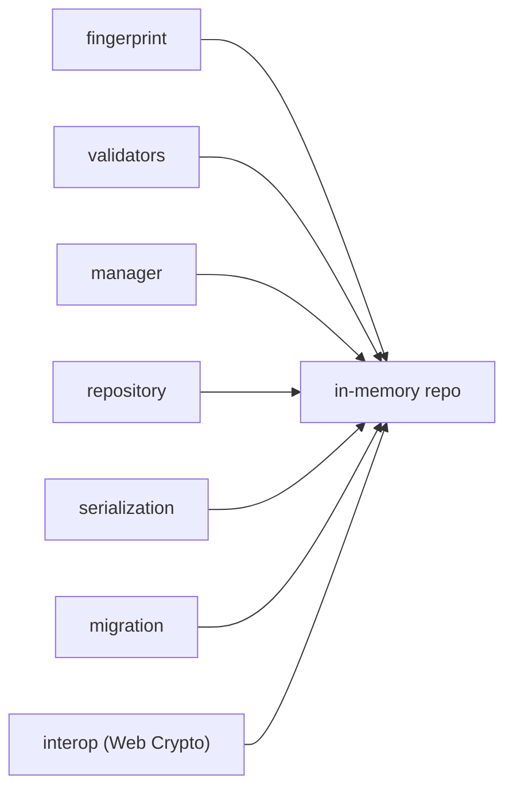

# LAYER 3 · SPRINT 1 — Secure Identity Infrastructure

> **Status: complete.** This is the first sprint that integrates the Layer 2
> Crypto SDK into the chat application. It establishes **permanent cryptographic
> identities** for every user and every device.
>
> It does **NOT** implement E2E encryption, secure handshake, forward secrecy,
> session keys, peer discovery, or P2P — those are later sprints. It only
> establishes identity, additively, without changing existing auth/JWT/chat.

Related docs: [`PROJECT_KNOWLEDGE.md`](./PROJECT_KNOWLEDGE.md) (backend baseline),
[`crypto-sdk/CRYPTO_SDK.md`](./crypto-sdk/CRYPTO_SDK.md) (the SDK),
[`crypto-sdk/INTEGRATION.md`](./crypto-sdk/INTEGRATION.md) (extension points this
sprint realizes for Identity Keys).

---

## 1. What changed (and what did NOT)

**Added (new, isolated):**

- Server subsystem `server/identity/` (models, repository, manager, validators,
  fingerprints, serialization, migration).
- Two new MongoDB collections: `identities`, `devices`.
- New API surface under `/api/identity` (all behind the existing JWT middleware).
- Client module `client/src/lib/identity.js` (Web Crypto key generation).

**Modified (minimal, additive only):**

- `server/server.js` — 2 lines: import + mount `/api/identity`.
- `server/package.json` — added a `test` script.
- `client/context/AuthContext.jsx` — 3 additive lines: register identity after
  login / auth-check (fire-and-forget).

**Untouched:** the `User`/`Message`/`Group` models, existing auth controllers,
JWT (`generateToken`, `protectedRoute`), all message/group routes and controllers,
Socket.IO, Redis, and the entire Layer 2 Crypto SDK. Existing signup/login still
return the same JWT and still work with an identity-unaware client.

---

## 2. Architecture



Design principle: the server is a **public-key directory**. It never receives,
derives, or stores a private key. Fingerprints are recomputed and verified
server-side so a client cannot register a key under a mismatched fingerprint.

### Folder structure

```
server/identity/
├── index.js                      # subsystem entry (Mongo + in-memory factories)
├── errors.js                     # typed IdentityError hierarchy (.code, .status)
├── manager/identityManager.js    # orchestration facade (lifecycle, lookup, validation)
├── repository/
│   ├── mongoRepository.js        # production (Mongoose)
│   └── inMemoryRepository.js     # tests / reference (no DB)
├── models/
│   ├── Identity.model.js         # NEW collection — public identity
│   └── Device.model.js           # NEW collection — public device
├── validators/identityValidators.js   # key/fingerprint/device validation
├── fingerprints/fingerprint.js         # deterministic fingerprints (SDK-compatible)
├── serialization/identitySerializer.js # public DTOs (private material excluded)
├── migration/migration.js              # adoption report; no destructive migration
└── tests/                              # node --test suite (37 tests, in-memory)

server/controllers/identityController.js  # HTTP adapters
server/routes/identityRoute.js            # /api/identity routes
client/src/lib/identity.js                # browser identity (Web Crypto)
```

---

## 3. Identity model

Every user owns exactly **one** long-term identity (unique index on `user`).

| Field | Where | Notes |
|---|---|---|
| `identityId` | server | stable UUID |
| `publicKey` | server (public) | base64 raw Ed25519 (32 bytes) |
| **private key** | **device only** | JWK in browser `localStorage`; **never** sent |
| `algorithm` | both | `"ed25519"` |
| `fingerprint` | both | SHA-256(publicKey) hex (server verifies) |
| `version` | server | 1 (rotation is future) |
| `status` | server | `active` / `revoked` |
| `metadata` | server | public, caller-defined |
| `createdAt`/`updatedAt` | server | timestamps |

### Identity lifecycle



---

## 4. Device identity

Each installation is a device with its own keypair. Designed for **multiple
devices per identity** (a future layer); Sprint 1 registers the current device.

| Field | Notes |
|---|---|
| `deviceId` | client-generated, stable per install (`dev_<hex>`) |
| `name` / `platform` | e.g. "Web · Chrome", "web (Chrome on Linux)" |
| `publicKey` / `algorithm` / `fingerprint` | device's own Ed25519 public key |
| `identityId` / `user` | owner links (ownership enforced) |
| `status` / `lastActive` / `registeredAt` | lifecycle |



---

## 5. Database changes

Two **new** collections; existing schemas untouched. MongoDB is schemaless, so no
destructive migration is required.



**Migration / backward compatibility:** existing users simply have no identity
yet. The server cannot backfill (no private keys), so adoption is client-driven —
the next identity-aware login generates and registers the identity. Until then,
identity lookups return `null` (non-breaking). `reportIdentityAdoption()` gives
operators visibility into who still lacks an identity.

---

## 6. Authentication flow (JWT unchanged)

Identity is layered on top of the existing flow. The auth controllers are not
modified; the client orchestrates identity **after** it holds the JWT.



Because private keys are generated on-device, the "Generate Identity → Store
Public Keys" step of the new flow lives on the **client** plus the new endpoint —
the signup/login controllers stay exactly as they were.

---

## 7. API changes

All routes require the existing JWT (`token` header). No private keys accepted or
returned.

| Method | Route | Purpose |
|---|---|---|
| POST | `/api/identity/register` | Establish identity + register calling device |
| GET | `/api/identity/me` | Caller's public identity (or `null`) |
| GET | `/api/identity/fingerprint` | Caller's fingerprint (machine/human/numeric) |
| POST | `/api/identity/devices` | Register another device under caller's identity |
| GET | `/api/identity/devices` | List caller's devices |
| GET | `/api/identity/devices/:deviceId` | Look up one device (ownership-checked) |
| PATCH | `/api/identity/devices/:deviceId/active` | Mark device active |
| GET | `/api/identity/users/:userId/public-key` | Another user's key bundle (distribution) |
| GET | `/api/identity/users/:userId/fingerprint` | Another user's fingerprint |

Errors map from typed `IdentityError`s: `400` validation, `403` ownership, `404`
not-found, `409` duplicate.

---

## 8. Identity Manager

`IdentityManager` (in `manager/identityManager.js`) is the reusable facade. It is
DB-agnostic (constructed with `{ identities, devices }` repositories) so it runs
against MongoDB in production and an in-memory store in tests.

Methods: `registerIdentity`, `registerDevice`, `getIdentityByUser`,
`getPublicKey`, `getFingerprint`, `listDevices`, `getDevice`, `touchDevice`,
`validateIdentity`. No encryption; identity only.

## 9. Repositories

The repository isolates all database access behind a small contract
(`create/find*/update/delete`) with two implementations:

- `createMongoRepositories()` — Mongoose, `.lean()` reads.
- `createInMemoryRepositories()` — Map-backed, deep-copied, for tests.

Both enforce: one identity per user (duplicate → `DuplicateIdentityError`), unique
`deviceId` (`DuplicateDeviceError`), and record isolation.

## 10. Fingerprints

Deterministic and **SDK-compatible**: `fingerprint = SHA-256(rawPublicKey)` hex —
byte-identical to the Crypto SDK's `fingerprint()` and to the client's Web Crypto
computation (proven by interop tests). Formats:

- **machine** — 64-char hex (canonical).
- **human** — hex in 4-char groups.
- **numeric** — 8×5-digit safety-number-style code (single-identity; pairwise
  safety numbers are future).
- **binary** — raw 32-byte digest (for QR export / verification, future).

The identity fingerprint is a function of the identity public key only, so it is
**stable across devices** for the same identity; each device also has its own
device fingerprint.

---

## 11. Testing

37 tests via Node's built-in runner (`node --test`), zero external deps, using the
in-memory repository (no MongoDB needed). Run: `cd server && npm test`.

Coverage: signup/login-adjacent identity generation, public-key storage,
**private-key isolation** (DTOs asserted to contain no private material), device
registration, multiple devices, fingerprint generation/formats/stability, identity
lookup, repository CRUD + constraints, ownership enforcement, corrupted keys,
fingerprint mismatch, migration/backfill reporting, and **client↔server interop**
(Web Crypto keys validated + registered server-side).



---

## 12. Future integration points

- **Key distribution:** `GET /users/:id/public-key` already serves the bundle a
  future Secure Handshake / E2EE layer will fetch to start a session.
- **Signing:** identity keys are Ed25519 — ready to sign prekeys / handshake
  transcripts (future) with the Crypto SDK's `SignatureEngine`.
- **Multi-device:** the `devices` collection and per-device keys are in place;
  future multi-device identity-key transfer/sync builds on this.
- **Rotation:** `version` + `status` fields anticipate future identity rotation
  (currently a re-register with a different key is rejected).
- **Verification UI:** fingerprint formats (human/numeric/binary) are ready for QR
  export and safety-number comparison.

See `crypto-sdk/INTEGRATION.md` §2–§7 for the full map.

---

## 13. Current limitations

- **Single-device identity in practice.** Each device generates its own identity
  keypair; sharing one identity's private key across a user's devices (true
  multi-device) is a future capability. Today, a second device would create a
  conflicting identity (rejected) unless it reuses the same local storage.
- **No identity rotation.** Re-registering a different key for a user is rejected
  (409); rotation with history is future.
- **Browser Ed25519 dependency.** Client key generation needs Web Crypto Ed25519
  (modern browsers). If unsupported, identity registration is skipped gracefully
  and chat is unaffected.
- **Private-key storage is `localStorage`.** Adequate for Sprint 1; hardware-backed
  / non-extractable storage is future.
- **Trust-on-first-use.** The server verifies fingerprint↔key consistency but does
  not (yet) provide out-of-band identity verification between users — that is the
  safety-number/verification feature of a later layer.
- **No encryption of anything.** This sprint establishes identity only.
