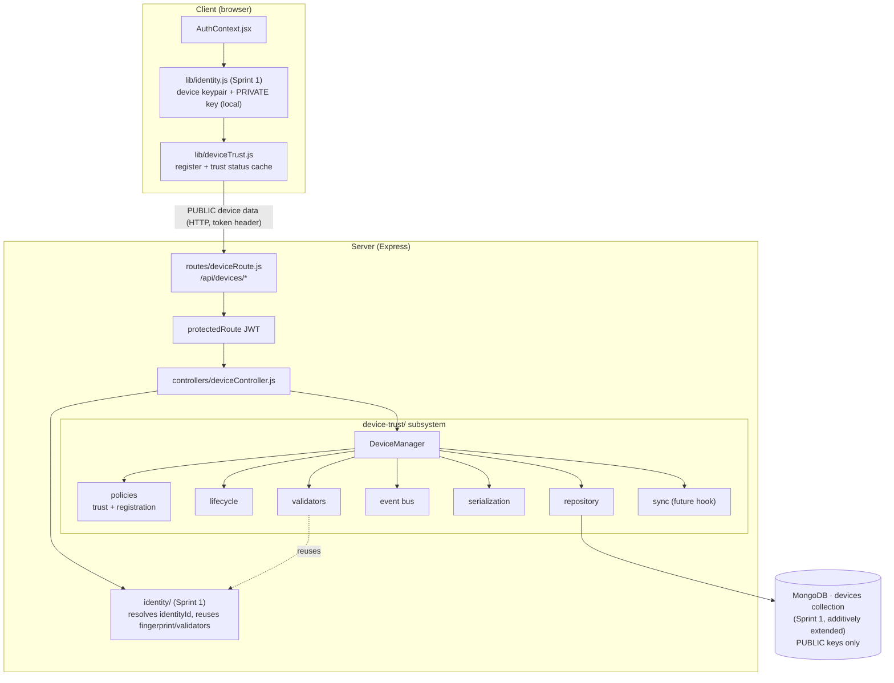
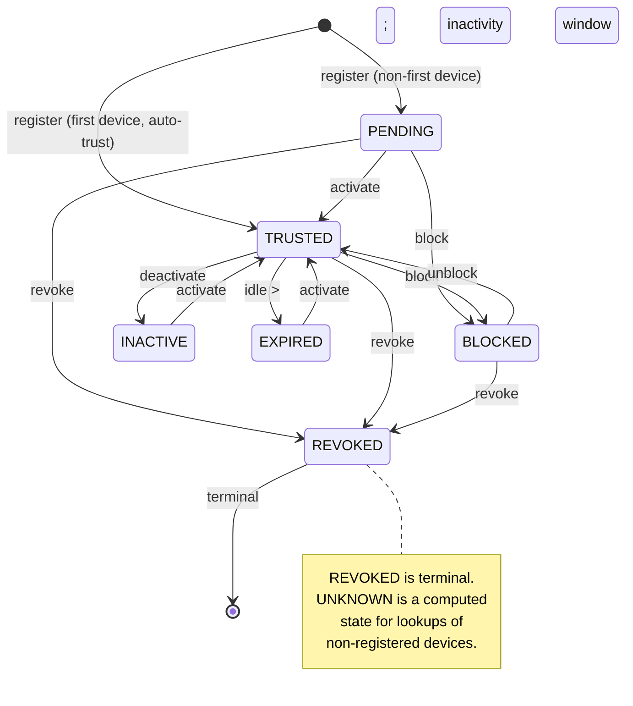
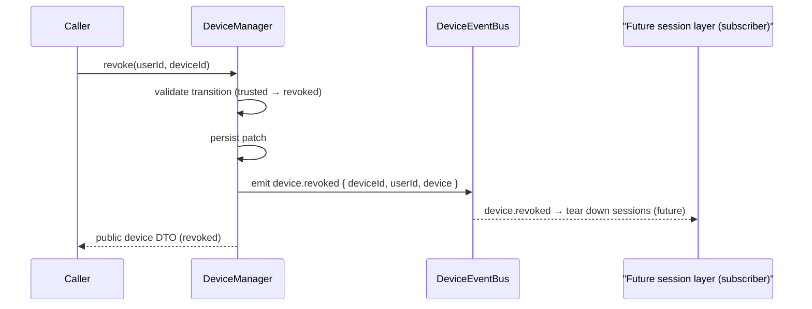
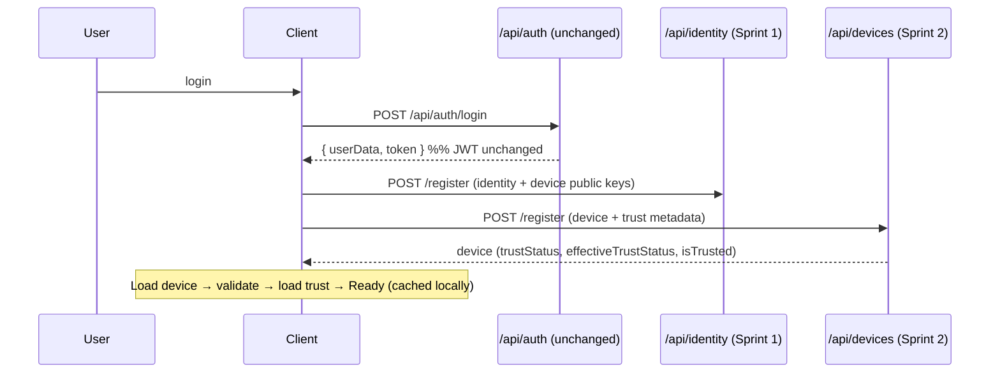

# LAYER 3 · SPRINT 2 — Device Trust & Multi-Device Management

> **Status: complete.** Builds on Layer 3 Sprint 1 (Secure Identity) without
> redesigning it. Devices are now **first-class cryptographic entities** with a
> full trust lifecycle, policies, and events. Future layers will establish secure
> sessions between **trusted devices**, not merely between users.
>
> This sprint does **NOT** implement E2E encryption, secure handshake, forward
> secrecy, session keys, peer discovery, P2P, encrypted messaging, the Signal
> protocol, QR verification, safety numbers, or user verification. It manages
> trusted devices only.

Related: [`LAYER3_SPRINT1_IDENTITY.md`](./LAYER3_SPRINT1_IDENTITY.md),
[`PROJECT_KNOWLEDGE.md`](./PROJECT_KNOWLEDGE.md),
[`crypto-sdk/INTEGRATION.md`](./crypto-sdk/INTEGRATION.md).

---

## 1. What changed (and what did NOT)

**Added (new, isolated):**

- Server subsystem `server/device-trust/` (manager, repository, policies,
  validators, lifecycle, events, sync-hook, serialization, migration).
- New API surface under `/api/devices` (behind the existing JWT middleware).
- Client module `client/src/lib/deviceTrust.js`.

**Modified (minimal, additive only):**

- `server/identity/models/Device.model.js` — **additive fields** (trustStatus, os,
  appVersion, capabilities, revokedAt, revokedReason, deactivatedAt, metadata),
  all optional with defaults. Existing docs/behaviour unaffected.
- `server/server.js` — 2 lines: import + mount `/api/devices`.
- `server/package.json` — test glob now includes device-trust.
- `client/context/AuthContext.jsx` — device registration chained after identity
  (fire-and-forget).

**Untouched:** Sprint 1's identity manager/repository/controllers/routes, the
`User`/`Message`/`Group`/`Identity` schemas, JWT (`generateToken`,
`protectedRoute`), all chat routes/controllers, Socket.IO, Redis, and the Layer 2
Crypto SDK. The Sprint 1 `Device` collection is reused (not duplicated).

---

## 2. Architecture



### Folder structure

```
server/device-trust/
├── index.js                       # subsystem entry (Mongo + in-memory factories)
├── types.js                       # TrustStatus, DeviceEventType, DeviceCapability, DeviceAction
├── errors.js                      # DeviceTrustError hierarchy (.code, .status)
├── manager/deviceManager.js       # facade: lifecycle, queries, trust evaluation, events
├── policies/
│   ├── trustPolicy.js             # state machine + expiry + canEstablishSession
│   └── registrationPolicy.js      # device limit, naming, initial trust
├── lifecycle/deviceLifecycle.js   # pure action → {patch, event} planner
├── validators/deviceValidators.js # reuses Sprint 1 key/fingerprint validation
├── events/deviceEvents.js         # DeviceEventBus (EventEmitter)
├── serialization/deviceSerializer.js # public DTOs (+ effective trust status)
├── repository/
│   ├── mongoRepository.js         # production (Mongoose, shared Device model)
│   └── inMemoryRepository.js      # tests / reference
├── sync/deviceSync.js             # NoopDeviceSync (future multi-device sync hook)
├── migration/migration.js         # backfill trustStatus; breakdown; no destructive change
└── tests/                         # node --test suite (45 tests, in-memory)

server/controllers/deviceController.js   # HTTP adapters
server/routes/deviceRoute.js             # /api/devices routes
client/src/lib/deviceTrust.js            # browser device-trust integration
```

Suggested-structure mapping: `storage/` is the repository (single source of
truth); `services/` responsibilities live in the manager + serialization.

---

## 3. Trust model

Every device is a first-class entity with the fields in the model table below and
a trust status governed by a state machine.



- **Effective status** applies inactivity expiry on read: a stored `TRUSTED` device
  idle beyond the window evaluates to `EXPIRED` without a write.
- **`canEstablishSession(device)`** is the single decision future session layers
  MUST honour before creating a secure session — it returns `{ ok, status, reason }`
  and is `ok` only for a trusted, owned, non-expired device.

### Trusted device model

| Field | Notes |
|---|---|
| `deviceId` | client-generated, stable per install |
| `user` / `identityId` | owner + identity links |
| `publicKey` / `algorithm` / `fingerprint` | Ed25519 public key (Sprint 1) |
| `name` / `platform` / `os` / `appVersion` | descriptors |
| `capabilities` | advertisement flags (`messaging`, `media`, `groups`) — no crypto capability yet |
| `trustStatus` | authoritative trust state |
| `status` | Sprint 1 legacy (`active`/`revoked`), kept loosely in sync |
| `lastActive` / `deactivatedAt` / `revokedAt` / `revokedReason` | lifecycle timestamps |
| `metadata` | arbitrary public metadata (extensible) |
| `createdAt` / `updatedAt` | timestamps |

---

## 4. Device lifecycle & Device Manager

`DeviceManager` (`manager/deviceManager.js`) is the reusable, DB-agnostic facade
(constructed with a `{ devices }` repository + optional event bus / policies /
clock). Operations:

- **register** (idempotent; first device auto-trusted, rest pending),
- **activate / deactivate / revoke / block / unblock** (policy-guarded transitions),
- **rename / updateMetadata / touch**,
- **delete**,
- **listDevices / listTrusted / filterByStatus / getDevice / getFingerprint**,
- **evaluateTrust / canEstablishSession / getCurrentDeviceTrust** (for future sessions & auth).

Each mutation emits a device event (§7). Future recovery/sync hooks: the `sync/`
module (`NoopDeviceSync`) is wired now for later cross-device propagation.

---

## 5. Repository layer

The repository isolates all DB access behind one contract
(`create`, `findById`, `findByUser`, `findByIdentity`, `findByStatus`,
`findTrusted`, `countByUser`, `update`, `delete`) with two implementations —
`createMongoDeviceRepository()` (Mongoose, shared `Device` model) and
`createInMemoryDeviceRepository()` (tests). Enforces unique `deviceId`
(`DuplicateDeviceError`) and record isolation.

---

## 6. Database changes

No new collection — the Sprint 1 `devices` collection is **additively extended**
(trustStatus, os, appVersion, capabilities, revokedAt, revokedReason,
deactivatedAt, metadata; all optional with defaults). MongoDB is schemaless, so
existing device documents remain valid.

**Backfill:** `backfillTrustStatus()` derives `trustStatus` for pre-Sprint-2
devices from the legacy `status` (`active → trusted`, `revoked → revoked`).
Idempotent. `trustStatusBreakdown()` reports a user's device trust distribution.

---

## 7. Device events

`DeviceEventBus` (Node `EventEmitter`) emits typed, in-process events on every
lifecycle change; future layers subscribe (e.g. tear down sessions on revoke).



Event types: `device.registered`, `device.activated`, `device.deactivated`,
`device.revoked`, `device.blocked`, `device.unblocked`, `device.updated`,
`device.deleted`. Payloads are public (ids + public DTOs) — no private material.

---

## 8. Authentication integration (JWT unchanged)

Additive: JWT is untouched. After login, the client establishes identity
(Sprint 1) then registers/loads device trust.



Server-side, `DeviceManager.getCurrentDeviceTrust` + `canEstablishSession`
implement "load device → validate → load device trust → ready" without any change
to the JWT middleware.

---

## 9. API endpoints

All behind `protectedRoute` (JWT). No private keys accepted or returned.

| Method | Route | Purpose |
|---|---|---|
| POST | `/api/devices/register` | Register/refresh the calling device (trust metadata) |
| GET | `/api/devices` | List the caller's devices |
| GET | `/api/devices/trusted` | List the caller's trusted devices |
| GET | `/api/devices/:deviceId` | Get one device |
| GET | `/api/devices/:deviceId/fingerprint` | Device fingerprint (all formats) |
| POST | `/api/devices/:deviceId/revoke` | Revoke a device (`{ reason? }`) |
| POST | `/api/devices/:deviceId/activate` | Activate (→ trusted) |
| POST | `/api/devices/:deviceId/deactivate` | Deactivate (→ inactive) |
| POST | `/api/devices/:deviceId/touch` | Mark active now |
| PATCH | `/api/devices/:deviceId/rename` | Rename (`{ name }`) |
| PATCH | `/api/devices/:deviceId/metadata` | Merge metadata (`{ metadata }`) |
| DELETE | `/api/devices/:deviceId` | Delete a device record |

Errors map from typed `DeviceTrustError`/`IdentityError`: `400` validation, `403`
ownership, `404` not-found, `409` duplicate / registration-policy / invalid
transition.

---

## 10. Client integration

`client/src/lib/deviceTrust.js` reuses the Sprint 1 local device keypair, enriches
it with OS / app version / capabilities, registers the PUBLIC device, and caches
the current device + trust status in `localStorage`
(`securechat.deviceTrust.v1.<userId>`). Helpers: `fetchDevices`,
`fetchTrustedDevices`, `refreshCurrentDeviceTrust`, `revokeDevice`, `renameDevice`,
`activateDevice`. **Private keys never leave the browser.**

---

## 11. Testing

45 device-trust tests (82 total with Sprint 1) via Node's built-in runner
(`cd server && npm test`), zero external deps, in-memory repository (no MongoDB).

Coverage: registration (first-trusted / rest-pending), idempotency, validation
(fingerprint mismatch, capabilities, metadata, ownership), revocation, activation,
deactivation, block/unblock, invalid transitions, multiple devices, lookup,
repository CRUD + filters, trust policy state machine + expiry, `canEstablishSession`,
device events (typed + wildcard + unsubscribe), lifecycle planner, migration
backfill, and **authentication integration** (load device → validate → trust → ready).

---

## 12. Future integration points

- **Secure sessions:** future handshake/session layers call
  `DeviceManager.canEstablishSession(userId, deviceId)` (or the pure
  `trustPolicy.canEstablishSession`) before establishing a session, and subscribe
  to `device.revoked`/`device.blocked` to tear sessions down.
- **Per-device messaging:** messages will target `deviceId`s (first-class), using
  device public keys served by `/api/devices/*`.
- **Multi-device sync:** `sync/deviceSync.js` (`NoopDeviceSync`) is the seam for
  propagating device-list/trust changes across a user's devices.
- **Recovery:** the lifecycle + events provide the hook points for future device
  recovery/approval flows.

---

## 13. Current limitations

- **New devices are `pending` but self-activatable.** Sprint 2 has no cross-device
  approval (a trusted device approving a new one) — that needs multi-device sync
  and is future. The device owner can activate their own pending devices.
- **Expiry is evaluated on read, not swept.** A background job to persist
  `EXPIRED` is future; `effectiveStatus` already reflects it for decisions.
- **No cross-device sync.** `NoopDeviceSync` performs nothing yet.
- **Trust ≠ user verification.** This sprint manages device trust for the owner;
  out-of-band verification between different users (safety numbers / QR) is
  explicitly a later layer.
- **Browser Ed25519 dependency** (inherited from Sprint 1): if unsupported, device
  registration is skipped gracefully and chat is unaffected.
- **No encryption.** Devices are cryptographic identities; no messages are
  encrypted in this sprint.
