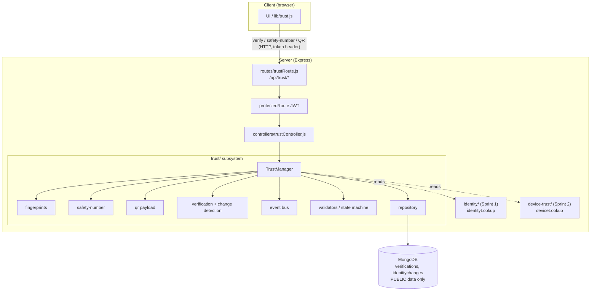
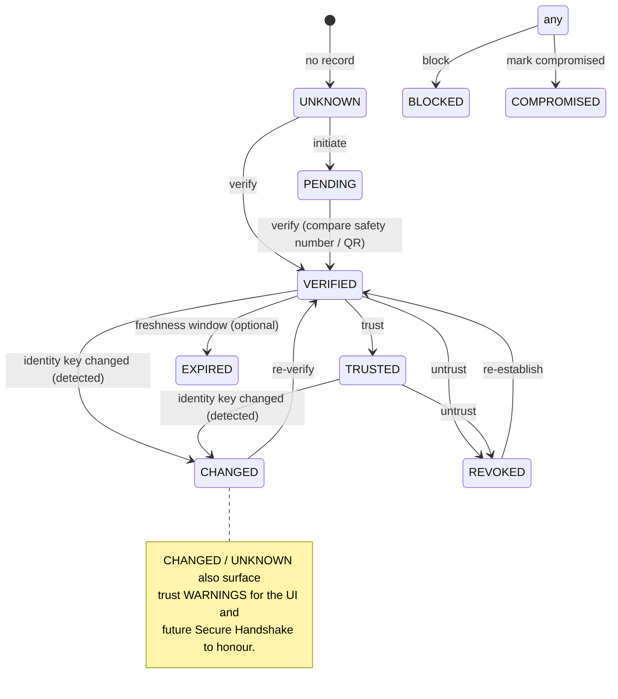
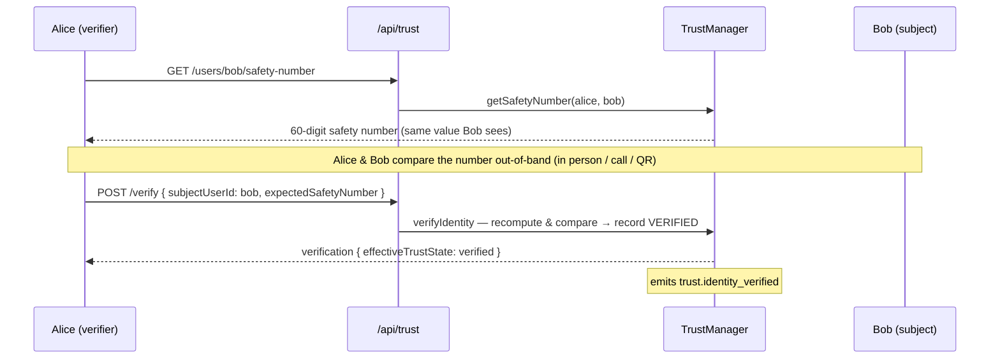
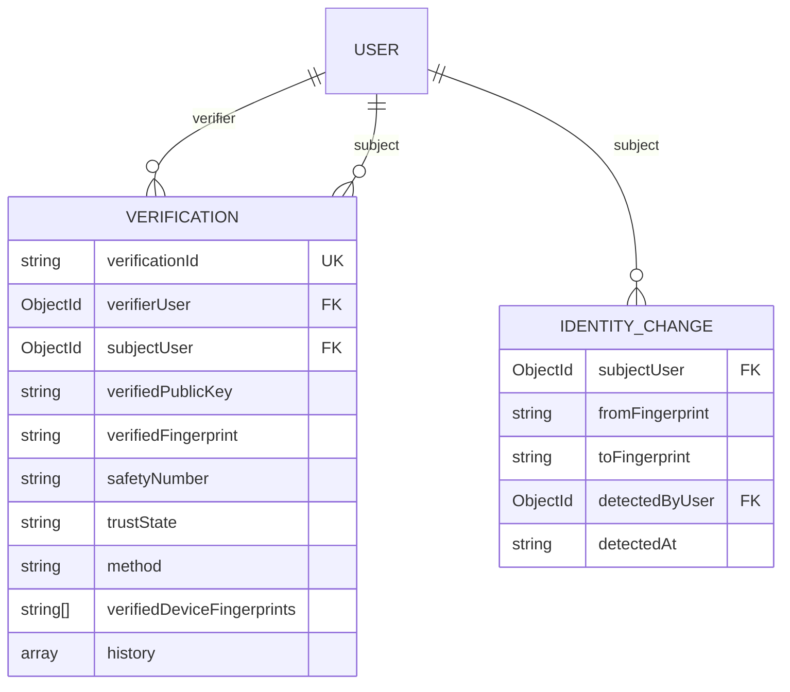

# LAYER 3 · SPRINT 3 — Identity Verification & Trust Establishment

> **Status: complete.** Builds on Sprint 1 (Identity) and Sprint 2 (Device Trust)
> without redesigning them. Users can now **cryptographically verify each other's
> identities** before secure communication begins. This completes the trust layer
> and prepares the system for **Secure Handshake in Layer 4**.
>
> This sprint does **NOT** implement Secure Handshake, E2E encryption, forward
> secrecy, session keys, peer discovery, P2P, encrypted messaging/media, the Signal
> double ratchet, or camera QR scanning. It establishes verification & trust only.

Related: [`LAYER3_SPRINT1_IDENTITY.md`](./LAYER3_SPRINT1_IDENTITY.md),
[`LAYER3_SPRINT2_DEVICE_TRUST.md`](./LAYER3_SPRINT2_DEVICE_TRUST.md),
[`crypto-sdk/CRYPTO_SDK.md`](./crypto-sdk/CRYPTO_SDK.md).

---

## 1. What changed (and what did NOT)

**Added (new, isolated):**

- Server subsystem `server/trust/` (manager, verification, fingerprints,
  safety-number, qr, validators, serialization, events, repository, models,
  migration).
- Two new MongoDB collections: `verifications`, `identitychanges`.
- New API surface under `/api/trust` (behind the existing JWT middleware).
- Client module `client/src/lib/trust.js`.

**Modified (minimal, additive only):**

- `server/server.js` — 2 lines: import + mount `/api/trust`.
- `server/package.json` — test glob now includes `trust`.

**Untouched:** Sprints 1–2 subsystems, `User`/`Message`/`Group`/`Identity`/`Device`
schemas, JWT (`generateToken`, `protectedRoute`), all chat routes/controllers,
Socket.IO, Redis, and the Layer 2 Crypto SDK. The trust layer *reuses* Sprint 1's
fingerprint spec and public-key validation.

---

## 2. Architecture



### Folder structure

```
server/trust/
├── index.js                        # subsystem entry (Mongo + in-memory factories)
├── types.js                        # TrustState, VerificationMethod, TrustEventType, TrustWarningType
├── errors.js                       # TrustError hierarchy (.code, .status)
├── manager/trustManager.js         # facade: verify/trust, fingerprints, safety numbers, QR, change detection
├── fingerprints/fingerprint.js     # rich fingerprints (reuses Sprint 1 spec)
├── safety-number/safetyNumber.js   # deterministic symmetric safety numbers
├── qr/qrPayload.js                 # QR verification payload (build/serialize/deserialize/validate)
├── verification/                   # (verification logic lives in the manager)
├── validators/trustValidators.js   # trust state machine + ownership
├── serialization/trustSerializer.js # public DTOs
├── events/trustEvents.js           # TrustEventBus
├── repository/
│   ├── mongoRepository.js          # production (Mongoose)
│   └── inMemoryRepository.js       # tests / reference
├── models/
│   ├── Verification.model.js       # NEW collection
│   └── IdentityChange.model.js     # NEW collection (change history)
├── migration/migration.js          # report; no destructive change
└── tests/                          # node --test suite (34 tests, in-memory)

server/controllers/trustController.js   # HTTP adapters (wires identity + device lookups)
server/routes/trustRoute.js             # /api/trust routes
client/src/lib/trust.js                 # browser trust integration
```

---

## 3. Trust model & verification lifecycle

A verification is a directed relationship: **verifier → subject**. Its trust state
follows a state machine; identity-change detection can move a verified relationship
to `CHANGED`.



States: `UNKNOWN`, `PENDING`, `VERIFIED`, `TRUSTED`, `CHANGED`, `COMPROMISED`,
`REVOKED`, `EXPIRED`, `BLOCKED`. Future modules (Secure Handshake) consume these.

### Verification flow (safety number)



---

## 4. Fingerprints

Reuses the Sprint 1 spec (`SHA-256(rawPublicKey)` hex) so client, identity, device,
and trust all agree. Each identity exposes:

- **machine** — canonical 64-char hex (stable).
- **compact** — 16-char prefix (compact display / lookup).
- **human** — hex grouped for eyeballing.
- **version** + **metadata** (`{ algorithm, version, createdAt }`).
- **history** — recorded in the `identitychanges` log when a key changes.

Fingerprints are pure functions of the public key: stable unless the identity key
changes (which the trust layer detects).

---

## 5. Safety numbers

Deterministic, **symmetric** 60-digit numbers for out-of-band verification —
both parties compute the identical value from their two public identity keys.

- Per party: `d_i = SHA-512^N(version ‖ publicKey_i ‖ identifier_i, publicKey_i)`
  (first 30 bytes) → 30 digits (6 × 5-digit groups, each `5-byte-BE mod 100000`).
- Safety number = the two 30-digit strings in **canonical order** (by digest
  comparison) → 60 digits, formatted in 12 groups of 5.
- Versioned; validated (`isValidSafetyNumber`); QR-ready.

Security: derived from PUBLIC keys — not secret. Its purpose is a stable,
human-comparable representation, not confidentiality. A mismatch on compare
signals a possible impersonation / MITM.

---

## 6. QR payload format

Infrastructure only (no camera). `buildQrPayload` → `serializeQrPayload` produces
the base64url string a QR code would encode; a scanner hands the string to
`deserializeQrPayload`/`verifyViaQr`.

```json
{
  "v": 1,
  "type": "securechat-identity-verification",
  "subjectUserId": "…",
  "identityId": "…",
  "publicKey": "base64-raw-ed25519",
  "algorithm": "ed25519",
  "fingerprint": "hex",
  "issuedAt": "ISO",
  "checksum": "sha256(canonical body)"
}
```

Tamper detection: the `checksum` (SHA-256 over the canonical body) **and** a
fingerprint↔public-key consistency check. `verifyViaQr` additionally confirms the
scanned identity matches the subject's **current** registered identity.

---

## 7. Identity change detection & warnings

On status checks (and listed via `/changes`), the manager compares the subject's
**current** identity fingerprint against what was verified. Detected conditions →
warnings + events, and a verified/trusted relationship transitions to `CHANGED`:

| Warning | Trigger |
|---|---|
| `fingerprint-changed` / `identity-changed` | subject's identity key differs from the verified one |
| `unknown-identity` | subject no longer has an identity |
| `device-added` | subject registered new device(s) since verification (via Sprint 2 `deviceLookup`) |
| `safety-number-mismatch` | supplied safety number ≠ computed (during verify) |

Changes are appended to the verification `history` and the `identitychanges` log.

---

## 8. Events

`TrustEventBus` (Node `EventEmitter`) emits typed events future layers subscribe to
(e.g. Secure Handshake refusing to proceed on `identity_changed`):

`trust.identity_verified`, `trust.identity_changed`, `trust.verification_revoked`,
`trust.fingerprint_changed`, `trust.trust_updated`, `trust.safety_number_generated`,
`trust.qr_payload_generated`. Payloads are public (user ids, warnings) — no private
material.

---

## 9. Database changes

Two **new** collections; existing schemas untouched (schemaless Mongo → no
destructive migration):



Unique index on `(verifierUser, subjectUser)`. Fingerprints/safety numbers are
recomputed on demand (nothing to backfill). `verificationReport()` gives
operational visibility.

---

## 10. Repositories

The repository isolates DB access behind a contract — `verifications`
(`create/findByPair/findById/findByVerifier/findBySubject/update/delete`) and
`changes` (`create/findBySubject`) — with Mongo and in-memory implementations.

---

## 11. API endpoints

All behind `protectedRoute` (JWT). No private keys accepted or returned.

| Method | Route | Purpose |
|---|---|---|
| GET | `/api/trust/users/:userId/fingerprint` | A user's identity fingerprint |
| GET | `/api/trust/users/:userId/safety-number` | Safety number between me and :userId |
| POST | `/api/trust/initiate` | Start a verification (`{ subjectUserId }`) |
| POST | `/api/trust/verify` | Verify (`{ subjectUserId, method?, expectedSafetyNumber?, expectedFingerprint? }`) |
| POST | `/api/trust/verify-qr` | Verify via a scanned QR (`{ payload }`) |
| POST | `/api/trust/trust` | Elevate to trusted (`{ subjectUserId }`) |
| POST | `/api/trust/untrust` | Revoke verification (`{ subjectUserId }`) |
| GET | `/api/trust/verifications` | List my verifications |
| GET | `/api/trust/users/:userId/status` | Verification status (with change detection) |
| GET | `/api/trust/users/:userId/history` | Identity change history for :userId |
| GET | `/api/trust/changes` | My verifications with active warnings |
| GET | `/api/trust/me/qr` | My QR verification payload |
| GET | `/api/trust/users/:userId/qr` | :userId's QR verification payload |
| POST | `/api/trust/qr/validate` | Validate a scanned QR payload (`{ payload }`) |

Errors map from typed `TrustError`/`IdentityError`: `400` validation/QR, `403`
ownership, `404` unknown identity / no verification, `409` mismatch / invalid
transition.

---

## 12. Client integration

`client/src/lib/trust.js` — fetch fingerprints/safety numbers, verify/trust/untrust,
verification status + trust warnings (cached in `localStorage`), identity history,
and QR payload generation/parsing (`getMyQrPayload`, `parseQrPayload`,
`verifyViaQr` — the future scanner hook). No encrypted messaging.

---

## 13. Testing

34 trust tests (116 total with Sprints 1–2) via Node's built-in runner
(`cd server && npm test`), zero external deps, in-memory repositories + an
in-memory identity store (no MongoDB).

Coverage: fingerprint generation/stability, **safety number determinism +
symmetry + key-change sensitivity**, QR payload serialize/deserialize/validate +
**tamper detection**, TrustManager (verify / trust / untrust / state machine),
expected-safety-number/fingerprint enforcement, self-verify + unknown-identity
rejection, **identity change detection** (→ CHANGED + warnings + change log +
events), device-add warnings, `verifyViaQr` (+ rotated-identity rejection),
repository CRUD, validators, events, and the migration report.

---

## 14. Future integration points (Layer 4 — Secure Handshake)

- **Gate the handshake on trust:** before establishing a session, Layer 4 checks
  `getVerificationStatus` / subscribes to `trust.identity_changed` and refuses /
  warns on `CHANGED`, `REVOKED`, `BLOCKED`, `COMPROMISED`.
- **Key material:** the verified identity public key (served here) is the long-term
  key a handshake authenticates against.
- **Device-scoped trust:** combine with Sprint 2 `canEstablishSession(device)` to
  verify *both* the user identity and the device.
- **Safety-number re-verification** after a detected change re-establishes trust.

---

## 15. Current limitations

- **Trust-on-assertion.** `verify` records the verifier's assertion that they
  compared out-of-band; supplying `expectedSafetyNumber`/`expectedFingerprint`
  strengthens it, but the server cannot force the human comparison. This is not a
  cryptographic handshake (Layer 4).
- **Change detection is on-read.** Statuses are evaluated when queried (and via
  `/changes`); there is no background sweep/notification yet — a future push layer
  will consume the emitted events.
- **Identity rotation is not yet a first-class flow.** Sprint 1 rejects a different
  key for the same user, so "changes" today arise from identity replacement; when
  rotation lands, the change log + `CHANGED` state already model it.
- **QR is payload-only.** No image rendering or camera scanning (out of scope);
  `serialize`/`parse` are the integration seam.
- **No encryption / handshake / sessions.** This sprint establishes verification &
  trust only.
