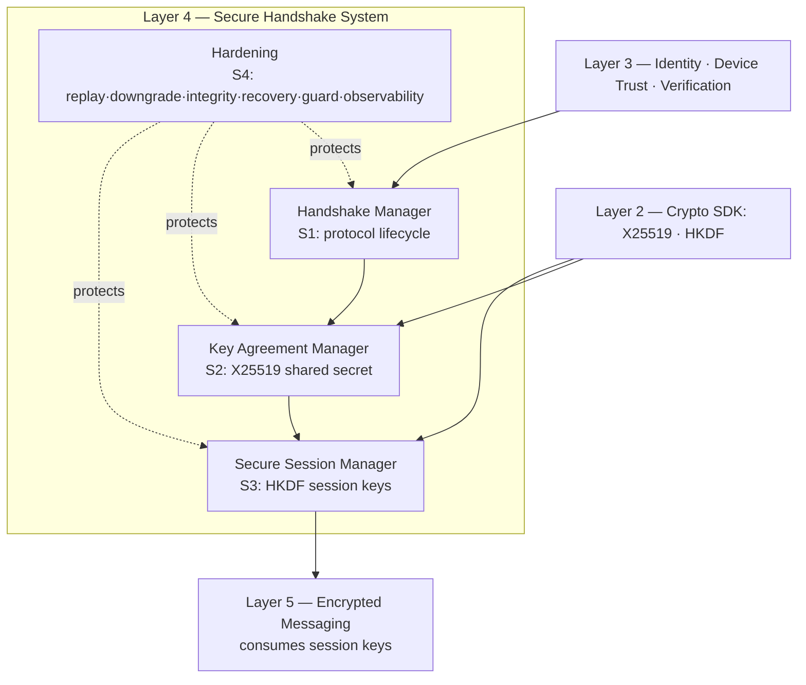
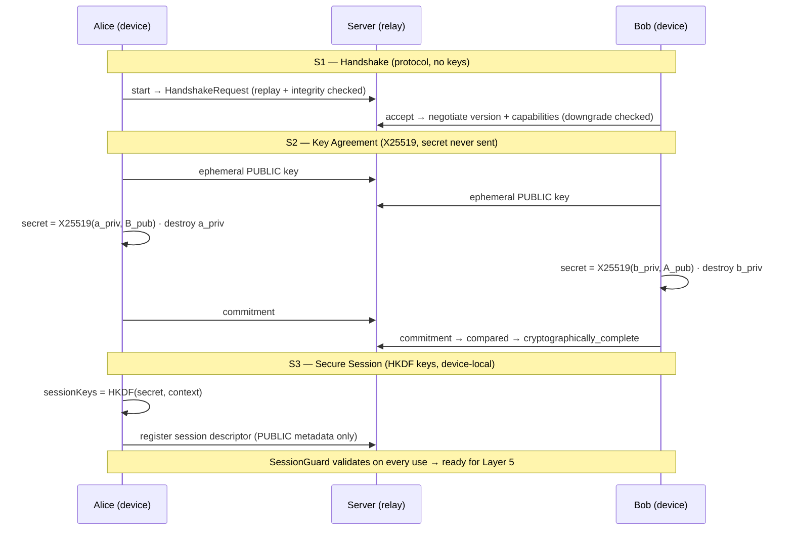
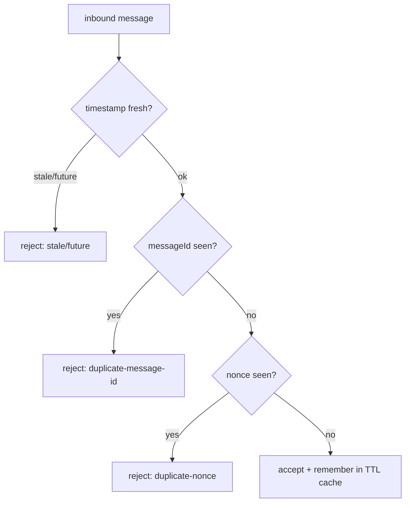
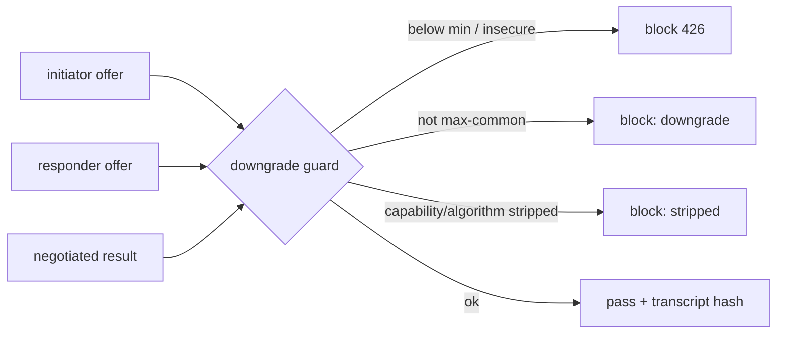
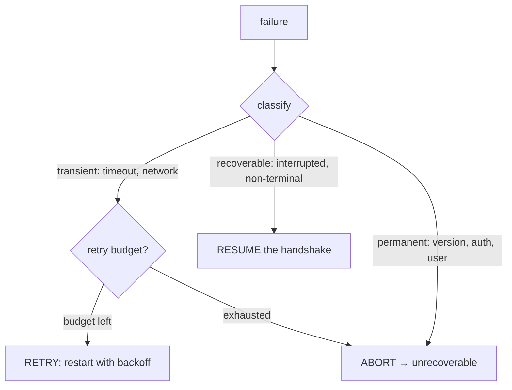

# Layer 4 — Secure Handshake System (SHS): Final / Complete

> **Status:** ✅ **LAYER 4 COMPLETE** (Sprints 1–4) · **Tests:** **357 passing**
> (`cd server && npm test`) · **Protocol:** SHS v1.0 · **Key agreement:** X25519 ·
> **KDF:** HKDF-SHA256 · **Frozen public surface** (see §14).
>
> Layer 4 is the complete Secure Handshake System: a production-quality secure protocol
> that establishes an authenticated shared secret between two verified devices and
> derives complete Secure Sessions — **without encrypting application messages** (that
> is Layer 5). Sprint 4 hardened it against replay, downgrade, integrity, and failure.

---

## Table of Contents

1. [The Complete System](#1-the-complete-system)
2. [Architecture](#2-architecture)
3. [State Machine](#3-state-machine)
4. [Protocol & Message Flow](#4-protocol--message-flow)
5. [Replay Protection](#5-replay-protection)
6. [Downgrade Protection](#6-downgrade-protection)
7. [Protocol Integrity](#7-protocol-integrity)
8. [Recovery](#8-recovery)
9. [Continuous Session Validation](#9-continuous-session-validation)
10. [Security Review](#10-security-review)
11. [Performance](#11-performance)
12. [Observability](#12-observability)
13. [Repositories & Managers](#13-repositories--managers)
14. [Protocol Freeze & Extension Points](#14-protocol-freeze--extension-points)
15. [Testing](#15-testing)
16. [Future — Layer 5 Integration](#16-future--layer-5-integration)
17. [Current Limitations](#17-current-limitations)

---

## 1. The Complete System

| Sprint | Delivered | Doc |
| --- | --- | --- |
| **1 — Protocol Foundation** | handshake state machine, manager, sessions, messages, serialization, validation, versioning, timeout/retry, events | `LAYER4_SPRINT1_PROTOCOL.md` |
| **2 — Secure Key Agreement** | X25519 ECDH, ephemeral keys, shared secret (never transmitted), crypto negotiation | `LAYER4_SPRINT2_KEY_AGREEMENT.md` |
| **3 — Secure Session Establishment** | HKDF session keys, session lifecycle, expiration, resumption, rekey framework | `LAYER4_SPRINT3_SESSIONS.md` |
| **4 — Hardening** *(this doc)* | replay + downgrade protection, protocol integrity, recovery, session guard, observability, repository hardening, security audit, protocol freeze | `LAYER4_FINAL.md` |

**Invariant across all four sprints:** the server relays PUBLIC material and stores
PUBLIC metadata only. Private keys, shared secrets, and session keys are **device-local
and never leave the device**. No API returns any of them.

---

## 2. Architecture

```
server/shs/
├── (Sprint 1) protocol/ state-machine/ sessions/ messages/ serializers/
│              validators/ negotiation/ timeout/ retry/ events/ manager/ repository/
├── key-agreement/   (Sprint 2)  crypto/ exchange/ derivation/ negotiation/ validation/
│                                 session/ serialization/ events/ repository/ manager/
├── session/         (Sprint 3)  derivation/ lifecycle/ storage/ expiration/ resumption/
│                                 rekey/ validators/ events/ serialization/ repository/ manager/
└── hardening/       (Sprint 4)  replay/ downgrade/ integrity/ recovery/ session-guard/
                                 observability/ repository/ audit/ protocol/ perf/

server/controllers/  handshakeController · keyAgreementController · secureSessionController
server/routes/       /api/handshake · /api/key-agreement · /api/secure-session
client/src/lib/      handshake.js · keyAgreement.js · secureSession.js
```



Every hardening component is **additive** — it composes around the Sprint 1–3 managers
without changing them. Sprint 4 touched only `server.js` / `package.json` among existing
files (plus additive crypto states in Sprint 2).

---

## 3. State Machine

The handshake FSM spans the protocol (S1) and crypto (S2) sub-lifecycles; the session
FSM (S3) governs an established session. Both are deterministic; every transition is
validated by the manager **and** re-checkable via `hardening/integrity`.

```mermaid
stateDiagram-v2
  [*] --> created
  created --> initialized --> waiting --> negotiating
  negotiating --> completed: S1 (no crypto)
  negotiating --> generating_ephemeral_keys: S2
  generating_ephemeral_keys --> waiting_for_peer_key --> deriving_shared_secret
  deriving_shared_secret --> shared_secret_established --> cryptographically_complete
  cryptographically_complete --> [*]
  note right of cryptographically_complete
    Shared secret established.
    Layer 4 Sprint 3 derives a
    Secure Session from here.
  end note
  waiting --> rejected
  negotiating --> failed
  waiting --> cancelled
  waiting --> expired
  waiting --> timed_out
  negotiating --> aborted
```

Session lifecycle (S3): `created → active ⇄ idle ⇄ paused → resumed`, terminals
`expired / closed / destroyed / invalid / failed`. See `LAYER4_SPRINT3_SESSIONS.md §5`.

---

## 4. Protocol & Message Flow



Messages (S1): `handshake.request/response/accept/reject/cancel/timeout/resume/
complete/failure/error` — a common envelope (`type, handshakeId, version, messageId,
from/to, timestamp, nonce, payload`) with JSON / binary (CRC32-framed) / compact
encodings.

---

## 5. Replay Protection

`hardening/replay` rejects replayed, duplicate, or stale messages/handshakes.



- **`ReplayCache`** — a TTL'd, capacity-bounded set of seen identifiers with an
  eviction hook; drop-in for the Sprint 1 validators' `seen` set.
- **Timestamp window** — reject older than `maxAgeMs` (default 2m) or beyond
  `maxSkewMs` forward skew (default 30s); this bounds a captured message's usefulness.
- **`ReplayProtector`** — the facade: `check` / `remember` / `accept` (atomic) /
  `consumeHandshakeId` (first-use). Cache TTL aligns to the timestamp window so a
  message too old to accept is safe to forget ⇒ **bounded memory**.
- **Events** — `hardening.replay_detected` feeds observability.
- **Multi-node** — supply a distributed cache implementing `has`/`add`/`prune` (§14).

---

## 6. Downgrade Protection

`hardening/downgrade` detects a network attacker forcing a weaker configuration.

- **Reject-below-minimum / insecure-version denylist.**
- **Max-common validation** — the negotiated version MUST equal the highest version
  both parties support; anything lower ⇒ downgrade.
- **Capability / algorithm strip detection** — every mutually-supported capability /
  the most-preferred mutual algorithm must survive negotiation.
- **Transcript hash** — a stable SHA-256 over both parties' full advertised offers, so
  tampering is **detectable** (and bindable by a future signed handshake).



---

## 7. Protocol Integrity

`hardening/integrity` strengthens Sprint 1's per-message checks with cross-message and
cross-state guarantees: **header/metadata** validation (wraps `validateMessage`),
**message ordering** (each type accepted only in the states the protocol expects),
**state consistency** (message ↔ session), **transition legality** (defence-in-depth
over the FSM), and a chained **`TranscriptAccumulator`** that makes the ordered message
stream tamper-evident. Corrupted serialization is caught by the CRC32-framed binary
format (Sprint 1) and surfaced here.

---

## 8. Recovery

`hardening/recovery` classifies a failure and drives the Sprint 1 manager to recover.



`RecoveryManager.recover(handshakeId, user)` resolves the session, calls
`decideRecovery`, and performs `resume` / `restart` (with `RetryPolicy` backoff) or
aborts. Covers interrupted handshakes, timeouts, retries, network interruptions,
temporary failures, and unrecoverable aborts. Emits `recovery_attempted / succeeded /
aborted`.

---

## 9. Continuous Session Validation

`hardening/session-guard` re-validates a Secure Session **before every use** — the gate
Layer 5 calls before encrypting:

| Check | Source |
| --- | --- |
| Ownership (caller is a participant) | session record |
| Participant identity still known | Layer 3 `identityLookup` |
| Device identity known + usable | Layer 3 `deviceLookup` (rejects revoked/blocked) |
| Metadata well-formed (not corrupted, no raw keys) | `session/validators` |
| Not expired | `session/expiration` |
| Protocol version still supported | `protocol/version` |
| Trust not revoked/changed/compromised | Layer 3 `trustLookup` |

Lookups are injected + optional; `validate()` returns a detailed verdict, `assert()`
throws `SessionGuardError`.

---

## 10. Security Review

A machine-readable audit is produced by `hardening/audit/securityAudit()` and mirrored
here. Status: **implemented**, ⚠️ **partial**, ⏭️ **future (Layer 5)**.

| Control | Status | Notes |
| --- | --- | --- |
| MITM resistance | ⚠️ partial | Ephemeral keys MAY be Ed25519-signed by the identity key (optional; set `requireSignature`). Without it, relies on Layer 3 out-of-band verification + commitment comparison. |
| Replay resistance | ✅ | Nonce + messageId TTL cache, timestamp window, handshake first-use. |
| Downgrade resistance | ✅ | Min-version + denylist, max-common, strip detection, transcript hash (not yet signed). |
| Identity validation | ✅ | Parties/devices resolve against Layer 3; guard re-checks each use. |
| Session isolation | ✅ | Context + purpose separated HKDF; distinct handshakes ⇒ distinct keys. |
| Key lifecycle | ✅ | Ephemerals fresh/never-reused/destroyed; session keys device-local, wiped on close. |
| Error handling | ✅ | Typed hierarchies per subsystem; controllers emit safe JSON. |
| Serialization safety | ✅ | Magic + CRC32 + length framing; size caps; ordering/state checks; transcript. |
| Temporary key destruction | ✅ | Ephemeral privates dropped post-derivation; secret buffers zero-filled. |
| Memory cleanup | ⚠️ partial | Buffers zero-filled; JS runtime may retain KeyObject/CryptoKey internals (never exported). |
| State-machine integrity | ✅ | Deterministic FSMs; every transition validated; terminals immutable. |
| Continuous session validation | ✅ | Ownership/identity/device/metadata/expiry/version/trust on each use. |
| Forward secrecy | ⏭️ future | Rekey framework + ratchet material in place for Layer 5. |
| Message confidentiality | ⏭️ future | Session keys derived + available (device-local) for Layer 5. |

**Documented assumptions:** transport carries public metadata (confidentiality is
Layer 5/TLS); Layer 3 identity keys are authentic; the server is honest-but-curious and
never holds secrets; peer clocks are within the skew window; the in-process replay cache
is per-node (share it for multi-node).

---

## 11. Performance

`hardening/perf/benchmark.js` profiles the hot paths (in-memory repos, single core).
Representative run (`node shs/hardening/perf/benchmark.js`):

| Scenario | ops/sec | p50 (ms) | p95 (ms) | p99 (ms) |
| --- | ---: | ---: | ---: | ---: |
| handshake full lifecycle (start→accept→complete) | ~1,500 | 0.54 | 1.23 | 2.84 |
| session create (derive keys + persist) | ~2,200 | 0.41 | 0.56 | 1.68 |
| session lookup (cached) | ~23,000 | 0.04 | 0.06 | 0.11 |
| serialize round-trip (binary) | ~22,700 | 0.035 | 0.056 | 0.18 |
| validate message | ~235,000 | 0.004 | 0.004 | 0.017 |

**Optimizations:** repository read-cache (hardened wrapper), O(1) session lookup,
bounded replay cache (no unbounded growth), reservoir histograms (fixed memory),
deterministic backoff, and lazy expiry (no background timers required).

---

## 12. Observability

`hardening/observability` provides export-agnostic internal signals:

- **`MetricsCollector`** — counters (handshakes started/completed/failed, retries,
  replays/downgrades/integrity blocked, sessions), gauges (active), histograms (latency
  with p50/p95/p99).
- **`Tracer`** — nestable spans with timing + status (off by default; zero overhead).
- **`HealthMonitor`** — subscribes to the handshake/key-agreement/session/hardening
  event buses and derives **healthy / degraded / unhealthy** from failure + security
  rates. `health()` and `metrics.snapshot()` are the poll surfaces for a future
  Prometheus/OpenTelemetry exporter.

---

## 13. Repositories & Managers

**Managers** (the seams Layer 5 uses, never the storage directly): `HandshakeManager`
(S1), `KeyAgreementManager` (S2), `SecureSessionManager` (S3), plus `RecoveryManager`
and `SessionGuard` (S4).

**Repository hardening** (`hardening/repository`): `hardenRepository(repo)` wraps any
Sprint 1–3 repo with a per-key **`KeyedMutex`** (serializes read-modify-write ⇒ no lost
updates), optimistic `_rev` compare-and-set, idempotent create, a TTL read-cache, and
write validation — the same contract, transparently safer. In-memory + Mongo repos back
every subsystem; Mongo schemas store **metadata only** (no key fields exist).

---

## 14. Protocol Freeze & Extension Points

`hardening/protocol/freeze.js` declares the **frozen public surface** as
`PROTOCOL_MANIFEST` (protocol name + versions, message types, handshake + session
states, algorithms, event names, session-model shape). `manifestHash()` fingerprints it
and `assertFrozen()` detects drift — CI can assert the Layer 4 contract does not break.

**Extension points for Layer 5 (extend, do not redesign):**

| Extension point | How |
| --- | --- |
| New protocol / crypto version | Add to `SUPPORTED_VERSIONS` / `SUPPORTED_ALGORITHMS`; negotiation + downgrade guard absorb it. |
| Message confidentiality | Flip the reserved `ENCRYPTED` frame flag; wrap the body — envelope unchanged. |
| Forward secrecy / ratchet | Register a strategy in `session/rekey` `REKEY_STRATEGIES` using the reserved `ratchetMaterial`; generation counter + rekey events already exist. |
| Session keys for messaging | `SecureSessionManager.loadSessionKeys(sessionId)` → `encryptionKey` (aes-256-gcm) + `macKey`, device-local. |
| Event consumption | Subscribe to the typed handshake/key-agreement/session/hardening buses. |
| Distributed replay cache | Provide a `has`/`add`/`prune` cache to `ReplayProtector`. |
| Observability export | Poll `MetricsCollector.snapshot()` / `HealthMonitor.health()` / `Tracer.spans`. |

---

## 15. Testing

`cd server && npm test` → `node --test` (built-in, zero deps, in-memory repos — **no
MongoDB**; Mongo/JSX validated via `node --check`). **357 tests total:**

| Suite | Tests |
| --- | ---: |
| Layer 3 (identity/device/trust/integration) | 129 |
| Sprint 1 — protocol foundation | 83 |
| Sprint 2 — key agreement | 48 |
| Sprint 3 — sessions | 48 |
| **Sprint 4 — hardening** | **49** |

Sprint 4 coverage: replay attacks, downgrade attacks, malformed payloads, protocol
recovery, session expiration, interrupted handshakes, concurrent handshakes (100-way),
multiple devices, hardened-repository concurrency (no lost writes), large-scale
simulation, performance sanity, and end-to-end protected-flow integration.

---

## 16. Future — Layer 5 Integration

Layer 5 (encrypted messaging) consumes Layer 4 without redesigning it:

1. Establish a Secure Session (this layer) → obtain `sessionId`.
2. `SessionGuard.assert(session, { actingUser })` before each use.
3. `SecureSessionManager.loadSessionKeys(sessionId)` → `encryptionKey` + `macKey`
   (device-local) → AEAD-seal/authenticate messages, `initMaterial` for nonces.
4. For forward secrecy, register a ratchet `RekeyStrategy` (rooted at `ratchetMaterial`)
   — the rekey framework, generation counter, and `session.rekeyed` events are ready.
5. Keep the hardening guards live: replay-protect message frames, health-monitor the
   protocol, and honour the frozen manifest.

---

## 17. Current Limitations

- **No message/transport encryption and no forward secrecy** — by design; Layer 5.
- **Authenticated key exchange is optional** — enable `requireSignature` once all
  clients sign ephemeral keys; until then MITM protection leans on Layer 3 verification
  + commitment comparison.
- **Transcript is tamper-evident, not signed** — a future signed handshake binds it.
- **Single protocol version (1.0)** — negotiation/downgrade logic is version-general.
- **In-process replay cache & observability** — per-node; multi-node needs a shared
  replay store + a metrics exporter (both are documented extension points).
- **JS memory hygiene** — secret buffers are zero-filled, but the runtime may retain
  copies; raw private bytes are never exported.

---

*Layer 4 is complete. The Secure Handshake System establishes an authenticated shared
secret between two verified devices, derives complete Secure Sessions, and is hardened
against replay, downgrade, integrity, and failure. Layer 5 can now build encrypted
communication on top of Secure Sessions without redesigning Layer 4.*
