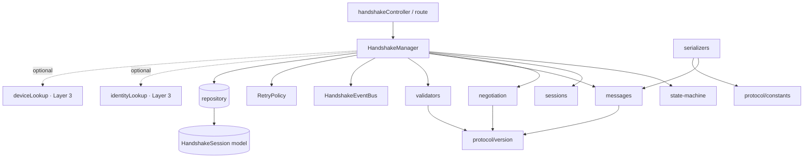
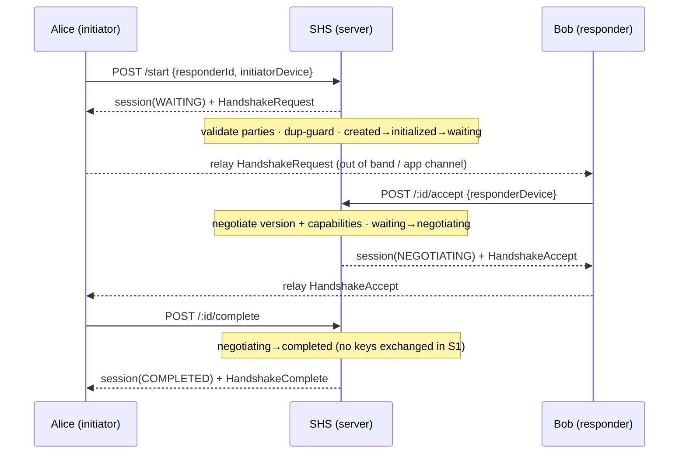
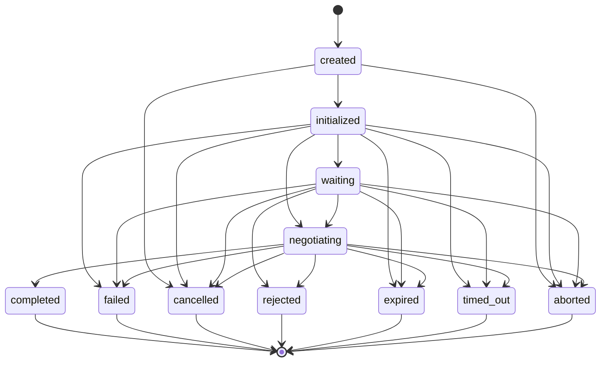
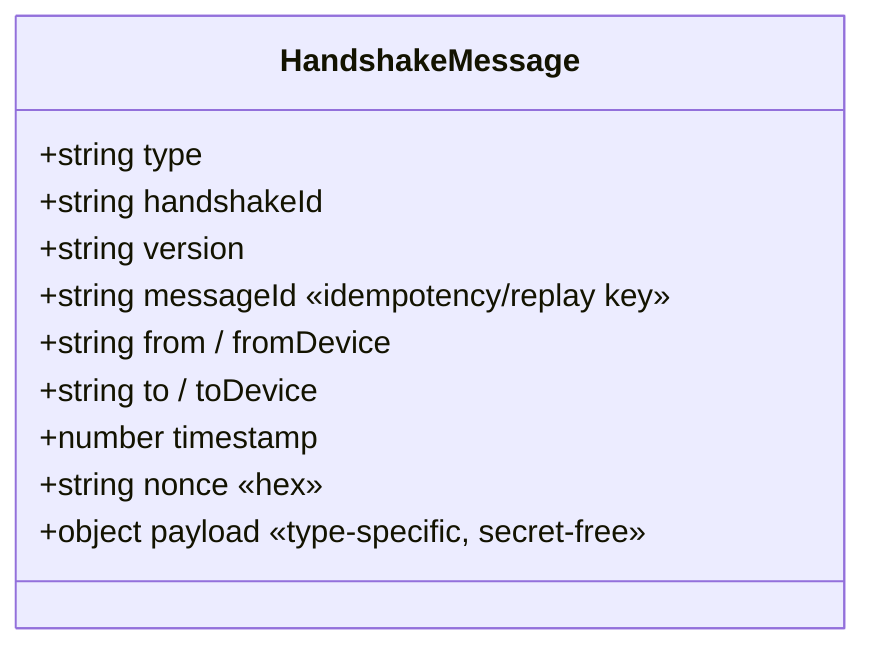
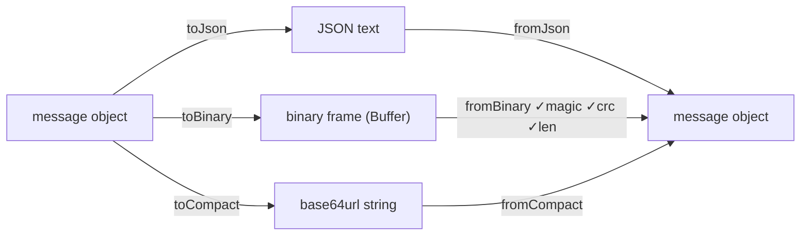
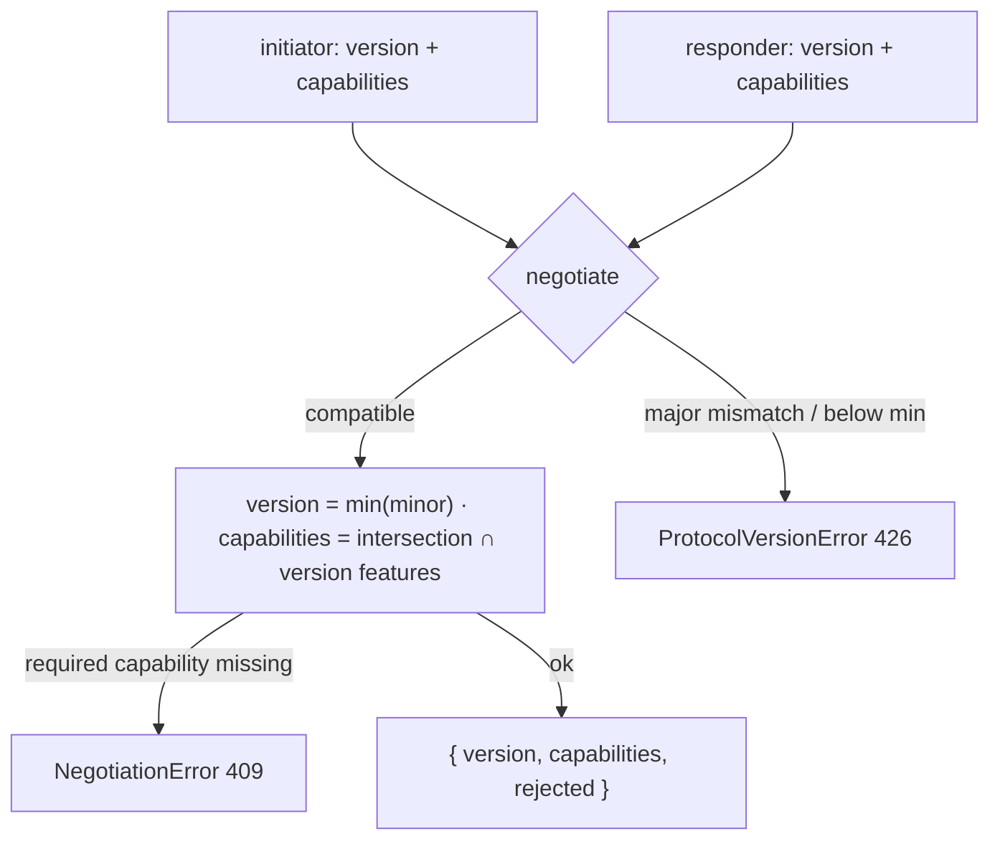
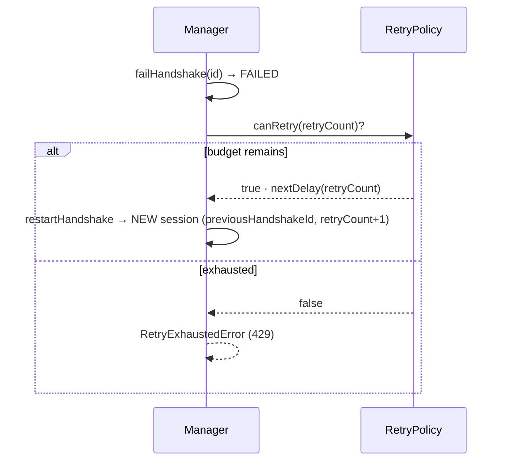

# Layer 4 · Sprint 1 — Secure Handshake System (SHS): Protocol Foundation

> **Status:** ✅ Complete · **Tests:** 83 SHS + 129 Layer 3 = **212 passing** · **Protocol version:** `1.0`
>
> This sprint builds the **operating system that future handshake logic runs on** — a
> deterministic protocol state machine, a lifecycle manager, sessions, messages,
> serialization, validation, negotiation, timeout/retry frameworks, events, and
> repositories. It performs **no** cryptographic key exchange, creates **no** shared
> secrets, and encrypts **no** messages. Those plug into this framework in later sprints.

---

## Table of Contents

1. [Scope & Non-Goals](#1-scope--non-goals)
2. [Architecture](#2-architecture)
3. [Protocol Overview](#3-protocol-overview)
4. [State Machine](#4-state-machine)
5. [Handshake Lifecycle](#5-handshake-lifecycle)
6. [Handshake Manager](#6-handshake-manager)
7. [Session Model](#7-session-model)
8. [Protocol Messages](#8-protocol-messages)
9. [Serialization](#9-serialization)
10. [Validation](#10-validation)
11. [Protocol Versioning & Negotiation](#11-protocol-versioning--negotiation)
12. [Timeout & Retry](#12-timeout--retry)
13. [Events](#13-events)
14. [Repository Layer](#14-repository-layer)
15. [API Endpoints](#15-api-endpoints)
16. [Client Integration](#16-client-integration)
17. [Testing](#17-testing)
18. [Future Integration](#18-future-integration)
19. [Current Limitations](#19-current-limitations)

---

## 1. Scope & Non-Goals

### In scope (Sprint 1)

✅ Secure Handshake Protocol architecture · Handshake Manager · deterministic state
machine · session lifecycle · protocol messages · serialization (JSON / binary /
compact) · validation · timeout framework · retry framework · repository layer ·
events · backend integration · client integration · comprehensive tests · docs.

### Explicitly **NOT** in scope (future sprints)

❌ ECDH · shared secrets · session keys · forward secrecy · double ratchet ·
encrypted messages · P2P / WebRTC / NAT traversal · transport encryption ·
cryptographic suite negotiation.

> **Security invariant:** every value in SHS is **public protocol metadata** (ids,
> states, versions, capabilities). No private keys, no shared secrets, no ciphertext.
> A `completed` handshake means *"the protocol framework agreed on a version and
> capability set"* — **not** *"keys were exchanged"*.

### How this builds on Layer 3

| Layer 3 subsystem | Consumed by SHS as |
| --- | --- |
| Identity (Sprint 1) | `identityLookup` → reject handshakes to/from unknown identities |
| Device Trust (Sprint 2) | `deviceLookup` → reject handshakes from unknown devices |
| Trust / Verification (Sprint 3) | *(future)* gate on verification status before completing |
| Integration (Sprint 4) | JWT `protectedRoute`, socket identity, session validity |

Integration is **additive**: only `server.js` (mount + import) and
`server/package.json` (test glob) touch existing files; everything else is new under
`server/shs/`, `server/controllers/handshakeController.js`,
`server/routes/handshakeRoute.js`, and `client/src/lib/handshake.js`.

---

## 2. Architecture

```
server/shs/
├── index.js                     # public entry point (re-exports the whole API)
├── types.js                     # enums: states, roles, message types, events, reasons
├── errors.js                    # ShsError hierarchy (stable .code + HTTP .status)
├── protocol/
│   ├── constants.js             # magic, TTLs, timeouts, frame flags, size limits
│   └── version.js               # CURRENT/MINIMUM, compatibility, features, negotiation
├── state-machine/
│   └── stateMachine.js          # ALLOWED_TRANSITIONS + HandshakeStateMachine (FSM)
├── sessions/
│   └── session.js               # createSession() + party/role/resumable helpers
├── messages/
│   └── messages.js              # 10 message builders + envelope assertion
├── serializers/
│   ├── serializer.js            # JSON / binary / compact + CRC32 integrity
│   └── sessionSerializer.js     # toPublicSession() DTO
├── validators/
│   └── validators.js            # message/version/session/party/duplicate/expiry checks
├── negotiation/
│   └── negotiation.js           # version + capability negotiation
├── timeout/
│   └── timeout.js               # deadline math + TimeoutScheduler (injected timers)
├── retry/
│   └── retry.js                 # RetryPolicy + backoff strategies
├── events/
│   └── events.js                # HandshakeEventBus (typed pub/sub)
├── repository/
│   ├── inMemoryRepository.js    # reference impl + test backend (zero deps)
│   └── mongoRepository.js       # Mongoose impl (same contract)
├── models/
│   └── HandshakeSession.model.js# NEW Mongo collection (public metadata only)
├── migration/
│   └── migration.js             # schema version, adoption report, stale sweep
└── tests/                       # 83 tests (node --test, in-memory, zero deps)

server/controllers/handshakeController.js   # thin HTTP adapters over the manager
server/routes/handshakeRoute.js             # /api/handshake/* behind protectedRoute
client/src/lib/handshake.js                 # protocol-aware client
```

### Component dependency graph



Every module is pure except the repositories (I/O) and the manager (orchestration).
The state machine, versioning, negotiation, serialization, validation, retry, and
timeout modules hold **no I/O and no crypto** — they are reusable and independently
testable.

---

## 3. Protocol Overview

A handshake is a short-lived, server-mediated negotiation between an **initiator** and
a **responder** (each identified by a user id + device id). The server is the
**source of truth** for a handshake's state; parties drive it through REST calls that
map 1:1 onto manager operations. Each operation returns the updated **session DTO**
and, where relevant, a **protocol message** the caller can relay to the peer.



---

## 4. State Machine

Eleven states — four **active**, seven **terminal**. The machine is **deterministic**:
from any state a transition is either legal (exactly one target) or rejected. Terminal
states have no outgoing transitions; a "restart" mints a *new* session that references
the old one rather than reviving it.



| State | Kind | Meaning |
| --- | --- | --- |
| `created` | active | session object created, nothing negotiated |
| `initialized` | active | initiator prepared the request (version/capabilities set) |
| `waiting` | active | request emitted; awaiting the responder |
| `negotiating` | active | both parties present; version/capabilities agreed |
| `completed` | terminal | protocol handshake concluded (no keys in S1) |
| `failed` | terminal | a protocol/validation error ended the handshake |
| `cancelled` | terminal | the initiator cancelled |
| `rejected` | terminal | the responder declined |
| `expired` | terminal | passed the whole-session deadline |
| `timed_out` | terminal | a step deadline elapsed |
| `aborted` | terminal | force-terminated (system/admin/recovery) |

`ALLOWED_TRANSITIONS`, `canTransition`, `assertTransition`, `nextStates`, and the
stateful `HandshakeStateMachine` wrapper are all exported from
`shs/state-machine/stateMachine.js`.

---

## 5. Handshake Lifecycle

| Operation | From → To | Actor | Emits event | Returns message |
| --- | --- | --- | --- | --- |
| `startHandshake` | created → initialized → waiting | initiator | `started` | `HandshakeRequest` |
| `acceptHandshake` | waiting → negotiating | responder | `negotiating`, `accepted` | `HandshakeAccept` |
| `completeHandshake` | negotiating → completed | party | `completed` | `HandshakeComplete` |
| `rejectHandshake` | waiting\|negotiating → rejected | responder | `rejected` | `HandshakeReject` |
| `cancelHandshake` | any active → cancelled | initiator | `cancelled` | `HandshakeCancel` |
| `failHandshake` | any active → failed | system | `failed` | `HandshakeFailure` |
| `abortHandshake` | any active → aborted | system | `aborted` | — |
| `timeoutHandshake` | any active → timed_out | system | `timeout` | — |
| `expireHandshake` | any active → expired | system | `expired` | — |
| `resumeHandshake` | *(no change)* | party | `resumed` | `HandshakeResume` |
| `restartHandshake` | *(new session)* | initiator | `restarted` | `HandshakeRequest` |

Every transition also emits a `state_changed` event carrying `{ previousState, state }`.

---

## 6. Handshake Manager

`HandshakeManager` (`shs/manager/handshakeManager.js`) is the reusable facade. It
drives every transition through the state machine, persists via the repository, and
emits events. Cryptographic operations will plug into **this** class in future sprints.

```js
import { HandshakeManager, createMongoShsRepository } from "./shs/index.js";

const handshakes = new HandshakeManager({
  ...createMongoShsRepository(),
  identityLookup: (u) => identityManager.getIdentityByUser(u),
  deviceLookup:  (u, d) => deviceManager.getDevice(u, d),
  requiredCapabilities: [],          // capabilities that MUST be negotiated
});

const { session, message } = await handshakes.startHandshake({
  initiator: "alice", responder: "bob", initiatorDevice: "dev-a",
});
```

**Constructor dependencies** (`sessions` required; the rest optional with sane
defaults): `identityLookup`, `deviceLookup`, `events`, `retryPolicy`, `clock`,
`idGenerator`, `currentVersion`, `minVersion`, `ttlMs`, `requiredCapabilities`.

**Responsibilities:** Start · Accept/Negotiate · Complete · Reject · Cancel · Fail ·
Abort · Timeout · Expire · Resume · Restart · Lookup (`getHandshake`/`getStatus`) ·
List (`listSessions`/`listByState`/`getActiveBetween`) · `validateState` ·
`sweepExpired` (housekeeping). Reads lazily expire a session that has passed its
deadline (`getHandshake` persists the `expired` transition silently).

**Errors** (all carry `.code` + HTTP `.status`): `HandshakeNotFoundError` (404),
`HandshakeOwnershipError` (403), `InvalidStateTransitionError` (409),
`DuplicateHandshakeError` (409), `ProtocolVersionError` (426), `NegotiationError`
(409), `HandshakeExpiredError` (410), `HandshakeTimeoutError` (408),
`RetryExhaustedError` (429), `UnknownPartyError` (404),
`HandshakeValidationError`/`MessageSerializationError` (400).

---

## 7. Session Model

A session is the lifecycle container for one handshake attempt. It stores **no shared
secret** — future sprints attach negotiated *public* artifacts to the same shape.

```jsonc
{
  "handshakeId": "…uuid…",
  "initiator": "…userId…",     "responder": "…userId…",
  "initiatorDevice": "dev-a",  "responderDevice": "dev-b",
  "protocolVersion": "1.0",    "minVersion": "1.0",
  "state": "waiting",
  "proposedCapabilities":   ["handshake.resume", "…"],
  "negotiatedCapabilities": [],
  "retryCount": 0,             "previousHandshakeId": null,
  "reason": null,              "terminatedBy": null,   // initiator | responder | system
  "history": [ { "from": null, "to": "created", "at": "ISO" }, … ],
  "metadata": {},
  "createdAt": "ISO", "updatedAt": "ISO", "expiresAt": "ISO", "completedAt": null
}
```

The Mongo model (`shs/models/HandshakeSession.model.js`) is a **new collection**,
indexed on `handshakeId`, `initiator`, `responder`, `state`, and a compound
`{ initiator, responder, state }` for the active-pair lookup. There is deliberately
**no field** for a key or secret.

---

## 8. Protocol Messages

All ten message types share a common envelope and carry **protocol metadata only**.



| Type | Builder | Purpose | Key payload |
| --- | --- | --- | --- |
| `handshake.request` | `buildRequest` | initiator opens | `capabilities`, `metadata` (+ `minVersion`) |
| `handshake.response` | `buildResponse` | responder acks (no accept) | `capabilities` |
| `handshake.accept` | `buildAccept` | responder accepts | `negotiatedCapabilities` |
| `handshake.reject` | `buildReject` | responder declines | `reason` |
| `handshake.cancel` | `buildCancel` | initiator aborts | `reason` |
| `handshake.timeout` | `buildTimeout` | step deadline elapsed | `step` |
| `handshake.resume` | `buildResume` | resume a live session | `fromState` |
| `handshake.complete` | `buildComplete` | protocol concluded | `negotiatedCapabilities` |
| `handshake.failure` | `buildFailure` | semantic failure | `reason`, `details` |
| `handshake.error` | `buildError` | protocol-level error | `code`, `message`, `details` |

`assertEnvelope()` rejects anything lacking a known `type` + `messageId`.

---

## 9. Serialization

Three interchangeable encodings over one logical envelope
(`shs/serializers/serializer.js`):

- **JSON** — canonical text; the default over HTTP.
- **binary** — `Buffer` frame: `MAGIC(4) │ version(1) │ flags(1) │ type(1) │ CRC32(4) │ len(4) │ body(len)`.
- **compact** — the binary frame, **base64url**-encoded (URL / header / QR safe).



Each binary/compact frame carries a **CRC32** of the body — a tamper-**evidence**
integrity aid (rejects corrupted/truncated frames), **not** confidentiality or a MAC.
A reserved `ENCRYPTED` frame flag is the hook a future crypto sprint flips to wrap the
body **without changing this envelope**. A `format`-agnostic `serialize()` /
`deserialize()` facade selects the encoding. `MAX_MESSAGE_BYTES` (16 KiB) bounds size.

---

## 10. Validation

`shs/validators/validators.js` covers everything except state transitions (which the
state machine owns):

- **`validateMessage`** — envelope shape, required per-type fields, nonce/timestamp
  format, payload presence, version parse + support.
- **`validateVersionCompatibility`** — two versions share a major ≥ minimum.
- **`validateAgainstSession`** — message ↔ session id match + non-expiry.
- **`validateParties`** — two distinct parties; unknown identity/device rejected via
  the optional Layer 3 lookups.
- **`assertNotDuplicate`** — replay/idempotency guard over seen `messageId`/`nonce`.
- **`isExpired` / `assertNotExpired`** — whole-session deadline checks.

---

## 11. Protocol Versioning & Negotiation

Versions are dotted `MAJOR.MINOR`. **Compatibility rule:** *major must match; minor is
backward-compatible* — two peers are compatible iff they share a major (both ≥
`MINIMUM_VERSION`), and the negotiated version is the **lower minor** (a newer peer
talks down to an older one).



- `CURRENT_VERSION = "1.0"`, `MINIMUM_VERSION = "1.0"`, `SUPPORTED_VERSIONS = ["1.0"]`.
- **Feature flags** are per-version (`VERSION_FEATURES`). Sprint 1 ships framework
  capabilities only (`handshake.lifecycle`, `handshake.resume`, `handshake.retry`,
  `handshake.capability-negotiation`, `handshake.json`, `handshake.binary`).
  Cryptographic capabilities (`ecdh`, `ratchet`, …) are intentionally absent and add
  **without changing this module's shape**.
- **Capability negotiation** intersects both parties' advertised capabilities and
  keeps only those the agreed version actually offers; `requiredCapabilities` that go
  unmet fail negotiation (and fail the handshake).

---

## 12. Timeout & Retry

**Timeout** (`shs/timeout/timeout.js`): pure deadline math (`deadlineFrom`,
`isElapsed`, `remainingMs`) plus an optional `TimeoutScheduler` with **injected
timers** (default Node `setTimeout`, `.unref()`'d so it never keeps the process alive)
and an `onTimeout` recovery hook. The REST flow works purely on deadline math;
`sweepExpired()` / `sweepStaleSessions()` expire stragglers.

**Retry** (`shs/retry/retry.js`): `RetryPolicy` with `maxRetries`, a backoff
`strategy` (`fixed` · `linear` · `exponential`), `baseMs`, `maxDelayMs` cap, and
injectable jitter (deterministic by default for stable tests).



Exponential example (`base 500`, cap `10s`): `500 → 1000 → 2000 → 4000 → …`.

---

## 13. Events

`HandshakeEventBus` (`shs/events/events.js`) is a typed in-process pub/sub over Node's
`EventEmitter`. Every emit fires the specific type **and** the wildcard `"*"`; events
carry only public data.

| Event | Fired by |
| --- | --- |
| `handshake.started` | `startHandshake` |
| `handshake.negotiating` / `handshake.accepted` | `acceptHandshake` |
| `handshake.completed` | `completeHandshake` |
| `handshake.rejected` | `rejectHandshake` |
| `handshake.cancelled` | `cancelHandshake` |
| `handshake.failed` | `failHandshake` / failed negotiation |
| `handshake.aborted` | `abortHandshake` |
| `handshake.timeout` | `timeoutHandshake` |
| `handshake.expired` | `expireHandshake` / `sweepExpired` |
| `handshake.resumed` | `resumeHandshake` |
| `handshake.restarted` | `restartHandshake` |
| `handshake.state_changed` | *every* transition |

```js
const off = handshakes.events.on("handshake.accepted", (e) => {
  // FUTURE sprint: kick off ECDH for e.handshakeId here.
});
```

---

## 14. Repository Layer

The manager depends on a **contract**, not a store. Two implementations satisfy it:

| Method | Purpose |
| --- | --- |
| `create(session)` | persist a new session |
| `findById(handshakeId)` | load one |
| `update(handshakeId, patch)` | patch (throws `HandshakeNotFoundError` if absent) |
| `delete(handshakeId)` | remove; returns boolean |
| `findActiveByPair(initiator, responder)` | the live handshake between a pair (excludes terminals) |
| `listByUser(userId)` | every session where the user is initiator **or** responder |
| `findByState(state)` | filter by state |
| `listAll()` | all sessions (used by the expiry sweep) |

- **`createInMemoryShsRepository()`** — deep-copies records (no reference leakage),
  imports no driver → the whole stack runs under `node --test` with zero deps. It is
  also the reference for the contract.
- **`createMongoShsRepository()`** — Mongoose; reads use `.lean()`.

---

## 15. API Endpoints

All routes mount at `/api/handshake` behind the **existing** `protectedRoute` (JWT).
`:id` = `handshakeId`. Errors return `{ success:false, code, message }` with the
error's HTTP status.

| Method | Path | Body | Action |
| --- | --- | --- | --- |
| `POST` | `/start` | `{ responderId, initiatorDevice, responderDevice?, version?, capabilities?, metadata? }` | start a handshake |
| `POST` | `/:id/accept` | `{ responderDevice?, version?, capabilities? }` | responder accepts (negotiate) |
| `POST` | `/:id/complete` | — | complete a negotiating handshake |
| `POST` | `/:id/reject` | `{ reason? }` | responder rejects |
| `POST` | `/:id/cancel` | `{ reason? }` | initiator cancels |
| `POST` | `/:id/resume` | — | resume a live handshake |
| `POST` | `/:id/restart` | — | restart a terminated handshake |
| `GET` | `/:id` | — | status of one handshake (caller must be a party) |
| `GET` | `/` | `?state=` | list the caller's handshakes |
| `GET` | `/protocol/info` | — | advertised version + capabilities |

The `caller` is always `req.user._id`; the caller is forced into the initiator or
responder role by the manager's ownership checks. **No endpoint** accepts or returns
key material.

---

## 16. Client Integration

`client/src/lib/handshake.js` is a protocol-aware client (public metadata only). It
tags requests with the caller's local device id (reusing the Layer 3 device keypair —
private keys never leave the browser) and caches a **handshake history** in
`localStorage`.

```js
import { startHandshake, listPending, getProtocolInfo, HandshakeState } from "./lib/handshake.js";

const { session } = await startHandshake(axios, myUserId, peerId);
const pending = await listPending(axios);           // in-flight handshakes
const proto   = await getProtocolInfo(axios);       // { current, minimum, supported, features }
```

Exposes: `startHandshake`, `acceptHandshake`, `completeHandshake`, `rejectHandshake`,
`cancelHandshake`, `resumeHandshake`, `restartHandshake`, `getHandshake`,
`listSessions`, `listPending`, `getProtocolInfo`, plus local `readHistory` /
`clearHistory` and the `HandshakeState` / `ACTIVE_STATES` constants.

---

## 17. Testing

`cd server && npm test` → `node --test` (built-in, zero deps, in-memory repo — **no
MongoDB required**). Production Mongo/JSX files are validated with `node --check`.

**83 SHS tests** across 8 files (212 total with Layer 3):

| File | Covers |
| --- | --- |
| `stateMachine.test.js` | transition table, determinism, terminal immutability, FSM wrapper |
| `protocol.test.js` | version parse/compare/compatibility/negotiation, capability intersection |
| `serialization.test.js` | JSON/binary/compact round-trips, checksum/magic/truncation rejection |
| `validators.test.js` | message/version/session/party/duplicate/expiry validation |
| `timeout-retry.test.js` | backoff curves, jitter, budget, injected-timer scheduler |
| `repository-events.test.js` | repo contract (incl. reference isolation) + event bus |
| `manager.test.js` | full lifecycle, roles, dup-guard, negotiation failure, resume/restart, timeout/expiry/sweep, directory validation, concurrency |
| `session-migration.test.js` | session helpers + adoption report + stale sweep |

Concurrency, recovery (timeout/abort/expire/sweep), and malformed-input paths are all
exercised.

---

## 18. Future Integration

Future sprints plug **into** this framework — they do not redesign it:

- **Key exchange (ECDH):** subscribe to `handshake.accepted`, or extend
  `completeHandshake`, to run X25519 (Layer 2 `AsymmetricEngine`) using each party's
  public key from the Layer 3 identity directory. Store the resulting **public**
  ephemeral material on the session; private material stays on-device.
- **New capabilities/version:** add `ecdh` / `ratchet` / `pfs` to `VERSION_FEATURES`
  under a new minor (e.g. `1.1`) — negotiation and validation pick them up unchanged.
- **Encrypted transport:** flip the reserved `ENCRYPTED` frame flag and wrap the body
  in the serializer — the envelope is unchanged.
- **Trust gating:** consult `TrustManager.getVerificationStatus` before
  `completeHandshake`; refuse to complete on `identity_changed`.
- **Sockets / real-time:** emit handshake events over Socket.IO for push delivery
  (the event bus + `TimeoutScheduler` recovery hook are the seams).

---

## 19. Current Limitations

- **No cryptography.** `completed` means *protocol agreement*, not key exchange. There
  is no confidentiality, authentication of message origin, or forward secrecy yet.
- **Server-mediated only.** Messages are produced by the manager and returned to the
  caller to relay; there is no P2P transport, and no automatic message delivery to the
  peer (the app relays via its existing channel).
- **CRC32 is integrity, not security.** It detects corruption, not tampering by an
  active adversary — that is a future MAC/signature concern.
- **Single protocol version (`1.0`).** Negotiation logic is version-general but only
  one version exists today.
- **Timeout scheduling is opt-in.** The default REST flow relies on deadline math +
  `sweepExpired`; push-style expiry requires wiring `TimeoutScheduler`.
- **Duplicate detection is per-call.** `assertNotDuplicate` needs a caller-supplied
  "seen" set; a durable cross-request replay cache is a future concern.

---

*Layer 4 · Sprint 1 establishes the protocol foundation. Every future secure-messaging
capability is built on this state machine, manager, and message framework rather than
alongside it.*
