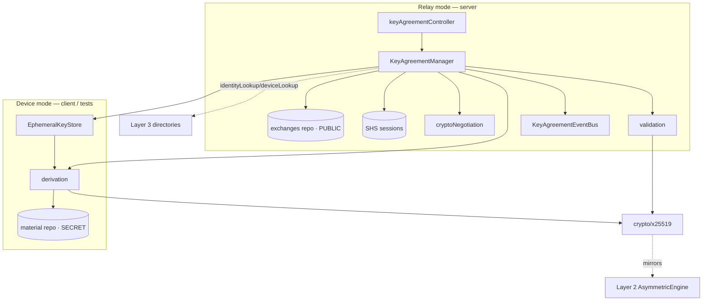
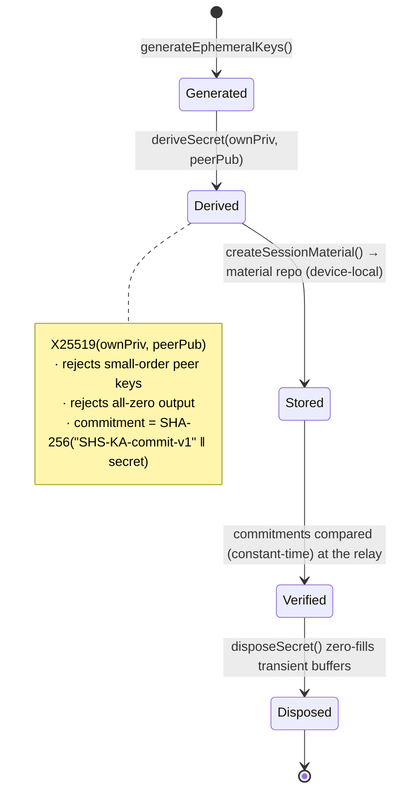
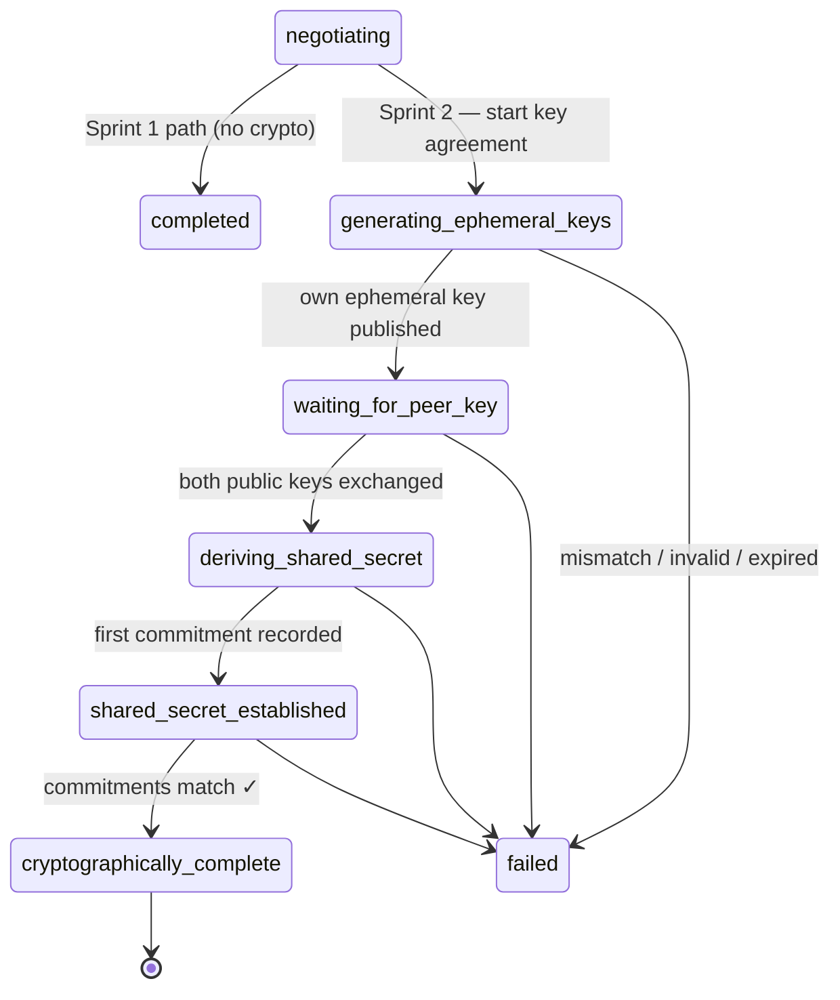
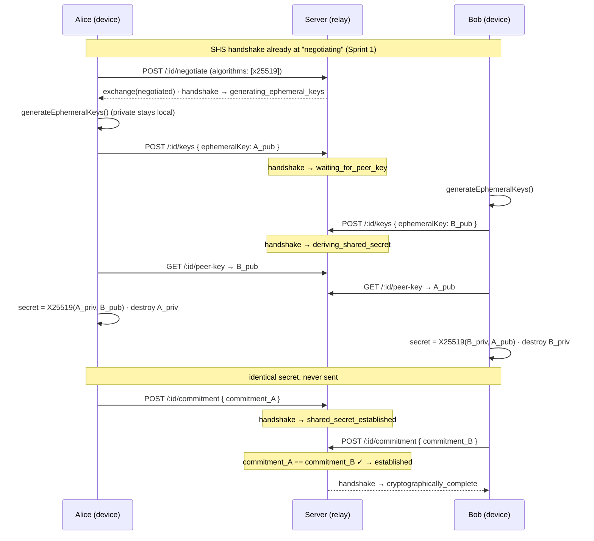
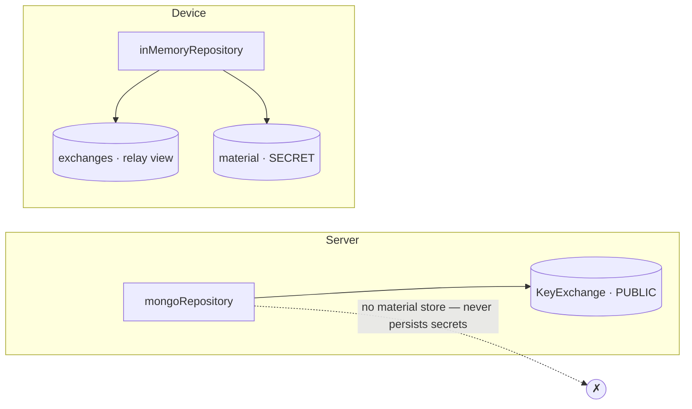

# Layer 4 · Sprint 2 — Secure Key Agreement

> **Status:** ✅ Complete · **Tests:** 48 key-agreement + 212 prior = **260 passing** ·
> **Algorithm:** X25519 (ECDH) · **Crypto protocol version:** `1.0`
>
> This sprint plugs cryptographic key agreement **into** the Sprint 1 Secure Handshake
> System without redesigning it. Two verified devices each mint a fresh ephemeral
> X25519 key pair, exchange only their **public** ephemeral keys, and **independently
> derive an identical shared secret that is never transmitted**.

---

## Table of Contents

1. [Scope & Non-Goals](#1-scope--non-goals)
2. [Architecture](#2-architecture)
3. [Ephemeral Keys](#3-ephemeral-keys)
4. [Shared-Secret Lifecycle](#4-shared-secret-lifecycle)
5. [State-Machine Changes](#5-state-machine-changes)
6. [End-to-End Flow](#6-end-to-end-flow)
7. [Session Material](#7-session-material)
8. [Negotiation](#8-negotiation)
9. [Validation & Attack Surface](#9-validation--attack-surface)
10. [Repositories](#10-repositories)
11. [Events](#11-events)
12. [API Endpoints](#12-api-endpoints)
13. [Client Integration](#13-client-integration)
14. [Security Review](#14-security-review)
15. [Testing](#15-testing)
16. [Future Integration](#16-future-integration)
17. [Current Limitations](#17-current-limitations)

---

## 1. Scope & Non-Goals

### In scope

✅ Ephemeral X25519 key generation (fresh per handshake, never reused) · secure key
agreement · shared-secret derivation (never transmitted) · session material ·
cryptographic negotiation · handshake state-machine integration · session
repositories · validation · events · backend relay integration · client integration ·
comprehensive tests · docs.

### Explicitly **NOT** in scope (future sprints)

❌ Message encryption · session **encryption** keys · forward secrecy · double
ratchet · encrypted attachments · P2P/WebRTC · transport encryption. Layer 2 and
Layer 3 are **not** redesigned; Sprint 1 SHS is **extended, not replaced**.

> **Core security invariant:** the shared secret is derived **independently on each
> device** and is **never transmitted**. Only PUBLIC ephemeral keys and one-way
> COMMITMENTS cross the network. The server is a **relay** — it never sees a private
> key or the shared secret. This sprint stores the **raw ECDH secret** only; it
> derives **no** encryption keys.

### Consumes Layer 2 / Layer 3

| Dependency | Used as |
| --- | --- |
| Layer 2 crypto-engine `AsymmetricEngine` (X25519) | mirrored: same algorithm, same 32-byte raw key format, **same safety checks** (small-order-point + all-zero rejection). Server-side uses `node:crypto` for zero-dep parity, as Layer 3 did. |
| Layer 3 Identity (Ed25519) | optional **authenticated key exchange** — ephemeral keys may be signed by the identity key and verified against the identity directory. |
| Layer 3 Device Trust | `identityLookup` / `deviceLookup` reject unknown peers. |
| Layer 4 Sprint 1 SHS | the handshake session + state machine the crypto sub-lifecycle extends. |

Integration is **additive** — the only existing files touched are `server/server.js`
(mount), `server/package.json` (test glob), `server/shs/types.js` +
`shs/state-machine/stateMachine.js` (additive crypto states/transitions), and
`shs/models/HandshakeSession.model.js` (enum). All Sprint 1 tests remain green.

---

## 2. Architecture

```
server/shs/key-agreement/
├── index.js                        # public entry point
├── types.js                        # algorithms, roles, exchange states, events, typedefs
├── errors.js                       # KeyAgreementError hierarchy (ERR_KA_*)
├── crypto/
│   └── x25519.js                   # X25519 primitives + small-order/all-zero guards + Ed25519 sign/verify
├── exchange/
│   └── ephemeralKeys.js            # EphemeralKeyStore (local privates) + public bundle build/serialize
├── derivation/
│   └── sharedSecret.js             # deriveSecret, commitment, constant-time compare, secure dispose
├── negotiation/
│   └── cryptoNegotiation.js        # algorithm + crypto-version negotiation
├── validation/
│   └── keyAgreementValidators.js   # peers, key, replay, duplicate, expiry, signature, payload
├── session/
│   └── sessionMaterial.js          # createSessionMaterial (holds the secret, device-local)
├── serialization/
│   └── keyAgreementSerializer.js   # toPublicExchange / toPublicSessionMaterial (SECRET-STRIPPING)
├── events/
│   └── keyAgreementEvents.js       # KeyAgreementEventBus
├── repository/
│   ├── inMemoryRepository.js       # exchanges (public) + material (SECRET, device-local)
│   ├── mongoRepository.js          # exchanges ONLY — server never persists secrets
│   └── constants.js
├── models/
│   └── KeyExchange.model.js        # NEW Mongo collection — PUBLIC coordination only
├── migration/
│   └── migration.js                # schema version, adoption report, expiry sweep
└── manager/
    └── keyAgreementManager.js      # the facade (relay + device modes)

server/controllers/keyAgreementController.js  # relay-only HTTP handlers
server/routes/keyAgreementRoute.js            # /api/key-agreement/* behind protectedRoute
client/src/lib/keyAgreement.js                # Web Crypto X25519 device side
```



The **same `KeyAgreementManager`** serves both modes. Constructed with only
`exchanges` (+ `sessions`) it is a **relay** (public-only, never derives). Constructed
additionally with a `material` repo it is a **device** (generates keys, derives,
stores the secret).

---

## 3. Ephemeral Keys

- **Fresh per handshake, per party** — `EphemeralKeyStore.generate(handshakeId, role)`
  mints a new X25519 pair every call; keys are **never reused** across sessions
  (enforced by test).
- **Private half stays local** — held as a Node `KeyObject` (or a non-extractable Web
  Crypto `CryptoKey` on the client); raw private bytes are never exported.
- **Public bundle** — the only thing published: `{ algorithm, publicKey (base64 raw
  32B), keyId, version, signature?, identityPublicKey?, createdAt }`.
- **Optional identity binding** — `signEphemeralKey` signs the raw public key with the
  Ed25519 identity key; `verifyEphemeralKey` checks it against the identity directory
  (authenticated key exchange; set `requireSignature: true` to mandate it).
- **Destroyed after use** — `deriveAndStore` calls `destroyEphemeralKeys` in a
  `finally`, so the ephemeral private key is dropped the moment the secret exists.

```mermaid
sequenceDiagram
  participant D as Device
  participant S as EphemeralKeyStore
  D->>S: generate(handshakeId, role)
  S-->>D: public bundle (publish); private KeyObject (kept)
  Note over D: … peer public key arrives …
  D->>S: privateKey(handshakeId, role)
  D->>D: deriveSecret(privateKey, peerPublicKey)
  D->>S: destroy(handshakeId, role)   %% ephemeral private wiped
```

---

## 4. Shared-Secret Lifecycle



- **Derivation** — `deriveSecret(ownPrivate, peerPublic)` → `{ secret, commitment }`.
  The secret is a 32-byte `Buffer`; the commitment is a **one-way, domain-separated**
  SHA-256 that is safe to transmit and reveals nothing about the secret.
- **Both sides match** — `X25519(a_priv, b_pub) == X25519(b_priv, a_pub)`. The relay
  compares the two commitments in constant time to confirm agreement **without ever
  seeing a secret**; a mismatch fails the handshake (MITM/ corruption signal).
- **Disposal** — `disposeSecret()` zero-fills transient secret buffers; the persisted
  copy lives only in device-local session material.
- **Never transmitted** — no code path serializes `sharedSecret` to a DTO, an event,
  a log, or the wire (guaranteed by the serializer + enforced by tests).

---

## 5. State-Machine Changes

Sprint 1's deterministic FSM is **extended additively** with four active crypto
states + one terminal success state. Every Sprint 1 transition is unchanged, so all
Sprint 1 tests still pass.



Each crypto state can also transition to `failed`, `cancelled`, `timed_out`,
`expired`, or `aborted` (recovery), exactly like the Sprint 1 active states. The
`KeyAgreementManager` walks the session forward one legal step at a time
(`_syncHandshakeState`), keeping the machine deterministic.

---

## 6. End-to-End Flow



---

## 7. Session Material

The device-local record of an established secret (`session/sessionMaterial.js`):

```jsonc
{
  "sessionId": "…", "handshakeId": "…",
  "sharedSecret": "…base64…",          // SECRET — device-local, NEVER serialized
  "sharedSecretFingerprint": "…hex…",  // one-way commitment (safe to expose)
  "algorithm": "x25519", "cryptoVersion": "1.0",
  "security": { "keyLength": 32, "kdf": "none-raw-ecdh", "ephemeralDestroyed": true },
  "metadata": {},
  "createdAt": "ISO", "expiresAt": "ISO"
}
```

`toPublicSessionMaterial()` **omits `sharedSecret`** and emits only the fingerprint +
metadata. The server has **no** session-material collection — material lives only in
device-local storage (the client and the in-memory repo). `kdf: "none-raw-ecdh"` marks
that this sprint stores the raw ECDH output; a future sprint runs a KDF over it.

---

## 8. Negotiation

`negotiation/cryptoNegotiation.js` sits on top of the Sprint 1 handshake-version
negotiation and agrees the **key-agreement algorithm** + **crypto protocol version**:

- `SUPPORTED_ALGORITHMS = ["x25519"]` (most-preferred first); the initiator's ordering
  wins on ties. New algorithms (e.g. a PQ hybrid) are added here **without reshaping
  the module**.
- `CRYPTO_PROTOCOL_VERSION = "1.0"`, negotiated independently of the SHS handshake
  version so crypto can evolve on its own cadence.
- `negotiateCrypto(initiatorOffer, responderOffer)` → `{ algorithm, cryptoVersion,
  rejectedAlgorithms }`; throws `CryptoNegotiationError` when there is no overlap.
- `cryptoCapabilities()` advertises this build's algorithms + versions (served at
  `GET /api/key-agreement/capabilities`).

---

## 9. Validation & Attack Surface

`validation/keyAgreementValidators.js` + `crypto/x25519.js` cover every spec item:

| Threat / input | Guard |
| --- | --- |
| Unknown peer | `validatePeers` via `identityLookup` → `UnknownPeerError` |
| Invalid / malformed public key | `validateRawPublicKey` (base64, 32 bytes) → `InvalidPublicKeyError` |
| **Small-order point** | `isSmallOrderPoint` (RFC 7748 list, constant-time) → reject |
| **All-zero / non-contributory secret** | rejected at derivation → `InvalidPublicKeyError` |
| Malformed handshake reference | `validateHandshakeRef` |
| Mismatched protocol/crypto versions | `negotiateCryptoVersion`, `validateAgainstExchange` |
| Mismatched algorithm | `validateAgainstExchange` |
| Invalid ephemeral bundle | `validateBundle` (+ optional signature) |
| Duplicate ephemeral key | `assertNotDuplicateKey` → `DuplicateExchangeError` |
| Replayed ephemeral key | `assertNotReplayedKey` → `ReplayError` |
| Expired exchange | `assertExchangeFresh` → `KeyAgreementExpiredError` |
| Corrupted negotiation payload | `validateNegotiationPayload` |
| MITM / tampered identity binding | `verifyBundleSignature` (Ed25519) → `PeerAuthenticationError` |
| Secret disagreement | commitment compare (constant-time) → `SharedSecretMismatchError` |

All comparisons of secret-derived material (commitments, secrets, key bytes) use
constant-time equality.

---

## 10. Repositories

Two stores, split by **who may hold what**:

**`exchanges`** — PUBLIC coordination (relay). Contract: `create · findById · update ·
delete · findActive · listByUser · findByState · listAll`. Backed by Mongo
(`KeyExchange` collection) **or** in-memory. **No secret fields exist.**

**`material`** — DEVICE-LOCAL session material (holds the secret). Contract: `create ·
findByHandshake · findById · delete · deleteByHandshake · requireByHandshake · list ·
history`. **In-memory only** — there is deliberately **no Mongo `material`
repository**, because the server must never persist a shared secret. `history()`
returns metadata only (no secret).



---

## 11. Events

`KeyAgreementEventBus` (typed, wildcard `"*"`, public data only). Future layers
(session-key derivation, messaging) subscribe.

| Event | Fired when |
| --- | --- |
| `keyagreement.negotiation_succeeded` / `_failed` | algorithm/version negotiated |
| `keyagreement.ephemeral_key_generated` | a party generated / submitted an ephemeral key |
| `keyagreement.peer_key_received` | both public keys are present |
| `keyagreement.shared_secret_derived` | a device derived the secret (local) |
| `keyagreement.session_material_created` | material stored (local) |
| `keyagreement.completed` | commitments matched → established |
| `keyagreement.failed` | mismatch / expiry / error |
| `keyagreement.ephemeral_keys_destroyed` | ephemeral private key wiped |

```js
keyAgreement.events.on("keyagreement.completed", (e) => {
  // FUTURE sprint: derive session encryption keys from the established secret for e.handshakeId.
});
```

---

## 12. API Endpoints

Mounted at `/api/key-agreement`, all behind the **existing** `protectedRoute` (JWT).
`:id` = `handshakeId`. The caller's role is inferred from the SHS session, never
trusted from the body. **No endpoint accepts or returns a private key or a shared
secret.**

| Method | Path | Body | Action |
| --- | --- | --- | --- |
| `POST` | `/:id/negotiate` | `{ initiatorOffer?, responderOffer? }` | negotiate algorithm + version, open exchange |
| `POST` | `/:id/keys` | `{ ephemeralKey }` | submit own PUBLIC ephemeral key (initiate/respond) |
| `GET` | `/:id/peer-key` | — | fetch the peer's PUBLIC ephemeral key to derive against |
| `POST` | `/:id/commitment` | `{ commitment }` | submit the one-way secret commitment |
| `GET` | `/:id` | — | key-exchange status (public) |
| `GET` | `/:id/material-status` | — | whether the exchange is established (+ note: secret is device-local) |
| `GET` | `/` | — | list the caller's key exchanges |
| `GET` | `/capabilities` | — | advertised algorithms + versions |

---

## 13. Client Integration

`client/src/lib/keyAgreement.js` performs the **device side** in the browser via **Web
Crypto** (`X25519`), mirroring how Layer 3 used Web Crypto for identity (the Node SDK
cannot run in a browser).

- `generateEphemeralKeys(handshakeId)` — non-extractable private `CryptoKey` kept in
  memory; returns the public bundle.
- `deriveSharedSecret(handshakeId, peerPublicKey)` — validates the peer key (length +
  small-order rejection + all-zero rejection), derives via `deriveBits`, stores the
  secret in an **in-memory** map (never `localStorage`), destroys the ephemeral private
  key, returns the commitment (SHA-256 with the **same** `"SHS-KA-commit-v1"` domain
  label as the server, so commitments match cross-stack).
- `performKeyAgreement(axios, handshakeId, { initiate })` — orchestrates the full flow
  (negotiate → generate → publish → poll peer key → derive → commit).
- `loadSharedSecret` (device-local, for a future KDF), `clearSessionMaterial` /
  `clearAll` (zero-fill on logout), `isSupported()`.

---

## 14. Security Review

| Concern | Handling |
| --- | --- |
| **Ephemeral key lifecycle** | fresh per handshake, never reused, private half never exported, destroyed after derivation. |
| **Shared-secret lifecycle** | derived locally, never transmitted, compared via one-way commitments, zero-filled on disposal. |
| **Memory cleanup** | `disposeSecret` / `clearSessionMaterial` zero-fill buffers; ephemeral keys dropped. (JS caveat below.) |
| **Serialization safety** | `toPublicSessionMaterial` strips the secret; server has no secret field to serialize. |
| **Small-order / invalid points** | rejected before/at derivation (RFC 7748 list, constant-time). |
| **Non-contributory secret** | all-zero output rejected. |
| **MITM** | optional Ed25519 identity binding of ephemeral keys + directory verification; commitment comparison detects secret disagreement. |
| **Replay / duplicate** | ephemeral keys must be unique per handshake; per-role duplicate + cross-role replay rejected. |
| **Timing side-channels** | constant-time equality for all secret-derived comparisons. |
| **Server trust** | server is a relay; it structurally cannot see private keys or secrets (no storage, no derivation path). |

---

## 15. Testing

`cd server && npm test` → `node --test` (built-in, zero deps, in-memory repos — **no
MongoDB required**; production Mongo files validated with `node --check`).

**48 key-agreement tests** across 4 files (260 total with Layer 3 + SHS Sprint 1):

| File | Covers |
| --- | --- |
| `crypto.test.js` | X25519 keygen, **shared-secret equality**, different peers, small-order/all-zero rejection, commitments, sign/verify, ephemeral store lifecycle, no-reuse |
| `negotiation-validation.test.js` | algorithm/version negotiation, bundle/signature/peer/replay/duplicate/expiry validation, corrupted payloads |
| `manager.test.js` | full agreement, step-by-step state sync, secret non-leakage, ephemeral destruction, **commitment mismatch → fail**, expiry sweep, relay-cannot-derive, standalone mode, **concurrency**, repeated handshakes |
| `repository-session.test.js` | exchange + material repository contracts, DTO secret-stripping, event bus, migration/report, **performance (25 sequential)** |

Every spec test item — key agreement, shared-secret equality, different peers,
malformed keys, replay, expiry, negotiation, validation, repositories, events,
performance, repeated + concurrent handshakes — is exercised.

---

## 16. Future Integration

The established shared secret is the seam future sprints build on **without
redesigning this module**:

- **Session encryption keys (next sprint):** subscribe to `keyagreement.completed` (or
  read device-local `loadSharedSecret`) and run **HKDF** over the raw secret to derive
  message keys. `security.kdf` flips from `"none-raw-ecdh"` to the chosen KDF.
- **Forward secrecy / double ratchet:** the per-handshake ephemeral keys are already
  the DH inputs a ratchet needs.
- **Authenticated KE by default:** flip `requireSignature: true` once all clients sign
  ephemeral keys with their identity key.
- **Post-quantum:** add a hybrid algorithm to `SUPPORTED_ALGORITHMS`; negotiation and
  validation absorb it unchanged.

---

## 17. Current Limitations

- **Raw ECDH secret, no KDF.** Sprint 2 stores the raw X25519 output; message keys
  (via HKDF) are a future sprint. Do not use the raw secret as an encryption key.
- **No message/transport encryption** and **no forward-secrecy guarantees** beyond the
  use of fresh ephemeral keys.
- **Authenticated KE is optional** (`requireSignature` defaults to `false`) — without
  it, MITM protection relies on the out-of-band identity verification from Layer 3
  Sprint 3 plus commitment comparison.
- **JS memory hygiene caveat.** `KeyObject`/`CryptoKey` internal bytes cannot be
  force-wiped by JS; we drop references promptly and never export raw private bytes.
  Transient secret `Buffer`s (and the client's `Uint8Array`) **are** zero-filled.
- **Commitment ≠ possession proof.** Matching commitments prove both sides derived the
  same secret; a full authenticated confirmation (MAC over a transcript) is a future
  concern.
- **Relay availability.** The exchange is server-mediated; there is no P2P transport
  and the client polls for the peer key (`performKeyAgreement`).

---

*Layer 4 · Sprint 2 establishes a shared secret between two verified devices — derived
independently, never transmitted. Future sprints transform this secret into session
encryption keys and secure communication.*
