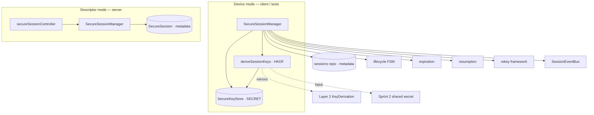
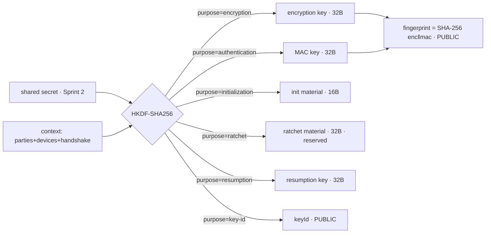
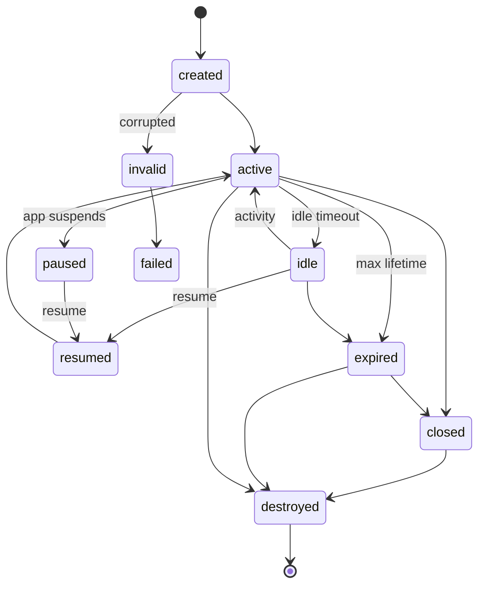
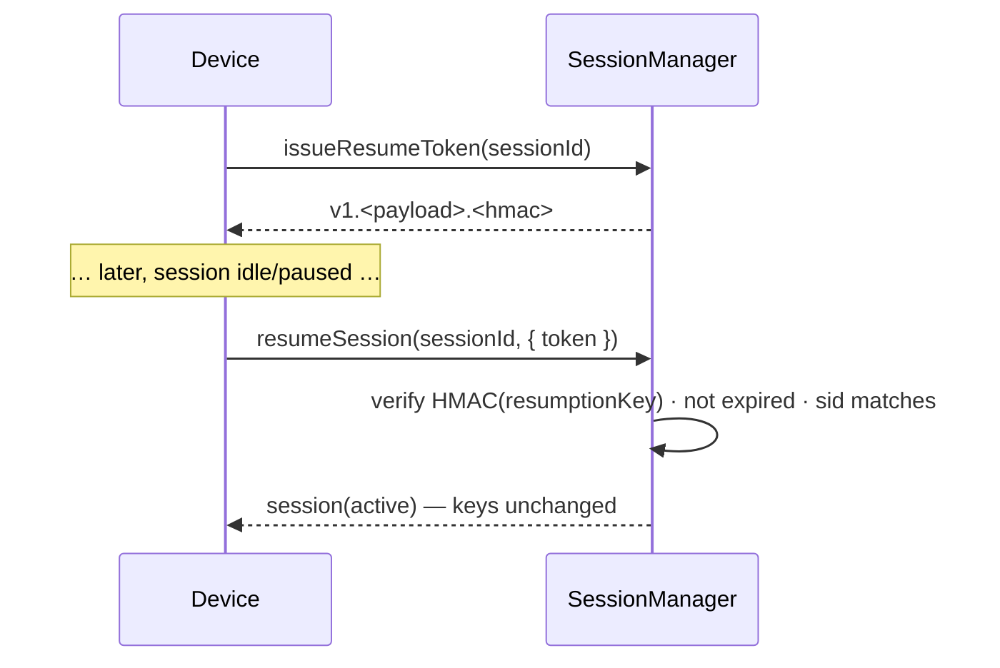
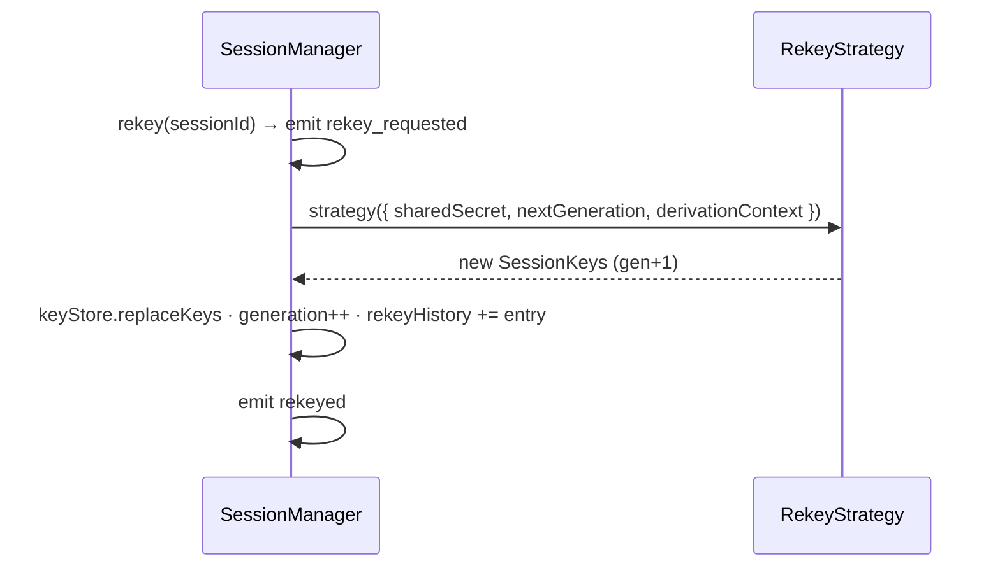

# Layer 4 · Sprint 3 — Secure Session Establishment

> **Status:** ✅ Complete · **Tests:** 48 session + 260 prior = **308 passing** ·
> **KDF:** HKDF-SHA256 · **Session key algorithm (metadata):** AES-256-GCM + HMAC-SHA256
>
> This sprint transforms the Sprint 2 shared secret into a complete, reusable **Secure
> Session** — derived session keys, a deterministic lifecycle, expiration, resumption,
> and a rekey framework — **without encrypting any chat messages**. The output is what
> Layer 5 will use for encrypted messaging.

---

## Table of Contents

1. [Scope & Non-Goals](#1-scope--non-goals)
2. [Architecture](#2-architecture)
3. [Session Key Derivation](#3-session-key-derivation)
4. [Secure Session Model](#4-secure-session-model)
5. [Session Lifecycle](#5-session-lifecycle)
6. [Session Manager](#6-session-manager)
7. [Repositories](#7-repositories)
8. [Expiration](#8-expiration)
9. [Resumption](#9-resumption)
10. [Rekey Framework](#10-rekey-framework)
11. [Validation](#11-validation)
12. [Events](#12-events)
13. [Backend Integration](#13-backend-integration)
14. [Client Integration](#14-client-integration)
15. [Testing](#15-testing)
16. [Future Integration](#16-future-integration)
17. [Current Limitations](#17-current-limitations)

---

## 1. Scope & Non-Goals

### In scope

✅ Secure Session architecture · session key derivation (encryption + MAC + init +
ratchet + resumption + keyId) · Session Manager · deterministic lifecycle · session
repository · expiration (max lifetime + idle timeout) · resumption (tokens) · rekey
framework · validation · events · backend integration · client integration ·
comprehensive tests · docs.

### Explicitly **NOT** in scope (Layer 5)

❌ Encrypted chat messages · forward secrecy · double ratchet · message ratcheting ·
encrypted media · P2P/WebRTC · transport encryption. Layer 2 / Layer 3 / Sprint 1 /
Sprint 2 are **not** redesigned — this sprint builds **on top** of them.

> **Core security invariant:** a session RECORD holds only PUBLIC metadata + key
> METADATA (algorithm, length, keyId, fingerprint). Raw session keys + the shared
> secret live **only** in a device-local secure key store; they are never serialized,
> persisted to the server, or returned by any API. Two devices sharing the Sprint 2
> secret derive the **same** session keys independently — the KDF is deterministic and
> node↔browser byte-identical.

### Consumes prior layers

| Dependency | Used as |
| --- | --- |
| Layer 2 SDK `KeyDerivation` | mirrored `{ namespace, context, purpose }` HKDF structure (server uses `node:crypto.hkdfSync` for zero-dep parity, as Layer 3/4 did). |
| Layer 4 Sprint 2 shared secret | the HKDF input keying material (device-local). |
| Layer 4 Sprint 1/2 handshake | the session is bound to a `cryptographically_complete` handshake. |
| Layer 3 identity/JWT | `protectedRoute`; participants resolved from the handshake, never trusted from the body. |

Integration is **additive** — only `server.js` (mount) and `server/package.json`
(test glob) among existing files changed.

---

## 2. Architecture

```
server/shs/session/
├── index.js                     # public entry point
├── types.js                     # SessionState, KeyPurpose, events, typedefs
├── errors.js                    # SessionError hierarchy (ERR_SESSION_*)
├── derivation/
│   └── sessionKeys.js           # HKDF-SHA256 key derivation (context + purpose separation)
├── model/
│   └── secureSession.js         # createSecureSession() — metadata record (no key bytes)
├── lifecycle/
│   └── lifecycle.js             # deterministic FSM (10 states) + SessionLifecycle
├── storage/
│   └── secureKeyStore.js        # SecureKeyStore — device-local raw keys (never persisted)
├── expiration/
│   └── expiration.js            # max-lifetime + idle-timeout policies
├── resumption/
│   └── resumption.js            # HMAC'd resume tokens (device-local resumption key)
├── rekey/
│   └── rekey.js                 # rekey interface + strategies (NOT forward secrecy)
├── validators/
│   └── validators.js            # id/metadata/duplicate/participant/repo validation
├── events/
│   └── events.js                # SessionEventBus
├── serialization/
│   └── sessionSerializer.js     # toPublicSession() — key METADATA only
├── repository/
│   ├── inMemoryRepository.js    # reference + test/device backend (zero deps)
│   └── mongoRepository.js       # metadata only — no key fields
├── models/
│   └── SecureSession.model.js   # NEW Mongo collection — metadata only
└── migration/
    └── migration.js             # schema version, report, expiry sweep

server/controllers/secureSessionController.js   # descriptor-mode HTTP handlers
server/routes/secureSessionRoute.js             # /api/secure-session/* behind protectedRoute
client/src/lib/secureSession.js                 # Web Crypto HKDF device side
```



The **same `SecureSessionManager`** runs in two modes. With a `SecureKeyStore` it is a
**device** (derives + holds keys, can rekey / load keys / issue resume tokens).
Without one it is the **server descriptor** manager (lifecycle metadata only — it
cannot derive or hold keys).

---

## 3. Session Key Derivation

`derivation/sessionKeys.js` runs **HKDF-SHA256** over the shared secret with:

- **Context separation** — `hs=<handshakeId>|parties=<sorted users>|devices=<sorted
  devices>|pv=<version>` is baked into every `info` label, so keys are bound to the
  session's participants + handshake. Sorting makes it **symmetric** (both peers derive
  identical keys).
- **Purpose separation** — a distinct `info` label per key (`encryption`,
  `authentication`, `initialization`, `ratchet`, `resumption`, `key-id`), so each key
  is cryptographically independent.
- **Generation** — a `gen=<n>` term enables deterministic rekeys (Section 10).



Derived: **encryption key**, **authentication (MAC) key**, **initialization material**,
**ratchet material** (reserved for Layer 5), **resumption key**, a PUBLIC **keyId**, and
a PUBLIC **key fingerprint**. `node:crypto` HKDF is byte-identical to the browser's Web
Crypto HKDF (verified), so client + reference derivations agree exactly.

> The encryption key is derived and stored but **not used to encrypt** in Sprint 3
> (`security.kdf = "hkdf-sha256"`, algorithm metadata `aes-256-gcm`). Layer 5 uses it.

---

## 4. Secure Session Model

The record (`model/secureSession.js`) holds only PUBLIC + key-METADATA fields:

```jsonc
{
  "sessionId": "…", "handshakeId": "…",
  "participants": ["alice", "bob"],
  "deviceIds": { "initiator": "devA", "responder": "devB" },
  "protocolVersion": "1.0",
  "encryptionKey":     { "algorithm": "aes-256-gcm",  "length": 32, "keyId": "…", "fingerprint": "…" },
  "authenticationKey": { "algorithm": "hmac-sha256", "length": 32 },
  "status": "active",           // lifecycle state
  "generation": 0,              // rekey counter
  "rekeyHistory": [],
  "createdAt": "ISO", "lastActivityAt": "ISO", "expiresAt": "ISO",
  "maxLifetimeMs": 86400000, "idleTimeoutMs": 1800000,
  "security": { "kdf": "hkdf-sha256", "contextSeparated": true, "purposeSeparated": true },
  "metadata": {}, "extensions": {}      // extensions = future extension fields
}
```

The Mongo model is a **new collection** with **no field** for a raw key or secret;
`validateMetadata` additionally throws if a record ever carries `*.bytes` or
`sharedSecret`.

---

## 5. Session Lifecycle

Ten states, driven by a deterministic FSM (`lifecycle/lifecycle.js`); every transition
is validated. `DESTROYED` is fully terminal.



| State | Meaning |
| --- | --- |
| `created` → `active` | keys derived; session usable |
| `idle` | idle timeout elapsed (still resumable) |
| `paused` → `resumed` → `active` | app suspend/resume |
| `expired` | hard max-lifetime reached |
| `closed` | graceful end (keys wiped, metadata kept) |
| `destroyed` | keys wiped + record removed (terminal) |
| `invalid` / `failed` | corrupted metadata / error |

---

## 6. Session Manager

`SecureSessionManager` (`manager/sessionManager.js`) is the facade future layers use
instead of touching storage.

```js
import { SecureSessionManager, createInMemorySessionRepository, SecureKeyStore } from "./shs/session/index.js";

const sessions = new SecureSessionManager({ ...createInMemorySessionRepository(), keyStore: new SecureKeyStore() });
const s = await sessions.establishSession({ handshakeId, participants: ["alice","bob"], sharedSecret });
const keys = sessions.loadSessionKeys(s.sessionId);   // device-local; Layer 5 consumes these
await sessions.trackActivity(s.sessionId);
await sessions.rekey(s.sessionId, { reason: "manual" });
await sessions.closeSession(s.sessionId);              // wipes local keys
```

**Responsibilities:** `establishSession` (device) / `registerSession` (server) ·
`getSession` / `getStatus` / `getActiveByHandshake` · `listSessions` / `listByState` ·
`validateSession` · `trackActivity` · `markIdle` / `pauseSession` / `resumeSession` ·
`rotateMetadata` · `closeSession` / `destroySession` · `expireSession` / `sweepExpired`
· `loadSessionKeys` / `issueResumeToken` / `rekey` (device only). Reads lazily expire
(hard lifetime) or mark idle (idle timeout).

**Errors** (all carry `.code` + HTTP `.status`): `SessionNotFoundError` (404),
`InvalidSessionTransitionError` (409), `SessionExpiredError` (410),
`DuplicateSessionError` (409), `ParticipantMismatchError` (403),
`CorruptedMetadataError` (422), `ResumptionError` (401), `RekeyError` (409),
`DeviceModeRequiredError` (400), `SessionValidationError` (400).

---

## 7. Repositories

Contract (persistence-isolated): `create · findById · update · delete ·
findActiveByHandshake · listByUser · findByState · listAll`.

- **`createInMemorySessionRepository()`** — deep-copies records, zero deps, the
  reference + device/test backend.
- **`createMongoSessionRepository()`** — Mongoose, `.lean()` reads, **metadata only**
  (no key fields exist in the schema).

Raw keys never touch a repository — they live in the device-local `SecureKeyStore`.

---

## 8. Expiration

`expiration/expiration.js` (pure policies):

- **Maximum lifetime** — `expiresAt = createdAt + maxLifetimeMs` (default 24h). Reaching
  it → `expired`.
- **Idle timeout** — `now - lastActivityAt ≥ idleTimeoutMs` (default 30m) → `idle`
  (still resumable, distinct from expiry).
- **Activity tracking** — `trackActivity` refreshes `lastActivityAt` and wakes an idle
  session; it does **not** extend the hard lifetime.
- **Cleanup hook** — `sweepExpired()` / `sweepExpiredSessions()` expire stragglers.
- **Automatic rotation** — a future hook (the rekey framework is the seam).

---

## 9. Resumption

`resumption/resumption.js` issues opaque **resume tokens** so a device can resume an
idle/paused session **without renegotiating keys**:

```
v1.<base64url(payload)>.<base64url(HMAC-SHA256(resumptionKey, payload))>
payload = { sessionId, keyId, generation, issuedAt, expiresAt }
```

The `resumptionKey` is derived in Section 3 and lives device-local — the server never
sees it, so token issuance + verification are device-side. Resume performs
`idle|paused → resumed → active` and reuses the existing keys. (Fast-resume /
server-side ticketing is a documented future hook.)



---

## 10. Rekey Framework

`rekey/rekey.js` is a **reusable interface** — deliberately **not** Forward Secrecy.
The default `hkdf-generation` strategy re-derives keys from the **same** shared secret
with `generation+1` in the HKDF context: deterministic (both peers rekey to the same
new keys) but **not forward-secret** (still a function of the root secret). **Layer 5
extends this** by registering a ratcheting strategy.



Provides: the **rekey interface** (`RekeyStrategy`), **rekey metadata**
(`rekeyRecord`), **version tracking** (`generation` + `rekeyHistory`), **rekey events**
(`rekey_requested` / `rekeyed`), and a **future hook** (`REKEY_STRATEGIES` registry +
injectable strategy).

---

## 11. Validation

`validators/validators.js` covers every spec item: **expired** (`assertNotExpired`),
**unknown** (`requireSession`), **invalid state** (lifecycle FSM),
**corrupted/malformed metadata** (`validateMetadata` — also rejects any record that
carries raw key bytes), **duplicate** (`assertNoDuplicate` — one active session per
handshake), **mismatched participants** (`assertParticipant` /
`assertParticipantsMatch`), **invalid session id** (`validateSessionId`), and
**malformed repository** (`validateRepository` — checked at manager construction).

---

## 12. Events

`SessionEventBus` (typed, wildcard `"*"`, public data only). Future layers subscribe.

| Event | Fired when |
| --- | --- |
| `session.created` / `session.activated` | establish / register |
| `session.idle` | idle timeout (on read) |
| `session.paused` / `session.resumed` | pause / resume |
| `session.expired` | hard lifetime (read or sweep) |
| `session.closed` / `session.destroyed` | close / destroy |
| `session.validated` | validateSession |
| `session.rekey_requested` / `session.rekeyed` | rekey |
| `session.failed` | corrupted → invalid |

```js
sessions.events.on("session.rekeyed", (e) => {/* Layer 5: rotate message keys for e.sessionId */});
```

---

## 13. Backend Integration

Mounted at `/api/secure-session` (distinct from Layer 3's `/api/session`), all behind
`protectedRoute`. **Descriptor mode** — the server tracks lifecycle metadata; it
**never** derives/holds keys. `/register` resolves participants from the SHS handshake
(requires `cryptographically_complete`) and never trusts them from the body.

| Method | Path | Action |
| --- | --- | --- |
| `POST` | `/register` | register a session a device established locally (public key metadata) |
| `GET` | `/` | list the caller's sessions (`?status=`) |
| `GET` | `/handshake/:handshakeId` | active session for a handshake |
| `GET` | `/:sessionId` | session status |
| `GET` | `/:sessionId/status` | compact status |
| `POST` | `/:sessionId/resume` | resume idle/paused |
| `POST` | `/:sessionId/activity` | record activity |
| `POST` | `/:sessionId/close` | close |

**Never exposed:** session keys, MAC keys, private keys, shared secrets — the server
does not possess them.

---

## 14. Client Integration

`client/src/lib/secureSession.js` derives session keys in-browser via **Web Crypto
HKDF** (byte-identical to the server-side derivation — verified), keeps them in memory
(never `localStorage`), and registers only PUBLIC metadata:

```js
import { establishSession, getCurrentSession, resumeSession, listSessions } from "./lib/secureSession.js";

const session = await establishSession(axios, handshakeId, { participants: [me, peer], deviceIds });
const keys = loadSessionKeys(session.sessionId);   // in-memory; Layer 5 consumes these
const current = await getCurrentSession(axios, handshakeId);
await resumeSession(axios, session.sessionId);
```

Session awareness: `getCurrentSession` · `getSession` · `getSessionStatus` ·
`listSessions` / `getSessionHistory` · `resumeSession` · `trackActivity` ·
`closeSession` · `isSessionExpired`, plus local `loadSessionKeys` /
`getLocalKeyFingerprint` / `clearSessionKeys` / `clearAll` (zero-fill on logout).

---

## 15. Testing

`cd server && npm test` → `node --test` (built-in, zero deps, in-memory repo — **no
MongoDB required**; Mongo files validated via `node --check`).

**48 session tests** across 4 files (308 total):

| File | Covers |
| --- | --- |
| `derivation-lifecycle.test.js` | symmetric derivation, purpose/context separation, generation, disposal; lifecycle FSM determinism |
| `expiration-resumption-rekey.test.js` | lifetime/idle policies; resume-token issue/verify/tamper/expiry; rekey strategy + guards |
| `repository-validators-serializer.test.js` | repo contract, id/metadata/duplicate/participant/repo validation, DTO secret-stripping, events |
| `manager.test.js` | establish/register, key equality across peers, lifecycle (idle/pause/resume/close/destroy), activity, expire/sweep, rekey, **concurrency, multi-device, stress (50 cycles)** |

Every spec test item — creation, validation, expiration, resumption, repository,
lifecycle, events, concurrent sessions, multiple devices, malformed metadata,
performance, stress — is exercised.

---

## 16. Future Integration

Layer 5 builds on the Secure Session without redesigning it:

- **Encrypted messaging:** read device-local `loadSessionKeys(sessionId)` → use the
  `encryptionKey` (AES-256-GCM) + `macKey` to seal/authenticate messages, with
  `initMaterial` seeding nonces.
- **Forward secrecy / double ratchet:** register a ratchet `RekeyStrategy` in
  `REKEY_STRATEGIES` and use `ratchetMaterial` as the root — the rekey framework,
  generation counter, and events are already in place.
- **Fast resume:** extend the resume-token infrastructure with server-side tickets.
- **Automatic rotation:** wire `sweepExpired` + a rekey policy into a scheduler.

---

## 17. Current Limitations

- **Keys derived, not used.** Session keys exist and are stored device-local, but
  nothing is encrypted yet (`aes-256-gcm` is metadata). Layer 5 uses them.
- **Rekey is not forward-secret.** The default strategy re-derives from the same root
  secret; PFS/ratchet is Layer 5.
- **Server is metadata-only.** It cannot derive, hold, or expose keys — session
  establishment (key derivation) happens on-device; the server tracks lifecycle.
- **Resumption is single-device-local.** Tokens are verified against device-local keys;
  cross-device fast-resume is a future concern.
- **JS memory hygiene caveat.** Secret `Buffer`s / `Uint8Array`s are zero-filled on
  dispose/close, but the JS runtime may retain copies; raw keys are never exported.
- **In-memory key store.** Device keys live in process memory for the session's life;
  durable secure storage (e.g. platform keychains) is out of scope here.

---

*Layer 4 · Sprint 3 produces complete Secure Sessions — derived keys, lifecycle,
expiration, resumption, and a rekey framework — ready for Layer 5 to encrypt
application data. No encrypted messaging is implemented yet.*
