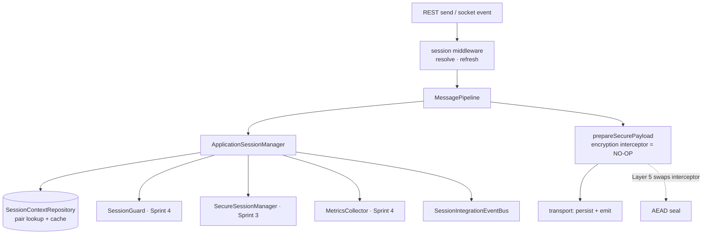
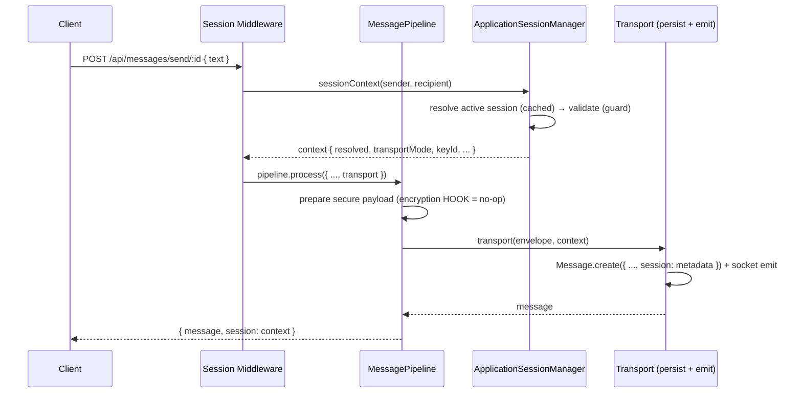
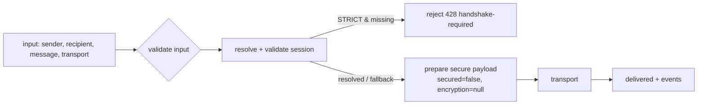
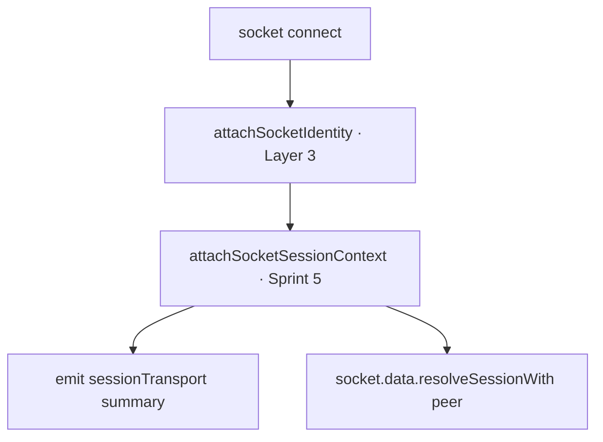

# Layer 4 · Sprint 5 — Secure Session Integration

> **Status:** ✅ Complete · **Tests:** 34 integration + 357 prior = **391 passing** ·
> **Enforcement:** PERMISSIVE (default) / STRICT · **Encryption:** disabled (hook ready).
>
> This sprint integrates the completed Secure Session infrastructure (Sprints 1–4) into
> the production chat backend. The application becomes **session-aware**: every
> messaging operation resolves + validates a Secure Session and runs through a
> transport-independent pipeline — **without encrypting any message** (Layer 5 adds
> that behind an already-wired hook).

---

## Table of Contents

1. [Scope & Non-Goals](#1-scope--non-goals)
2. [Architecture](#2-architecture)
3. [Application Flow](#3-application-flow)
4. [Message Pipeline](#4-message-pipeline)
5. [Application Session Manager](#5-application-session-manager)
6. [Middleware](#6-middleware)
7. [REST Integration](#7-rest-integration)
8. [WebSocket Integration](#8-websocket-integration)
9. [Repositories & Caching](#9-repositories--caching)
10. [Events](#10-events)
11. [Failure Handling & Recovery](#11-failure-handling--recovery)
12. [Performance & Observability](#12-performance--observability)
13. [The Encryption Hook (Layer 5)](#13-the-encryption-hook-layer-5)
14. [Testing](#14-testing)
15. [Current Limitations](#15-current-limitations)

---

## 1. Scope & Non-Goals

### In scope

✅ Session-aware messaging pipeline · session-aware REST APIs · session-aware
WebSockets · session middleware · session events · repository integration + caching ·
failure recovery · performance/observability · comprehensive tests · docs.

### Explicitly **NOT** in scope (Layer 5)

❌ Message encryption · encrypted attachments · forward secrecy · double ratchet ·
message ratcheting · P2P / WebRTC · transport encryption. The Secure Handshake System
(Sprints 1–4) is **not** redesigned — it is integrated.

> **Core principle:** the app becomes session-**aware**, not session-**encrypted**. A
> `secured: false` payload envelope carries an unused encryption HOOK. Making messages
> confidential in Layer 5 is a single interceptor swap — no controller, route,
> middleware, or pipeline change.

### Non-breaking by design

Enforcement is **PERMISSIVE** by default: when no session exists between two users
(they haven't completed a handshake yet), messaging proceeds via a **fallback**
transport (unencrypted, flagged, counted). Setting `SESSION_ENFORCEMENT=strict` (or a
STRICT manager) rejects session-less sends — full enforcement once clients establish
sessions.

---

## 2. Architecture

```
server/session-integration/
├── index.js                     # public entry point
├── types.js                     # PipelineStage, SessionResolution, TransportMode, EnforcementMode, events
├── errors.js                    # ERR_MSG_SESSION_* hierarchy
├── manager/
│   └── applicationSessionManager.js  # resolve → validate → context (the facade)
├── repositories/
│   └── sessionContextRepository.js   # pair lookup + TTL cache + stats
├── services/
│   └── messagePipeline.js            # resolve → validate → prepare → transport
├── middleware/
│   └── sessionMiddleware.js          # require/validate/resolve/refresh/reject
├── transport/
│   └── securePayload.js              # envelope builder (encryption hook)
├── interceptors/
│   └── encryptionInterceptor.js      # NO-OP hook Layer 5 replaces
├── adapters/
│   ├── restAdapter.js                # req → pipeline input; persist+emit transport
│   └── socketAdapter.js              # attach session context to sockets
├── validators/ · events/            # input validation · event bus

server/controllers/sessionMessagingController.js   # production wiring + status/stats
server/routes/sessionMessagingRoute.js             # /api/messaging-session/*
client/src/lib/sessionMessaging.js                 # client session awareness
```



The integration layer **composes** the existing managers — it modifies none of them.
Only 5 existing files changed, all additively: `Message.model.js` (optional `session`
subdoc), `messageController.js` (send → pipeline), `messageRoute.js` (middleware),
`server.js` (socket context + route mount), `package.json` (test glob).

---

## 3. Application Flow



---

## 4. Message Pipeline

The transport-independent flow every message runs through:

```
Message → Resolve Session → Validate Session → Prepare Secure Payload → Transport → Receiver
```

- **Resolve + Validate** — `ApplicationSessionManager.sessionContext()` finds the
  active session for the pair (cached) and validates it (Sprint 4 SessionGuard or a
  basic check). No session ⇒ fallback context (PERMISSIVE) or reject (STRICT).
- **Prepare Secure Payload** — `prepareSecurePayload()` builds the envelope and runs
  the **encryption interceptor** (a no-op in Sprint 5). This is the single extension
  point Layer 5 fills.
- **Transport** — an injected async function (REST persist+emit, socket emit, or a test
  double) — so the pipeline is reusable across transports.



The envelope:

```jsonc
{
  "version": 1,
  "sessionId": "…|null", "keyId": "…|null",   // key METADATA only
  "secured": false,                            // Layer 5 flips this
  "encryption": null,                          // Layer 5 populates { algorithm, iv, ciphertext, tag }
  "transportMode": "session|fallback",
  "fallback": false,
  "payload": { "text": "…", "image": "…" },    // plaintext in Layer 4
  "meta": { "initiator": "…", "peer": "…", "resolution": "resolved" }
}
```

---

## 5. Application Session Manager

`ApplicationSessionManager` is the single entry point every messaging operation uses.

```js
import { ApplicationSessionManager, MessagePipeline } from "./session-integration/index.js";
const appSessions = new ApplicationSessionManager({ sessions: secureSessionManager, guard });
const ctx = await appSessions.sessionContext(senderId, recipientId); // resolve + validate
```

**Responsibilities:** `resolveActiveSession(a,b)` · `validateSession(session, user)` ·
`loadSession(id)` · `resumeSession(id, user)` · `closeSession(id)` · `touch(id)` ·
`createIfMissing(a, b, opts)` · `sessionContext(a, b)` (the consolidated view) ·
`shouldReject(ctx)` · `getStats()`.

`createIfMissing` establishes a session only in **device mode** (with a shared secret);
in **descriptor mode** (the server) it reports `HANDSHAKE_REQUIRED` — the server never
fabricates a secret; a device establishes the session (Sprint 2–3 flow).

---

## 6. Middleware

`createSessionMiddleware({ appSessions })` yields reusable Express middleware:

| Middleware | Behaviour |
| --- | --- |
| `resolveSession` | resolve + attach `req.sessionContext` — **never blocks** |
| `requireSession` | STRICT: reject 428 when no valid session; PERMISSIVE: pass |
| `validateSession` | STRICT: reject 409/410 on an expired/invalid session |
| `refreshSession` | best-effort activity touch (non-blocking) |
| `rejectInvalidSession` | combined strict guard (require + validate) |

Wired on the send route: `protectedRoute → resolveSession → refreshSession →
sendMessage`. **Future encryption middleware plugs in right after `resolveSession`** —
the context + envelope hooks are already present.

---

## 7. REST Integration

Existing messaging endpoints stay backward compatible; `send` is now session-aware:

| Method | Path | Session behaviour |
| --- | --- | --- |
| `POST` | `/api/messages/send/:id` | resolve → refresh → pipeline (persist tagged with session metadata + emit) |
| `GET` | `/api/messaging-session/context/:peerId` | the caller's session context with a peer |
| `GET` | `/api/messaging-session/status` | transport readiness + enforcement + encryption state |
| `GET` | `/api/messaging-session/stats` | aggregate integration metrics (no PII) |

The extension points for `edit / delete / react / forward / reply` are identical —
attach `resolveSession` and route through the pipeline. Persisted messages carry a
PUBLIC `session` subdoc (`{ sessionId, keyId, secured:false, transportMode, fallback }`).

---

## 8. WebSocket Integration

Building on the Layer 3 identity attachment (`socket.data.identity`), the socket adapter
attaches a session-transport summary (`socket.data.session`) with **identity, device,
session status, handshake readiness, and enforcement** and exposes an on-demand
per-peer resolver (`socket.data.resolveSessionWith(peer)`). On connect the server emits
`sessionTransport`. Presence, rooms, and delivery are unchanged; no transport encryption.



---

## 9. Repositories & Caching

`SessionContextRepository` extends session lookup for messaging:

- **`findActiveByPair(a, b)`** — resolves the active session bound to a participant pair
  (the Sprint 3 repo is keyed by handshake/user; this scans the caller's sessions —
  indexed on `participants` — for the counterparty + a usable state). Order-independent.
- **TTL cache** (default 3s) with hit/miss tracking — hot conversations resolve from
  cache; `cacheForPair` / `invalidatePair` / `invalidateAll` keep it correct on
  create/close/expire.
- **`stats()`** — lookups, resolved/missing, invalidations, cache size + hit rate.

---

## 10. Events

`SessionIntegrationEventBus` (typed, wildcard `"*"`, public data only):

| Event | Fired when |
| --- | --- |
| `integration.session_resolved` / `_validated` | a valid session backs the operation |
| `integration.session_missing` / `_expired` | no usable session → fallback |
| `integration.session_created` / `_resumed` / `_closed` | lifecycle via the app manager |
| `integration.transport_ready` | payload prepared / socket attached |
| `integration.message_pipelined` | a message completed the pipeline |
| `integration.pipeline_fallback` | delivered via the session-less fallback |
| `integration.pipeline_rejected` | STRICT rejection (handshake required) |

---

## 11. Failure Handling & Recovery

| Failure | Handling (PERMISSIVE) |
| --- | --- |
| Missing session | fallback transport + `handshake-fallback` counter |
| Expired session | validation fails → fallback; cache invalidated |
| Invalid session | fallback; `session.failures` counter |
| Unknown device / revoked identity | SessionGuard (Sprint 4) marks invalid → fallback |
| Session mismatch | `assertSessionMatchesPair` rejects a mixed-up session |
| Transport unavailable | pipeline wraps the error as `TransportUnavailableError` (503) |
| Handshake required | fallback (PERMISSIVE) or 428 (STRICT) with a recovery hint |

Recovery is graceful: the app keeps delivering messages (unencrypted, flagged) while
sessions are being established, and lights up the secure path automatically once a
session exists. An idle session resumes; an expired one falls back until re-established.

---

## 12. Performance & Observability

**Performance:** a short-TTL pair cache (hot conversations avoid a lookup), O(1) cached
resolution, best-effort non-blocking activity refresh, and fallback that never blocks.

**Observability** (`getStats()` / `/api/messaging-session/stats`) via the Sprint 4
`MetricsCollector`: `integration.session.resolved` / `.missing` / `.failures`,
`integration.handshake.fallback` (handshake fallback count),
`integration.session.created`, `integration.session.lookup_ms` (latency histogram),
`integration.sessions.active` (gauge), plus repository cache hit-rate.

---

## 13. The Encryption Hook (Layer 5)

The `EncryptionInterceptor` is the ONLY thing Layer 5 changes to make messages
confidential:

```js
// Layer 5, at startup — no controller/route/pipeline change:
import { setEncryptionInterceptor } from "./session-integration/index.js";
setEncryptionInterceptor({
  name: "aes-256-gcm",
  encryptOutbound(envelope, ctx) {
    const keys = secureSessionManager.loadSessionKeys(ctx.sessionId); // device-local
    const sealed = aeadSeal(envelope.payload, keys.encryptionKey, keys.macKey);
    return { ...envelope, secured: true, encryption: sealed, payload: null };
  },
  decryptInbound(envelope, ctx) { /* open envelope.encryption → payload */ },
});
```

Verified by tests: registering an interceptor flips `secured` to `true`, moves the
plaintext out of `payload`, and the pipeline stage/outcome is **unchanged**.

---

## 14. Testing

`cd server && npm test` → `node --test` (zero deps, in-memory session manager — **no
MongoDB**; production Mongo files validated via `node --check`). **34 integration
tests** across 4 files (391 total):

| File | Covers |
| --- | --- |
| `manager.test.js` | resolution, symmetric pair lookup, fallback, group, expiry, createIfMissing (device/descriptor), caching, stats, enforcement |
| `pipeline-transport.test.js` | secure payload, encryption hook (no-op + Layer 5 swap), fallback/session-backed delivery, STRICT reject, input/transport failures |
| `middleware-repository.test.js` | resolve/require/validate/refresh middleware (permissive + strict), repository pair lookup + cache + invalidation, event bus |
| `integration.test.js` | full controller path (persist+emit with session metadata), Layer 5 drill, concurrency (25 pairs), multiple devices, graceful recovery, no-secret-leak |

Every spec test item — message pipeline, REST, WebSocket, middleware, lookup,
expiration, handshake fallback, repository, events, caching, concurrent users, multiple
devices — is exercised.

---

## 15. Current Limitations

- **No encryption.** Messages are plaintext (`secured: false`); the hook is unused until
  Layer 5. Do not treat fallback as private.
- **Group messages always fall back.** Sprint 5 resolves pairwise sessions only; group
  (fan-out) session keys are a future concern.
- **Server can't create sessions.** In descriptor mode `createIfMissing` reports
  `HANDSHAKE_REQUIRED` — a device establishes the session (Sprint 2–3). PERMISSIVE mode
  keeps messaging working meanwhile.
- **Pair resolution scans the caller's sessions.** Fine at chat scale + cached; a
  dedicated pair index is a future optimization.
- **In-process cache & metrics.** Per-node; multi-node needs a shared cache + exporter
  (the same extension points as Sprint 4).
- **PERMISSIVE by default.** Set `SESSION_ENFORCEMENT=strict` to require sessions once
  clients establish them.

---

*Layer 4 · Sprint 5 makes the messaging application operate through the Secure Session
Layer. Every send resolves + validates a session and runs the pipeline; the encryption
hook is in place but unused. Layer 5 will enable encryption by registering one
interceptor — without changing the application architecture.*
