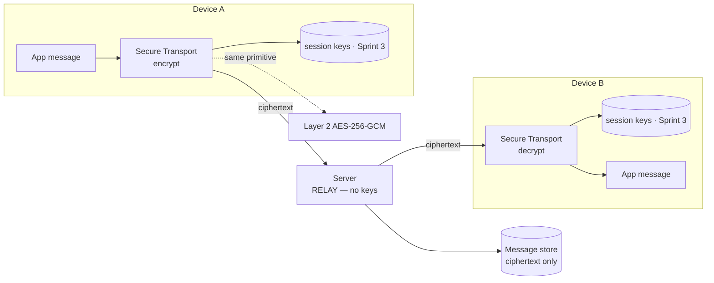
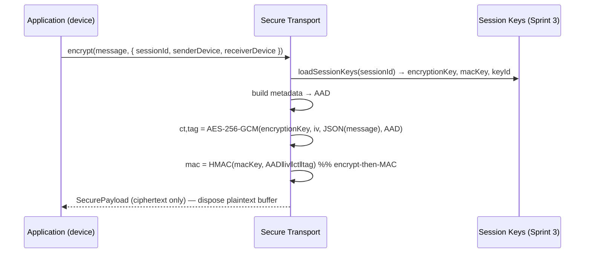
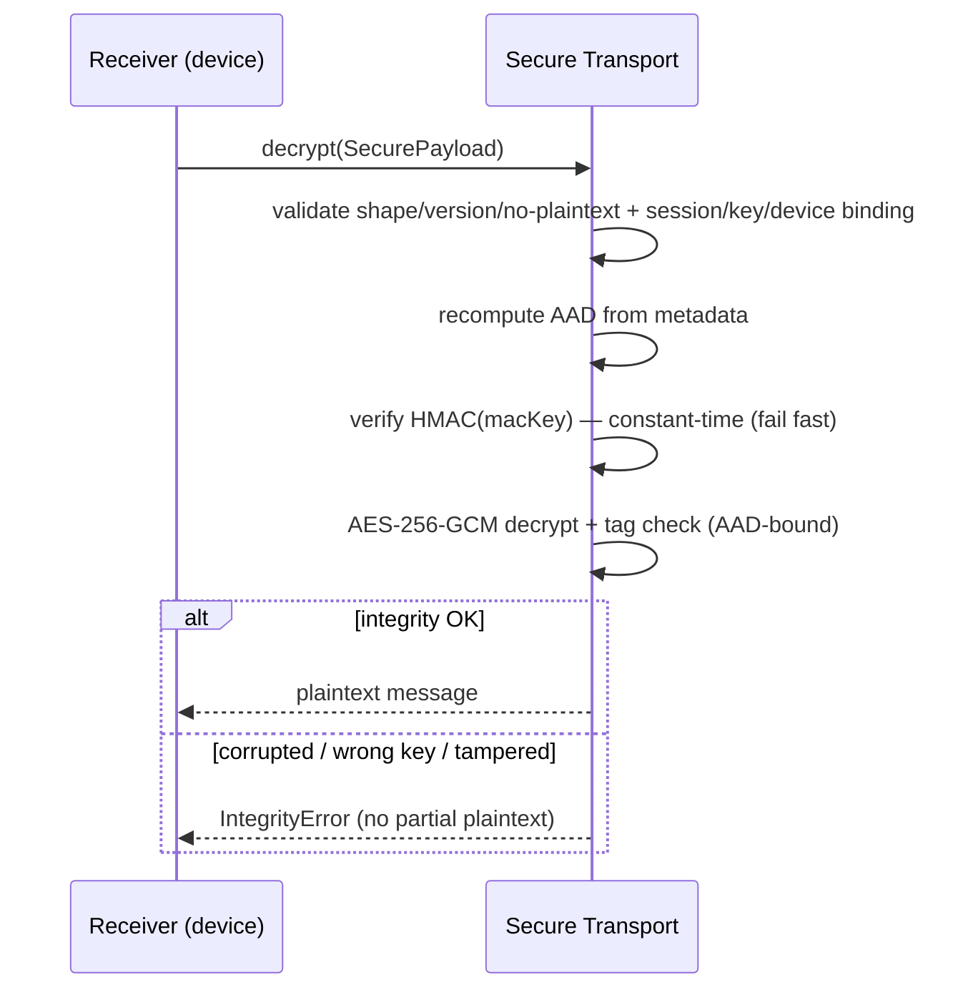
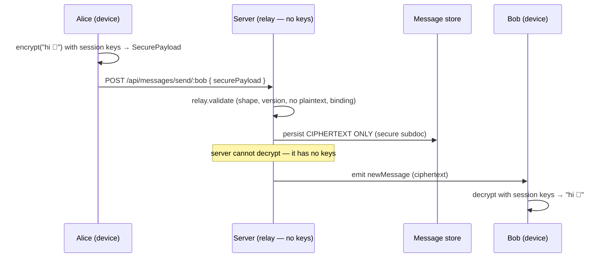

# Layer 4 · Sprint 6 — Secure Transport Layer (First End-to-End Encryption)

> **Status:** ✅ Complete — **LAYER 4 COMPLETE** · **Tests:** 33 transport + 391 prior =
> **424 passing** · **Cipher:** AES-256-GCM + encrypt-then-HMAC-SHA256 · **Keys:** the
> Sprint 3 session keys.
>
> This sprint delivers the first fully **end-to-end encrypted message**. The
> application never encrypts directly — it hands messages to a reusable, transport-
> independent Secure Transport Layer. The server becomes a **blind relay**: it
> validates, routes, and stores **ciphertext only**, and cannot read message content.

---

## Table of Contents

1. [Scope & Non-Goals](#1-scope--non-goals)
2. [Architecture](#2-architecture)
3. [Secure Payload Format](#3-secure-payload-format)
4. [Encryption Flow](#4-encryption-flow)
5. [Decryption Flow](#5-decryption-flow)
6. [The First End-to-End Message](#6-the-first-end-to-end-message)
7. [REST Integration](#7-rest-integration)
8. [WebSocket Integration](#8-websocket-integration)
9. [Database Changes](#9-database-changes)
10. [Server Responsibilities](#10-server-responsibilities)
11. [Validation](#11-validation)
12. [Performance & Observability](#12-performance--observability)
13. [Testing](#13-testing)
14. [Current Limitations](#14-current-limitations)
15. [Future — Forward Secrecy (Layer 5)](#15-future--forward-secrecy-layer-5)

---

## 1. Scope & Non-Goals

### In scope

✅ Secure Transport Layer · end-to-end encrypted messaging (REST + WebSocket) ·
ciphertext-only storage · client-side encryption + decryption · transport abstraction ·
comprehensive tests · docs.

### Explicitly **NOT** in scope (Layer 5)

❌ Forward secrecy · double ratchet · session ratcheting · key rotation · P2P / WebRTC /
NAT · offline sync. Encryption uses the **existing Sprint 3 session keys**. The Secure
Handshake System (Sprints 1–5) is **not** redesigned — this is the transport on top.

> **Core principle:** *the application never performs encryption directly.*
> ```
> Application → Secure Transport Layer → Transport → Receiver
> ```
> The Secure Transport Layer owns encryption, decryption, serialization, secure-payload
> construction, session usage, and transport abstraction. The **server holds no keys and
> cannot decrypt** — encryption/decryption happen on the participant devices.

---

## 2. Architecture

```
server/secure-transport/
├── index.js                    # public entry point
├── types.js · errors.js        # enums/typedefs · ERR_TRANSPORT_* hierarchy
├── crypto/aead.js              # AES-256-GCM + encrypt-then-HMAC (node:crypto)
├── metadata/metadata.js        # authenticated metadata + canonical AAD
├── payload/securePayload.js    # SecurePayload assemble/decode/shape-check
├── encryptor/encryptor.js      # message → SecurePayload
├── decryptor/decryptor.js      # SecurePayload → message (+ integrity)
├── serializer/serializer.js    # JSON / compact
├── validators/validators.js    # relay + device validation
├── transport/transport.js      # Transport interface + InMemoryTransport
├── adapters/transportAdapters.js  # REST / WebSocket transports (reused by WebRTC/QUIC/TURN)
├── manager/secureTransportManager.js  # the facade (encrypt/decrypt/relay + metrics)
├── interceptor/secureTransportInterceptor.js  # bridge that activates E2E in the Sprint 5 pipeline
├── repositories/ciphertextRepository.js  # ciphertext-only storage contract + in-memory impl
├── middleware/secureTransportMiddleware.js  # server relay middleware
└── events/events.js            # SecureTransportEventBus

server/controllers/secureTransportController.js  # server relay + status/metrics
server/routes/secureTransportRoute.js            # /api/secure-transport/*
client/src/lib/secureTransport.js                # Web Crypto AES-256-GCM (browser E2E)
```



The layer is **transport-independent**: REST, WebSocket, and future WebRTC / QUIC /
TURN transports all implement the same `Transport` interface and reuse the same
crypto/serialization. Integration is **additive** — 5 existing files changed
(`Message.model.js`, `messageController.js`, `messageRoute.js`, `server.js`,
`package.json`).

---

## 3. Secure Payload Format

The encrypted envelope carries ciphertext + authenticated metadata and **never any
plaintext**:

```jsonc
{
  "v": 1, "payloadVersion": 1, "type": "message", "protocolVersion": "1.0",
  "sessionId": "…", "keyId": "…",                 // session/key binding (metadata)
  "senderDevice": "devA", "receiverDevice": "devB",
  "timestamp": 1700000000000, "nonce": "…hex…",    // replay metadata
  "encryption": { "algorithm": "aes-256-gcm", "iv": "b64(12B)", "ciphertext": "b64", "tag": "b64(16B)" },
  "integrity":  { "algorithm": "hmac-sha256", "mac": "b64" },  // encrypt-then-MAC
  "ratchet": null                                  // reserved for Layer 5 forward secrecy
}
```

**All metadata is bound as AEAD AAD** (`canonicalAAD`), so a relay or attacker cannot
tamper with any field (session, device, type, timestamp, nonce) without breaking
decryption. The `keyId` binds the payload to a specific session key generation.

---

## 4. Encryption Flow

```
Application Message → Load Session Keys → Encrypt (AES-256-GCM) → Secure Payload → Serialize → Transport
```



Every message uses a **fresh random 12-byte IV + nonce** (IND-CPA; identical plaintexts
produce different ciphertexts). The transient plaintext buffer is zero-filled after
sealing. All encryption uses the Layer 2 SDK's **AES-256-GCM** primitive (via
`node:crypto`; the browser uses Web Crypto — byte-compatible, verified).

---

## 5. Decryption Flow

```
Receive Payload → Deserialize → Validate → Load Session Keys → Verify Integrity → Decrypt → Plaintext
```



Two independent integrity layers: the **HMAC** (verified first, constant-time) and the
**GCM tag** (authenticates ciphertext + AAD). Any of wrong-key, tampered-ciphertext,
tampered-metadata, or wrong-session is rejected with no plaintext leaked.

---

## 6. The First End-to-End Message



Proven by test: *Alice encrypts → the server relays + stores ciphertext (no plaintext,
cannot decrypt) → Bob decrypts.* Cross-stack too: a browser (Web Crypto) ciphertext
decrypts on the Node reference and vice-versa.

---

## 7. REST Integration

`POST /api/messages/send/:id` now accepts a client-encrypted `securePayload`:

- **Middleware:** `resolveSession` (Sprint 5) → `refreshSession` → `validateSecurePayload`
  (relay-validate the ciphertext) → `requireCiphertext` (reject plaintext when
  `E2E_REQUIRED=true`).
- **Controller:** if `securePayload` present → relay-validate → persist ciphertext
  (`secure` subdoc) → emit → respond `{ encrypted: true }`. Else the Sprint 5 plaintext
  fallback (backward compatible).
- The same shape extends to **edit / reply / forward / delete / react** — each carries a
  `securePayload` with the corresponding `type`. **The server receives only ciphertext.**

`GET /api/messages/:id` returns messages including the `secure` subdoc; the **client
decrypts** them locally.

---

## 8. WebSocket Integration

**Design decision — what is encrypted vs not:**

| Event | Encrypted? | Rationale |
| --- | --- | --- |
| `newMessage` (message content) | ✅ ciphertext | message body is E2E encrypted |
| `messageStatusUpdate`, `messagesRead` | ❌ | delivery/read metadata — no content |
| `typing`, presence / `onlineUsers` | ❌ | operational control-plane, no content |

Message **payloads are encrypted**; operational/protocol events (typing, presence, read
receipts, delivery status) remain unencrypted — they carry routing/status metadata, not
message content, and encrypting them would add cost without protecting content. This
mirrors mainstream E2E messengers. The socket already carries identity + session context
(Sprint 5); encrypted `newMessage` frames ride the same channel.

---

## 9. Database Changes

The `Message` model gains a `secure` subdoc (additive) storing the **ciphertext
envelope + metadata ONLY**:

```jsonc
"secure": {
  "encrypted": true,
  "v": 1, "payloadVersion": 1, "type": "message", "protocolVersion": "1.0",
  "sessionId": "…", "keyId": "…", "senderDevice": "…", "receiverDevice": "…",
  "timestamp": 1700000000000, "nonce": "…",
  "algorithm": "aes-256-gcm", "iv": "b64", "ciphertext": "b64", "tag": "b64",
  "macAlgorithm": "hmac-sha256", "mac": "b64"
}
```

When `encrypted` is true, `text`/`image` are absent. **Never stored:** plaintext,
encryption keys, MAC keys, or shared secrets. `toStoredCiphertext()` whitelists the
ciphertext + metadata defensively before persistence.

---

## 10. Server Responsibilities

The backend is a **secure relay**:

| Responsibility | Notes |
| --- | --- |
| Authentication | existing JWT `protectedRoute` |
| Routing / delivery | to the recipient's socket (ciphertext) |
| Persistence | ciphertext + metadata only (`secure` subdoc) |
| Offline queue | ciphertext persists; delivered on reconnect (decrypts on device) |
| Push / metadata | delivery status, timestamps, session references |

**The server must never decrypt** — and structurally *cannot*: the relay
`SecureTransportManager` has no `keyProvider`, so `encrypt`/`decrypt` throw; only
`relay()` (validate + forward) is available. `GET /api/secure-transport/status` reports
`canDecrypt: false`.

---

## 11. Validation

`validators.js` + the decryptor cover every spec item: **malformed payloads**
(shape + no-plaintext), **wrong session / device / identity** (metadata binding),
**corrupted ciphertext** (HMAC + GCM tag), **version mismatch**, **integrity failures**,
and **replay metadata** (`nonce` + `checkReplay`, wireable to the Sprint 4
ReplayProtector). The server's `validateForRelay` runs the structural + binding checks
it *can* (it can't verify integrity without keys — the receiver does that).

---

## 12. Performance & Observability

**Performance** (single core, in-memory): ~1,500–3,000 encrypt+decrypt round trips/sec
for typical messages; ciphertext overhead is a bounded metadata + base64 wrapper (no
plaintext). Fresh-IV single-shot GCM (no chunking needed at message sizes), constant-
time MAC compare, transient-buffer disposal.

**Observability** (`MetricsCollector`, `/api/secure-transport/metrics`):
`transport.messages.encrypted` / `.decrypted` / `.relayed`, `transport.encrypt_ms` /
`decrypt_ms` (latency histograms), `transport.ciphertext_bytes` (size histogram),
`transport.failures`, plus `SecureTransportEventBus` events
(`message_encrypted/decrypted`, `integrity_failure`, `relayed`).

---

## 13. Testing

`cd server && npm test` → `node --test` (zero deps, no MongoDB; production Mongo/JSX via
`node --check`). **33 transport tests** across 5 files (424 total):

| File | Covers |
| --- | --- |
| `encrypt-decrypt.test.js` | AEAD seal/open, round trips (unicode/emoji/large/binary/empty), fresh-IV, wrong key/session, tampered ct/tag/metadata, malformed, serialization |
| `manager-relay.test.js` | manager encrypt/decrypt/metrics/events, transport abstraction + REST/WS adapters, relay validation, ciphertext-only storage, middleware |
| `interceptor.test.js` | Sprint 5 interceptor bridge — seals/opens, fallback, activates `prepareSecurePayload` |
| `e2e.test.js` | **the first E2E message**, cross-session isolation, **offline delivery**, multiple devices, **100 concurrent** round trips, performance + overhead |

Cross-stack (browser Web Crypto ↔ Node) interop is verified. Every spec test item —
encrypted messaging, REST, WebSocket, large, unicode, binary, malformed ciphertext,
wrong key, wrong session, offline delivery, multiple devices, concurrency, performance,
stress, regression — is exercised.

---

## 14. Current Limitations

- **Static session keys.** Sprint 6 uses the Sprint 3 session keys as-is — **no forward
  secrecy / rekeying / ratchet** (Layer 5). A compromised session key exposes that
  session's messages.
- **Group messages fall back.** E2E covers pairwise sessions; group (fan-out) keys are a
  future concern.
- **Metadata is authenticated but not hidden.** Session/device ids, timestamps, and
  sizes are visible to the relay (necessary for routing) — content is not.
- **No offline sync / multi-device key sync.** Ciphertext queues + delivers, but
  cross-device history sync is out of scope.
- **E2E is opt-in per deployment.** `E2E_REQUIRED=true` enforces ciphertext; otherwise
  plaintext fallback remains for un-upgraded clients.
- **JS memory hygiene.** Plaintext/secret buffers are zero-filled, but the runtime may
  retain copies; raw keys are never exported.

---

## 15. Future — Forward Secrecy (Layer 5)

Layer 5 enhances these secure sessions **without redesigning the transport**:

- **Ratchet the session keys** — register a rekey strategy (Sprint 3 `REKEY_STRATEGIES`,
  rooted at the reserved `ratchetMaterial`); the transport picks up the new `keyId` per
  message. The `ratchet` payload slot is already reserved.
- **Per-message keys / double ratchet** — the encryptor already takes keys per call;
  Layer 5 supplies evolving keys keyed by `generation`.
- **Automatic rekeying** — driven by the Sprint 3 rekey framework + `session.rekeyed`
  events; the transport re-reads `loadSessionKeys` transparently.

The payload format, envelope, transport interface, relay, and storage are stable — Layer
5 changes only *which key* the transport uses, not *how* it transports.

---

*Layer 4 is complete. The application now supports production-grade end-to-end encrypted
communication: messages are encrypted on the sender's device with the session keys
established by the Secure Handshake System, relayed + stored as ciphertext by a server
that cannot read them, and decrypted only on the recipient's device. Layer 5 will add
forward secrecy and cryptographic session evolution on top of this transport.*
