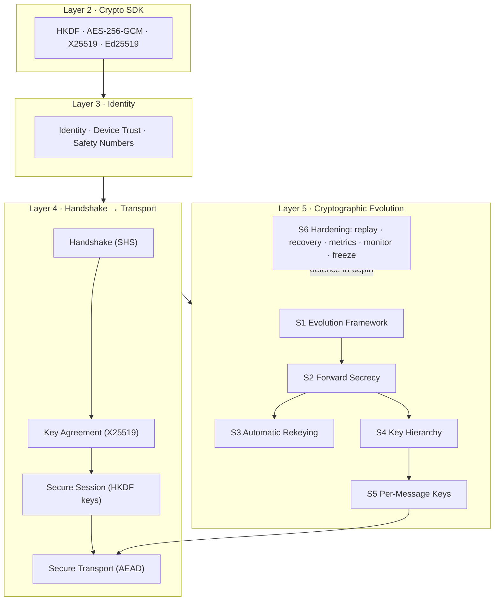
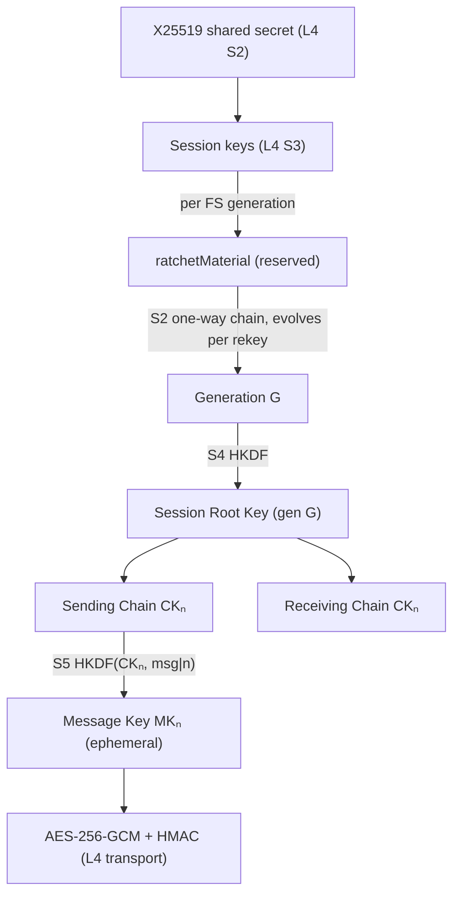
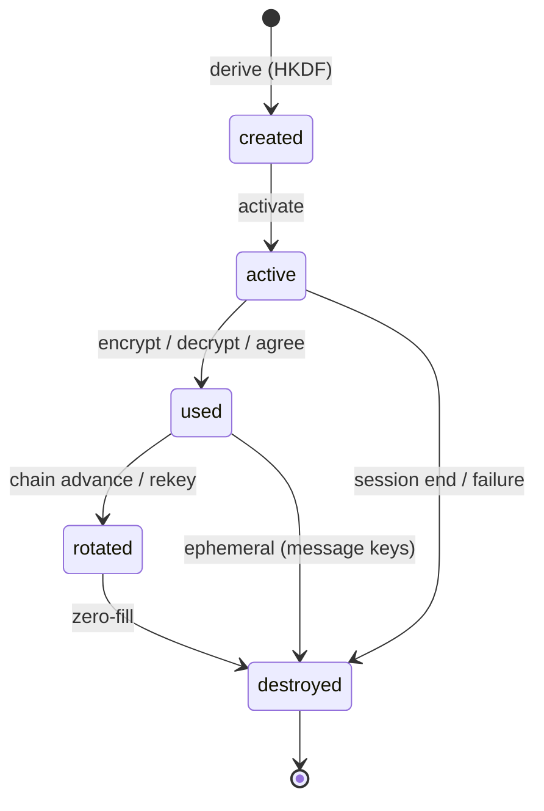
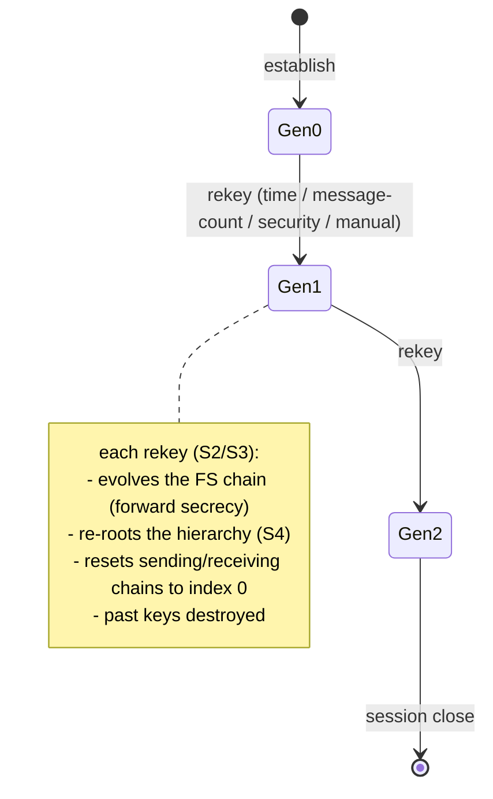
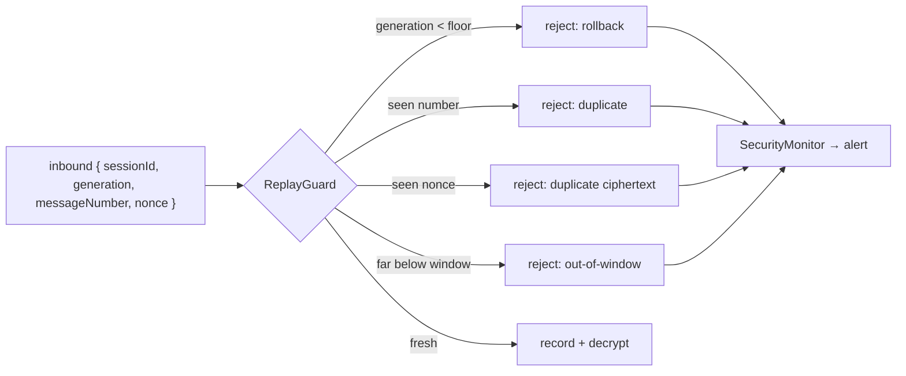
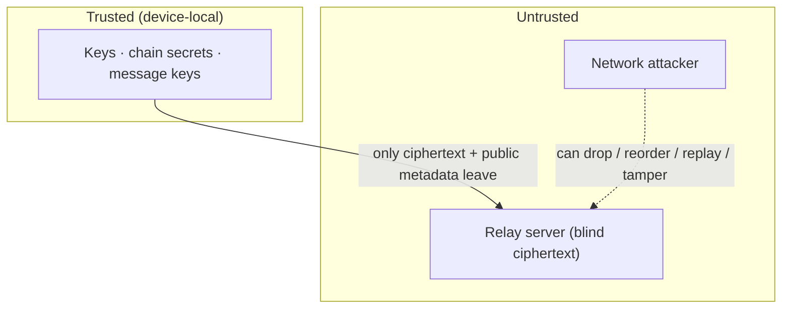

# Layer 5 — FINAL: The Production Cryptographic Subsystem

> **Status:** ✅ Layer 5 COMPLETE (6 sprints) · **Tests:** 657 total, all green · **Sprint 6 adds:** production hardening (no new crypto)

This document is the capstone for **Layers 2–5**: the complete end-to-end-encrypted secure
messaging engine. It consolidates the architecture, the message flow, the key lifecycle, the
threat model, security assumptions, known limitations, the frozen interfaces, and the Layer 6
extension points.

---

## 0. What the cryptographic subsystem provides

| Capability | Layer / Sprint | Module |
|---|---|---|
| End-to-End Encryption | L4 S6 | `secure-transport/` |
| Secure Identity | L3 | `identity/`, `device-trust/`, `trust/` |
| Secure Handshake (X25519 ECDH) | L4 S1–2 | `shs/`, `shs/key-agreement/` |
| Secure Sessions | L4 S3 | `shs/session/` |
| Session Evolution Framework | L5 S1 | `session-evolution/` |
| Forward Secrecy | L5 S2 | `forward-secrecy/` |
| Automatic Rekeying | L5 S3 | `evolution-policy/` |
| Key Hierarchy (Root + Chains) | L5 S4 | `key-hierarchy/` |
| Per-Message Keys | L5 S5 | `message-keys/` |
| Production Hardening | L5 S6 | `crypto-hardening/` |

---

## 1. Full architecture



### The key hierarchy, top to bottom



---

## 2. End-to-end message flow (send)

```mermaid
sequenceDiagram
  participant App
  participant AR as Auto-Rekey (S3)
  participant MK as MessageKeyManager (S5)
  participant CH as ChainManager (S4)
  participant FS as ForwardSecrecy (S2)
  participant HG as Hardening (S6)
  participant T as Transport (L4)
  App->>MK: send(message)
  MK->>AR: recordMessage() → policy may auto-rekey
  AR->>FS: evolve() (if a policy fires) → new generation
  FS->>CH: re-root hierarchy (archives old chains)
  MK->>CH: resolveSendingChainKey → CKₙ, n
  MK->>MK: MKₙ = HKDF(CKₙ, "msg|dir|gen|n")
  MK->>T: AES-256-GCM seal(message, MKₙ)
  MK->>MK: DESTROY MKₙ (zero-fill)
  MK->>CH: advanceSendingChain → CKₙ₊₁
  MK-->>App: envelope { messageNumber:n, generation, payload }
  Note over HG: metrics.observe(encrypt_ms); replay window updated
```

**Receive** is the inverse: `HG` replay-guard rejects duplicates/rollbacks up-front → resolve
receiving chain (skip-cache gaps) → derive `MKₙ` → decrypt → destroy → advance.

---

## 3. Key lifecycle (every key)



- **Message keys** — created → used exactly once → destroyed immediately (S5).
- **Chain keys** — advance one-way; the previous is disposed on ratchet (S4).
- **Generation chain secret** — evolves one-way per rekey; the previous is destroyed (S2).
- **Root key** — superseded + destroyed on re-root (S4).
- **Session keys** — device-local; wiped on close/destroy (L4 S3).

The **`KeyLifecycleVerifier` (S6)** independently confirms these invariants and that **no
record ever contains raw key material** (deep-scan for buffers + forbidden field names).

---

## 4. Session evolution over time



---

## 5. Replay protection (S6, defence-in-depth)

The per-message layer already rejects replays intrinsically (a consumed key is destroyed). The
**`ReplayGuard`** adds a transport-level, pre-decryption check:



Bounded (sliding window + TTL), reconnect-aware (`restore` re-seeds the floor), generation-aware
(`advanceGeneration` raises the floor and clears the window).

---

## 6. Threat model



| Adversary | Capability | Defence |
|---|---|---|
| **Relay server** | sees all ciphertext + metadata; can drop/reorder | E2E encryption; server holds NO keys; AAD-bound metadata; blind relay |
| **Network attacker** | intercept, replay, tamper, reorder | AES-256-GCM + HMAC (fails closed); ReplayGuard; per-message keys |
| **Future key compromise** | steals a device's *current* state | **Forward secrecy** — past generations + message keys already destroyed |
| **Single message-key leak** | one message key | exposes exactly ONE message (per-message keys) |
| **Downgrade / rollback** | forces an older generation | generation floor + rollback rejection (S2/S6) |
| **DoS** | floods replays / out-of-order / handshakes | bounded caches, `maxSkip`, cooldowns, monitor alerts |

**Explicitly NOT in the threat model (yet):** a *sophisticated, persistent* full-state
compromise is mitigated only up to forward secrecy — **Post-Compromise Security (a DH ratchet)
is future work.** Endpoint malware, a malicious OS, and side channels are out of scope.

---

## 7. Security assumptions (documented per S2 audit)

1. **The relay server is honest-but-curious** — it routes ciphertext and stores metadata but
   never receives keys, shared secrets, chain secrets, or message keys. Every server-side
   manager runs in **descriptor mode**.
2. **HKDF-SHA256 / AES-256-GCM / X25519 / Ed25519 are secure** as used (Layer 2 SDK, byte-compatible
   node ↔ Web Crypto).
3. **Both peers derive identical key material independently** from the same shared secret; no key
   is ever transmitted. Canonical directions (`i2r`/`r2i`) give sender/receiver agreement.
4. **Device-local storage is trusted** — the JS runtime cannot guarantee full memory erasure, so
   destruction is best-effort zero-filling of live buffers (strongest available guarantee).
5. **Message ordering metadata is authenticated implicitly** — a tampered `messageNumber`/
   `generation` yields the wrong key and fails closed.
6. **JWT auth + participant checks gate every API**; hardening endpoints are read-only metadata.

---

## 8. Repositories & storage hardening (S7)

Every layer uses a **storage-independent repository contract** (in-memory reference + Mongo),
keyed by `sessionId`, storing **metadata only** — no schema anywhere has a field for a key,
chain secret, or shared secret. Hardening measures: deep-copy on read (no shared mutable state),
unique indexes for duplicate protection, `.lean()` reads, bounded/append-capped logs, and the
`RecoveryCoordinator` for corruption (quarantine / escalate).

---

## 9. Observability & monitoring (S9–S10)

- **`MetricsRegistry`** — counters, gauges, histograms, timers; `snapshot()`, Prometheus text
  exposition, and an OpenTelemetry `registerExporter` hook. Exposed at
  `GET /api/crypto-hardening/metrics` (`?format=prometheus`).
- **`SecurityMonitor`** — windowed anomaly detection → alerts (suspicious replay, repeated
  validation failures, rollback attempts, handshake failures, lifecycle anomalies, repository
  inconsistency, metadata corruption). Exposed at `GET /api/crypto-hardening/alerts`.

---

## 10. Testing (S11)

657 tests across 190 suites, all green. Highlights: full two-peer encrypted conversations,
out-of-order + replay handling, repeated rekeying, 100–20k-message stress/long-running,
concurrent messaging, malformed-payload **fuzzing** (2 000 randomized replay contexts), recovery
paths, metrics/monitor consistency, and lifecycle verification over **real** DTOs.

```bash
cd server && npm test    # 657 passing
```

---

## 11. Known limitations

- **No Post-Compromise Security** — forward secrecy protects the past; a full-state compromise
  still exposes current + future messages until a **DH ratchet** is added (Layer 6+).
- **No Double Ratchet** — the symmetric ratchet (chains + message keys) is complete; the DH half
  is not.
- **Peer coordination** — automatic rekeying + chain advancement are local; peers stay in sync via
  generation/message numbers on the wire, not an explicit rekey negotiation handshake.
- **Best-effort memory wipe** — JS limitation.
- **Skipped-key retention** — bounded cache widens the window for specific out-of-order messages.

---

## 12. Protocol freeze & Layer 6 extension points (S14)

The cryptographic interfaces of Layers 2–5 are **frozen** (see `crypto-hardening/freeze/` and
`GET /api/crypto-hardening/protocol`). Frozen wire/derivation versions: crypto-sdk `1.0.0`,
handshake `1.0`, session schema `1`, FS chain `1`, key-hierarchy `1`, message-keys `1`, transport
envelope `1`, message envelope `1`.

**Stable extension points for Layer 6 (Peer Discovery) — build on these without touching the crypto:**

| Seam | Module | Layer 6 use |
|---|---|---|
| `BaseTransport` + adapters | `secure-transport/transport` | add P2P / WebRTC transports behind the same interface |
| encryption interceptor | `session-integration` | any transport reuses the same seal/open |
| `ratchetMaterial` (reserved) | `forward-secrecy` | a DH ratchet can reseed it → Post-Compromise Security |
| `messageKeyLabel` + chain resolution | `key-hierarchy` | PCS reseeds the Root Key; message layer unchanged |
| `MetricsRegistry.registerExporter` | `crypto-hardening` | Prometheus / OpenTelemetry |
| `SecurityMonitor` alert bus | `crypto-hardening` | external SIEM / alerting |
| typed event buses (`*/events`) | all layers | consume lifecycle + hardening events |

> **Layer 6 begins here.** Secure communication can now evolve from server-mediated routing
> toward **direct peer connectivity** — adding P2P/WebRTC transports and (eventually) a DH
> ratchet for Post-Compromise Security — **without redesigning the cryptographic architecture.**

---

## 13. Sprint documents

`LAYER5_SPRINT1_SESSION_EVOLUTION.md` · `LAYER5_SPRINT2_FORWARD_SECRECY.md` ·
`LAYER5_SPRINT3_AUTOMATIC_REKEYING.md` · `LAYER5_SPRINT4_KEY_HIERARCHY.md` ·
`LAYER5_SPRINT5_MESSAGE_KEYS.md` · **`LAYER5_FINAL.md`** (this document).
