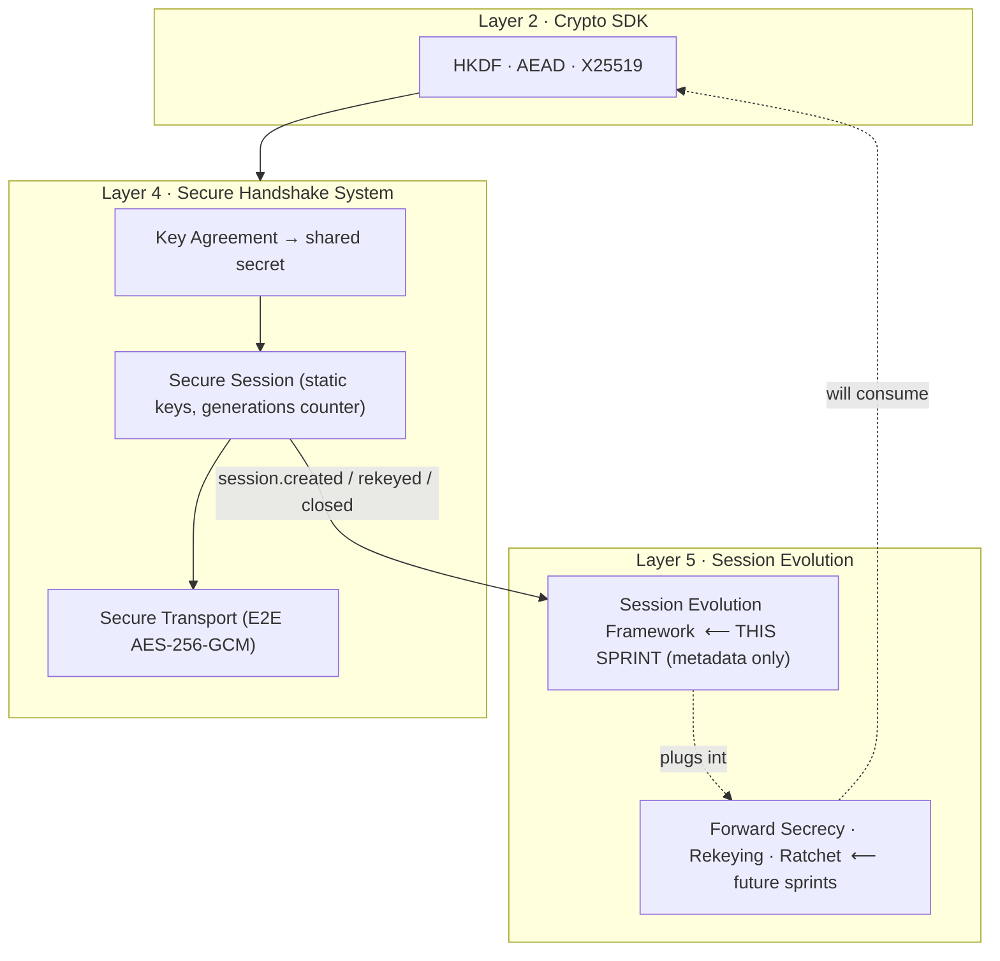
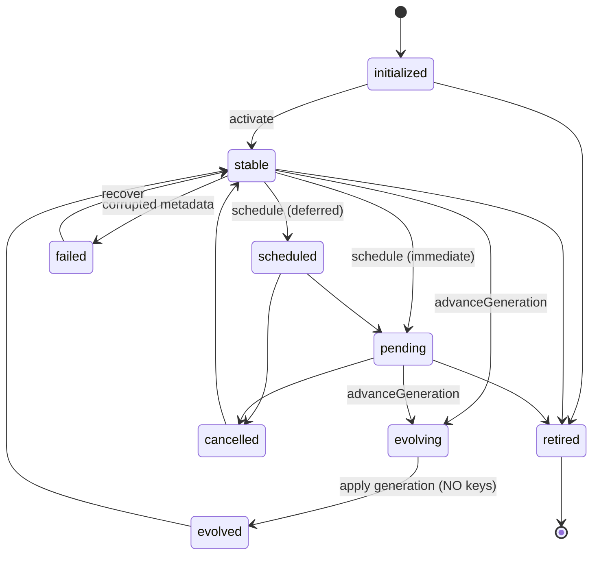
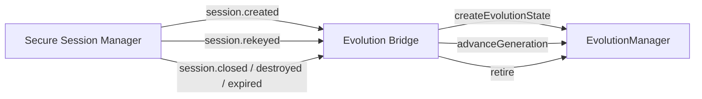

# Layer 5 · Sprint 1 — Session Evolution Framework

> **Status:** ✅ Complete · **Tests:** 491 total (67 new) · **Crypto in this sprint:** **none**

## 0. TL;DR

The **Secure Handshake System** (Layer 4) establishes a Secure Session with **static**
session keys. From this sprint on, a session is no longer a fixed thing — it can
**evolve** over time. This sprint builds the reusable *architecture* for that evolution:
**generations**, an **evolution lifecycle**, **policies** that decide *when* to evolve, a
**scheduler**, a **versioned generation timeline**, a **metadata framework**,
**validation**, **repositories**, **events**, and **application integration**.

> [!IMPORTANT]
> **No cryptography happens in Sprint 1.** Nothing derives, rotates, or ratchets a key.
> `advanceGeneration()` bumps a *counter* and records *metadata*; `schedule()` parks an
> *intent*. The framework only makes the app **aware** that sessions have generations
> and records **when** an evolution *should* occur. Future Layer 5 sprints (Forward
> Secrecy, Automatic Rekeying, Chain Keys, Message Keys, Double Ratchet, Post-Compromise
> Security) plug their key mechanics **into** this framework instead of redesigning the
> session architecture.

Everything is **additive**: a NEW `session-evolution/` module + a NEW Mongo collection
(`evolutionstates`). No existing schema, route, or auth path changed.

---

## 1. Where it sits



The framework is **transport-independent**. REST, WebSocket, WebRTC and P2P transports
all reuse the same `EvolutionManager` — an evolution record is a metadata *sidecar* keyed
by `sessionId`, never bound to a wire protocol.

---

## 2. Module layout

```
server/session-evolution/
├── index.js                      # public entry point (barrel)
├── errors.js                     # ERR_EVOLUTION_* typed hierarchy
├── types/types.js                # enums, constants, typedefs
├── state/evolutionState.js       # evolution record factory + pure helpers
├── lifecycle/lifecycle.js        # evolution state machine (FSM)
├── evolution/generations.js      # generation timeline / versioning logic
├── policies/policies.js          # WHEN-to-evolve policy descriptors + evaluators
├── schedulers/scheduler.js       # policy evaluation, trigger detection, pending registry
├── metadata/metadata.js          # metadata framework (evolution/policy/security/audit + future)
├── validators/validators.js      # generation/metadata/policy/request/repo validation
├── serialization/serializer.js   # public DTOs (whitelist; strips key-like fields)
├── events/events.js              # EvolutionEventBus (typed pub/sub)
├── repository/
│   ├── inMemoryEvolutionRepository.js   # reference + test/device backend
│   └── mongoEvolutionRepository.js      # server backend (metadata only)
├── models/EvolutionState.model.js       # Mongoose schema (NEW collection)
├── manager/evolutionManager.js          # the reusable facade
├── integration/sessionEvolutionBridge.js# app integration (session events → evolution)
└── tests/                               # 67 tests
server/controllers/sessionEvolutionController.js  # read-only awareness endpoints
server/routes/sessionEvolutionRoute.js            # /api/session-evolution
```

---

## 3. Evolution state model

Every Secure Session now has an **evolution sidecar** record:

| Field | Meaning |
|---|---|
| `evolutionId` | stable id for the evolution record |
| `sessionId` | the Secure Session it tracks (1:1) |
| `handshakeId` | lineage back to the originating handshake |
| `state` | one of the evolution lifecycle states (below) |
| `generation` | monotonic generation **counter** (starts at 0) |
| `keyVersion` | `{ current, previous, next }` — integer **pointers**, no key bytes |
| `versionHistory[]` | ordered timeline of generation advances |
| `policies[]` | attached policy descriptors (*when* to evolve) |
| `pending` | a scheduled/triggered evolution slot (or `null`) |
| `createdAt` / `updatedAt` / `lastEvolutionAt` | timestamps |
| `evolutionMetadata` / `policyMetadata` / `securityMetadata` / `audit[]` | metadata framework |
| `ratchetMetadata` / `chainMetadata` / `messageMetadata` | **future** inert placeholders |

> [!NOTE]
> **`keyVersion` holds integers, not keys.** A validator (`validateEvolutionMetadata`)
> actively rejects any record that carries `sharedSecret`, `privateKey`, `rootKey`,
> `chainKey`, `messageKey`, `keyBytes`, or a `.bytes`/`.secret`/`.key` field on any block.

---

## 4. Evolution lifecycle



- **`advanceGeneration`** walks `stable|pending|scheduled → evolving → evolved → stable`,
  bumping the counter and appending a `versionHistory` entry. It generates **no keys**.
- **`schedule`** parks intent: `stable → scheduled` (deferred) or `stable → pending`
  (immediate). **`cancelEvolution`** returns to `stable`.
- **`retire`** is terminal — the session ended; evolution tracking stops.
- **`failed`** is recoverable — a corrupted record can be repaired and `recover()`-ed.

---

## 5. Generation model & versioning

```mermaid
sequenceDiagram
  participant App
  participant M as EvolutionManager
  participant R as Repository
  App->>M: advanceGeneration(sessionId, {reason})
  M->>M: projectNextGeneration()  (gen 0 → 1; keyVersion {current:1, previous:0})
  M->>M: assertMonotonicAdvance() + assertNoDuplicateGeneration()
  M->>R: state → EVOLVING (no key work)
  M->>R: state → EVOLVED  (+ generation, keyVersion, versionHistory entry)
  M-->>App: emit GENERATION_ADVANCED
  M->>R: state → STABLE
  Note over M,R: NOT forward-secret. No key derived. Metadata timeline only.
```

- **Monotonic:** generation advances by **exactly one** — gaps and regressions throw
  `InvalidGenerationError`; a repeated generation throws `DuplicateGenerationError`.
- **`migrationSnapshot()`** returns `{ current, count, generations[] }` for clients to
  reconcile which generations they've seen.
- **`rollbackMetadata()`** *describes* the last advance (`from`/`to`) but reports
  `reversible: false` — actual key rollback is a future concern the framework won't fake.

---

## 6. Policy framework

Policies are **serializable descriptors** answering one question — *when* should a
session evolve? They never rekey.

| Factory | Type | Triggers when… |
|---|---|---|
| `createTimeBasedPolicy({intervalMs})` | `time-based` | `now − lastEvolutionAt ≥ intervalMs` |
| `createMessageCountPolicy({maxMessages})` | `message-count` | `messagesSinceLastEvolution ≥ maxMessages` |
| `createManualPolicy()` | `manual` | caller passes `{manual:true}` |
| `createSecurityEventPolicy({events})` | `security-event` | `context.securityEvent` ∈ events (empty = any) |
| `createDeviceEventPolicy({events})` | `device-event` | `context.deviceEvent` ∈ events (empty = any) |
| `createAdministratorPolicy()` | `administrator` | caller passes `{admin:true}` |
| `createCustomPolicy({evaluate})` | `custom` | your predicate returns true (fn kept in memory, never persisted) |

`evaluatePolicies(record, context)` returns `{ results, triggered, anyTriggered }`.
`manual` and `administrator` are **singletons** — attaching two conflicts
(`PolicyConflictError`).

---

## 7. Scheduler

`EvolutionScheduler` provides:

- **Evaluation** — `evaluate(record, context)` / `detectTrigger(record, context)` (pure).
- **Deferred + pending registry** — `schedule({ sessionId, dueInMs|dueAt, … })` parks a
  plan (one per session); `due(now)` reports which are ready.
- **Cancellation** — `cancel(sessionId)`.

> [!IMPORTANT]
> The scheduler **detects and parks** — it does **not execute**. A future Automatic-Rekeying
> sprint attaches an executor to `scheduler.due()`; Sprint 1 leaves that hook empty.

---

## 8. Metadata framework

Composable, independently-extensible blocks (all key-free):

- **evolutionMetadata** — `{ generation, keyVersion, evolutionCount, lastEvolutionAt }`
- **policyMetadata** — `{ count, types[], enabled, lastPolicyUpdate }`
- **securityMetadata** — `{ forwardSecrecy:false, automaticRekeying:false, ratcheting:false,
  postCompromiseSecurity:false, keyRotationPerformed:false, … }` — **honestly advertises
  that no advanced crypto is active yet**
- **audit[]** — append-only, immutable, length-capped trail
- **ratchetMetadata / chainMetadata / messageMetadata** — *future* placeholders, `reserved:true`

`recomputeMetadata(record)` keeps the derived blocks consistent after every mutation.

---

## 9. Validation

`validators/validators.js` covers every spec item: invalid generation, duplicate
generations, corrupted metadata, unknown session, retired (expired) records, policy
conflicts, invalid transitions (delegated to the lifecycle FSM), malformed evolution
requests, and malformed repositories — plus the **no-key-material invariant**.

---

## 10. Repository layer

Storage-independent contract (identical across in-memory + Mongo), keyed by `sessionId`:

```
create · findBySessionId · findById · update · delete · findByState · listAll
```

The Mongo schema (`evolutionstates`) has **no field** for a key or secret. It is a NEW,
additive collection.

---

## 11. Events

`EvolutionEventBus` emits (specific type + `"*"` wildcard):

`evolution.created` · `evolution.scheduled` · `evolution.validated` ·
`evolution.generation_advanced` · `evolution.policy_triggered` · `evolution.policy_updated`
· `evolution.cancelled` · `evolution.retired` · `evolution.failed`

Events carry PUBLIC data only. Future layers subscribe here to drive real rekeying.

---

## 12. Application integration

`attachSessionEvolution({ sessionEvents, evolutionManager })` bridges the Layer 4
`SessionEventBus` into the framework, making the chat backend **evolution-aware**:



- `session.created` → create an evolution record (generation 0).
- `session.rekeyed` → advance the generation (metadata mirror of the Layer 4 rekey).
- `session.closed/destroyed/expired` → retire the record.

The bridge is **defensive**: handler errors are caught and reported, never propagated —
it can't break the session flow. `deriveGenerationView(session, evolution)` fuses the two
DTOs into a single client-facing "this session is on generation N" view.

### HTTP surface (read-only, JWT-protected, participant-checked)

| Method | Path | Returns |
|---|---|---|
| GET | `/api/session-evolution/:sessionId` | full evolution DTO |
| GET | `/api/session-evolution/:sessionId/status` | `{ generation, state, isPending }` |
| GET | `/api/session-evolution/:sessionId/metadata` | metadata framework bundle |
| GET | `/api/session-evolution/:sessionId/history` | generation timeline snapshot |

---

## 13. Performance notes

- **Generation lookup** — repository keyed by `sessionId` (Mongo `unique` index); status
  reads avoid loading history via `toEvolutionStatus`.
- **Policy evaluation** — pure, allocation-light; short-circuits disabled policies.
- **Metadata loading** — derived blocks are recomputed only on mutation, not on read.
- **Scheduler** — O(1) pending registry keyed by session; `due()` is a single pass.
- **Audit** — length-capped (200) to bound record growth.

---

## 14. Testing

67 new tests (491 total, all green):

| Suite | Covers |
|---|---|
| `lifecycle-state.test.js` | FSM transitions, state classifiers, record factory, projection |
| `policies-scheduler.test.js` | every policy type, aggregation, scheduler evaluate/schedule/due/cancel |
| `manager.test.js` | create, policies, evaluate, schedule/cancel, advance, validate, retire, errors |
| `repository-validators-serializer.test.js` | repo contract, all validators, DTOs |
| `events-metadata.test.js` | event bus, metadata blocks, audit, recompute |
| `integration-concurrency.test.js` | session↔evolution bridge, 100-session scale, 50-cycle stress |

```bash
cd server && npm test
```

---

## 15. Future Forward-Secrecy integration (how the next sprints plug in)

This framework was designed so that later sprints add **key mechanics only**:

1. **Automatic Rekeying** — attach an executor to `EvolutionScheduler.due()` that calls
   `advanceGeneration` *and* the Layer 4 rekey. No lifecycle changes.
2. **Forward Secrecy / Ratchet** — inside `advanceGeneration`, derive the next-generation
   keys (via the Layer 2 SDK) and store them device-locally; populate `ratchetMetadata`.
   Flip `securityMetadata.forwardSecrecy` to `true`. The generation timeline already
   exists.
3. **Chain / Message Keys** — populate the reserved `chainMetadata` / `messageMetadata`
   placeholders; the DTOs and repository already carry them.

The evolution architecture — generations, lifecycle, policies, scheduler, events — stays
**unchanged**. That is the whole point of Sprint 1.
