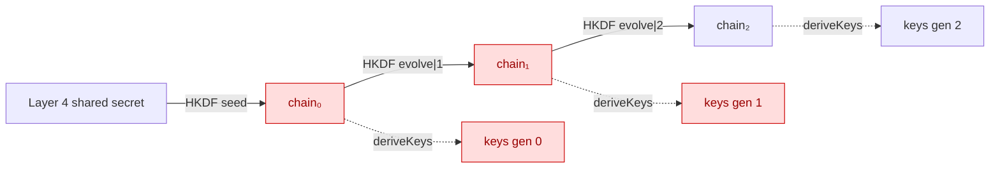
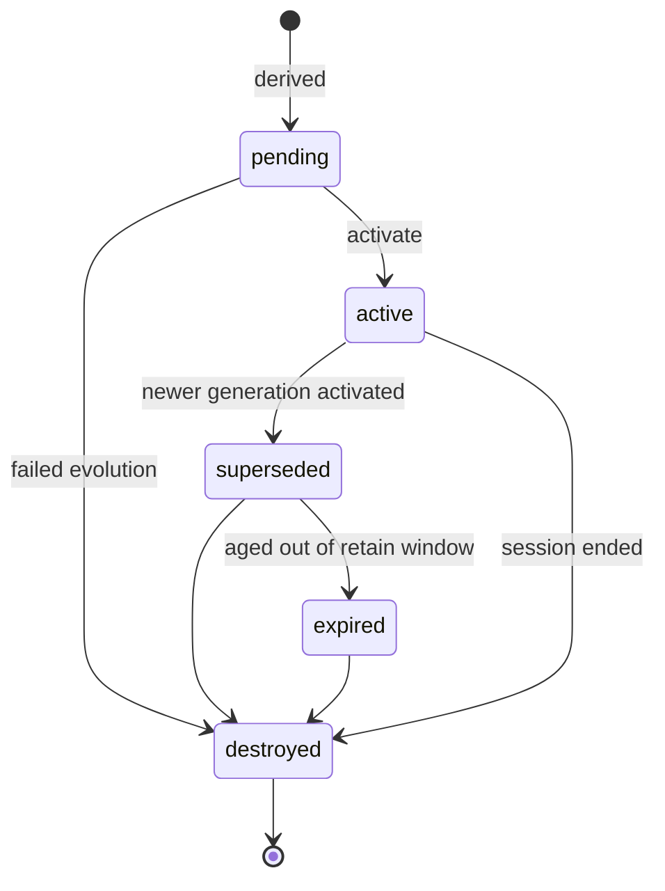

# Layer 5 · Sprint 2 — Forward Secrecy Engine

> **Status:** ✅ Complete · **Tests:** 535 total (44 new) · **Crypto in this sprint:** **yes — real key evolution + destruction**

## 0. TL;DR

Sprint 1 gave sessions *metadata-only* generations. **Sprint 2 makes them cryptographic.**
Secure sessions no longer use static keys: every evolution derives a **fresh** set of
session keys from a **one-way KDF chain**, activates them, and **securely destroys** the
obsolete secrets. Compromising the current device state can no longer decrypt **past**
traffic — that is forward secrecy.

> [!IMPORTANT]
> **What this sprint deliberately does NOT do:** no Double Ratchet, no Chain Keys, no
> per-Message Keys, no Post-Compromise Security, no P2P/WebRTC. The engine evolves
> **session generations** only. Future sprints derive chain/message keys *from* this
> evolving state.

Everything is **additive**: a NEW `forward-secrecy/` module + a NEW Mongo collection
(`forwardsecrecystates`, metadata only). It builds on — and does not redesign — the
Sprint 1 Evolution Framework, the Layer 4 session-key derivation, and the Secure Transport
layer.

---

## 1. The forward-secrecy model

The engine maintains a device-local **generation-secret chain**. Evolving from generation
`n` to `n+1`:



1. `chainₙ₊₁ = HKDF(chainₙ, "fs-chain-evolve|gen=n+1")` — a **one-way** step;
2. fresh session keys are derived from `chainₙ₊₁` (reusing the Layer 4 derivation, so they
   are byte-identical on server + browser and slot straight into Secure Transport);
3. `chainₙ` and the generation-`n` keys are **securely wiped**.

**Why it's forward-secret:** HKDF/SHA-256 is preimage-resistant, so `chainₙ` cannot be
recovered from `chainₙ₊₁`. Once `chainₙ` is destroyed, generation-`n` keys can never be
re-derived — a later compromise reveals nothing about earlier generations.

**Why the relay still sees nothing:** both peers derive an identical chain independently
from the same Layer 4 shared secret (HKDF is deterministic). **No key material is ever
transmitted.**

---

## 2. Module layout

```
server/forward-secrecy/
├── index.js                       # public entry point (barrel)
├── errors.js                      # ERR_FS_* typed hierarchy
├── types/types.js                 # enums, constants, typedefs
├── derivation/keyChain.js         # ★ the one-way generation-secret chain
├── keystore/forwardSecrecyKeyStore.js  # device-local chain + per-generation keys
├── destruction/secureDestruction.js    # zeroization + destruction records
├── lifecycle/generationLifecycle.js     # generation FSM + forward-only ordering
├── validation/validators.js       # ordering/ownership/state/replay/destroyed-ref/…
├── serialization/serializer.js    # public DTOs (metadata only)
├── audit/audit.js                 # security audit trail (no secrets)
├── events/events.js               # ForwardSecrecyEventBus
├── repository/
│   ├── inMemoryForwardSecrecyRepository.js
│   └── mongoForwardSecrecyRepository.js
├── models/ForwardSecrecyState.model.js  # Mongoose schema (NEW collection)
├── policies/policyExecutor.js     # evolution policies → real generation advancement
├── transport/transportIntegration.js   # Secure Transport wiring
├── manager/forwardSecrecyManager.js     # ★ the facade (start / evolve / destroy)
└── tests/                         # 44 tests
server/controllers/forwardSecrecyController.js   # descriptor-mode HTTP handlers
server/routes/forwardSecrecyRoute.js             # /api/forward-secrecy
```

---

## 3. Generation lifecycle



- **Rollback prevention** — `assertForwardOnly(current, next)` rejects any `next ≤ current`
  (`RollbackDetectedError`) and any gap (`GenerationOrderingError`). A generation may only
  advance by exactly one.
- **Replay resistance** — `assertNoReplay` refuses a `next` already present in history.
- A generation's keys exist only while its status is `pending` / `active` / `superseded`.

---

## 4. Evolution sequence (the core operation)

```mermaid
sequenceDiagram
  participant App
  participant M as ForwardSecrecyManager
  participant KS as Key Store (device)
  participant R as Repository (metadata)
  App->>M: evolve(sessionId, {reason, trigger})
  M->>M: validate ownership · state · ordering · replay · version consistency
  M->>KS: load chainₙ (assert not destroyed)
  M->>M: chainₙ₊₁ = evolveChain(chainₙ); keysₙ₊₁ = deriveGenerationKeys(chainₙ₊₁)
  alt derivation/activation fails
    M->>M: destroy intermediate material
    M->>R: audit EVOLUTION_FAILED
    M-->>App: throw EvolutionFailedError
  else success
    M->>KS: commitEvolution → install chainₙ₊₁+keysₙ₊₁, DESTROY chainₙ
    M->>KS: prune generations < (n+1 − retainWindow) → DESTROY their keys
    M->>R: currentGeneration=n+1, mark gen n superseded, append destructions + audit
    M->>M: emit GENERATION_ADVANCED · KEYS_DESTROYED · EVOLUTION_COMPLETED · TRANSPORT_UPDATED
    M-->>App: FS state DTO (new generation active)
  end
```

A **failed** evolution is atomic-ish: intermediate material is destroyed, the failure is
audited + evented, and the committed state stays at generation `n`.

---

## 5. Key evolution & destruction

- **Never reuse an evolved key.** Each generation's keys come from a distinct chain secret
  and a distinct HKDF `info` (generation-tagged) → distinct `keyId` per generation
  (verified in tests: 11 evolutions → 11 distinct key ids).
- **Destroy on supersession.** `commitEvolution` wipes the previous **chain secret**
  immediately (this is the forward-secrecy pivot). Derived keys of superseded generations
  are kept only within a bounded **retention window** so in-flight (late-arriving) messages
  still decrypt, then wiped.
- **`DEFAULT_RETAINED_GENERATIONS = 1`** — current + one previous generation's keys are
  held. Set `retainedGenerations: 0` for strict FS (a superseded generation cannot decrypt
  at all). The **chain secret is destroyed immediately regardless** of this window.
- **Failed-evolution material** and **session teardown** both zero-fill every secret and
  emit a `DestructionRecord` (metadata only) into the audit trail.

> [!NOTE]
> JavaScript cannot guarantee every byte copy is erased, but zero-filling the live
> `Buffer`s removes the primary copy — the strongest guarantee this runtime offers. This is
> a documented **current limitation** (see §12).

---

## 6. Validation (Step 6)

`validation/validators.js` covers every spec item: generation ordering (forward-only,
`+1`), evolution requests (malformed payloads + a *no-key-material* guard), session
ownership, session state (active-family only), version consistency (key store ↔ metadata),
destroyed-key references, and replay attempts.

---

## 7. Repositories (Step 7)

Storage-independent contract (in-memory + Mongo), keyed by `sessionId`:

```
create · findBySessionId · update · delete · findByGeneration · listAll
```

Each record stores the **current generation**, **generation history** (keyId / fingerprint
/ status / timestamps), **destruction records**, **audit**, and **security flags** — never
a chain secret or key. The Mongo collection `forwardsecrecystates` is NEW + additive.

---

## 8. Policy integration (Step 8)

`EvolutionPolicyExecutor` turns a Sprint 1 evolution *decision* into a Sprint 2 *action* —
policy execution now **advances real session generations**:

| Driver | Method | Effect |
|---|---|---|
| Manual | `executeManual` | evolve now |
| Policy | `executePolicies(sessionId, context)` | evaluate Sprint 1 policies; evolve if any fires |
| Security event | `executeSecurityEvent` | evolve immediately (e.g. suspected compromise) |
| Scheduled | `runDue(scheduler)` | evolve every session whose deferred evolution is due |

When wired with an `EvolutionManager`, each FS evolution also advances the Sprint 1
evolution generation in lockstep (best-effort; a sync failure never undoes a successful
crypto evolution).

---

## 9. Secure Transport integration (Step 9)

```
encrypt:  message ─▶ resolve CURRENT generation ─▶ load current keys ─▶ AES-256-GCM ─▶ SecurePayload
decrypt:  SecurePayload ─▶ read metadata.keyId ─▶ resolve THAT generation's keys ─▶ open
```

- `encryptWithForwardSecrecy(message, ctx, { forwardSecrecy })` seals under the **latest**
  generation — every evolution automatically shifts which keys are used, with **zero**
  transport-layer code changes.
- `decryptWithForwardSecrecy(payload, { forwardSecrecy })` resolves the generation from the
  payload's public `keyId`. If that generation's keys are already destroyed, it **fails
  closed** (`DestroyedKeyReferenceError`) — no plaintext.
- `createForwardSecrecyInterceptor(...)` is a drop-in for the Layer 4 Sprint 5 encryption
  hook (`setEncryptionInterceptor`) — makes existing session-aware messaging confidential
  **and** forward-secret without touching the pipeline.

The end-to-end forward-secrecy property is proven in `transport-integration.test.js`: two
peers exchange gen-0 traffic, both evolve, new traffic flows uninterrupted, and the old
ciphertext becomes **permanently undecryptable**.

---

## 10. Audit trail (Step 10)

Append-only, length-capped, **metadata only** — `assertNoSecretMaterial` rejects any
attempt to log a key. Actions: forward-secrecy-started, generation-created / activated /
destroyed, keys-destroyed, evolution-completed / failed, policy-triggered,
validation-failure, session-ended.

---

## 11. Events (Step 11)

`ForwardSecrecyEventBus` emits: `fs.started` · `fs.generation_created` ·
`fs.generation_advanced` · `fs.generation_activated` · `fs.keys_destroyed` ·
`fs.generation_destroyed` · `fs.evolution_completed` · `fs.evolution_failed` ·
`fs.policy_triggered` · `fs.validation_failure` · `fs.transport_updated`. Public payloads
only. Future layers (Chain Keys, Message Keys) subscribe here.

---

## 12. Two modes + HTTP surface

- **Device mode** (client / reference / tests) — has a `ForwardSecrecyKeyStore`; `start` /
  `evolve` derive + destroy real keys; `resolveEncryptionKeys` / `resolveDecryptionKeys`
  feed Secure Transport.
- **Descriptor mode** (server) — no key store; tracks the FS generation METADATA devices
  report. The server never holds a chain secret or key.

| Method | Path | Purpose |
|---|---|---|
| POST | `/api/forward-secrecy/:sessionId/start` | record a device started FS (gen 0) |
| POST | `/api/forward-secrecy/:sessionId/evolve` | record a device-performed evolution |
| GET | `/api/forward-secrecy/:sessionId` | full FS state (metadata) |
| GET | `/api/forward-secrecy/:sessionId/status` | current generation + active keyId |
| GET | `/api/forward-secrecy/:sessionId/history` | generation timeline |
| GET | `/api/forward-secrecy/:sessionId/audit` | security audit trail |

All JWT-protected + participant-checked; **no route accepts or returns key material.**

---

## 13. Performance notes

- **Generation lookup** — repository keyed by `sessionId` (unique index); the key store
  resolves current keys in O(1) and by-`keyId` in O(window).
- **Evolution** — two HKDF calls + one key-set derivation; destruction is a buffer fill.
- **Key store bounded** — the retention window caps held generations (stress test: 100
  evolutions with `retainedGenerations: 2` holds exactly 3 generations).
- **Repository access** — reads use `.lean()`; metadata blocks recomputed only on mutation.

---

## 14. Testing (Step 13)

44 new tests (535 total, all green):

| Suite | Covers |
|---|---|
| `derivation-destruction.test.js` | chain one-wayness, determinism, distinct per-gen keys, zeroization |
| `lifecycle-validation.test.js` | generation FSM, forward-only/rollback, all validators |
| `manager.test.js` | start, evolve, key destruction, rollback/replay/consistency, failure path, descriptor mode |
| `transport-integration.test.js` | encrypt-under-latest, decrypt-by-keyId, **end-to-end FS**, retention window, interceptor |
| `policies-events.test.js` | manual/policy/security/scheduled execution, lockstep evolution sync, events |
| `repository-concurrency.test.js` | repo contract, DTOs, 60-session concurrency, 100-evolution stress, restart regression |

```bash
cd server && npm test
```

---

## 15. Future Chain Key integration & current limitations

**How the next sprints build on this engine:**
- **Chain Keys / Message Keys** — derive a symmetric-key ladder *from each generation's
  chain secret* (the `chainMetadata` / `messageMetadata` placeholders from Sprint 1 are
  ready). The generation chain becomes the "root" the message chains hang off.
- **Double Ratchet / PCS** — add a DH ratchet that reseeds the generation chain with fresh
  entropy per round-trip, upgrading forward secrecy to post-compromise security. The
  `evolve` entry point and event surface stay the same.

**Current limitations (documented honestly):**
- **Coarse granularity** — forward secrecy is per *generation* (per evolution), not per
  message. Two messages in the same generation share keys. Per-message keys are a future
  sprint.
- **No post-compromise security** — the chain only moves forward from existing material; a
  full state compromise still exposes current + future generations until a DH ratchet is
  added.
- **Retention window trade-off** — `retainedGenerations > 0` keeps a small number of past
  *derived* keys for in-flight decryption, slightly widening the compromise surface for
  those generations. The chain secret is always destroyed immediately.
- **Best-effort memory wipe** — JS cannot guarantee every byte copy is erased; live buffers
  are zero-filled.
- **Coordination** — both peers must evolve in lockstep (same generation number) to share
  keys; explicit rekey negotiation is out of scope for this sprint.
