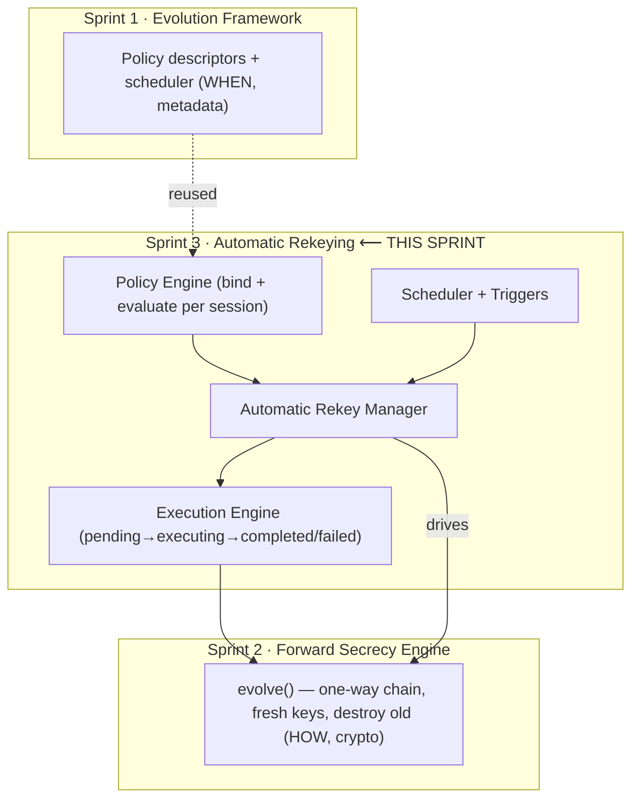
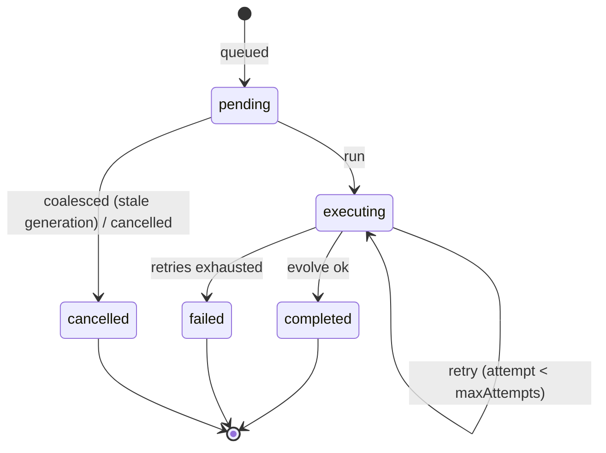

# Layer 5 · Sprint 3 — Automatic Rekeying & Evolution Policies

> **Status:** ✅ Complete · **Tests:** 569 total (34 new) · **Role:** orchestration (no new crypto)

## 0. TL;DR

Sprint 2 made session evolution *cryptographic* but *manual*. **Sprint 3 makes it
automatic.** Secure sessions now rekey themselves according to configurable policies —
time, message count, session age, device/security events — with **no developer or user
intervention**. The application just sends messages; generations advance underneath it.

> [!IMPORTANT]
> This sprint is an **orchestration layer** — it adds **no new cryptography**. It decides
> *when* to evolve and manages the *execution*; the actual key derivation + destruction is
> still the Sprint 2 {@link module:forward-secrecy} engine, which it drives. It reuses the
> Sprint 1 policy descriptors verbatim (adding only `session-age`). **No redesign** of
> earlier layers.
>
> **Out of scope (later sprints):** Chain Keys, Message Keys, Double Ratchet,
> Post-Compromise Security.

Everything is **additive**: a NEW `evolution-policy/` module + a NEW Mongo collection
(`rekeypolicystates`, metadata only).

---

## 1. Where it sits



---

## 2. Module layout

```
server/evolution-policy/
├── index.js                       # public entry point (barrel)
├── errors.js                      # ERR_REKEY_* typed hierarchy
├── types/types.js                 # enums, constants, typedefs
├── policies/policyFactory.js      # reuse Sprint 1 factories + session-age
├── evaluator/policyEvaluator.js   # deterministic evaluation
├── triggers/triggers.js           # message counter + evaluation-context builder
├── scheduler/rekeyScheduler.js    # autonomous time-driven scheduling
├── execution/executionEngine.js   # ★ the rekey state machine (serialized, deduped, retrying)
├── validators/validators.js       # duplicate/conflict/generation/schedule/expiry/replay
├── serialization/serializer.js    # public DTOs (metadata only)
├── metadata/metadata.js           # policy + execution + security metadata
├── audit/audit.js                 # audit trail (no secrets)
├── events/events.js               # RekeyEventBus
├── repository/
│   ├── inMemoryPolicyRepository.js
│   └── mongoPolicyRepository.js
├── models/RekeyPolicyState.model.js   # Mongoose schema (NEW collection)
├── manager/automaticRekeyManager.js   # ★ the facade
├── transport/transportIntegration.js  # transparent auto-rekey on encrypt
└── tests/                         # 34 tests
server/controllers/automaticRekeyController.js  # descriptor-mode HTTP handlers
server/routes/automaticRekeyRoute.js            # /api/auto-rekey
```

---

## 3. Policy types (Step 3)

All are serializable descriptors `{ id, type, params, enabled }`. The shared kinds are
**reused from Sprint 1**; `session-age` is new.

| Factory | Fires when… |
|---|---|
| `createManualPolicy()` | an explicit request is made |
| `createTimeBasedPolicy({intervalMs})` | `intervalMs` elapses since the last rekey |
| `createMessageCountPolicy({maxMessages})` | `maxMessages` messages sent since the last rekey |
| `createSecurityEventPolicy({events})` | a matching security signal arrives |
| `createDeviceEventPolicy({events})` | a device change arrives (add/remove/reconnect) |
| `createSessionAgePolicy({maxAgeMs})` | the session is older than `maxAgeMs` **(new)** |
| `createCustomPolicy({evaluate})` | a caller predicate returns true |
| `createAdministratorPolicy()` | an administrator directive (future) |

`manual`, `administrator`, and `session-age` are **singletons** (attaching two conflicts).

---

## 4. Deterministic evaluation (Step 5)

`evaluatePolicies(policies, subject, context)` is a **pure function** — the same subject
(`createdAt`, `lastRekeyAt`) + context (`now`, `messagesSinceLastEvolution`, `sessionAgeMs`,
`securityEvent`, `deviceEvent`, …) always yields the same result. This makes automatic
rekeying reproducible and testable. Shared kinds delegate to the Sprint 1 evaluator;
`session-age` is handled locally.

---

## 5. Execution lifecycle (Step 6)



The `RekeyExecutionEngine` guarantees three safety properties:

- **Serialized per session** — a promise-chain mutex ensures at most one execution runs for
  a session at a time (**conflict resolution / no concurrent evolution**).
- **Generation-based deduplication** — each execution carries the generation observed when
  its trigger fired; if the session already advanced past it, the execution is **coalesced**
  to `cancelled` instead of re-running. A burst of identical triggers ⇒ exactly one rekey.
- **Bounded retry** — a failing `evolve` retries up to `maxAttempts` before `failed`.

---

## 6. Automatic rekey sequence

```mermaid
sequenceDiagram
  participant App
  participant RM as AutomaticRekeyManager
  participant EX as ExecutionEngine
  participant FS as ForwardSecrecy (Sprint 2)
  App->>RM: recordMessage(sessionId)   %% or tick / onSecurityEvent
  RM->>RM: evaluate policies (deterministic)
  alt a policy fires AND cooldown permits
    RM->>EX: submit({expectedGeneration})
    EX->>FS: currentGeneration()   %% dedup check
    alt already advanced (duplicate/concurrent)
      EX-->>RM: coalesced (cancelled)
    else
      EX->>FS: evolve()  %% fresh keys, old destroyed
      FS-->>EX: new generation
      EX-->>RM: completed
      RM->>RM: update generation · reset counter · reschedule · emit GenerationUpdated/TransportUpdated
    end
  else cooldown active / nothing fired
    RM-->>App: (no rekey; app is oblivious either way)
  end
```

---

## 7. Secure Transport integration (Step 7)

```
message ─▶ record activity (may auto-rekey) ─▶ resolve ACTIVE generation ─▶ validate ─▶ use latest keys ─▶ encrypt
```

`encryptWithAutoRekey(message, ctx, { rekeyManager })` records the send (which may trigger a
policy-driven rekey) and then seals under whatever generation is active afterwards.
**Applications never learn a rekey happened.** Decryption is unchanged from Sprint 2 (the
receiver resolves the sealing generation from the payload's `keyId`), so a message sent just
before a rekey still opens within the retention window. `createAutoRekeyInterceptor(...)` is
a drop-in for the Layer 4 Sprint 5 encryption hook.

---

## 8. Abuse / DoS guards (Step 12)

- **Cooldown** — automatic rekeys are rate-limited to one per `cooldownMs` (default 5s;
  configurable). **Manual + security-event triggers bypass** it so a real incident always
  rotates immediately.
- **Duplicate prevention** — an active (`pending`/`executing`) execution blocks a second;
  generation-based dedup coalesces stale/concurrent triggers.
- **Replay / rollback** — inherited from the Sprint 2 engine (forward-only generations).
- **Deterministic evaluation** — no time-of-check/time-of-use ambiguity; the execution
  engine re-reads the generation *inside* the lock before committing.

---

## 9. Repositories (Step 8)

Storage-independent contract (in-memory + Mongo), keyed by `sessionId`:

```
create · findBySessionId · update · delete · findEnabled · listAll
```

Each record stores **policy config**, **execution history**, **rekey history**, the
**pending operation**, and **audit** — never a key. The Mongo collection
`rekeypolicystates` is NEW + additive.

---

## 10. Events (Step 10)

`RekeyEventBus` emits: `rekey.policy_configured` · `rekey.policy_evaluated` ·
`rekey.policy_triggered` · `rekey.queued` · `rekey.started` · `rekey.completed` ·
`rekey.retry` · `rekey.failed` · `rekey.cancelled` · `rekey.generation_updated` ·
`rekey.transport_updated`. Public payloads only. Future layers subscribe here.

---

## 11. Two modes + HTTP surface

- **Device mode** — wired to a device-mode forward-secrecy manager; `recordMessage` /
  `tick` / `onSecurityEvent` actually evolve keys.
- **Descriptor mode** (server) — wired to the descriptor FS manager; stores policy config +
  rekey history METADATA. The server never holds keys.

| Method | Path | Purpose |
|---|---|---|
| POST | `/api/auto-rekey/:sessionId/configure` | configure policies |
| GET | `/api/auto-rekey/:sessionId` | full policy-state (metadata) |
| GET | `/api/auto-rekey/:sessionId/status` | compact status |
| GET | `/api/auto-rekey/:sessionId/history` | rekey (generation-advance) history |
| GET | `/api/auto-rekey/:sessionId/executions` | execution history |
| GET | `/api/auto-rekey/:sessionId/audit` | audit trail |

All JWT-protected + participant-checked; **no route accepts or returns key material.**

---

## 12. Performance notes (Step 11)

- **Policy evaluation** — pure, allocation-light, short-circuits disabled policies.
- **Scheduling** — the scheduler is an O(due) scan keyed by session; message-count/event
  triggers are reactive (no polling).
- **Repository** — keyed by `sessionId` (unique index); reads `.lean()`; metadata recomputed
  only on mutation.
- **Execution latency** — a rekey is two HKDF calls in the FS engine; the manager adds only
  metadata bookkeeping.
- **Concurrent sessions** — each session has an independent execution lock; the stress test
  runs 40 sessions rekeying in parallel.

---

## 13. Testing (Step 13)

34 new tests (569 total, all green):

| Suite | Covers |
|---|---|
| `manager.test.js` | configure, manual/message-count/time/session-age/security rekey, cooldown |
| `execution-engine.test.js` | pending→completed, coalesce/dedup, retry, fail, per-session serialization |
| `evaluator-scheduler-validators.test.js` | deterministic evaluation, message counter, scheduler, all validators |
| `transport-concurrency.test.js` | transparent auto-rekey on encrypt, concurrent bursts, repo/serializer, 40-session stress, regression |

```bash
cd server && npm test
```

---

## 14. Future Chain Key integration & current limitations

**How the next sprints build on this:**
- **Chain Keys / Message Keys** derive a per-message key ladder *from each automatically-
  evolving generation*. Automatic rekeying already advances the generation on a policy
  cadence; the message ladder simply hangs off whatever generation is active. The
  `GENERATION_UPDATED` / `TRANSPORT_UPDATED` events are the integration seam.
- **Double Ratchet / PCS** — a DH ratchet can be scheduled by the same policy engine
  (e.g. a `device-event` policy triggering a DH round-trip). No manager changes needed.

**Current limitations (honest):**
- **Coordination** — automatic rekeying advances the *local* generation; both peers must
  run compatible policies (or exchange a rekey signal) to stay on the same generation. A
  rekey negotiation/handshake is out of scope for this sprint.
- **Generation-level granularity** — rekeys are per policy-interval, not per message
  (per-message keys are a future sprint).
- **Scheduler is in-process** — `tick(now)` must be driven by a caller (a timer/cron); the
  engine does not spawn its own wall-clock timer, to keep it deterministic + testable.
- **Cooldown is best-effort rate-limiting** — it bounds automatic rekeys but a flood of
  manual/security triggers still rotates each time (by design).
