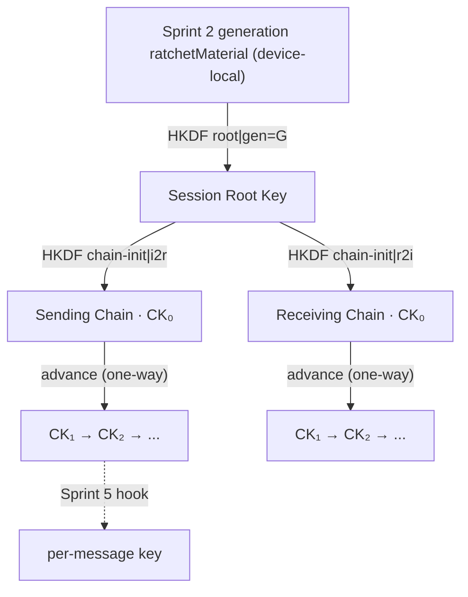
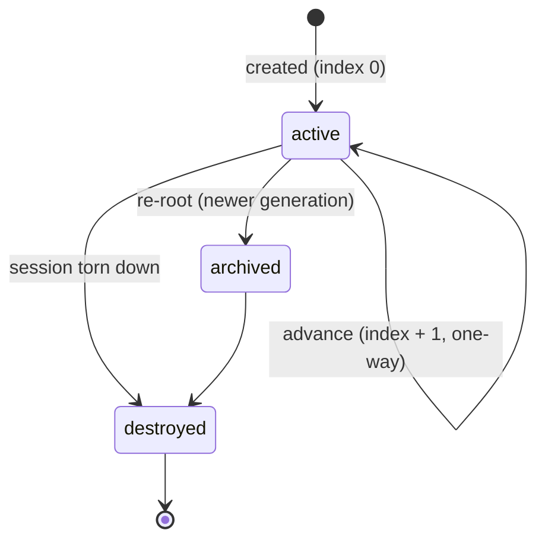
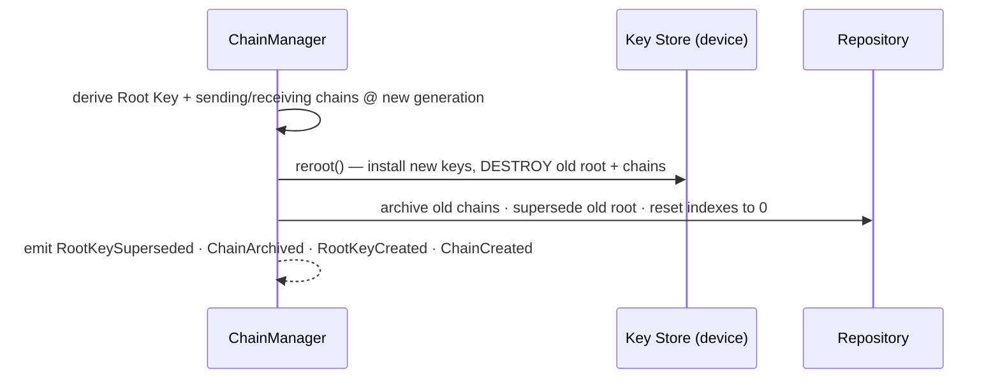

# Layer 5 · Sprint 4 — Key Hierarchy & Chain Management

> **Status:** ✅ Complete · **Tests:** 602 total (33 new) · **Crypto:** real (root key + chain-key ratchets)

## 0. TL;DR

Until now a session had a **flat** set of keys (one encryption + MAC key per generation).
Sprint 4 replaces that with a **structured cryptographic key hierarchy** inspired by modern
secure-messaging protocols:

```
Session Root Key
  ├── Sending Chain   (one-way chain-key ratchet)
  └── Receiving Chain (one-way chain-key ratchet)
```

This is the scaffolding **per-message keys (Sprint 5)** will hang off — each chain *index*
is a future message-key slot.

> [!IMPORTANT]
> **What this sprint does NOT do:** derive per-message keys, implement a Double Ratchet, or
> add Post-Compromise Security. Advancing a chain ratchets its chain key forward and moves
> the index — it derives **no message key**. The message-key derivation is exposed as an
> **extension point** only.

Everything is **additive**: a NEW `key-hierarchy/` module + a NEW Mongo collection
(`keyhierarchystates`, metadata only). It builds on — and does not redesign — the Sprint 2
forward-secrecy engine (whose reserved `ratchetMaterial` seeds the hierarchy).

---

## 1. The hierarchy



- **Root Key** — derived from the current generation's `ratchetMaterial`, so it inherits
  forward secrecy: each rekey **re-roots** the hierarchy and archives the old chains.
- **Chains** — a *sending* and a *receiving* chain, each a one-way HKDF chain-key ratchet:
  `CKₙ₊₁ = HKDF(CKₙ, "chain-advance|index")`. The two evolve **independently**.
- **Peer symmetry** — chains are keyed by canonical direction (`i2r` / `r2i`), so a device's
  *sending* chain equals the peer's *receiving* chain (interop groundwork for Sprint 5).

@security One-wayness at the chain level means a leaked later chain key cannot recover an
earlier one — the forward secrecy the per-message keys of Sprint 5 will inherit. Both peers
derive an identical hierarchy from the same `ratchetMaterial`, so **no key is transmitted**.

---

## 2. Module layout

```
server/key-hierarchy/
├── index.js                       # public entry point (barrel)
├── errors.js                      # ERR_KH_* typed hierarchy
├── types/types.js                 # enums, constants, typedefs
├── derivation/derivation.js       # ★ root / chain-init / chain-advance HKDF + fingerprints
├── root/rootKey.js                # root-key metadata model + lifecycle
├── chains/chain.js                # chain metadata model + advance/archive helpers
├── keystore/keyHierarchyKeyStore.js  # device-local root + chain key store
├── metadata/metadata.js           # hierarchy + security metadata
├── validators/validators.js       # root/chain/generation/rollback/corruption guards
├── serialization/serializer.js    # public DTOs (metadata only)
├── audit/audit.js                 # audit trail (no secrets)
├── events/events.js               # KeyHierarchyEventBus
├── repository/
│   ├── inMemoryKeyHierarchyRepository.js
│   └── mongoKeyHierarchyRepository.js
├── models/KeyHierarchyState.model.js  # Mongoose schema (NEW collection)
├── manager/chainManager.js        # ★ the facade
├── transport/transportIntegration.js  # resolution path + message-key extension point
└── tests/                         # 33 tests
server/controllers/keyHierarchyController.js  # descriptor-mode HTTP handlers
server/routes/keyHierarchyRoute.js            # /api/key-hierarchy
```

---

## 3. Root Key (Step 3)

The **Session Root Key** represents the session's root secret for a generation and
generates the child chains. Its raw bytes live ONLY in the device key store; the record
carries PUBLIC metadata: `rootKeyId`, `fingerprint`, `generation`, `version`, `status`
(`active` → `superseded` → `destroyed`). It is superseded (never mutated) on a re-root.

---

## 4. Chains (Step 4)

Each chain has: current chain state (device-local key), `generation`, `index`, `version`,
metadata, and `history[]`. Sending and receiving chains have **independent lifecycles** —
advancing one never touches the other (verified in tests).



---

## 5. Chain Manager (Steps 5–6)

`ChainManager` is the reusable facade:

| Method | Effect |
|---|---|
| `establish({sessionId, role, rootSecret})` | derive root + both chains (generation 0) |
| `advanceSendingChain(sessionId)` | ratchet the sending chain forward (no message key) |
| `advanceReceivingChain(sessionId)` | ratchet the receiving chain forward (independent) |
| `reroot(sessionId, {rootSecret, generation})` | archive chains, supersede root, derive fresh hierarchy |
| `validate(sessionId)` | metadata integrity + store/metadata index consistency |
| `resolveSendingChainKey / resolveReceivingChainKey` | device-local chain key (Sprint 5 hook input) |
| `destroy(sessionId)` | wipe all key material, mark destroyed |

**Rollback prevention** — a chain index may only advance by exactly one (`assertChainForward`
/ `advanceChainMeta`); the key store ratchets forward-only and disposes the previous key.

**Re-root sequence** (called when Sprint 2/3 rekeys the session):



---

## 6. Two modes

- **Device mode** — has a `KeyHierarchyKeyStore`; establishes/advances/re-roots real key
  material; resolves chain keys for the future per-message deriver.
- **Descriptor mode** (server) — no key store; tracks the hierarchy METADATA a device
  reported; read-only.

---

## 7. Secure Transport integration (Step 8)

The encryption key-resolution PATH is now formalised — **with a message-key extension point,
but no per-message keys yet**:

```
Session ─▶ Root Key ─▶ Current Sending Chain ─▶ [Future Message Key Hook] ─▶ Encryption
```

`encryptWithHierarchy(message, ctx, { chainManager, forwardSecrecy, messageKeyHook? })`:
- **without** a `messageKeyHook` (Sprint 4 default) → resolves the path, then seals with the
  Sprint 2 forward-secrecy session keys (behaviour unchanged, additive);
- **with** a hook (Sprint 5) → derives a per-message key from the current sending-chain key
  and seals with it. The test wires a stand-in hook to prove the seam produces a payload
  under a per-message key with **zero transport-layer changes**.

---

## 8. Validation (Step 9)

`validators/validators.js` covers every spec item: invalid root keys, chain mismatch
(direction/role/generation), generation mismatch, corrupted metadata, missing chain,
duplicate chain, chain rollback, and malformed chain state — plus the **no-key-material
invariant** (a record may never carry root/chain key bytes).

---

## 9. Events (Step 10)

`KeyHierarchyEventBus` emits: `hierarchy.root_key_created` · `hierarchy.root_key_superseded`
· `hierarchy.chain_created` · `hierarchy.chain_advanced` · `hierarchy.chain_archived` ·
`hierarchy.chain_validated` · `hierarchy.chain_loaded` · `hierarchy.destroyed`, plus the
**future** `hierarchy.message_key_generated` · `hierarchy.ratchet_advanced` (declared so
Sprint 5 consumers can subscribe ahead of time). Public payloads only.

---

## 10. Repositories (Step 7) + HTTP surface

Storage-independent contract (in-memory + Mongo), keyed by `sessionId`:
`create · findBySessionId · update · delete · findByGeneration · listAll`. Each record
stores root-key + chain metadata, chain history, versions, archived chains, and audit —
never a key. The Mongo collection `keyhierarchystates` is NEW + additive.

| Method | Path | Purpose |
|---|---|---|
| GET | `/api/key-hierarchy/:sessionId` | full hierarchy (metadata) |
| GET | `/api/key-hierarchy/:sessionId/status` | generation + chain indexes |
| GET | `/api/key-hierarchy/:sessionId/chains` | sending + receiving chain metadata |
| GET | `/api/key-hierarchy/:sessionId/root` | root-key metadata |
| GET | `/api/key-hierarchy/:sessionId/audit` | audit trail |

All JWT-protected + participant-checked; **no route accepts or returns key material.**

---

## 11. Security & performance (Steps 11–12)

- **Memory cleanup** — advancing disposes the previous chain key; re-rooting disposes the
  old root + both chains; destroy zero-fills everything.
- **Serialization** — DTOs whitelist metadata; a `containsKeyMaterial` guard rejects any
  record carrying key bytes.
- **Lookup** — repository keyed by `sessionId` (unique index); the store resolves the
  root/chain keys in O(1); metadata recomputed only on mutation.
- **Chain advancement** — one HKDF call + a buffer dispose; history is length-capped.

---

## 12. Testing (Step 13)

33 new tests (602 total, all green):

| Suite | Covers |
|---|---|
| `derivation.test.js` | root/chain derivation, one-wayness, independence, peer symmetry, message-key label |
| `manager.test.js` | establish, chain create/advance/independence, re-root, validate, destroy |
| `repository-validation-events.test.js` | repo contract, pure helpers, all validators, DTOs, events |
| `transport-concurrency.test.js` | resolution path, message-key hook, 50-session concurrency, multi-device, 100-advance stress, regression |

```bash
cd server && npm test
```

---

## 13. Future Message Key integration & current limitations

**How Sprint 5 builds on this:**
- Wire a `messageKeyHook` into `createHierarchyTransport` that derives `MKᵢ =
  HKDF(chainKeyᵢ, messageKeyLabel(i))` (the exact label is already exported from the
  derivation module), advance the sending chain per message, and resolve the receiving
  chain by index on the other side. The hierarchy, events, and transport seam are already
  in place — Sprint 5 adds the hook + a skipped-message-key cache.

**Current limitations (honest):**
- **No per-message keys yet** — advancing a chain moves the index but derives no key;
  encryption still uses the Sprint 2 session keys until the hook is wired.
- **No Double Ratchet / PCS** — the hierarchy re-roots on rekey (forward secrecy) but there
  is no DH ratchet, so a full state compromise still exposes the current + future chains
  until PCS is added.
- **Chain advancement is not yet coordinated with sends** — Sprint 4 exposes manual
  `advanceSendingChain`; Sprint 5 ties one advance to one message.
- **Interop requires matching roles** — the `i2r`/`r2i` symmetry gives matching chains only
  when peers agree on initiator/responder (as they do from the handshake).
