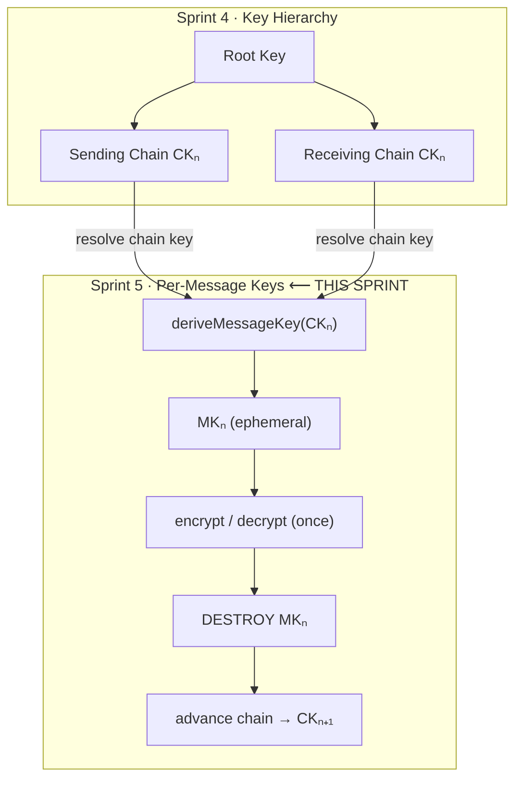
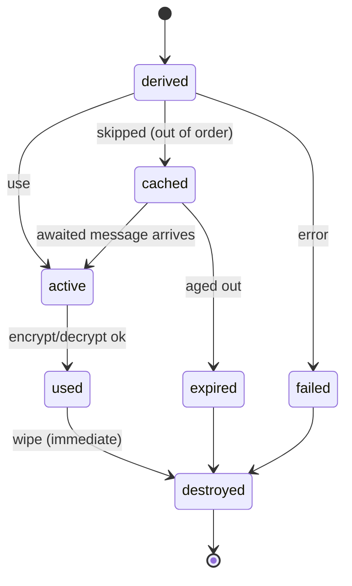
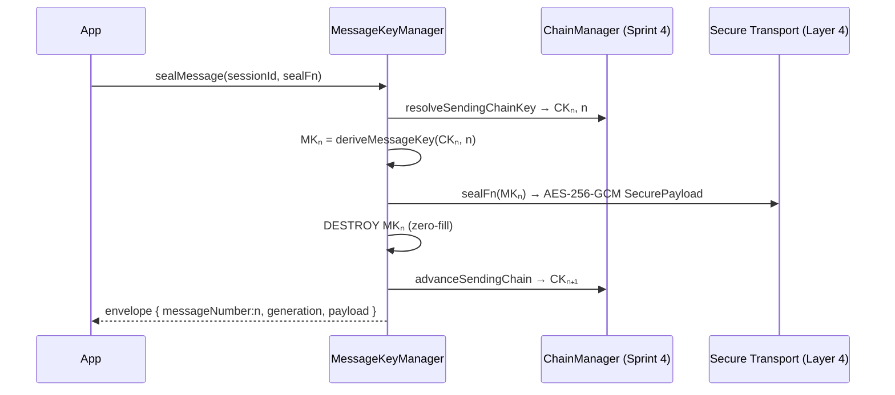

# Layer 5 · Sprint 5 — Per-Message Key Derivation

> **Status:** ✅ Complete · **Tests:** 625 total (23 new) · **Crypto:** real (ephemeral per-message keys)

## 0. TL;DR

Every encrypted message now uses **its own unique cryptographic key**, deterministically
derived from the active sending/receiving chain (Sprint 4 key hierarchy) and **securely
destroyed immediately after a single use**. Compromising one message key exposes exactly one
message — no others.

```
MKₙ = HKDF(CKₙ, "msg|dir|gen|n")     // one key per (direction, generation, message number)
```

> [!IMPORTANT]
> **What this sprint does NOT do:** Double Ratchet, Post-Compromise Security. Per-message keys
> derive from the **existing** chains — no DH ratchet is added. The message key and the next
> chain key are **independent** HKDF outputs of the same `CKₙ`, so a leaked message key reveals
> nothing about the chain or other messages.

Everything is **additive**: a NEW `message-keys/` module + a NEW Mongo collection
(`messagekeystates`, **metadata only — never a raw key**).

---

## 1. Where it sits



---

## 2. Module layout

```
server/message-keys/
├── index.js                       # public entry point (barrel)
├── errors.js                      # ERR_MK_* typed hierarchy
├── types/types.js                 # enums, constants, typedefs
├── derivation/derivation.js       # ★ per-message HKDF (enc + mac from a chain key)
├── lifecycle/lifecycle.js         # message-key state machine
├── destruction/destruction.js     # zeroization + destruction records
├── cache/messageKeyCache.js       # bounded skipped-key cache (out-of-order delivery)
├── metadata/metadata.js           # message + generation + security metadata
├── validators/validators.js       # duplicate/chain/generation/replay/destroyed-reuse
├── serialization/serializer.js    # public DTOs (metadata only)
├── audit/audit.js                 # audit trail (no secrets)
├── events/events.js               # MessageKeyEventBus
├── repository/
│   ├── inMemoryMessageKeyRepository.js
│   └── mongoMessageKeyRepository.js
├── models/MessageKeyState.model.js    # Mongoose schema (metadata only)
├── manager/messageKeyManager.js   # ★ the facade (sealMessage / openMessage)
├── transport/transportIntegration.js  # full encrypt/decrypt pipeline
└── tests/                         # 23 tests
server/controllers/messageKeyController.js  # descriptor-mode HTTP handlers
server/routes/messageKeyRoute.js            # /api/message-keys
```

---

## 3. Message key lifecycle (Step 5)



A message key is **used exactly once** then **destroyed immediately** — on success, on
failure, and on cache eviction/expiry. The same key is never reused.

---

## 4. Derivation (Step 4)

`deriveMessageKey(chainKey, { direction, generation, messageNumber, context })` returns an
ephemeral bundle `{ encryptionKey, macKey, keyId, keyFingerprint }`:

- `encryptionKey = HKDF(CKₙ, salt, "msg-enc|dir|gen|n")`, `macKey = HKDF(CKₙ, …"msg-mac…")`.
- **Context separation** — the label binds `direction`, `generation`, and `messageNumber`; the
  salt binds `sessionId` + `handshakeId`. Any change → a different key.
- **Uniqueness** — distinct `messageNumber` ⇒ distinct key + `keyId` (verified: 100 messages →
  100 distinct keys).
- **Peer agreement** — `direction` is the **canonical chain direction** (`i2r`/`r2i`), not a
  device-relative send/recv label, so the sender's `MKₙ` (from its sending chain) equals the
  receiver's `MKₙ` (from its receiving chain, which is the same chain). **No key is transmitted.**

---

## 5. Chain integration + Transport pipeline (Steps 6–7)



The receiver runs the inverse: resolve receiving chain → derive `MKₙ` → decrypt → destroy →
advance. The message key lives **only inside** `sealMessage`/`openMessage` and is wiped before
they return (even on error).

### Envelope
Because the receiver must know which index produced a message before it can derive the key,
encryption wraps the Layer 4 `SecurePayload` in `{ v, messageNumber, generation, payload }`.
These are PUBLIC; if tampered, the receiver derives the wrong key and decryption **fails
closed** (the AEAD tag / HMAC rejects it).

### Out-of-order delivery
The receiver keeps a bounded **skipped-key cache**: to open message `m` when the chain is at
`r < m`, it derives + caches `MKᵣ … MKₘ₋₁`, then uses `MKₘ`. Late messages are served from the
cache (then destroyed). Cache is bounded by size + TTL (DoS guard), and a `maxSkip` refuses an
absurd gap.

---

## 6. Repositories (Step 8)

Storage-independent contract (in-memory + Mongo), keyed by `sessionId`:
`create · findBySessionId · update · delete · listAll`. Each record stores per-session
counters, generation, a **capped message log** (numbers / key ids / fingerprints / delivery),
and audit — **never a raw message key**. The Mongo collection `messagekeystates` is NEW +
additive.

---

## 7. Validation (Step 9)

Covers every spec item: duplicate message numbers (sending numbers strictly advance), chain
mismatch, missing chain, generation mismatch, invalid derivation, **destroyed-key reuse**
(a replayed past message with no cached key), malformed metadata, and replay metadata (the
envelope validator).

---

## 8. Events (Step 11)

`MessageKeyEventBus` emits: `mk.derived` · `mk.message_encrypted` · `mk.message_decrypted` ·
`mk.destroyed` · `mk.cached` · `mk.expired` · `mk.chain_advanced` · `mk.derivation_failed` ·
`mk.validation_failed`. Public payloads only.

---

## 9. Security review (Step 10) + HTTP surface

- **Ephemeral keys** — derived, used once, zero-filled immediately; never persisted/logged.
- **Replay** — a replayed already-consumed message has no cached key ⇒ `DestroyedKeyReuseError`.
- **Tamper** — a modified ciphertext/number yields a wrong key ⇒ fails closed.
- **DoS** — cache is size + TTL bounded; `maxSkip` caps skip-derivation work.
- **No secret material** in repositories, DTOs, events, or audit (guards enforce this).

Server runs **descriptor mode** — it records per-message METADATA a device reports; it never
holds a key.

| Method | Path | Purpose |
|---|---|---|
| POST | `/api/message-keys/:sessionId/report` | record a device-produced message's metadata |
| GET | `/api/message-keys/:sessionId` | full message-key state (metadata) |
| GET | `/api/message-keys/:sessionId/status` | counts + last numbers |
| GET | `/api/message-keys/:sessionId/messages` | recent message metadata |

All JWT-protected + participant-checked; **no route accepts or returns key material.**

---

## 10. Performance (Step 12)

- **Derivation** — two HKDF calls per message; the message key + next chain key are separate
  cheap HKDF outputs.
- **Serialization** — `sealMessage`/`openMessage` are serialized **per session + direction** by
  a promise-chain mutex, so concurrent sends never collide on a message number (verified: 10
  concurrent sends → contiguous `0..9`, 10 distinct keys).
- **Memory** — keys are transient buffers wiped immediately; the cache is bounded.

---

## 11. Testing (Step 13)

23 new tests (625 total, all green):

| Suite | Covers |
|---|---|
| `derivation-lifecycle.test.js` | unique/deterministic derivation, context separation, destruction, lifecycle FSM, cache |
| `messaging-e2e.test.js` | unique keys, bidirectional, lifecycle events, **out-of-order**, **replay reject**, tamper, max-skip |
| `repository-concurrency.test.js` | repo contract, validators, DTOs, concurrent sends, 100-message stress, multi-session, regression |

```bash
cd server && npm test
```

---

## 12. Future Post-Compromise Security integration & current limitations

**How Sprint 6 / future PCS builds on this:**
- The per-message key derivation, ephemeral lifecycle, and chain integration are exactly the
  symmetric-ratchet half of a Double Ratchet. Adding **Post-Compromise Security** means adding a
  **DH ratchet** that reseeds the Sprint 4 root key with fresh entropy per round-trip — the
  message-key layer above it stays unchanged. Sprint 6 hardens replay protection, validates
  destruction, and prepares this seam.

**Current limitations (honest):**
- **No PCS** — a full state compromise still exposes current + future messages until the DH
  ratchet is added; forward secrecy (past messages) is already provided.
- **Ordering coordination** — sender and receiver must agree on message numbers (they do: the
  sender stamps the envelope, the receiver follows). A malicious peer sending a huge number is
  bounded by `maxSkip`.
- **Skipped-key retention** — cached skipped keys widen the compromise window for those specific
  out-of-order messages until they arrive or expire (bounded by size + TTL).
- **Best-effort memory wipe** — JS cannot guarantee every byte copy is erased; live buffers are
  zero-filled immediately after use.
