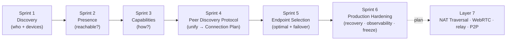
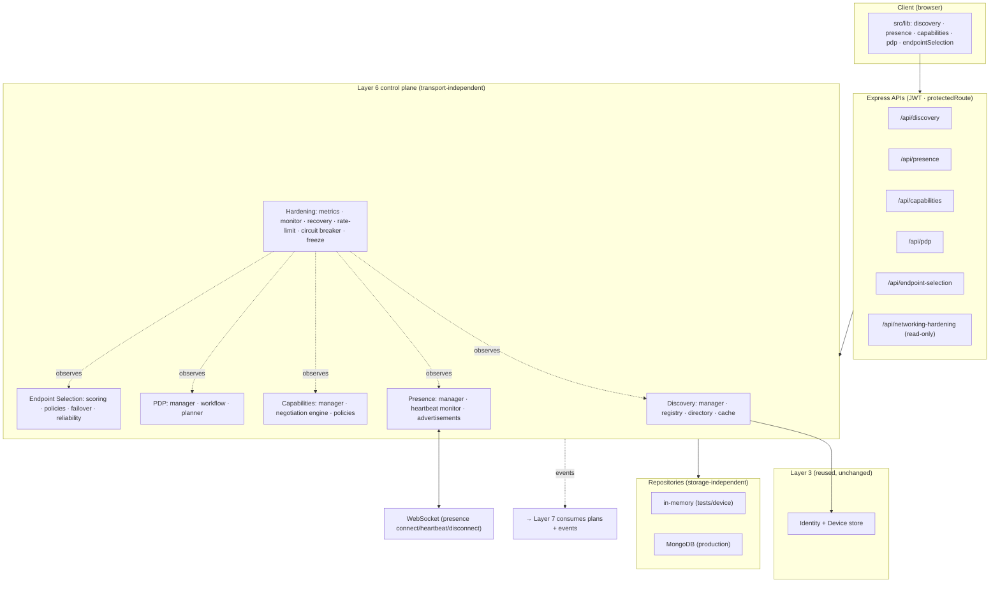
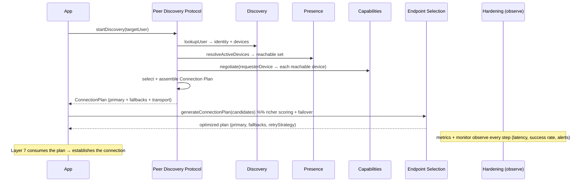
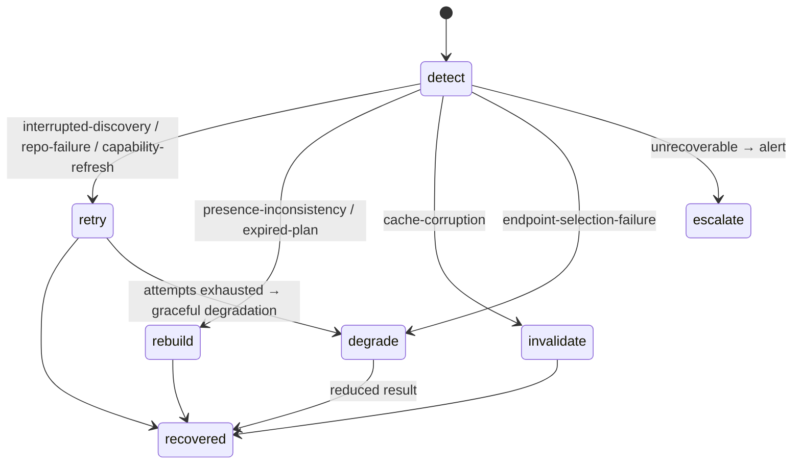
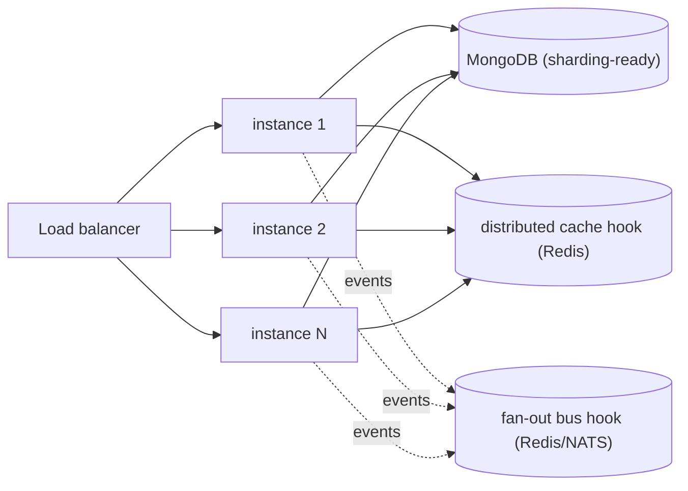

# Layer 6 — Networking Control Plane · FINAL

> **Status:** ✅ LAYER 6 COMPLETE (6 sprints) · **Tests:** 1031 total (1031 pass / 0 fail) · **Crypto:** none (control plane only) · **Frozen:** control-plane v1.0

## 0. What Layer 6 is

Layers 1–5 made messaging **secure** (identity, handshake, sessions, forward secrecy, per-message
keys). Layer 6 makes peers **findable + connectable-in-principle** — it is the transport-independent
**networking control plane** that answers, end to end:

> *Who is my peer, which of their devices are reachable, how can we communicate, and which
> endpoint(s) should we use — expressed as a validated, failover-ready Connection Plan?*

> [!IMPORTANT]
> **Layer 6 establishes NO connection.** It performs no NAT traversal, ICE/STUN/TURN, WebRTC, P2P,
> socket creation, or relay connections. It produces validated, transport-independent **Connection
> Plans** and freezes stable interfaces so **Layer 7** can build direct connectivity without an
> architectural redesign.

> [!NOTE]
> **Security invariant (whole layer):** the control plane carries **PUBLIC metadata only** — ids,
> public identity keys + fingerprints, presence status, negotiated versions/transports/flags,
> scores. **No private key, session key, message key, chain key, or shared secret** appears in any
> record, DTO, event, metric, or alert. A deep no-secret scan is enforced in every subsystem.

---

## 1. Complete architecture

Every subsystem is a **reusable manager** behind a **transport-independent API facade** with its own
typed event bus, validators, serializers, in-memory + Mongo repositories, and short-TTL caches. The
Express + WebSocket bindings are thin; a future transport reuses the facades directly.

---

## 2. Sprint-by-sprint summary

| Sprint | Subsystem | Answers / delivers | Module | API | Doc |
| --- | --- | --- | --- | --- | --- |
| 1 | **Discovery** | who is a peer + which devices | `peer-discovery/` | `/api/discovery` | SPRINT1 |
| 2 | **Presence** | which devices are reachable (heartbeats) | `presence/` | `/api/presence` | SPRINT2 |
| 3 | **Capabilities** | how two devices can communicate | `capabilities/` | `/api/capabilities` | SPRINT3 |
| 4 | **Peer Discovery Protocol** | unify 1–3 → Connection Plan | `peer-discovery-protocol/` | `/api/pdp` | SPRINT4 |
| 5 | **Endpoint Selection** | optimal endpoint(s) + failover plan | `endpoint-selection/` | `/api/endpoint-selection` | SPRINT5 |
| 6 | **Production Hardening** | recovery · consistency · security · observability · freeze | `networking-hardening/` | `/api/networking-hardening` | this doc |

---

## 3. The end-to-end discovery → plan sequence

---

## 4. The Connection Plan (the layer's output)

Two complementary plan shapes, both PUBLIC + transport-independent + short-lived:

- **PDP `ConnectionPlan`** — the unified-workflow output: selected device(s), presence snapshot,
  negotiated capabilities, preferred + fallback transports, protocol/crypto compatibility.
- **Endpoint-Selection `EndpointConnectionPlan`** — the optimized, failover-ready refinement: a
  scored primary + ranked fallback endpoints, a `priorityOrder`, a `retryStrategy`, per-dimension
  score breakdown, and a selection reason.

Both carry inert `connection` / `nat` **placeholders** — the reserved seams Layer 7 fills with ICE
candidates, relays, and reachability.

---

## 5. Repositories & caching

**Storage-independent** everywhere: an in-memory reference backend (tests + device-local) and a
MongoDB backend behind one contract per store. Layer 6 adds **12 new Mongo collections** (discovery
sessions + registry, presence records, capability sets + negotiation history, PDP sessions +
connection plans, endpoint plans + selections + reliability, network alerts) — all **metadata-only,
no key field by design**.

Every subsystem keeps a **short-TTL, LRU cache** in front of its reads (discovery results, presence
views, version-aware negotiation results, connection plans, endpoint rankings) with negative caching
where useful, auto-invalidation on writes, and a swappable interface for a future distributed
(Redis) cache. Sprint 6 adds a **cache hit-ratio** metric across the layer.

---

## 6. Recovery (Sprint 6)

`RecoveryCoordinator` turns a typed failure into a plan + graceful action:

Bounded exponential backoff (deterministic jitter), idempotent hooks injected by the caller (which
owns the repos/caches), and graceful degradation when recovery itself fails — never a crash.

---

## 7. Distributed consistency (Sprint 6)

Storage-agnostic primitives for a horizontally-scaled fleet: `assertVersion` (optimistic-concurrency
/ compare-and-set precondition), `resolveConflict` (deterministic, symmetric last-writer-wins:
higher version → later timestamp → id tie-break, so replicas converge without coordination),
`compareAndSet` (read-modify-write loop with a version bump), and an `IdempotencyStore` that
coalesces duplicate/retried requests to **exactly one effect**.

---

## 8. Observability & monitoring (Sprint 6)

- **`NetworkingMetrics`** — counters/gauges/histograms with a `snapshot()`, **Prometheus** exposition
  renderer, and an **OpenTelemetry exporter hook**. Tracks discovery latency + success rate, presence
  update rate, heartbeat failures, negotiation latency, plan generation, endpoint-selection latency,
  **cache hit ratio**, repository latency, and concurrent discoveries.
- **`NetworkMonitor`** — sliding-window signal accumulation → **alerts** on thresholds (discovery
  failure spike, repeated lookup failure, presence instability, capability mismatch, repository /
  cache failure, abnormal endpoint churn, API failure spike, rate-limit abuse, enumeration
  suspected). Alerts emit on the bus, persist to a sink, and derive an overall **health** status.
- Wired at `/api/networking-hardening`: `GET /health`, `/metrics` (`?format=prometheus`), `/alerts`,
  `/protocol`, `/security-audit`. The controller feeds the manager from **all five** subsystem event
  buses automatically.

---

## 9. Security & threat model

| Threat | Control |
| --- | --- |
| Key/secret exposure | **No-secret invariant** deep-scanned in every subsystem before store/return; the whole layer is metadata-only |
| Unauthorized discovery / updates | JWT (`protectedRoute`) on every route; owner-scoped mutations via `assertRequester` / `assertOwner` |
| **Enumeration** (probing which users/devices exist) | Uniform "not found" ≡ "not authorized" responses; enumeration-suspected alerts; rate limiting |
| Abuse / DoS on expensive ops | Token-bucket **rate limiter** (extension point on every heavy API); rate-limit-abuse alerts |
| Backend flapping / cascading failure | **Circuit breaker** + bounded retry on repositories; fail-fast + auto-probe recovery |
| Presence spoofing / hidden peers | Presence is owner-registered; `invisible` is reachable-but-hidden; discovery cross-checks presence ∧ discoverability |
| Capability downgrade | Deterministic negotiation gates protocol → crypto → transport; incompatible → typed failure, never a silent downgrade |
| Stale/expired plans | Short TTLs + lazy expiry on read + expiry sweeps; plans are snapshots Layer 7 must act on promptly |
| Concurrent-update corruption | Optimistic-concurrency version checks + deterministic conflict resolution + idempotency |

**Security audit:** `auditNetworkingApis()` machine-checks that every API group is authenticated,
public-metadata-only, and (for user-facing groups) enumeration-resistant — served at
`/api/networking-hardening/security-audit`.

---

## 10. Scalability

Every manager is **stateless beyond its repository + (swappable) cache**, so the layer scales
horizontally behind a load balancer. Repositories are **sharding-ready** (keyed by stable ids:
`userId`/`deviceId`/`planId`), caches expose a distributed-cache interface, heartbeat + expiry
sweeps are **idempotent** (safe to run on every instance), and the event buses are the seam where a
fan-out transport (Redis pub/sub, NATS) plugs in. In-flight coalescing + idempotency keep
high-concurrency discovery correct.

---

## 11. Testing

**1031 tests, 0 fail** (DB-free, `node --test`). Layer 6 contributes **~360** across the six
subsystems: discovery lifecycle, presence + heartbeat, capability negotiation, the PDP integration
workflow (real in-memory Discovery+Presence+Capabilities wired together), endpoint scoring/ranking/
failover, and hardening. Sprint 6 specifically adds recovery, consistency, rate-limit, circuit-
breaker, metrics, monitor/alert, freeze, and security-audit tests, **plus a 100k-signal load
simulation, a 50k rate-limit stress test, and deterministic fuzz testing** of hardening inputs
(validators, pagination, conflict resolution, recovery) that assert only typed errors ever escape.

---

## 12. Protocol freeze (Sprint 6, Step 14)

The control-plane interfaces are **frozen at v1.0** (machine-readable manifest in
`networking-hardening/freeze/protocolFreeze.js`, served at `/api/networking-hardening/protocol`).
Frozen: the Discovery / Presence / Capability / PDP / Endpoint-Selection managers + API facades, the
Connection Plan models, the event buses, the repository contracts, and the caches. Adding to an
interface is backward-compatible; removing/renaming requires a version bump + migration.

**Stable extension points for Layer 7:**

| Module | Seam | Layer 7 fills |
| --- | --- | --- |
| presence/advertisement | `connection` + `transport` placeholders | reachability (endpoints, protocols) |
| capabilities/advertisement | `p2p` placeholder + transport policies | ICE/STUN/TURN methods + WebRTC/QUIC |
| pdp/planner | `ConnectionPlan.connection` + `.nat` | ICE candidates + relays; establish |
| endpoint-selection/scorer | `networkQuality` + `natType` dimensions | NAT-aware scoring |
| endpoint-selection/planner | `nat` placeholder + `retryStrategy` | walk priorityOrder to connect + fail over |
| networking-hardening | `registerExporter` + event buses | Prometheus/OTel + external monitoring/signaling |

---

## 13. Known limitations (by design)

- **No connection is ever established** — Layer 6 stops at a validated plan. NAT traversal, ICE,
  STUN, TURN, WebRTC, QUIC, relay, and direct P2P are **Layer 7**.
- Caches + rate limiter + circuit breaker + idempotency store are **process-local**; the interfaces
  are distributed-ready but a shared (Redis) backend is a deployment task, not implemented here.
- `lowest-latency` selection, `networkQuality`, and `natType` scoring dimensions are **inert
  placeholders** — real values arrive with Layer 7.
- Metrics/monitor are in-process; a real Prometheus/OTel exporter is wired via the provided hook.

---

## 14. Layer 7 integration (what comes next)

Layer 7 consumes a **Connection Plan** and turns it into a real connection: it reads
`priorityOrder` + `retryStrategy` + `preferredTransport`, fills the `nat` / `connection` placeholders
with ICE candidates + relays, gathers NAT-traversal candidates, and establishes the transport —
failing over down the plan's fallback chain. It subscribes to the frozen event buses
(`connection_plan_created`, `routing_updated`, presence changes) to react in real time, and populates
the reserved scoring dimensions to make selection NAT-aware. **No Layer 6 code changes are required.**

The networking control plane is **production-ready and frozen.** Layer 6 is complete.
