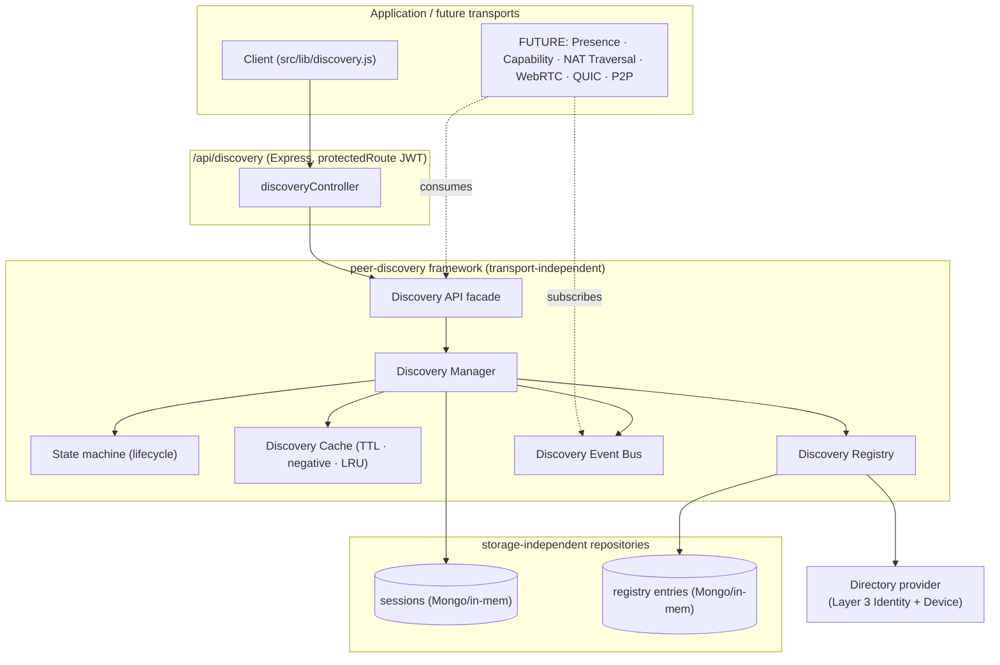
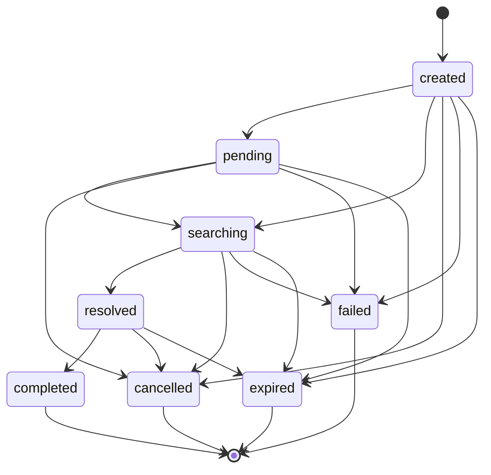
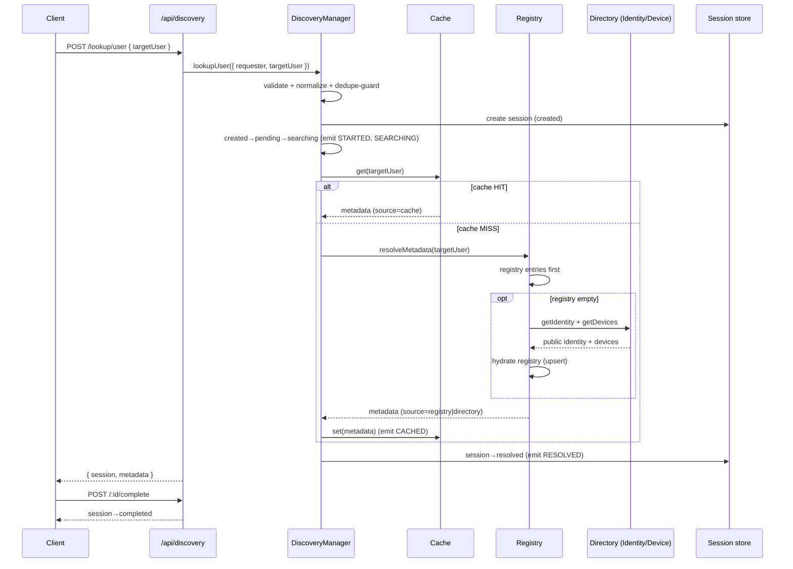

# Layer 6 · Sprint 1 — Peer Discovery Framework

> **Status:** ✅ Complete · **Tests:** 741 total (84 new) · **Crypto:** none (control plane only) · **Additive:** new `server/peer-discovery/` module + 2 new Mongo collections + `client/src/lib/discovery.js`

## 0. TL;DR

Layer 6 opens the **networking control plane**. This sprint builds the reusable **Peer
Discovery Framework** that answers one question:

> **"How do devices discover each other?"**

Discovery answers **WHO** a peer is and **WHICH** devices they have — never **HOW** to reach
them. Every lookup creates a **discovery session** that walks a deterministic state machine,
resolves the peer's public identity + discoverable devices through a **cache → registry →
directory** pipeline, and returns **PUBLIC metadata only**.

```
lookup(u2) ──▶ session[created→pending→searching] ──▶ resolve(cache→registry→directory) ──▶ session[resolved] ──▶ metadata{ identity, devices[] }
```

> [!IMPORTANT]
> **What this sprint deliberately does NOT do:** Presence · Capability Exchange · NAT
> Traversal · ICE/STUN/TURN · WebRTC · QUIC/TCP · P2P · direct sockets · transport
> negotiation. Those are **future Layer 6 sprints** that consume this framework. Every
> descriptor carries inert `presence` / `capability` / `transport` **placeholders** — the
> extension points those sprints populate.

> [!NOTE]
> **Security invariant:** discovery records (sessions, metadata, descriptors, events, DTOs)
> carry **PUBLIC control-plane data only** — public identity/device keys + fingerprints, ids,
> states, counts. There is **no field, anywhere, for a private key, session key, message key,
> chain key, or shared secret**, and a deep no-secret scan is enforced before anything is
> stored or returned.

Everything is **additive**: it does not touch existing chat/auth/crypto layers.

---

## 1. Where it sits



The framework is a **facade the whole layer builds on**: the Express controller is just one
binding. A future WebRTC-signaling / QUIC / P2P transport reuses the **same** Discovery API
facade and subscribes to the **same** events instead of re-implementing discovery.

---

## 2. Module layout

```
server/peer-discovery/
  index.js                     # public barrel
  errors.js                    # ERR_DISCOVERY_* typed errors (.code + .status)
  types/types.js               # enums, TTL/limit constants, typedefs
  manager/discoveryManager.js  # THE reusable facade (register/lookup/resolve/cache/validate/lifecycle)
  session/discoverySession.js  # session record factory + pure helpers (dedupe key, expiry)
  lifecycle/lifecycle.js       # deterministic FSM (allowed transitions + guarded driver)
  registry/registry.js         # discoverable-descriptor index (registry-first, directory-hydrate)
  registry/directory.js        # directory-provider contract + in-memory reference
  registry/mongoIdentityDirectory.js  # SERVER directory over Layer 3 Identity/Device
  metadata/metadata.js         # device/identity descriptors + inert presence/cap/transport placeholders
  cache/cache.js               # TTL + negative + LRU cache
  validators/validators.js     # request/ref/metadata validation + NO-SECRET invariant
  serializers/serializer.js    # PUBLIC DTOs (whitelist)
  events/events.js             # typed pub/sub bus
  repository/inMemoryDiscoveryRepository.js  # reference + test backend
  repository/mongoDiscoveryRepository.js     # Mongo (Mongoose) backend
  models/DiscoverySession.model.js           # NEW collection (metadata only)
  models/DiscoveryRegistryEntry.model.js     # NEW collection (public device descriptors)
  api/discoveryApi.js          # transport-independent facade (actingUser-scoped)
  tests/                       # 84 tests, DB-free

server/controllers/discoveryController.js    # Express binding (singleton manager)
server/routes/discoveryRoute.js              # /api/discovery routes (JWT)
client/src/lib/discovery.js                  # client integration + future hooks
```

---

## 3. Discovery lifecycle & state machine (Steps 4–5)

Every lookup **creates a discovery session** — the unit of work that binds a requester (+
requester device) to a target user (+ optional target devices), tracks lifecycle state, holds
the resolved metadata, and records audit + history. A session is a deterministic finite state
machine:



- **created** — record created, not queued.
- **pending** — accepted + queued.
- **searching** — resolver actively looking the peer/devices up.
- **resolved** — metadata found + attached.
- **completed** — the caller consumed the result (terminal).
- **failed** — unknown user/device, corrupted metadata, internal error (terminal).
- **expired** — outlived its TTL (terminal; swept eagerly or lazily on read).
- **cancelled** — the requester cancelled (terminal).

**Every transition is validated** (`assertDiscoveryTransition`); an illegal transition throws
`InvalidDiscoveryTransitionError`. Terminal states have **no exits**.

### End-to-end lookup



Identical **concurrent** lookups are **coalesced**: the manager shares one in-flight promise
per dedupe key `(requester|targetUser|lookupType|sortedDevices)`, so a lookup storm resolves
the registry/directory exactly once. A cross-process duplicate is caught by an indexed
`findActiveByDedupeKey` query and rejected with `DuplicateDiscoveryError`.

---

## 4. Discovery Manager (Step 3)

The single reusable object future layers consume. Responsibilities (the sprint spec):

| Responsibility | Method |
| --- | --- |
| Register / deregister device | `registerDevice`, `deregisterDevice` |
| Lookup user / device / devices | `lookupUser`, `lookupDevice`, `lookupDevices` |
| Resolve discovery metadata | `_resolveMetadata` → `registry.resolveMetadata` |
| Cache discovery results | `DiscoveryCache` (positive + negative) |
| Validate discovery requests | `validators` (before create + before store/return) |
| Manage the discovery lifecycle | guarded FSM transitions + `sweepExpired` |
| Stage a session | `createDiscoverySession` |
| Query / list | `getDiscovery`, `getDiscoveryStatus`, `listDiscoveries`, `listActiveDiscoveries` |
| Complete / cancel | `completeDiscovery`, `cancelDiscovery` |

A resolution failure that is a genuine **"not found"** is surfaced as a **FAILED session**
(with a machine-readable `failureReason`) rather than a thrown error, so a caller can inspect
the outcome; hard **validation/authorization** errors still throw with an HTTP status.

---

## 5. Metadata & placeholders (Step 6)

`DiscoveryMetadata` is the resolved answer to a lookup — a user's public discovery record:

```jsonc
{
  "userId": "…", "identityId": "…",
  "publicIdentity": { "identityId": "…", "publicKey": "<PUBLIC>", "fingerprint": "…", "version": 1 },
  "deviceIds": ["d1", "d2"],
  "devices": [ { "deviceId": "d1", "publicKey": "<PUBLIC>", "fingerprint": "…", "status": "active",
                 "presence": { "reserved": true }, "capabilities": { "reserved": true }, "transport": { "reserved": true } } ],
  "presence": { "enabled": false, "reserved": true },     // FUTURE — inert
  "capabilities": { "enabled": false, "reserved": true },  // FUTURE — inert
  "transport": { "enabled": false, "reserved": true },     // FUTURE — inert
  "source": "directory", "resolvedAt": "…", "schemaVersion": 1
}
```

Device discoverability is normalized from the **authoritative device trust state**
(`trustStatus`): `revoked`/`blocked` → non-discoverable `revoked`; `pending`/`expired`/
`inactive` → `inactive`; otherwise `active`. Only `active` descriptors are returned.

---

## 6. Repositories & storage independence (Step 7)

Two stores behind a **storage-independent contract**, with in-memory (reference/tests) and
Mongo (production) implementations:

- **session store** — `create · findById · update · delete · findActiveByDedupeKey ·
  listByRequester · listByState · listExpired`.
- **registry store** — `upsert · findByUser · findByUserAndDevice · remove · removeByUser ·
  listAll`.

Two **new** Mongo collections, both **metadata-only** (no key field by design): a
`discoverysessions` collection (indexed on `discoveryId`, `dedupeKey`, and compound
`{state,expiresAt}` / `{requester,state}` for fast sweeps + lists) and a
`discoveryregistryentries` collection (unique on `{userId,deviceId}`).

---

## 7. Caching (Step 8)

`DiscoveryCache` is TTL-bounded, LRU-capped, and process-local behind a swappable interface
(a future sprint can drop in a distributed cache):

- **positive caching** — resolved metadata keyed by `(userId, sortedDeviceIds)`.
- **negative caching** — a remembered "not found" with a **shorter** TTL, so a missing peer
  doesn't hammer the directory but still self-heals fast.
- **TTL expiry** — stale entries are treated as misses and pruned on probe / `pruneExpired`.
- **capacity limits** — LRU eviction beyond `limit`; a HIT promotes to most-recently-used.
- **invalidation + refresh** — `invalidateUser` (on device (de)register) and `invalidate`.
- **stats** — hits / misses / negativeHits / evictions / expirations / hitRate.

---

## 8. Validation (Step 9)

Covers every spec item: unknown user, unknown device, expired session, duplicate request,
malformed request, unauthorized lookup, corrupted metadata, and state transitions. The core
security check is `assertNoSecretMaterial` — a **deep, cycle-safe scan** that rejects any
record carrying a forbidden key (`privateKey`, `sessionKey`, `messageKey`, `chainKey`,
`rootKey`, `sharedSecret`, `seed`, …). It runs **before anything is stored or returned**.

---

## 9. API surface (Steps 10 & 16)

The transport-independent facade (`createDiscoveryApi`) is bound to HTTP at `/api/discovery`,
behind the existing `protectedRoute` JWT middleware. The authenticated `req.user._id` is the
requester; reads/actions are requester-scoped.

| Method + path | Purpose |
| --- | --- |
| `POST /api/discovery/lookup/user` | resolve a peer → identity + all devices |
| `POST /api/discovery/lookup/device` | resolve one device of a peer |
| `POST /api/discovery/lookup/devices` | resolve a subset (or all) of a peer's devices |
| `POST /api/discovery/sessions` | stage a discovery session (no resolve) |
| `GET  /api/discovery?active=true` | list the caller's (active) discoveries |
| `GET  /api/discovery/:id` | full session view (`?audit=true`) |
| `GET  /api/discovery/:id/status` | compact status (for polling) |
| `POST /api/discovery/:id/cancel` | cancel an active discovery |
| `POST /api/discovery/:id/complete` | mark a resolved discovery consumed |
| `POST /api/discovery/register` | register the caller's OWN device as discoverable |
| `POST /api/discovery/deregister` | deregister the caller's own device |

**No transport information** is present on any endpoint. Every public API has strong
TypeScript-style JSDoc types, examples, and `@security` / `@evolution` notes.

---

## 10. Client integration (Step 11)

`client/src/lib/discovery.js` makes the client aware of discovery **without** establishing any
peer connection: `lookupUser` / `lookupDevice(s)`, `createSession`, `getStatus`,
`awaitResolved` (poll to terminal), `cancelDiscovery` / `completeDiscovery`,
`listDiscoveries`, and self-service `registerOwnDevice` / `deregisterOwnDevice`. It keeps a
bounded per-peer metadata cache + history, and exposes **FUTURE hooks** —
`getPresence` / `getCapabilities` / `getTransport` — that read the inert placeholders today
and light up when later sprints populate them. Handles PUBLIC metadata only.

---

## 11. Events (Step 12)

A typed bus (`DiscoveryEventBus`) emits on every notable action so future sprints react
without polling: `discovery.started`, `discovery.searching`, `discovery.resolved`,
`discovery.completed`, `discovery.failed`, `discovery.cancelled`, `discovery.expired`,
`discovery.cached`, `discovery.cache_invalidated`, `discovery.device_registered`,
`discovery.device_deregistered`. Events carry PUBLIC data only.

---

## 12. Performance (Step 13)

- **Repository lookups** — O(1) session `findById`; registry keyed by `(userId,deviceId)`;
  Mongo indexes on `discoveryId`, `dedupeKey`, `{state,expiresAt}`, `{requester,state}`.
- **Caching** — cache in front of the registry/directory; negative cache shields the
  directory from repeated misses; LRU bounds memory.
- **Concurrency** — in-flight coalescing collapses N identical concurrent lookups into one
  session + one directory hit.
- **Session creation / validation** — pure, allocation-light; audit + history are capped.

The suite includes a **500-distinct-user** simulation, a **mixed known/unknown** batch, a
25-way **coalescing** check (exactly one directory hit), and cache/repository latency smoke
budgets.

---

## 13. Testing (Step 14)

**84 new tests, DB-free** (`node --test`), across 4 files:

- `discovery-lifecycle.test.js` — state machine, session helpers, manager lookups, complete/
  cancel/expire (eager sweep + lazy expire-on-read), events, and the API facade.
- `cache-validation.test.js` — TTL/negative/LRU cache, manager cache integration, metadata
  builders + placeholders, all validators, the **no-secret invariant** (incl. cyclic graphs),
  and serializer DTOs.
- `repository-concurrency.test.js` — session + registry repository contracts, registry
  directory hydration, concurrent-lookup coalescing, large-user-base simulation, performance.
- `helpers.js` — DB-free wiring (controllable clock + id generator + in-memory directory).

Full project suite: **741 pass / 0 fail** (657 prior + 84 new). This sprint also fixed a
latent manager bug where `getDiscovery` / `getDiscoveryStatus` returned the **pre-sweep**
snapshot after a lazy expiry; they now reflect the post-sweep state.

---

## 14. Future integration & current limitations

This framework is the **foundation** the rest of Layer 6 stands on:

- **Presence sprint** → fills the `presence` placeholder + subscribes to discovery events to
  track online/last-seen. Discovery today never reports whether a peer is online.
- **Capability Exchange sprint** → fills the `capabilities` placeholder + the session's
  `capabilitiesSnapshot`.
- **NAT Traversal / ICE / STUN / TURN / WebRTC / QUIC / TCP / P2P sprints** → fill the
  `transport` placeholder with ICE candidates / relays / reachability and reuse the Discovery
  API facade + events to drive connection setup.

**Limitations (by design):** no presence, no capability exchange, no transport negotiation, no
peer connections. Discovery answers **WHO / WHICH**, never **HOW**. The framework is
transport-independent so every future transport reuses it rather than redesigning it.
