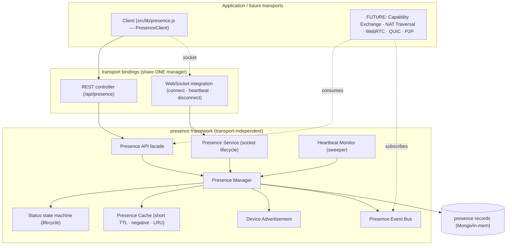
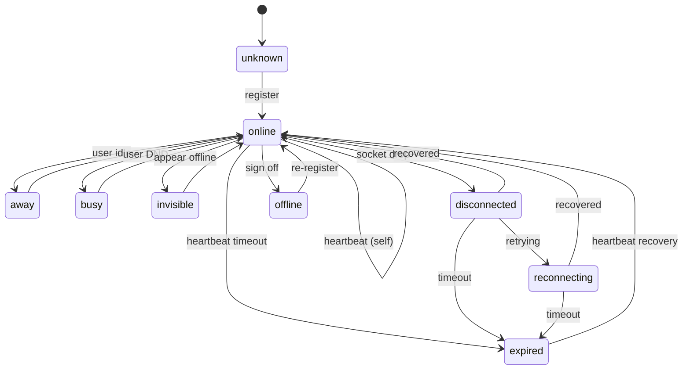
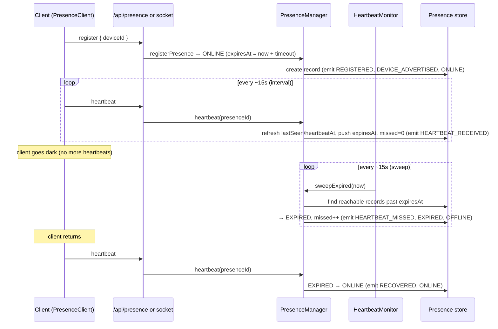

# Layer 6 · Sprint 2 — Presence & Device Advertisement

> **Status:** ✅ Complete · **Tests:** 821 total (80 new) · **Crypto:** none (control plane only) · **Additive:** new `server/presence/` module + 1 new Mongo collection + `client/src/lib/presence.js` + socket integration

## 0. TL;DR

Sprint 1 answered *"who is a peer + which devices do they have?"* (Discovery). Sprint 2 answers
the **real-time** question:

> **"Which of a user's authenticated devices are currently reachable?"**

The **Presence Service** maintains one live presence record per device, driven by
**heartbeats**. Each reachable device publishes a PUBLIC **device advertisement** (its public
identity + status + platform/version). A **heartbeat monitor** sweeps devices that stop beating
to `EXPIRED`; a fresh heartbeat **recovers** a dropped device back to `ONLINE`.

```
register(dev) ─▶ ONLINE ──heartbeat──▶ (stays alive) ──miss timeout──▶ EXPIRED ──heartbeat──▶ ONLINE (recovered)
```

> [!IMPORTANT]
> **What this sprint deliberately does NOT do:** Capability Exchange · NAT Traversal ·
> ICE/STUN/TURN · WebRTC · QUIC/TCP · P2P · transport negotiation. Presence reports *whether* a
> device is reachable, **never how to reach it**. Every advertisement carries inert `connection`
> and `transport` **placeholders** — the extension points Sprint 3 (Capability Exchange) and the
> later NAT/WebRTC sprints populate. **Connection establishment belongs to later layers.**

> [!NOTE]
> **Security invariant:** presence records, advertisements, DTOs, and events carry **PUBLIC
> control-plane data only** — public identity keys + fingerprints, ids, statuses, timestamps,
> counts. There is **no field, anywhere, for a private key, session key, message key, chain key,
> or shared secret**, and a deep no-secret scan is enforced before anything is stored or returned.

Everything is **additive** and **transport-independent**: it reuses Sprint 1's identity/device
model and the existing WebSocket, without modifying either.

---

## 1. Where it sits



The framework is a **facade the whole layer builds on**: the REST controller and the WebSocket
handler are two bindings over the **same** `PresenceManager`, so presence is consistent no matter
how a device connects. A future transport reuses the same facade + events.

---

## 2. Module layout

```
server/presence/
  index.js                       # public barrel
  errors.js                      # ERR_PRESENCE_* typed errors (.code + .status)
  types/types.js                 # statuses, event types, constants, typedefs
  manager/presenceManager.js     # THE reusable facade (register/update/heartbeat/lookup/sweep)
  lifecycle/lifecycle.js         # validated status state machine
  record/presenceRecord.js       # pure presence-record factory + helpers
  advertisement/advertisement.js # PUBLIC device advertisement + inert connection/transport placeholders
  heartbeat/heartbeat.js         # HeartbeatMonitor — periodic expiry sweeper (failure detection)
  cache/cache.js                 # short-TTL + negative + LRU cache
  validators/validators.js       # request/ref/status validation + NO-SECRET invariant
  serializers/serializer.js      # PUBLIC DTOs (whitelist)
  events/events.js               # typed pub/sub bus
  services/presenceService.js    # socket-oriented lifecycle (connect/heartbeat/disconnect)
  api/presenceApi.js             # transport-independent facade (actingUser-scoped)
  repository/inMemoryPresenceRepository.js   # reference + test backend
  repository/mongoPresenceRepository.js      # Mongo (Mongoose) backend
  models/PresenceRecord.model.js             # NEW collection (metadata only)
  tests/                         # 80 tests, DB-free

server/controllers/presenceController.js     # REST binding (singleton manager + monitor)
server/routes/presenceRoute.js               # /api/presence routes (JWT)
server/server.js                             # route mount + socket integration + monitor start
client/src/lib/presence.js                   # PresenceClient (auto-register, heartbeat, reconnect)
```

---

## 3. Presence lifecycle & state machine (Steps 4–5)

Every device has one presence record — a validated finite state machine over 9 statuses. Unlike a
discovery session, presence is **cyclic**: a device goes offline and comes back, so `OFFLINE` /
`EXPIRED` are *resting* states a fresh registration or heartbeat revives.



| Status | Reachable? | In public online list? | Meaning |
| --- | :---: | :---: | --- |
| `online` | ✅ | ✅ | connected + visible |
| `away` | ✅ | ✅ | reachable, idle |
| `busy` | ✅ | ✅ | reachable, do-not-disturb |
| `invisible` | ✅ | ❌ | reachable but appears offline |
| `reconnecting` | ❌ | ❌ | transiently dropped, restoring |
| `disconnected` | ❌ | ❌ | connection lost (unclean) |
| `offline` | ❌ | ❌ | clean sign-off |
| `expired` | ❌ | ❌ | heartbeats stopped past timeout |
| `unknown` | ❌ | ❌ | indeterminate / never registered |

**Every transition is validated** (`assertPresenceTransition`); an illegal jump (e.g.
`offline → busy` without re-registering, `expired → disconnected`) throws
`InvalidPresenceTransitionError`. A same-status transition (an idempotent heartbeat) is always
allowed and does not spam the status history.

`resolveActiveDevices(user)` returns the **reachable** set (incl. `invisible`); `listOnline(user)`
returns only the **visible-online** set (excludes `invisible`).

---

## 4. Heartbeat system (Step 7)



- **interval** — advisory client cadence (`DEFAULT_HEARTBEAT_INTERVAL_MS = 15s`).
- **timeout** — server expiry window (`DEFAULT_HEARTBEAT_TIMEOUT_MS = 45s`, ~3 missed beats
  tolerated for jitter). `expiresAt = heartbeatAt + timeout`.
- **failure detection** — the `HeartbeatMonitor` sweeps on an interval; a reachable/transitional
  record past `expiresAt` is `EXPIRED` and its `missedHeartbeats` counter bumps.
- **recovery** — a heartbeat for a dropped device (disconnected / reconnecting / expired / offline)
  transitions it back to `ONLINE` and emits `RECOVERED`.
- **lazy expiry** — a read (`getPresence`) also expires an overdue record on the spot, so a stale
  status is never returned even between sweeps.
- **reconnect** — the client re-registers/heartbeats on socket reconnect; the socket `disconnect`
  marks the device `DISCONNECTED` (a later heartbeat recovers it, or the sweep expires it).

---

## 5. Device advertisement (Step 6)

When a device is present it publishes a PUBLIC advertisement — *who is here + how you recognize
them* (never *how to reach them*):

```jsonc
{
  "userId": "…", "identityId": "…", "deviceId": "…",
  "publicIdentity": { "identityId": "…", "publicKey": "<PUBLIC>", "fingerprint": "…", "version": 1 },
  "status": "online",
  "softwareVersion": "1.0.0", "platform": "web (Chrome on Linux)",
  "connection": { "enabled": false, "reserved": true },   // FUTURE — inert (Capability Exchange)
  "transport":  { "enabled": false, "reserved": true },   // FUTURE — inert (NAT/ICE/WebRTC)
  "version": 3, "advertisedAt": "…", "schemaVersion": 1
}
```

The advertisement is re-stamped (version bumped) on every status change, and deep-scanned for
secret material before storage.

---

## 6. Repositories & storage independence (Step 8)

A storage-independent contract with in-memory (reference/tests) and Mongo (production)
implementations: `upsert · create · findById · findByUserAndDevice · findByUser · update · delete ·
listByStatus · listReachableByUser · listExpired · countByStatus · listAll`. Status history is an
append-only, capped array embedded on the record.

One **new** Mongo collection, `presencerecords`, **metadata-only** (no key field by design):
unique on `{userId, deviceId}` (one record per device), indexed on `presenceId`, `lastSeen`, and
compound `{userId, status}` / `{status, expiresAt}` for fast reachability queries + expiry sweeps.

---

## 7. Caching (Step 9)

`PresenceCache` is short-TTL, LRU-capped, and process-local. Presence changes fast, so the TTL is
deliberately small (`5s`) and the cache is **aggressively auto-invalidated** on any presence write
for a user (register / update / heartbeat-recovery / offline / expire / remove all invalidate).
Its job is to absorb read storms (many peers asking "who of user U is reachable?") — not to hold
state long. It supports positive + negative caching, TTL expiry, targeted invalidation, and LRU
eviction, all behind a minimal interface that a **future Redis** deployment swaps in as a drop-in.

---

## 8. Validation (Step 13)

Covers every spec item: duplicate registrations (a *reachable* device can't double-register; a
*resting* one is revived), heartbeat timeout, expired devices, unknown devices, invalid
transitions, malformed metadata, and unauthorized updates (owner-scoped). The core security check
is `assertNoSecretMaterial` — a deep, cycle-safe scan rejecting any forbidden key
(`privateKey`, `sessionKey`, `messageKey`, `chainKey`, …) — run before anything is stored/returned.

---

## 9. API surface (Steps 10 & 17)

The transport-independent facade (`createPresenceApi`) is bound to HTTP at `/api/presence`, behind
the existing `protectedRoute` JWT middleware. The authenticated `req.user._id` owns the presence.

| Method + path | Purpose |
| --- | --- |
| `POST /api/presence/register` | register/revive the caller's device presence |
| `PATCH /api/presence/:presenceId` | update the caller's device status |
| `POST /api/presence/:presenceId/heartbeat` | refresh liveness (recover if dropped) |
| `POST /api/presence/:presenceId/offline` | clean sign-off |
| `DELETE /api/presence/:presenceId` | remove the caller's presence record |
| `GET /api/presence/lookup/:userId` | resolve a user's reachable devices |
| `GET /api/presence/online/:userId` | a user's visible-online devices |
| `GET /api/presence/last-seen/:userId/:deviceId` | a device's last-seen |
| `GET /api/presence/:presenceId` | full presence view (`?history=true`) |
| `GET /api/presence/:presenceId/history` | status history |

**No transport information** is present on any endpoint. Every public API has strong
TypeScript-style JSDoc types, examples, and `@security` / `@distributed` / `@evolution` notes.

---

## 10. Client integration (Step 11)

`client/src/lib/presence.js` ships a `PresenceClient` that: **auto-registers** this device on
`start()`, **heartbeats** on an interval (over the socket when connected, else REST), **handles
reconnects** (re-register on socket `connect`), lets the user **change status**
(`setStatus`), and **tracks active devices** of peers (`getReachableDevices` / `getOnlineDevices` /
`getLastSeen`) with a local cache invalidated by live `presenceChanged` broadcasts. It exposes a
**future capability hook** (`getDeviceCapabilities`) that reads the inert advertisement placeholder
today. Handles PUBLIC metadata only; establishes no peer connection.

---

## 11. WebSocket integration

`server.js` wires presence into the existing socket (additive + fully defensive — any failure
never disturbs existing presence/rooms/delivery): on connect (with a `deviceId` in the handshake)
it registers/refreshes presence and emits `presenceSelf`; `presence:heartbeat` and
`presence:status` socket events drive liveness/status; `disconnect` marks the device
`DISCONNECTED`. Presence transitions (`ONLINE`/`OFFLINE`/`EXPIRED`/`RECOVERED`/`UPDATED`) are
broadcast as `presenceChanged` so clients update their rosters in real time. The heartbeat monitor
is started after the DB connects (its timer is `unref`'d).

---

## 12. Events (Step 12)

A typed bus (`PresenceEventBus`) emits on every notable action: `presence.registered`,
`presence.updated`, `presence.online`, `presence.offline`, `presence.expired`, `presence.removed`,
`presence.recovered`, `presence.device_advertised`, `presence.heartbeat_received`,
`presence.heartbeat_missed`, `presence.cache_invalidated`. Events carry PUBLIC data only. In a
distributed deployment this bus is the seam where a fan-out transport (Redis pub/sub, NATS) plugs
in — the event shape is transport-agnostic.

---

## 13. Performance & distributed notes (Step 14)

- **Heartbeat processing** — a heartbeat is one indexed record update; the sweep is one indexed
  range query (`{status, expiresAt}`) + a bounded set of transitions.
- **Repository lookups** — O(1) by `presenceId` and by `(userId, deviceId)`; reachability by
  `{userId, status}`.
- **Caching** — short-TTL cache in front of reachability reads; negative cache shields empty users.
- **Concurrency** — concurrent heartbeats converge to one fresh record; sweep + heartbeat races are
  idempotent (a record already moved is skipped).
- **Distributed scaling** — the manager is stateless beyond its store + (swappable) cache, so it
  scales horizontally; running the monitor on every instance is safe (idempotent sweeps), and for
  very large fleets a future deployment can elect a single sweeper or shard sweeps by user-id range
  without changing the interface.

The suite includes a **1000-user × 2-device** registration test, a **500-device mass-expiry**
sweep, **concurrent-heartbeat / concurrent-registration / sweep-vs-heartbeat** races, a mixed
**churn stress** test (no records lost/duplicated), and cache/repository latency budgets.

---

## 14. Testing (Step 15)

**80 new tests, DB-free** (`node --test`), across 3 files + helpers:

- `presence-lifecycle.test.js` — state machine, record/advertisement builders, registration +
  multi-device, status updates, heartbeat/expiry/recovery, the `HeartbeatMonitor`, queries.
- `cache-validation.test.js` — TTL/negative/LRU cache, manager cache auto-invalidation, all
  validators, the **no-secret invariant** (incl. cycles), serializer DTOs, the API facade, and the
  socket-oriented service.
- `repository-scale.test.js` — repository contract, concurrency, large-scale online users, mass
  expiry, stress churn, performance budgets.

Full project suite: **821 pass / 0 fail** (741 prior + 80 new).

---

## 15. Future Capability Exchange integration & current limitations

This service is the foundation Sprint 3 stands on:

- **Capability Exchange sprint (next)** → fills the advertisement's `connection` placeholder so a
  reachable device advertises *how* it can be reached (endpoints, protocols, versions). The
  `onConnect` service seam and `getDeviceCapabilities` client hook are the extension points.
- **NAT Traversal / ICE / STUN / TURN / WebRTC / QUIC / P2P sprints** → fill the `transport`
  placeholder with reachability candidates and use presence + its events to know which devices are
  live before attempting a connection.

**Limitations (by design):** presence determines *availability only* — no capability exchange, no
transport negotiation, no peer connections. Presence answers **reachable / not reachable**, never
**how to reach**. Connection establishment belongs to later layers.
