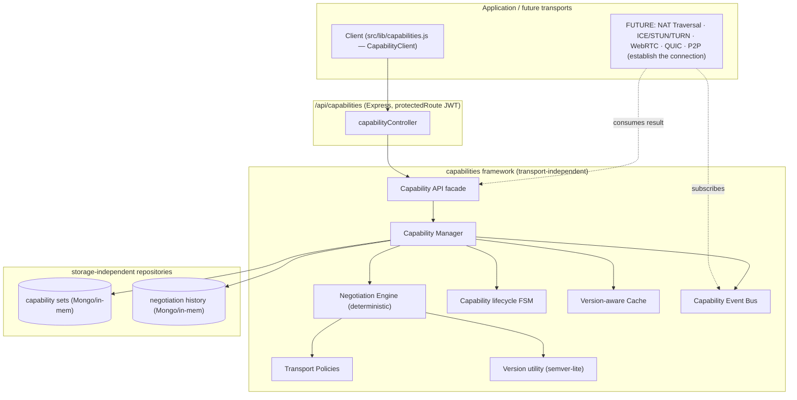
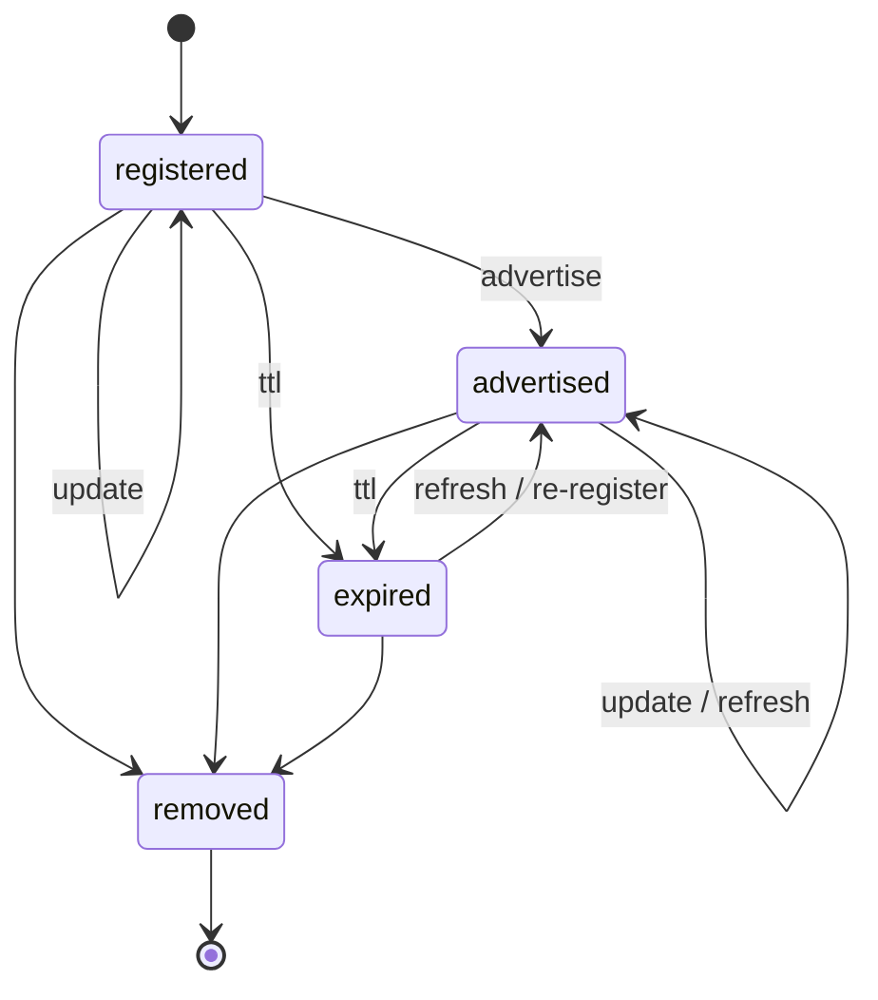
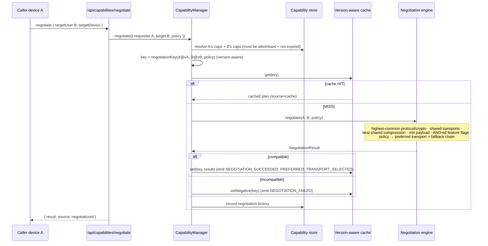
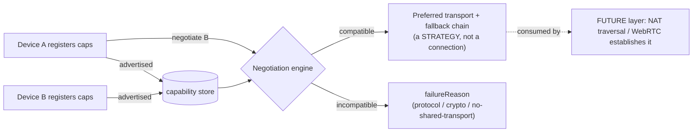

# Layer 6 · Sprint 3 — Capability Exchange & Transport Negotiation

> **Status:** ✅ Complete · **Tests:** 882 total (61 new) · **Crypto:** none (control plane only) · **Additive:** new `server/capabilities/` module + 2 new Mongo collections + `client/src/lib/capabilities.js`

## 0. TL;DR

Sprint 1 answered *who a peer is* (Discovery); Sprint 2 answered *which devices are reachable*
(Presence). Sprint 3 answers the third question:

> **"How can these two devices communicate?"**

Each device advertises a **capability set** — protocol/crypto versions, supported transports,
compression, attachment limits, and feature flags. Given two capability sets, a **deterministic
negotiation engine** computes what they share and which transport they should PREFER:

```
negotiate(A, B) ─▶ { protocol: 1.0, crypto: 1.0, compression: gzip,
                     sharedTransports: [relay, websocket], preferred: relay, fallback: [websocket],
                     featureFlags: { typing }, maxPayload: min(A,B) }
```

> [!IMPORTANT]
> **What this sprint deliberately does NOT do:** NAT Traversal · ICE/STUN/TURN · WebRTC · direct
> P2P · **connection establishment**. Capability Exchange determines COMPATIBILITY and a PREFERRED
> communication STRATEGY only. Choosing `"webrtc"` here means *"prefer WebRTC if a later layer can
> open it"* — it opens nothing. The `p2p` capability block and the negotiation result's `transport`
> block are inert **placeholders** the future NAT/WebRTC sprints fill. **Actual connection
> establishment belongs to later layers.**

> [!NOTE]
> **Security invariant:** capability sets, results, DTOs, and events carry **PUBLIC control-plane
> data only** — versions, transport names, feature flags, limits. There is **no field, anywhere,
> for a private key, session key, message key, chain key, or shared secret**, and a deep no-secret
> scan is enforced before anything is stored or returned.

Everything is **additive**: it does not modify Discovery, Presence, or any crypto layer.

---

## 1. Where it sits



The framework is a **facade the whole layer builds on**: the Express controller is one binding; a
future WebRTC-signaling / QUIC transport reuses the **same** facade + negotiation result + events.

---

## 2. Module layout

```
server/capabilities/
  index.js                        # public barrel
  errors.js                       # ERR_CAPABILITY_* typed errors (.code + .status)
  types/types.js                  # transports, compression, states, event types, constants, typedefs
  version/version.js              # semver-lite parse/compare/highest-common
  manager/capabilityManager.js    # THE reusable facade (register/update/resolve/negotiate/sweep)
  negotiation/negotiation.js      # deterministic negotiation engine + version-aware negotiationKey
  policies/transportPolicy.js     # transport-preference policies (AUTO / prefer-*)
  advertisement/advertisement.js  # normalized capability payload + inert p2p placeholder
  record/capabilityRecord.js      # pure capability-set factory + helpers
  lifecycle/lifecycle.js          # capability-set state machine
  cache/cache.js                  # version-aware TTL + negative + LRU cache
  validators/validators.js        # request/version/transport/flag validation + NO-SECRET invariant
  serializers/serializer.js       # PUBLIC DTOs (whitelist)
  events/events.js                # typed pub/sub bus
  api/capabilityApi.js            # transport-independent facade (actingUser-scoped)
  repository/inMemoryCapabilityRepository.js  # reference + test backend (caps + negotiations)
  repository/mongoCapabilityRepository.js     # Mongo (Mongoose) backend
  models/CapabilitySet.model.js               # NEW collection (metadata only)
  models/NegotiationRecord.model.js           # NEW collection (negotiation history)
  tests/                          # 61 tests, DB-free

server/controllers/capabilityController.js    # REST binding (singleton manager)
server/routes/capabilityRoute.js              # /api/capabilities routes (JWT)
client/src/lib/capabilities.js                # CapabilityClient (register, negotiate, resolve)
```

---

## 3. Capability model (Step 4)

A device's capability set is EXTENSIBLE — unknown feature flags + metadata flow through negotiation
unchanged:

```jsonc
{
  "capabilityId": "…", "userId": "…", "deviceId": "…",
  "protocolVersions": ["1.0"], "cryptoVersions": ["1.0"],
  "transports": ["webrtc", "websocket", "relay"],   // SUPPORT (declaring ≠ establishing)
  "compression": ["brotli", "gzip", "none"],
  "attachments": { "supported": true, "maxSize": 16777216 },
  "maxPayloadSize": 16777216,
  "relaySupport": true,
  "p2p": { "enabled": false, "reserved": true },     // FUTURE — inert (NAT/WebRTC sprint)
  "connectionPreferences": ["webrtc", "websocket", "relay"],
  "platformFeatures": ["web"], "softwareVersion": "1.0.0",
  "featureFlags": { "typing": true, "reactions": true },
  "state": "advertised", "version": 3, "expiresAt": "…", "versionHistory": [ … ]
}
```

---

## 4. Capability lifecycle & state machine (Step 7)

A capability set is a validated FSM. Like presence it is **cyclic**: `EXPIRED` is a resting state a
refresh/re-register revives; `REMOVED` is terminal.



Register → advertised (usable in negotiation); update bumps the **version** (invalidating cached
plans); refresh extends the TTL; the sweep (or a lazy read) moves an overdue set to `expired`; every
transition is validated (`assertCapabilityTransition`).

---

## 5. Negotiation process (Step 5)



The engine is **pure, deterministic, and symmetric** on shared fields: `negotiate(A,B)` and
`negotiate(B,A)` produce the same protocol/crypto/compression/feature-flags/shared-transports and
the same preferred transport (given the same policy) — so two peers agree without a round-trip.
Compatibility gates are checked most-fundamental-first: **protocol version → crypto version → shared
transport**.

---

## 6. Transport preferences (Step 6)

A policy is a priority ordering over transport types; it SELECTS a preference from the transports two
devices share — it establishes nothing.

| Policy | Priority (most → least preferred) |
| --- | --- |
| `auto` (default) | webrtc → quic → relay → websocket → tcp |
| `prefer-webrtc` | webrtc → quic → relay → websocket → tcp |
| `prefer-quic` | quic → webrtc → relay → websocket → tcp |
| `prefer-relay` | relay → websocket → quic → webrtc → tcp |
| `prefer-websocket` | websocket → relay → quic → webrtc → tcp |

`selectPreferredTransport(shared, policy)` → `{ preferredTransport, fallbackChain, policy }`. Both
peers applying the same policy to the same shared set pick the same transport — deterministic by
construction (mirrors how ICE orders candidate types).

---

## 7. Capability flow (register → negotiate → prefer)



---

## 8. Repositories (Step 8) & Caching (Step 9)

**Two new Mongo collections**, both metadata-only: `capabilitysets` (unique on `{userId,deviceId}`,
indexed on `capabilityId` + `{state,expiresAt}`) and `negotiationrecords` (negotiation history,
indexed per-device + per-pair). Storage-independent contract with in-memory + Mongo backends:
`upsert · create · findById · findByUserAndDevice · findByUser · update · delete · listByState ·
listExpired · countByState` (capabilities) and `record · findById · listByDevice · listByPair`
(history).

The **cache is version-aware**: a negotiation result is keyed by both devices AND their capability
`version` ({@link negotiationKey}). Because a capability UPDATE bumps the version, the old key is
never served again — cache invalidation is *automatic*. `invalidateDevice` additionally evicts stale
entries to bound memory. It supports positive + **negative** caching (an incompatible pair is
remembered briefly), TTL expiry, and LRU eviction — behind a minimal interface a future **Redis**
deployment swaps in as a drop-in (the version-aware key makes cross-node invalidation trivial).

---

## 9. Validation (Step 13)

Covers every spec item: unknown/invalid protocol version, unsupported crypto version, transport
conflicts (no shared transport → `NO_SHARED_TRANSPORT`), invalid feature flags (non-boolean),
malformed metadata, duplicate registration (a *live* set can't double-register; an expired one is
replaced), negotiation failures, and capability expiration. The core security check is
`assertNoSecretMaterial` — a deep, cycle-safe scan rejecting any forbidden key — run before storage.

---

## 10. API surface (Steps 10 & 17)

Bound to HTTP at `/api/capabilities`, behind the existing `protectedRoute` JWT middleware. The
authenticated `req.user._id` owns the capabilities and is the negotiation requester.

| Method + path | Purpose |
| --- | --- |
| `POST /api/capabilities/register` | register the caller's device capabilities |
| `PATCH /api/capabilities/:capabilityId` | update capabilities (bumps version) |
| `POST /api/capabilities/:capabilityId/refresh` | extend the capability TTL |
| `DELETE /api/capabilities/:capabilityId` | remove the capability set |
| `POST /api/capabilities/negotiate` | negotiate with a peer's device |
| `POST /api/capabilities/preferred-transport` | resolve just the preferred transport |
| `GET /api/capabilities/device/:userId/:deviceId` | a device's advertised capabilities |
| `GET /api/capabilities/history/:deviceId` | negotiation history |
| `GET /api/capabilities/:capabilityId` | full capability view (`?history=true`) |

**No connection is established** by any endpoint. Every public API has strong TypeScript-style JSDoc
types, examples, and `@security` / `@networking` / `@evolution` notes.

---

## 11. Client integration (Step 11)

`client/src/lib/capabilities.js` ships a `CapabilityClient` that **auto-registers** this device's
capabilities, **updates** them + **feature flags** (`setFeatureFlags`), **negotiates** with a peer
device (`negotiate`), and **resolves the preferred transport** (`resolvePreferredTransport`), caching
plans locally. It exposes a **future NAT hook** (`getTransportPlan`) that hands the preferred
transport to a later-layer connection establisher today it opens nothing. Handles PUBLIC metadata
only.

---

## 12. Events (Step 12)

A typed bus (`CapabilityEventBus`) emits: `capabilities.registered`, `capabilities.advertised`,
`capabilities.updated`, `capabilities.refreshed`, `capabilities.expired`, `capabilities.removed`,
`capabilities.negotiation_started`, `capabilities.negotiation_succeeded`,
`capabilities.negotiation_failed`, `capabilities.preferred_transport_selected`,
`capabilities.cache_invalidated`. Events carry PUBLIC data only. The future NAT sprint subscribes to
`preferred_transport_selected` to know which transport to establish.

---

## 13. Performance (Step 14)

- **Negotiation** — a pure function over two small sets; the version-aware cache turns repeat
  negotiations of the same pair into O(1) hits.
- **Repository lookups** — O(1) by `capabilityId` and `(userId, deviceId)`; state/expiry indexed.
- **Concurrency** — concurrent negotiations of a pair all resolve consistently; sweeps are
  idempotent.
- **Distributed scaling** — the manager is stateless beyond its store + (swappable) cache; the
  version-aware key makes distributed cache invalidation free (updates mint new keys).

The suite includes a **1000-device fan-out** negotiation, a 25-way **concurrent-negotiation** check,
a **1000-cached-negotiation** latency budget, feature-flag semantics, and repository latency budgets.

---

## 14. Testing (Step 15)

**61 new tests, DB-free** (`node --test`), across 3 files + helpers:

- `negotiation.test.js` — version utility, transport policies, advertisement builder, the
  deterministic engine (compatibility, incompatibility, symmetry, policy override, compression), and
  the version-aware negotiation key.
- `manager-lifecycle.test.js` — the lifecycle FSM, registration/update/refresh/remove, negotiation +
  version-aware caching + history + events, expiry sweeps, the cache, and the API facade.
- `repository-scale.test.js` — repository + history contracts, all validators, the **no-secret
  invariant**, feature-flag negotiation semantics, concurrency, large-scale fan-out, performance.

Full project suite: **882 pass / 0 fail** (821 prior + 61 new).

---

## 15. Future NAT Traversal integration & current limitations

This subsystem is the foundation the next sprints stand on:

- **Sprint 4 (Discovery Protocol)** → combines Discovery + Presence + Capability Exchange into one
  unified peer-discovery workflow: discover *who*, check *reachable*, negotiate *how*.
- **NAT Traversal / ICE / STUN / TURN / WebRTC sprints (Layer 7)** → consume the negotiation
  result's `preferredTransport` + `fallbackChain` and fill the `p2p` capability block + the result's
  `transport` block with ICE candidates / relays to actually **establish** the chosen transport.

**Limitations (by design):** capability exchange determines *compatibility + a preferred strategy*
only. It performs no NAT traversal, no ICE/STUN/TURN, no WebRTC, no P2P, and **establishes no
connection**. It answers **how two devices _could_ communicate**, never opening the channel.
Connection establishment belongs to later layers.
