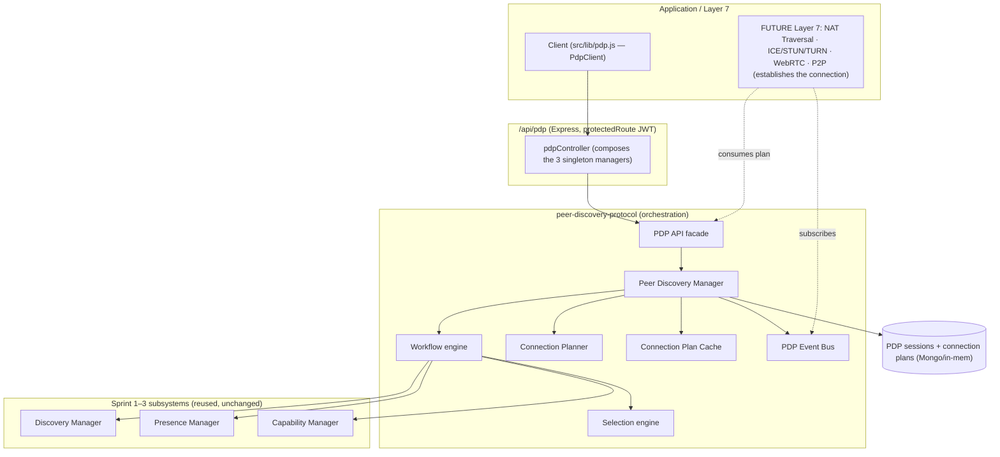
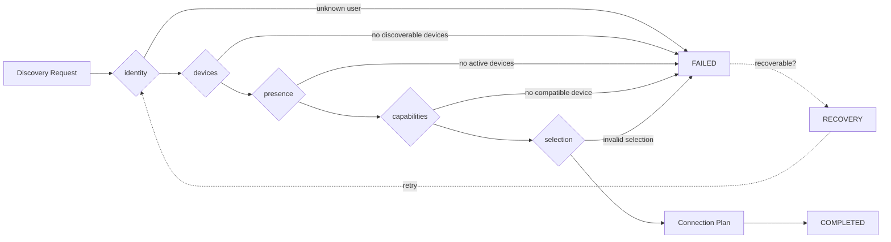
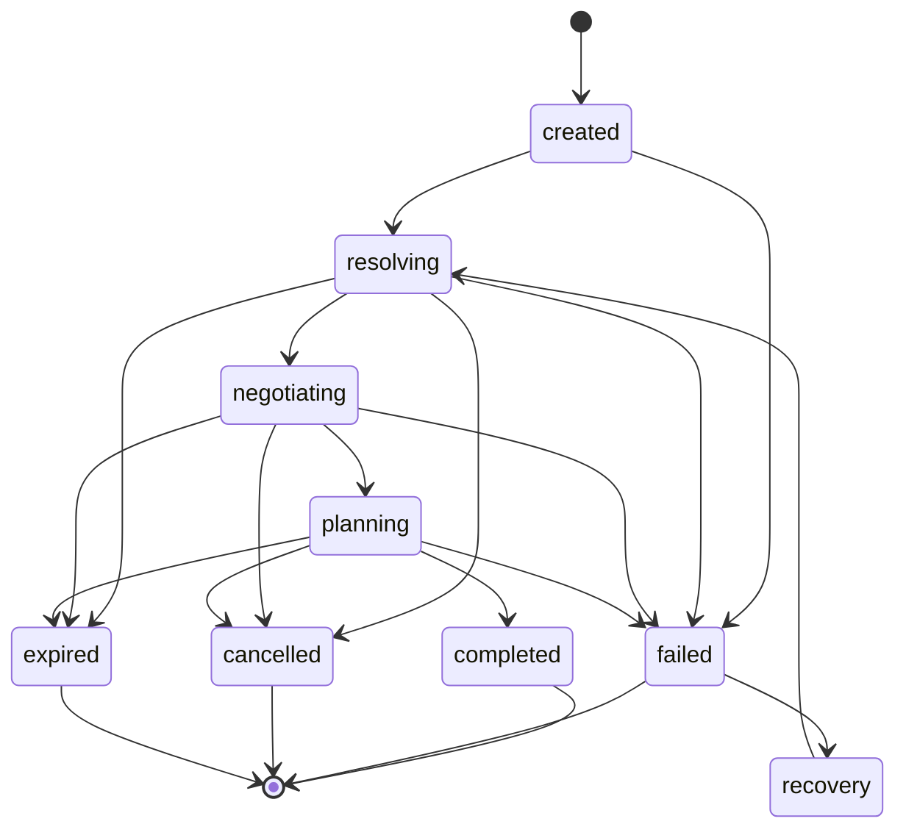
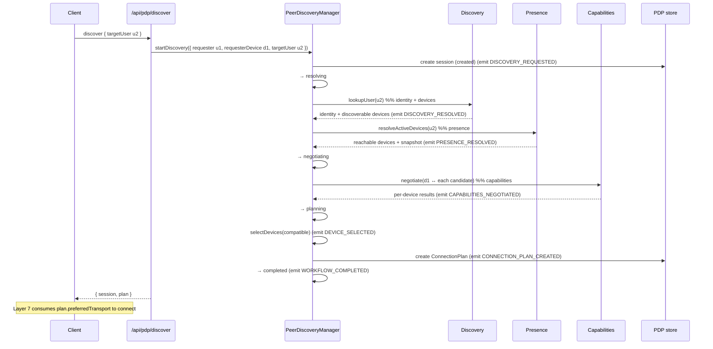

# Layer 6 · Sprint 4 — Peer Discovery Protocol (PDP)

> **Status:** ✅ Complete · **Tests:** 929 total (47 new) · **Crypto:** none (control plane only) · **Additive:** new `server/peer-discovery-protocol/` module + 2 new Mongo collections + `client/src/lib/pdp.js`

## 0. TL;DR

Sprints 1–3 built three independent subsystems. Sprint 4 **unifies** them into one protocol:

| Sprint | Subsystem | Answers |
| --- | --- | --- |
| 1 | Discovery | *who* is the peer + *which* devices do they have? |
| 2 | Presence | *which* devices are reachable right now? |
| 3 | Capabilities | *how* can two devices communicate? |
| **4** | **Peer Discovery Protocol** | **all of the above → a Connection Plan** |

PDP runs a deterministic workflow and produces the **Connection Plan** — the primary output — a
transport-independent, validated object containing everything Layer 7 needs to establish a
connection:

```
startDiscovery(u2) ─▶ identity → devices → presence → capabilities → selection → plan
                                                                                   │
                                              ┌────────────────────────────────────┘
                                              ▼
                       ConnectionPlan { primaryDevice, preferredTransport, fallback,
                                        protocol/crypto versions, presence snapshot, priority }
```

> [!IMPORTANT]
> **What this sprint deliberately does NOT do:** NAT Traversal · ICE/STUN/TURN · WebRTC · direct
> P2P · **socket creation** · hole punching · **connection establishment**. PDP produces a validated
> PLAN only. The plan's `connection` + `nat` blocks are inert **placeholders** Layer 7 fills.
> **Actual connection establishment belongs to Layer 7.**

> [!NOTE]
> **Security invariant:** PDP composes PUBLIC control-plane data from the three subsystems —
> identity/device ids, public keys + fingerprints, presence status, negotiated versions/transports/
> flags. There is **no field, anywhere, for a private key, session key, message key, chain key, or
> shared secret**, and a deep no-secret scan runs before a plan is stored or returned.

Everything is **additive**: PDP *orchestrates* the existing subsystems through their public
managers — it does not modify any of them.

---

## 1. Where it sits



The PDP manager is injected with the **same live Discovery/Presence/Capability managers** the other
APIs serve, so a plan reflects the real, current state of all three subsystems.

---

## 2. Module layout

```
server/peer-discovery-protocol/
  index.js                          # public barrel
  errors.js                         # ERR_PDP_* typed errors (.code + .status)
  types/types.js                    # states, stages, selection policies, event types, constants, typedefs
  protocol/protocol.js              # protocol definition + recoverable-failure classification
  manager/peerDiscoveryManager.js   # THE orchestrator (start/resolve/select/plan/recover/track)
  workflow/workflow.js              # deterministic stage pipeline (reads + pure transforms)
  workflow/lifecycle.js             # PDP session state machine (9 states)
  workflow/session.js               # pure PDP session factory + helpers
  planner/connectionPlan.js         # Connection Plan builder + inert connection/nat placeholders
  selectors/selection.js            # deterministic, configurable device-selection policies
  negotiation/negotiation.js        # fan-out capability negotiation over candidate devices
  cache/cache.js                    # connection-plan TTL + LRU cache
  validators/validators.js          # request/ref validation + NO-SECRET invariant
  serializers/serializer.js         # PUBLIC DTOs (whitelist)
  events/events.js                  # typed pub/sub bus
  api/pdpApi.js                     # transport-independent facade (actingUser-scoped)
  repositories/inMemoryPdpRepository.js   # reference + test backend (sessions + plans)
  repositories/mongoPdpRepository.js      # Mongo (Mongoose) backend
  models/PdpSession.model.js               # NEW collection
  models/ConnectionPlan.model.js           # NEW collection (the output)
  tests/                            # 47 tests, DB-free integration

server/controllers/pdpController.js        # REST binding (composes discovery+presence+capability singletons)
server/routes/pdpRoute.js                  # /api/pdp routes (JWT)
client/src/lib/pdp.js                      # PdpClient (discover, retry, track, connection strategy)
```

---

## 3. The workflow (Step 4)

A deterministic, forward-only pipeline. Each stage either advances the run or fails it with a
machine-readable reason + the stage it failed at.



| Stage | Subsystem | Produces | Failure reason |
| --- | --- | --- | --- |
| identity | Discovery | target's public identity | `unknown-user` |
| devices | Discovery | discoverable device list | `no-discoverable-devices` |
| presence | Presence | reachable candidates + snapshot | `no-active-devices` |
| capabilities | Capabilities | per-device negotiation results | `capability-conflict` |
| selection | Selectors | ranked selected device(s) | `invalid-selection` |
| plan | Planner | the **Connection Plan** | — |

Every stage supports failure handling; the manager records `stageHistory` + emits a semantic event
per stage. Candidates are the **intersection** of discoverable ∧ reachable — a device reachable but
not discoverable is a silently-excluded presence conflict; a discoverable device that's offline is
simply dropped.

---

## 4. Lifecycle & recovery (Step 7)



`RESOLVING` spans identity+devices+presence, `NEGOTIATING` spans capabilities, `PLANNING` spans
selection+plan. A **recoverable** failure (`no-active-devices`, `presence-conflict`,
`internal-error`, `expired-session`) can enter `RECOVERY` and re-run from `RESOLVING` — e.g. retry
once the peer's devices come online. Non-recoverable failures (`unknown-user`,
`no-discoverable-devices`, `capability-conflict`) are terminal. Every transition is validated.

---

## 5. The Connection Plan (Step 5)

The primary output. A transport-independent, validated snapshot:

```jsonc
{
  "planId": "…", "discoveryId": "…", "protocol": "1.0",
  "requester": "u1", "requesterDevice": "d1", "targetUser": "u2",
  "selectedDevices": [
    { "deviceId": "u2-laptop", "publicIdentity": { "publicKey": "<PUBLIC>", "fingerprint": "…" },
      "presenceStatus": "online", "lastSeen": "…", "platform": "web",
      "capabilities": { "protocolVersion": "1.0", "preferredTransport": "webrtc", "fallbackChain": ["relay"], … },
      "score": 0.745, "rank": 0, "priority": 74 }
  ],
  "primaryDeviceId": "u2-laptop",
  "presenceSnapshot": [ { "deviceId": "u2-laptop", "status": "online", "lastSeen": "…" } ],
  "negotiatedCapabilities": { … },
  "preferredTransport": "webrtc", "fallbackTransports": ["relay"],
  "protocolVersion": "1.0", "cryptoVersion": "1.0", "cryptoCompatible": true,
  "priority": 74, "selectionPolicy": "capability-score",
  "connection": { "enabled": false, "reserved": true },  // FUTURE — inert (Layer 7)
  "nat":        { "enabled": false, "reserved": true },  // FUTURE — inert (Layer 7)
  "createdAt": "…", "expiresAt": "…"
}
```

A plan is short-lived (default 60s TTL) — it is a snapshot of a fast-changing world, so Layer 7 must
act on it promptly (and can re-run PDP to refresh).

---

## 6. Discovery sequence (Step 16)



---

## 7. Device selection (Step 6)

Deterministic, configurable policies that rank the reachable, capability-compatible candidates. All
break ties by `deviceId` ascending so selection is reproducible.

| Policy | Ranks by |
| --- | --- |
| `capability-score` (default) | richness of the negotiated capabilities (shared transports, versions, compression, flags, relay) |
| `newest-active` | most recent `lastSeen` |
| `highest-priority` | declared device priority (+ capability score tie-break) |
| `platform-preference` | prefer a requested platform |
| `user-preference` | prefer a specific requested deviceId |
| `lowest-latency` | FUTURE — latency is a placeholder (all 0); deterministic tie-break |

Selection caps the result to `maxDevices` (default 3): index 0 is the primary, the rest are backups
the plan carries for Layer 7 to fall back to.

---

## 8. Repositories (Step 8) & Caching (Step 9)

**Two new Mongo collections**, both metadata-only: `pdpsessions` (workflow state, stage, audit,
history; indexed on `discoveryId`, `dedupeKey`, `{state,expiresAt}`, `{requester,state}`) and
`connectionplans` (the output; indexed on `planId`, `discoveryId`, `{requester,createdAt}`).
Storage-independent contract with in-memory + Mongo backends.

PDP benefits from caching at **every** layer: Discovery, Presence, and Capabilities each keep their
own caches (so the workflow's reads are already cheap), and PDP adds a **Connection Plan Cache** on
top — a short-TTL, LRU cache of assembled plans keyed by `(requester, requesterDevice, targetUser,
policy, deviceSubset)`. An identical repeat `startDiscovery` is served from cache (a fresh session,
fast-forwarded through the FSM, pointing at the cached plan). The cache TTL is capped by each plan's
own `expiresAt`, so a cached plan is never served past its validity. In-flight identical runs are
also **coalesced** into one. A future distributed deployment swaps the cache for Redis behind the
same interface.

---

## 9. Validation (Step 13)

Covers every spec item: unknown users (identity stage), no active devices (presence stage), presence
conflicts (excluded from candidates), capability conflicts (capabilities stage), invalid selection
(selection stage), expired plans/sessions, malformed metadata, and unauthorized discovery
(requester-scoped). The core security check is `assertNoSecretMaterial` — a deep, cycle-safe scan —
run before any plan is stored or returned.

---

## 10. API surface (Steps 10 & 17)

Bound to HTTP at `/api/pdp`, behind the existing `protectedRoute` JWT middleware. The authenticated
`req.user._id` is the requester.

| Method + path | Purpose |
| --- | --- |
| `POST /api/pdp/discover` | start a discovery run → session + connection plan |
| `GET /api/pdp/:discoveryId` | full session view (`?audit=true`) |
| `GET /api/pdp/:discoveryId/status` | compact status (for polling) |
| `GET /api/pdp/:discoveryId/plan` | the connection plan for a run |
| `GET /api/pdp/plan/:planId` | a connection plan by id |
| `POST /api/pdp/resolve-devices` | reachable devices of a target user (no session) |
| `POST /api/pdp/resolve-preferred` | the single preferred device + transport |
| `POST /api/pdp/:discoveryId/recover` | retry a recoverable failure |
| `POST /api/pdp/:discoveryId/cancel` | cancel an active discovery |
| `GET /api/pdp` | discovery history (`?active=true&limit=N`) |

**No connection is established** by any endpoint. Every public API has strong TypeScript-style JSDoc
types, examples, and `@security` / `@networking` / `@protocol` notes.

---

## 11. Client integration (Step 11)

`client/src/lib/pdp.js` ships a `PdpClient` that runs a full discovery (`discover`), **handles
failure + retry** of recoverable failures (`discoverWithRetry` → the recover endpoint), **tracks
workflow progress** (`trackProgress` polls status with an `onProgress` callback), resolves the
preferred device/devices, caches plans per peer, and exposes a **future NAT hook**
(`getConnectionStrategy`) that hands the plan's transport strategy to a Layer 7 connection
establisher — today it opens nothing. Handles PUBLIC metadata only.

---

## 12. Events (Step 12)

A typed bus (`PdpEventBus`) emits: `pdp.discovery_requested`, `pdp.discovery_resolved`,
`pdp.presence_resolved`, `pdp.capabilities_negotiated`, `pdp.device_selected`,
`pdp.connection_plan_created`, `pdp.workflow_completed`, `pdp.workflow_failed`,
`pdp.workflow_cancelled`, `pdp.workflow_expired`, `pdp.workflow_recovered`, plus per-stage
`pdp.stage_started` / `pdp.stage_completed`. Events carry PUBLIC data only. Layer 7 subscribes to
`connection_plan_created` to consume plans as they are produced.

---

## 13. Performance (Step 14)

- **Workflow execution** — the resolve stages are cache-backed at each subsystem; capability
  negotiation fans out concurrently over candidates.
- **Selection + planning** — pure, allocation-light transforms.
- **Caching + coalescing** — identical repeat runs hit the plan cache; concurrent identical runs
  share one execution.
- **Distributed scaling** — the manager is stateless beyond its store + (swappable) cache; sweeps
  are idempotent.

The suite includes a **200-user hub** fan-out, a 10-way **coalescing** check, a **300-cached-run**
latency budget, and repository latency budgets.

---

## 14. Testing (Step 15)

**47 new tests, DB-free integration** (`node --test`) — every test wires REAL in-memory Discovery +
Presence + Capabilities under the PDP manager:

- `workflow.test.js` — lifecycle FSM, selection engine (all policies), connection-plan builder, the
  end-to-end workflow, and staged failure handling (identity / devices / presence / capabilities).
- `manager-api.test.js` — caching + coalescing, recovery + cancel, queries + authorization + sweep,
  the plan cache, and the API facade.
- `repository-scale.test.js` — session + plan repository contracts, all validators, the **no-secret
  invariant**, concurrency, multi-device selection, large-scale, performance.

Full project suite: **929 pass / 0 fail** (882 prior + 47 new).

---

## 15. Future NAT Traversal integration & current limitations

The connection plan is exactly what **Layer 7** consumes:

- **Layer 7 (NAT Traversal / ICE / STUN / TURN / WebRTC / P2P)** → takes a `ConnectionPlan`, reads
  its `preferredTransport` + `fallbackTransports` + `selectedDevices`, fills the `connection` + `nat`
  placeholders with ICE candidates / relays / reachability, and **establishes** the connection.
  Subscribing to `pdp.connection_plan_created` lets it react as plans are produced.

**Limitations (by design):** PDP determines *who + how* and emits a validated plan — it performs no
NAT traversal, no ICE/STUN/TURN, no WebRTC, no P2P, no socket creation, and **establishes no
connection**. The Peer Discovery Protocol should only produce validated Connection Plans; actual
connection establishment belongs to Layer 7.
