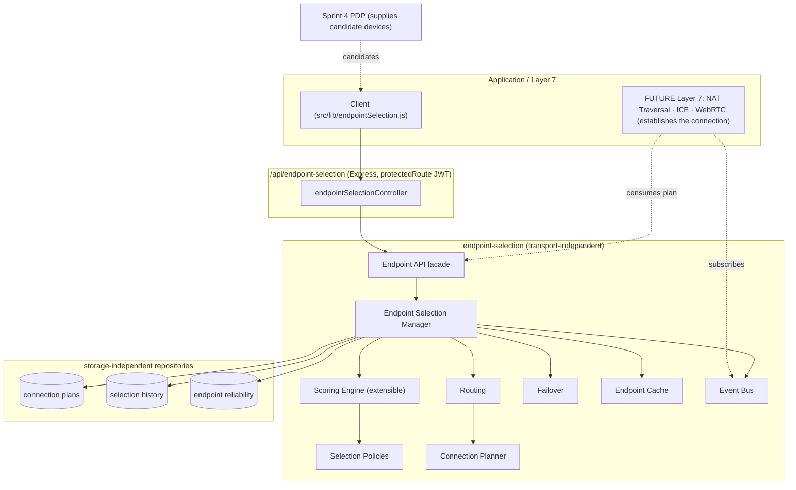
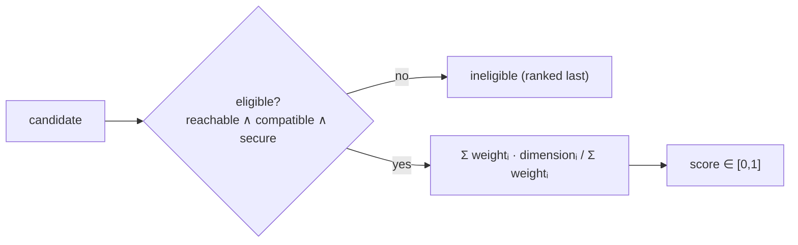
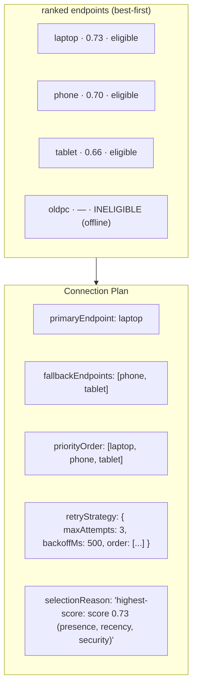
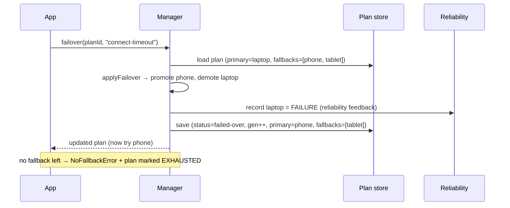

# Layer 6 · Sprint 5 — Endpoint Selection & Connection Planning

> **Status:** ✅ Complete · **Tests:** 984 total (55 new) · **Crypto:** none (control plane only) · **Additive:** new `server/endpoint-selection/` module + 3 new Mongo collections + `client/src/lib/endpointSelection.js`

## 0. TL;DR

A user may have **several devices connected at once** — a laptop, a phone, a tablet. Sprint 5
decides the **optimal endpoint(s)** to communicate with and produces a resilient, **failover-ready**
Connection Plan:

```
candidate devices ─▶ score (multi-dimensional, extensible) ─▶ rank ─▶ primary + fallbacks ─▶ Connection Plan
                                                                                                    │
                                                    ┌───────────────────────────────────────────────┘
                                                    ▼
                        { primaryEndpoint, fallbackEndpoints, priorityOrder, retryStrategy,
                          selectionReason, negotiatedCapabilities, preferredTransport }
```

Where Sprint 4 (PDP) produced a plan with a *basic* selection, Sprint 5 is a **dedicated,
intelligent selection engine**: multi-dimensional deterministic scoring, nine configurable policies,
historical reliability, and full failover support.

> [!IMPORTANT]
> **What this sprint deliberately does NOT do:** NAT Traversal · ICE/STUN/TURN · WebRTC · direct
> peer connections · **socket creation**. It selects endpoints + prepares plans with failover; it
> establishes NOTHING. The plan's `nat` block is the inert **placeholder** Layer 7 fills.

> [!NOTE]
> **Security invariant:** plans, rankings, DTOs, and events carry **PUBLIC control-plane data only**
> — device ids, public identities, presence status, negotiated capabilities, scores. There is **no
> field, anywhere, for a private key, session key, message key, chain key, or shared secret**, and a
> deep no-secret scan runs before a plan is stored or returned.

Everything is **additive**: it consumes the same candidate shape PDP produces and does not modify any
prior layer.

---

## 1. Where it sits



Candidates typically come from a PDP run (the reachable, capability-compatible devices) — this
subsystem is the *smarter selection stage* on top of them.

---

## 2. Module layout

```
server/endpoint-selection/
  index.js                        # public barrel
  errors.js                       # ERR_ENDPOINT_* typed errors (.code + .status)
  types/types.js                  # policies, dimensions, statuses, event types, constants, typedefs
  scorer/scoring.js               # extensible multi-dimensional scoring + ranking
  policies/policies.js            # 9 selection-policy weight profiles + resolve
  routing/routing.js              # routing decision (primary + fallbacks + retry + reroute)
  planner/connectionPlan.js       # EndpointConnectionPlan builder + inert nat placeholder
  failover/failover.js            # failover (promote fallback) + refresh + exhaust
  manager/endpointSelectionManager.js  # THE facade (generate/rank/select/failover/refresh/outcome)
  cache/cache.js                  # TTL + LRU cache (plans / rankings / results)
  validators/validators.js        # request/candidate validation + NO-SECRET invariant
  serializers/serializer.js       # PUBLIC DTOs (whitelist)
  events/events.js                # typed pub/sub bus
  api/endpointApi.js              # transport-independent facade (actingUser-scoped)
  repository/inMemoryEndpointRepository.js  # reference + test backend (plans + selections + reliability)
  repository/mongoEndpointRepository.js     # Mongo (Mongoose) backend
  models/EndpointConnectionPlan.model.js    # NEW collection (the output)
  models/SelectionRecord.model.js           # NEW collection (selection/routing history)
  models/EndpointReliability.model.js       # NEW collection (historical reliability)
  tests/                          # 55 tests, DB-free

server/controllers/endpointSelectionController.js   # REST binding (singleton manager)
server/routes/endpointSelectionRoute.js             # /api/endpoint-selection routes (JWT)
client/src/lib/endpointSelection.js                 # EndpointSelectionClient
```

---

## 3. The scoring engine (Step 4)

Deterministic, **extensible**, multi-dimensional. Each dimension is a pure function `→ [0,1]`; a
policy assigns weights and the engine returns the weighted average. New dimensions plug in via
`extraDimensions` without changing callers.

| Dimension | Signal |
| --- | --- |
| `presence` | online > away > busy > invisible (reachability quality) |
| `capability` | compatible + richness of the negotiated surface (shared transports, flags, compression) |
| `protocol` | protocol version height |
| `security` | crypto compatibility (+ meets a required minimum) |
| `platform` | matches a preferred platform |
| `userPreference` | matches a preferred device |
| `reliability` | **historical success ratio** (Laplace-smoothed) |
| `priority` | declared device priority |
| `recency` | how recently the device was active |
| `deviceType` | matches a preferred form factor (desktop/mobile) |
| `networkQuality`, `natType` | **FUTURE placeholders** — inert/neutral today |

**Hard eligibility gates** (a device may score but still be ineligible to be primary): must be
**reachable**, must be **capability-compatible**, and must **meet any security requirement**
(`minCryptoVersion`). Ranking places eligible above ineligible, higher score first, ties broken by
`deviceId` ascending — fully deterministic.



---

## 4. Selection policies (Step 5)

Named weight profiles that steer scoring toward different goals — all deterministic:

| Policy | Optimizes for |
| --- | --- |
| `highest-score` (default) | best overall weighted score |
| `most-recently-active` | the device the user is actually at |
| `preferred-platform` | a requested platform |
| `lowest-latency` | FUTURE — networkQuality placeholder (neutral); deterministic tie-break |
| `battery-friendly` | likely-plugged-in (desktop) endpoints, sparing mobile battery |
| `desktop-preferred` / `mobile-preferred` | a form factor |
| `manual-preference` | a pinned `preferredDeviceId` |
| `custom` | caller-supplied weights (+ optional custom dimension functions) |

A policy needs only *relative* weights — the engine normalizes. Weight overrides and a full custom
policy object (`{ weights, preferType, dimensions }`) are both supported.

---

## 5. Connection planning & endpoint ranking (Step 6)



The `EndpointConnectionPlan` carries: primary endpoint, ranked fallback endpoints, priority order,
selection reason, negotiated capabilities, preferred + fallback transports, a **retry strategy**, the
applied policy + weights, a priority, a generation counter, an expiration, and the inert `nat`
placeholder. Each endpoint includes its per-dimension **score breakdown** for transparency.

---

## 6. Failover planning (Step 7)



Failover **pre-computes the next move** so Layer 7 never re-runs selection mid-attempt — it just
walks `priorityOrder` / `retryStrategy.order`. Supported: primary failure → promote fallback, retry
ordering, alternative routing (`updateRouting` reroutes to a specific device), device recovery + plan
refresh (`refreshPlan` rebuilds from fresh candidates), and exhaustion (`EXHAUSTED` when nothing is
left). **No network reconnection happens here** — only the PLAN is reshaped. Recording an outcome
(`recordOutcome`) feeds the historical-reliability dimension so future selections learn.

---

## 7. Repositories (Step 8) & Caching (Step 9)

**Three new Mongo collections**, all metadata-only: `endpointconnectionplans` (the output),
`selectionrecords` (append-only selection/routing history with per-endpoint scoring metadata), and
`endpointreliabilities` (per-`(targetUser, deviceId)` success/failure counters feeding the
RELIABILITY dimension). Storage-independent contract with in-memory + Mongo backends.

The **Endpoint Cache** is a short-TTL, LRU cache of computed artifacts (plans / rankings / selection
results), keyed candidate-set-aware so a change in the reachable set re-keys. Its TTL is capped by
each plan's own `expiresAt`. It auto-invalidates by requester + target on any write (a recorded
outcome changes reliability → future scores differ). A future distributed deployment swaps it for
Redis behind the same interface (`get`/`set`/`invalidate*`/`pruneExpired`).

---

## 8. Validation (Step 13)

Covers every spec item: duplicate endpoints (candidate list), invalid rankings + selection conflicts
(a plan's primary must lead its priority order), expired plans, offline primary / no reachable
endpoint, missing fallback (failover with none → `NoFallbackError`), capability mismatch, and
malformed metadata. The core security check is `assertNoSecretMaterial` — a deep, cycle-safe scan —
run before any plan is stored or returned.

---

## 9. API surface (Steps 10 & 17)

Bound to HTTP at `/api/endpoint-selection`, behind the existing `protectedRoute` JWT middleware.

| Method + path | Purpose |
| --- | --- |
| `POST /api/endpoint-selection/plan` | generate an optimized connection plan |
| `POST /api/endpoint-selection/select` | select just the primary endpoint |
| `POST /api/endpoint-selection/rank` | rank candidate devices (no plan) |
| `GET /api/endpoint-selection/:planId` | a connection plan by id |
| `GET /api/endpoint-selection/:planId/status` | compact endpoint status |
| `GET /api/endpoint-selection/:planId/fallbacks` | the plan's fallback devices |
| `POST /api/endpoint-selection/:planId/failover` | promote the next fallback |
| `POST /api/endpoint-selection/:planId/refresh` | rebuild routing from fresh candidates |
| `POST /api/endpoint-selection/:planId/reroute` | try a specific device first |
| `POST /api/endpoint-selection/:planId/outcome` | record a connection outcome (reliability) |
| `GET /api/endpoint-selection` | routing/selection history |

**No connection is established** by any endpoint. Every public API has strong TypeScript-style JSDoc
types, examples, and `@security` / `@networking` / `@evolution` notes.

---

## 10. Client integration (Step 11)

`client/src/lib/endpointSelection.js` ships an `EndpointSelectionClient` that generates a plan from
candidate devices, **displays the active device** (`getActiveDevice`), the **preferred endpoint** +
**fallback devices** (`getFallbackDevices`), refreshes the plan (`refreshPlan`), handles selection
updates + failover (`failover`), reports outcomes (`recordOutcome`), and exposes a **future NAT hook**
(`getConnectionStrategy`) that hands the plan's ordered endpoints + retry strategy to a Layer 7
connection establisher — today it opens nothing. Handles PUBLIC metadata only.

---

## 11. Events (Step 12)

A typed bus (`EndpointEventBus`) emits: `endpoint.ranked`, `endpoint.primary_selected`,
`endpoint.fallback_generated`, `endpoint.routing_updated`, `endpoint.policy_applied`,
`endpoint.plan_created`, `endpoint.plan_updated`, `endpoint.selection_failed`,
`endpoint.outcome_recorded`, `endpoint.cache_invalidated`. Events carry PUBLIC data only. Layer 7
subscribes to `plan_created` / `routing_updated` to consume plans + reroutes as they happen.

---

## 12. Performance (Step 14)

- **Scoring + ranking** — pure, allocation-light; a full rank of N devices is O(N log N).
- **Repository lookups** — O(1) plan/reliability lookups; reliability fetched in one batched `getMany`.
- **Caching** — repeat identical generates hit the cache; candidate-set-aware keying keeps hits fresh.
- **Distributed scaling** — the manager is stateless beyond its store + (swappable) cache.

The suite includes a **50-device** ranking (deterministic + capped fallbacks), a 30-way
**concurrent-plan** check, and a **1000-ranking** latency budget.

---

## 13. Testing (Step 15)

**55 new tests, DB-free** (`node --test`), across 3 files + helpers:

- `scoring.test.js` — device-type inference, the scoring engine (eligibility gates, richness,
  reliability, custom dimensions), ranking determinism, policies, routing, the planner, and failover.
- `manager-api.test.js` — generate/rank/select, all policies steering selection, failover + reliability
  + refresh + reroute, selection failures + auth, the cache, and the API facade.
- `repository-scale.test.js` — plan/reliability/selection repository contracts, all validators, the
  **no-secret invariant**, concurrency, and large-scale/performance.

Full project suite: **984 pass / 0 fail** (929 prior + 55 new).

---

## 14. Future NAT Traversal integration & current limitations

The connection plan is exactly what **Layer 7** consumes:

- **Layer 7 (NAT Traversal / ICE / STUN / TURN / WebRTC / P2P)** → takes an
  `EndpointConnectionPlan`, walks its `priorityOrder` + `retryStrategy`, reads the `preferredTransport`
  per endpoint, fills the `nat` placeholder with ICE candidates / relays, and **establishes** the
  connection — failing over down the plan's fallback chain if the primary can't be reached. The
  `networkQuality` + `natType` scoring dimensions are the reserved extension points Layer 7 will
  populate to make selection NAT-aware.

**Limitations (by design):** this subsystem determines the *optimal endpoint(s)* and prepares
*resilient plans with failover* — it performs no NAT traversal, no ICE/STUN/TURN, no WebRTC, no P2P,
and **establishes no connection or socket**. Connection establishment belongs to Layer 7.
