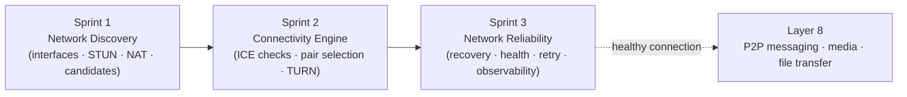
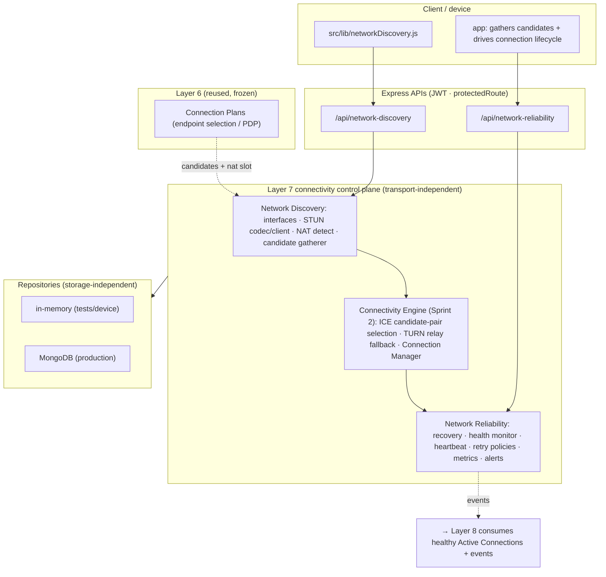
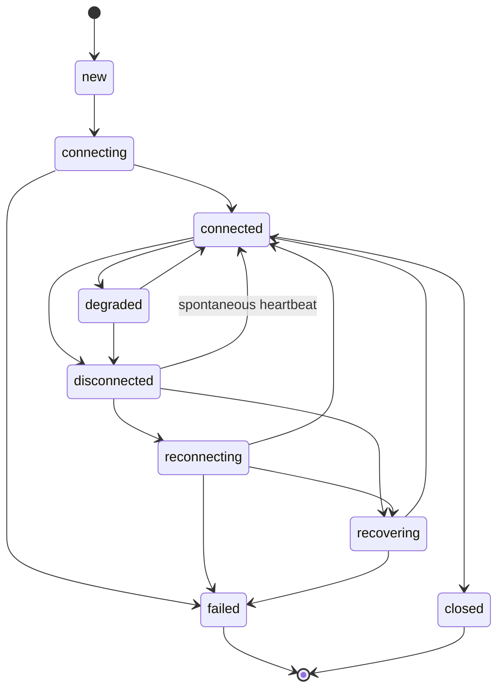
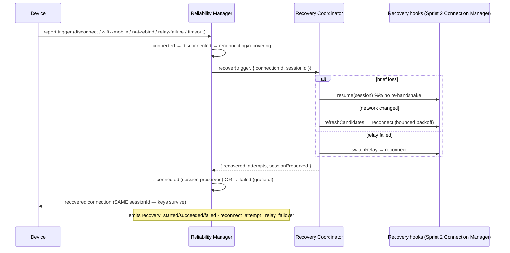
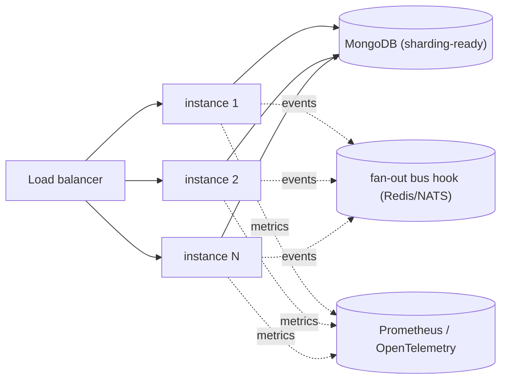
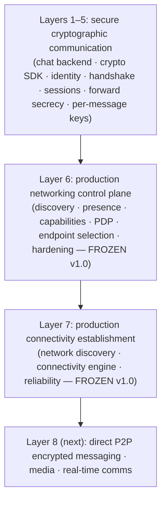

# Layer 7 — Connectivity Establishment · FINAL

> **Status:** ✅ LAYER 7 COMPLETE (3 sprints) · **Tests:** 1130 total (1130 pass / 0 fail) · **Crypto:** none (control plane only) · **Frozen:** connectivity v1.0

## 0. What Layer 7 is

Layer 6 produced validated **Connection Plans** (who + which endpoint + how). Layer 7 turns a plan
into a real, reliable connection. It is the transport-layer control plane that answers:

> *What is my network environment, which candidate path actually connects to a peer, and how do I
> keep that connection alive + recover it when the network changes — without ever re-doing the
> cryptographic handshake?*

> [!IMPORTANT]
> **Layer 7 carries NO application data.** It performs no peer-to-peer messaging, no data channels,
> no media streaming, and no file transfer. It produces + maintains an **Active Connection**; Layer 8
> consumes a *healthy* one to build direct P2P communication. The interfaces are frozen so Layer 8
> needs no networking redesign.

> [!NOTE]
> **Security invariant (whole layer):** the connectivity control plane carries **PUBLIC addressing +
> connection metadata only** — IPs, ports, NAT type, candidates, connection states, latencies, health
> scores, and the crypto `sessionId` (**an id, not a key**). **No private key, session key, message
> key, chain key, or shared secret** appears in any record, DTO, event, metric, or alert. Recovery
> **preserves the cryptographic session** by keeping `sessionId` stable across a reconnect.

---

## 1. Complete architecture

Each sprint is a **reusable, transport-independent subsystem** with its own typed event bus,
validators, serializers, in-memory + Mongo repositories, and caches. The reliability layer manages an
abstract **Active Connection** via injected recovery hooks, so it works with whatever the Connectivity
Engine provides.

---

## 2. Sprint-by-sprint

| Sprint | Subsystem | Delivers | Module | API |
| --- | --- | --- | --- | --- |
| 1 | **Network Discovery** | interfaces, STUN, NAT type, host/srflx candidates → Network Profile | `network-discovery/` | `/api/network-discovery` |
| 2 | **Connectivity Engine** | ICE connectivity checks, candidate-pair selection, TURN relay fallback, Active Connection Manager | (Sprint 2) | — |
| 3 | **Network Reliability** | recovery, health, retry policies, observability, freeze | `network-reliability/` | `/api/network-reliability` |

---

## 3. Sprint 1 — Network Discovery (recap)

Discovers the device's network environment: enumerates **interfaces** (host addresses), runs a modular
**STUN** client (pure RFC 5389 codec + injected transport, timeout/retry/fallback/latency) to learn
the public **server-reflexive** address, classifies **NAT** (`no-nat` / `cone` / `symmetric` /
`blocked`), and gathers RFC 8445 **candidates** (host + srflx, priority + foundation + SDP; relay is a
placeholder). Output: a reusable **Network Profile** + candidates, which fill the `nat` placeholder
(`{candidates, natType, reachability}`) that Layer 6's Connection Plans reserved. No ICE checks, no
TURN, no connection.

## 4. Sprint 2 — Connectivity Engine (recap)

Consumes two peers' profiles: forms **candidate pairs**, runs **ICE connectivity checks**, nominates a
working pair (`host` > `srflx` > `relay`), falls back to a **TURN relay** when direct traversal fails,
and hands an established **Active Connection** to the Connection Manager. It does not carry application
data.

## 5. Sprint 3 — Network Reliability (this sprint)

Makes an Active Connection production-grade.

### Connection lifecycle

### Recovery workflow (session-preserving)

| Trigger | Action | Session preserved |
| --- | --- | --- |
| network-loss | resume session (→ reconnect) | ✅ |
| wifi↔mobile / nat-rebind | refresh candidates → reconnect | ✅ |
| connection-timeout / unexpected-disconnect | reconnect (bounded backoff) | ✅ |
| relay-failure | switch relay → reconnect | ✅ |

### Health monitoring

A continuous **health score** `[0,1]` from **latency** (0.35) + **stability** (0.30, from missed
heartbeats + reconnects) + **activity** (0.20, recency) + **age** (0.15), mapped to
`healthy`/`degraded`/`unhealthy`. Heartbeats measure latency + reset the timeout; **packet loss** and
**jitter** are inert placeholders (no media-quality monitoring — Layer 8). A `HeartbeatMonitor` sweeps
timed-out connections and auto-recovers them.

### Retry policies

Configurable per connection/trigger: `immediate` / `fixed` / `exponential-backoff` (default) / `none`,
bounded by `maxAttempts`, `cooldownMs`, and an overall `recoveryTimeoutMs`, with deterministic jitter.
Manual + automatic reconnect are both supported.

---

## 6. Observability (Step 6)

A `ReliabilityMetrics` registry (counters/gauges/histograms, **Prometheus** renderer, **OpenTelemetry**
exporter hook) tracks: connection success/failure rate, reconnect + recovery counts, recovery success
rate, latency, health score, relay usage, candidate-selection time, and recovery time. A
`ReliabilityMonitor` raises threshold **alerts** (connection-failure spike, repeated recovery failure,
unhealthy connection, heartbeat timeout, relay overuse, NAT-rebind / reconnect storm) → the bus + a
persistent sink + a health status. Exposed at `/api/network-reliability/{health,metrics,alerts,protocol}`.

---

## 7. Security & threat model (Step 7)

| Threat | Control / assumption |
| --- | --- |
| Key/secret exposure | Metadata-only; no-secret deep-scan before storage; `sessionId` is an id, not a key |
| Connection / recovery authorization | JWT on every route; owner-scoped (only the owning device may inspect/recover) |
| **Session continuity** | A reconnect resumes the SAME `sessionId` (transport reconnect, not a new handshake) → forward-secret keys survive |
| **Replay resistance during reconnect** | A resumed session inherits Layer-5 per-message keys + replay windows → a reconnect cannot replay old ciphertext |
| **Connection hijacking** | A connection is bound to its authenticated device + session; ownership scoping prevents a third party adopting/recovering it |
| Reconnect-storm abuse / DoS | Bounded retry + cooldown + recovery timeout; rate-limit extension point; reconnect-storm alerts |
| Connection metadata leakage | Records are PUBLIC control-plane metadata; no message content |

`auditConnectivityApis()` machine-checks that every connectivity API is authenticated, owner-scoped,
and metadata-only, and surfaces the documented `SECURITY_ASSUMPTIONS` at
`/api/network-reliability/health`.

---

## 8. Performance & scalability (Step 8)

Managers are **stateless beyond their repository + cache**, so the layer scales horizontally.
Repositories are **sharding-ready** (keyed by `connectionId` / `deviceId`), heartbeat + recovery
sweeps are **idempotent** (safe on every instance), the injected `sleep`/timers make recovery loops
testable + non-blocking, and the event buses are the seam for a fan-out transport (Redis/NATS). The
suite includes a **500-connection** registration + recovery run, a **1000-recovery** benchmark, and a
**300-connection heartbeat sweep**.

---

## 9. Repositories & API hardening (Steps 9–10)

Storage-independent contracts with in-memory + Mongo backends across all three sprints; Layer 7 adds
**4 new Mongo collections** (`networkprofiles`, `discoveryhistories`, `activeconnections`,
`recoveryrecords` + `reliabilityalerts`), all **metadata-only**. Every API is JWT-authenticated,
owner-scoped, input-validated, bounded-paginated where it lists, versioned (schema + frozen protocol),
and backward-compatible (additive). Recovery/reconnect endpoints expose a rate-limit extension point.

---

## 10. Testing (Step 11)

**1130 tests, 0 fail** (DB-free, `node --test`). Layer 7 contributes **99** (51 discovery + 48
reliability): the STUN codec (IPv4/IPv6 round-trip, spoof rejection), NAT detection, candidate
generation, network-interruption + **WiFi↔mobile** + **NAT-rebind** + **relay-failure** recovery,
retry policies, health/heartbeat, the lifecycle FSM, repositories, **500-connection scale**, recovery
+ performance benchmarks, **failure injection** (throwing hooks), and **fuzz testing** of validators +
health + retry math (only typed errors ever escape).

---

## 11. Protocol freeze (Step 14)

The connectivity interfaces are **frozen at v1.0** (manifest in
`network-reliability/freeze/protocolFreeze.js`, served at `/api/network-reliability/protocol`). Frozen:
the Network Discovery manager + API + Network Profile + candidate model (RFC 8445) + STUN (RFC 5389),
the Connectivity Engine (Active Connection, pair selection, TURN fallback), and the Reliability manager
+ API + recovery + retry + health + events + repositories.

**Stable extension points for Layer 8:**

| Module | Seam | Layer 8 fills |
| --- | --- | --- |
| reliability/manager | `ActiveConnection` (connected + healthy) + `sessionId` | open app data channels, encrypt with Layer-5 session keys |
| reliability/events | `connection_state_changed` / `health_changed` / `recovery_succeeded` | pause/resume app streams as the connection degrades + recovers |
| reliability/recovery | recovery hooks + `sessionPreserved` | resume app streams over a recovered connection, no re-handshake |
| reliability/health | `packetLoss` + `jitter` placeholders | media adds real quality signals |
| reliability/observability | `registerExporter` | wire Prometheus/OpenTelemetry |

---

## 12. Known limitations (by design)

- **No application data** — Layer 7 stops at a healthy Active Connection. P2P messaging, data
  channels, media, and file transfer are **Layer 8**.
- Sprint 2's Connectivity Engine performs ICE + TURN; Sprint 3's recovery hooks are **injected** by it
  (the device drives the actual transport reconnect and confirms via heartbeat) — the server tracks +
  orchestrates state transport-independently.
- Caches + heartbeat monitors are **process-local**; interfaces are distributed-ready but a shared
  (Redis) backend + a leader-elected sweeper are deployment tasks.
- `packetLoss` / `jitter` / real network-quality live in Layer 8; here they are placeholders.

---

## 13. Where the project stands

The project now has **secure cryptographic communication**, a **production networking control plane**,
and **production connectivity establishment**. Layer 8 will consume healthy **Active Connections** to
implement direct peer-to-peer encrypted messaging, media transfer, and real-time communication —
**without modifying the networking architecture**.

The connectivity layer is **production-ready and frozen.** Layer 7 is complete.
