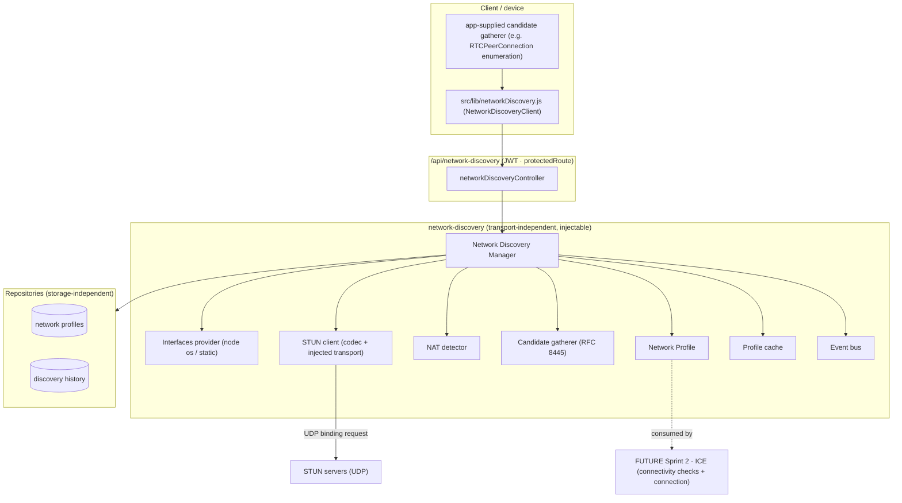
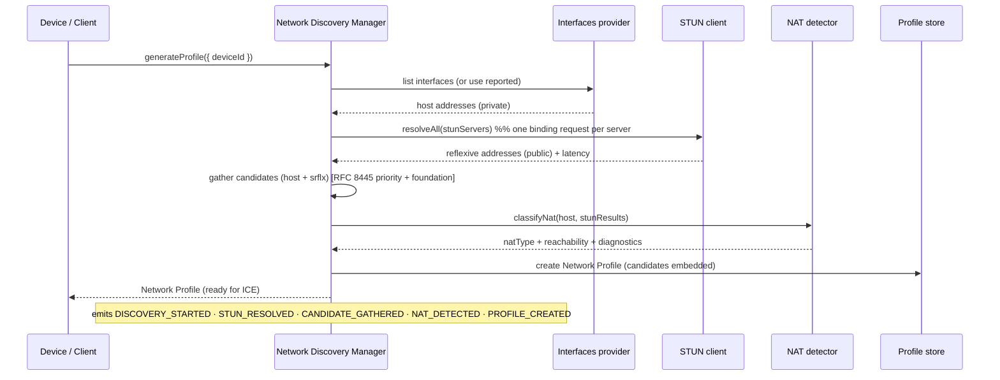
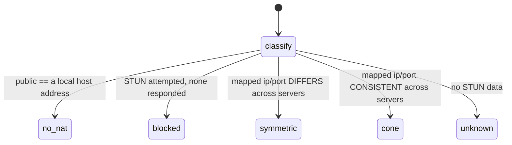

# Layer 7 · Sprint 1 — Network Discovery & Candidate Gathering

> **Status:** ✅ Complete · **Tests:** 1082 total (51 new) · **Crypto:** none (addressing metadata only) · **Additive:** new `server/network-discovery/` module + 2 new Mongo collections + `client/src/lib/networkDiscovery.js`

## 0. TL;DR

Layer 6 produced validated **Connection Plans** (who + which endpoint). Layer 7 begins turning a
plan into a real connection. **Sprint 1 discovers each device's network environment** and produces
the raw materials ICE needs:

> A reusable **Network Profile** + ICE-style **Connection Candidates** (host + server-reflexive),
> with the device's interfaces, public/private addresses, and detected **NAT type**.

```
interfaces (host)  +  STUN (server-reflexive)  →  NAT classification  →  Network Profile + Candidates
```

> [!IMPORTANT]
> **This sprint discovers + gathers ONLY.** It performs NO ICE connectivity checks, NO candidate-
> pair selection, NO TURN relay, NO WebRTC, NO peer connections, and opens NO peer socket. STUN opens
> a UDP socket only to ask a STUN server "what public address do you see?" — that is the discovery
> mechanism, not a connection. A future ICE sprint consumes the profile + candidates.

> [!NOTE]
> **Security invariant:** a profile/candidate carries **PUBLIC network addressing metadata only** —
> IPs, ports, NAT type, interface descriptors, candidates. There is **no private key, session key,
> message key, chain key, or shared secret** anywhere, and a deep no-secret scan is enforced before
> storage. (Addresses are sensitive but not cryptographic secrets.)

The subsystem is **injectable + transport-independent**: it runs in Node (real `os` interfaces + UDP
STUN), in the browser (the app gathers candidates and reports them), or under test (mocks).

---

## 1. Where it sits



---

## 2. Module layout

```
server/network-discovery/
  index.js                        # public barrel
  errors.js                       # ERR_NETDISC_* typed errors
  types/types.js                  # candidate/NAT/state enums, constants, typedefs
  manager/networkDiscoveryManager.js   # THE facade (generate/refresh/gather/classify/cache/lifecycle)
  interfaces/interfaces.js        # node + static interface providers, normalization, classification
  stun/stunMessage.js             # RFC 5389 codec (binding request/response, XOR-MAPPED-ADDRESS)
  stun/stunClient.js              # modular client: injected transport, timeout/retry/fallback/latency
  stun/nodeUdpTransport.js        # production UDP transport (dgram) — server/agent scenarios
  nat/natDetector.js              # NAT classification (no-nat/cone/symmetric/blocked) + reachability
  candidates/candidate.js         # host/srflx candidates + relay placeholder, RFC 8445 priority/foundation
  profile/profile.js              # Network Profile factory + signature (network-change detection)
  cache/cache.js                  # TTL + LRU profile cache
  validators/validators.js        # request/interface/candidate/NAT validation + no-secret invariant
  serializers/serializer.js       # PUBLIC DTOs
  events/events.js                # typed pub/sub bus
  api/discoveryApi.js             # transport-independent facade (actingUser-scoped)
  repository/inMemoryDiscoveryRepository.js   # reference + test backend (profiles + history)
  repository/mongoDiscoveryRepository.js      # Mongo (Mongoose) backend
  models/NetworkProfile.model.js               # NEW collection
  models/DiscoveryHistory.model.js             # NEW collection
  tests/                          # 51 tests, DB-free

server/controllers/networkDiscoveryController.js   # REST binding (singleton manager)
server/routes/networkDiscoveryRoute.js             # /api/network-discovery routes (JWT)
client/src/lib/networkDiscovery.js                 # NetworkDiscoveryClient
```

---

## 3. The discovery workflow (Step 3)



**Two input modes.** *Server-run*: the manager uses its injected interface provider + STUN client.
*Device-reported* (the browser path): the client gathers interfaces/candidates/STUN results itself
and REPORTS them; the manager validates + normalizes + assembles the profile. Both produce the same
profile shape.

---

## 4. Network Profile (Step 4)

```jsonc
{
  "profileId": "…", "deviceId": "d1", "userId": "u1", "state": "ready",
  "privateAddresses": ["192.168.1.8"], "publicAddress": "203.0.113.9",
  "privatePorts": [50000], "publicPorts": [40000],
  "natType": "cone",
  "interfaces": [ { "name": "wlo1", "family": "IPv4", "address": "192.168.1.8", "internal": false } ],
  "candidates": [ /* host + srflx ConnectionCandidates */ ],
  "connectionMetadata": { "hostCandidateCount": 1, "srflxCandidateCount": 1, "relayCandidateCount": 0, "symmetric": false },
  "nat": { "type": "cone", "symmetric": false, "portMapping": {…}, "reachability": {…} },
  "diagnostics": { "serversQueried": 2, "serversResponded": 2, "avgLatencyMs": 12 },
  "discoveredAt": "…", "expiresAt": "…", "version": 1
}
```

Contains **no cryptographic secrets**. A profile is a snapshot with a TTL — the network can change,
so it expires and is re-discovered (a refresh detects a **network change** via a signature diff).

---

## 5. NAT detection (Step 5)



Classification is from **observed mapping behaviour**: consistent public mapping across servers →
`cone`; divergent → `symmetric` (hardest to traverse); public == private → `no-nat`; no response →
`blocked`. Cone subtypes (full/restricted/port-restricted) and inbound-reachability/hairpinning are
recorded as **placeholders** — they need behaviour tests / ICE, which are future diagnostics. NAT
metadata includes `portMapping`, `reachability`, and a symmetric-NAT flag.

---

## 6. STUN integration (Step 6)

A **modular** two-layer design:

- **`stunMessage.js`** — a pure RFC 5389 codec: builds a Binding Request (magic cookie + 96-bit
  transaction id) and decodes `XOR-MAPPED-ADDRESS` / `MAPPED-ADDRESS` (IPv4 + IPv6). No sockets → fully
  unit-testable.
- **`stunClient.js`** — orchestration over an **injected transport**: configurable servers, per-server
  timeout + retries, **fallback** down the server list, **latency measurement**, and transaction-id
  verification (anti-spoof). `resolveAll()` queries every server (for symmetric-NAT detection).
- **`nodeUdpTransport.js`** — the production UDP transport (`dgram`), bound per query + closed. Tests
  inject a mock transport, so the whole stack is DB- and network-free.

---

## 7. Candidate gathering (Step 7)

ICE-style candidates (RFC 8445 shape) with a computed **priority** + **foundation** + SDP line:

- **Host** — one per usable interface (internal/link-local excluded); `typ host`.
- **Server-reflexive (srflx)** — the public address STUN observed; `raddr`/`rport` = the host base.
- **Relay** — an inert **placeholder** (TURN allocation is a future sprint).

`priority = 2^24·typePref + 2^8·localPref + (256 − component)` (host typePref 126 > srflx 100);
`foundation = hash(type, baseIp, protocol, server)`. Candidates are de-duplicated by transport
address and carry a TTL. Device-reported candidates (browser-gathered) are normalized (priority/
foundation/SDP recomputed). **No connectivity checks** are performed — candidates are gathered, not
tested.

---

## 8. Repositories (Step 8) & Caching (Step 9)

**Two new Mongo collections**, both metadata-only: `networkprofiles` (the current profile per device,
candidates embedded; unique on `profileId`, indexed on `{deviceId,state}` + `{state,expiresAt}`) and
`discoveryhistories` (append-only discovery/refresh/expire snapshots for diagnostics + change
tracking). Storage-independent contract with in-memory + Mongo backends. Creating a new profile marks
any prior live one `stale` (one current profile per device).

The **profile cache** is TTL + LRU, keyed per device, with the entry TTL capped by the profile's own
`expiresAt` (a cached profile is never served past its validity) and `invalidateDevice` on refresh —
behind a minimal interface a future Redis deployment swaps in.

---

## 9. Validation (Step 13)

Covers every spec item: invalid interfaces, missing public address, malformed candidates, **duplicate
candidates** (same type/ip/port/transport), expired profiles, invalid NAT metadata, repository
consistency (contract validators), and unauthorized requests (owner-scoped by user + device). The
core security check is `assertNoSecretMaterial` — a deep, cycle-safe scan — run before storage.

---

## 10. API surface (Steps 10 & 17)

Bound to HTTP at `/api/network-discovery`, behind the existing `protectedRoute` JWT middleware.

| Method + path | Purpose |
| --- | --- |
| `POST /api/network-discovery/generate` | generate the caller's device network profile |
| `POST /api/network-discovery/refresh` | refresh the profile (re-discover) |
| `GET /api/network-discovery/profile/:profileId` | a profile by id |
| `GET /api/network-discovery/device/:deviceId` | the device's current profile |
| `GET /api/network-discovery/device/:deviceId/candidates` | non-expired candidates |
| `GET /api/network-discovery/device/:deviceId/interfaces` | interfaces |
| `GET /api/network-discovery/device/:deviceId/public-address` | public address |
| `GET /api/network-discovery/device/:deviceId/nat` | NAT info |
| `GET /api/network-discovery/device/:deviceId/diagnostics` | diagnostics + history |

Every public API has strong TypeScript-style JSDoc types, examples, and `@security` / `@networking` /
NAT notes.

---

## 11. Client integration (Step 11)

`client/src/lib/networkDiscovery.js` ships a `NetworkDiscoveryClient` that **automatically discovers**
(gather + submit), **refreshes**, tracks **interface/network changes** (`online`/`offline` +
`navigator.connection`), **caches** the profile, and exposes a **future ICE hook**
(`getConnectionInputs`) that returns the gathered candidates + NAT type for Sprint 2 — today it opens
nothing. Candidate gathering is a **pluggable `gatherer`** the app supplies (this lib does not
implement WebRTC). Handles PUBLIC metadata only.

---

## 12. Events (Step 12)

A typed bus (`DiscoveryEventBus`) emits: `netdisc.discovery_started`, `netdisc.profile_created`,
`netdisc.profile_refreshed`, `netdisc.nat_detected`, `netdisc.stun_resolved`, `netdisc.stun_failed`,
`netdisc.candidate_gathered`, `netdisc.candidate_expired`, `netdisc.network_changed`,
`netdisc.discovery_failed`. Events carry PUBLIC addressing metadata only. The future ICE sprint
subscribes to `candidate_gathered` + `network_changed` to react.

---

## 13. Performance (Step 14)

- **STUN** — one binding request per server, parallel `resolveAll`, per-server timeout + bounded
  retries; the codec is pure Buffer work.
- **Candidate generation** — O(interfaces + stun results); de-duplicated.
- **Repository/cache** — O(1) by `profileId` + `deviceId`; short-TTL cache absorbs repeat reads.
- **Concurrency** — independent per device; profiles are keyed by device.

The suite includes a **500-device** discovery run and a **1000-round-trip STUN codec** benchmark, both
under a budget.

---

## 14. Testing (Step 15)

**51 new tests, DB-free** (`node --test`), across 3 files + helpers:

- `stun-candidates.test.js` — the STUN codec (IPv4/IPv6 round-trip, bad-cookie/short-message, spoof
  rejection), the STUN client (fallback, latency, resolveAll), interface normalization, candidate
  generation (priority/foundation/SDP/dedupe/normalize), and NAT detection (no-nat/cone/symmetric/
  blocked/unknown).
- `manager-api.test.js` — profile generation (server-run + device-reported), symmetric/blocked NAT,
  refresh + network-change, queries + lifecycle + lazy expiry, profile/cache helpers, validation, and
  the API facade.
- `repository-scale.test.js` — profile + history repository contracts, multiple interfaces,
  concurrency, and large-scale/performance.

Full project suite: **1082 pass / 0 fail** (1031 prior + 51 new).

---

## 15. Future ICE integration (Sprint 2)

Sprint 2 (ICE) consumes the Network Profile:

- It takes the **candidates** (host + srflx) + **NAT type** from the profile, forms **candidate pairs**
  with a remote peer's candidates (from their profile), runs **connectivity checks** (STUN binding
  requests across pairs), and nominates a working pair — then hands off to transport establishment.
- It fills the reachability placeholders (`inboundReachable`, `hairpinning`) with real check results,
  discovers **peer-reflexive** candidates during checks, and adds **TURN relay** candidates (the relay
  placeholder becomes real). The `networkQuality`/`natType` signals feed back into Layer 6 endpoint
  selection.

**Limitations (by design):** this sprint discovers + gathers only. No ICE connectivity checks, no
candidate-pair selection, no TURN relay, no WebRTC, no peer connection, no socket establishment.
Those belong to Sprint 2 and beyond. The Network Profile + candidates are the validated inputs that
make them possible.
