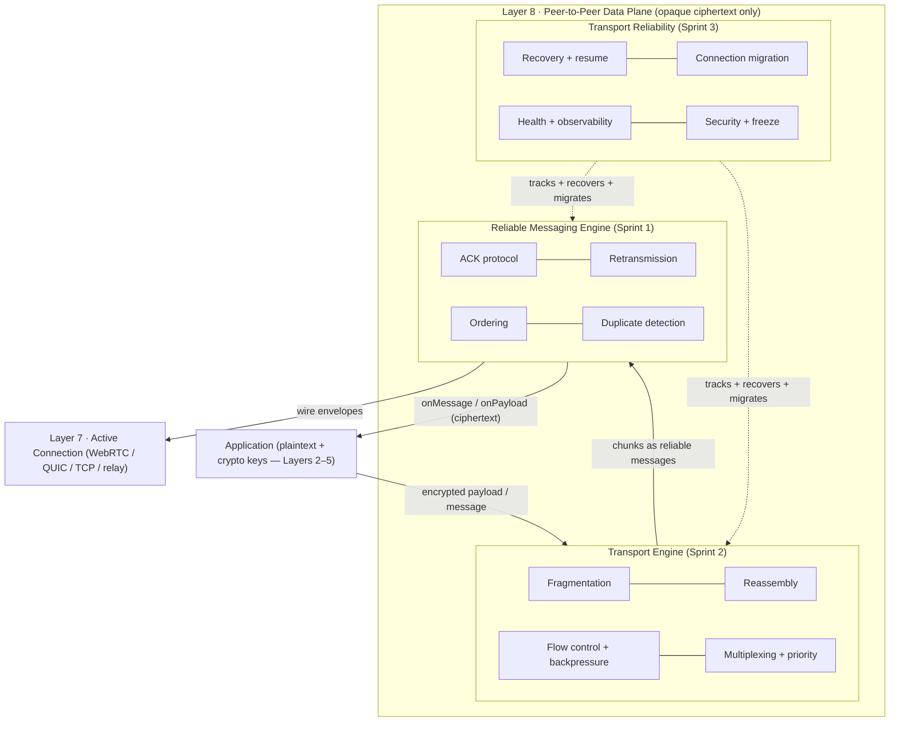
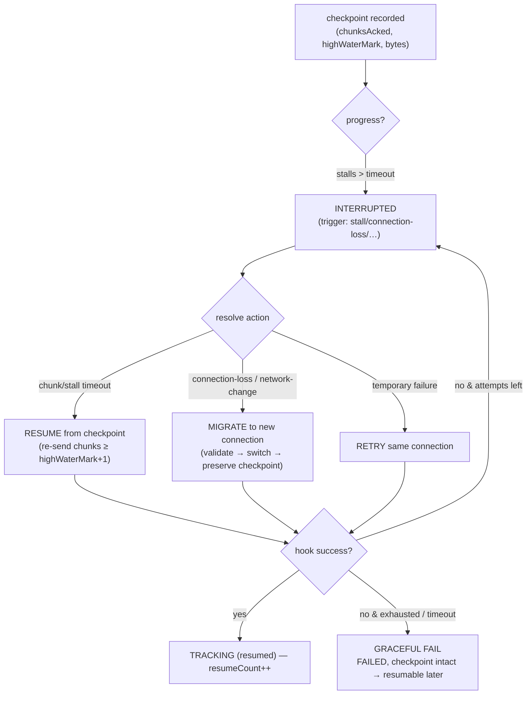
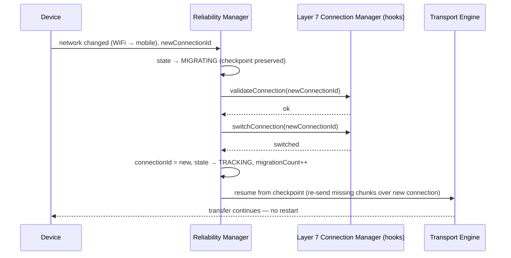
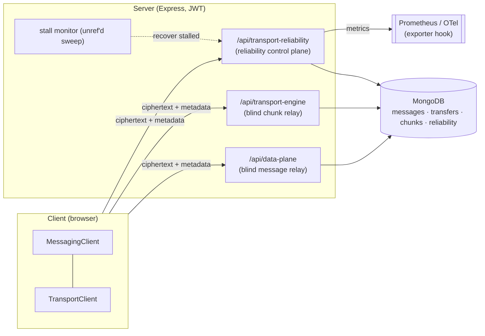

# LAYER 8 — Peer-to-Peer Data Plane · FINAL

> **Status:** ✅ COMPLETE + FROZEN v1.0 · **Tests:** 1348 project-wide, all green · **New crypto:** none in Layer 8
>
> Layer 8 is the **peer-to-peer Data Plane**: it reliably transports application data — messages and
> large encrypted payloads (files, images, videos, voice notes, documents, binary) — across the Active
> Connections that Layer 7 established, and makes that transport production-grade. It carries **opaque
> ciphertext only**; the cryptographic guarantees come from Layers 2–5.

Layer 8 was built in three sprints, each additive and each frozen here:

| Sprint | Subsystem | Delivers |
|---|---|---|
| **1** | `data-plane/` | Reliable Messaging Engine — delivery FSM, ACK protocol, retransmission, ordering, duplicate detection |
| **2** | `transport-engine/` | Transport Engine — fragmentation, reassembly, flow control, backpressure, multiplexing, priority scheduling |
| **3** | `transport-reliability/` | Reliability & Hardening — recovery, resume, connection migration, health, observability, security, freeze |

---

## 1. Complete Data Plane architecture



Each large-payload **chunk** rides as one Sprint-1 **reliable message** (filling that layer's reserved
`fragment` slot), so per-chunk ACK + retransmission + ordering + dedup are inherited; Sprint 2 adds the
transfer-level concerns; Sprint 3 wraps both with reliability + hardening. Every subsystem is
**transport-independent** (injected transport) and additive.

---

## 2. Transfer lifecycle (Sprint 2 engine + Sprint 3 reliability)

```mermaid
stateDiagram-v2
  direction LR
  state "Transport Engine transfer" as E {
    [*] --> created --> fragmenting --> active
    active --> paused --> active
    active --> reassembling --> completed
    active --> completed
    active --> failed
  }
  state "Reliability tracking" as R {
    [*] --> tracking
    tracking --> degraded --> tracking
    tracking --> interrupted --> recovering
    recovering --> tracking : resumed
    recovering --> migrating --> tracking : migrated
    recovering --> failed : exhausted (checkpoint intact)
    tracking --> completed
  }
```

The engine FSM tracks fragmentation progress; the reliability FSM tracks continuity + health. They run
in parallel over the same transfer.

---

## 3. Recovery + resume workflow



**Recovery never corrupts transfer state:** the checkpoint is read (never mutated) and advanced only
*monotonically*; state transitions are FSM-validated with version bumps; on exhaustion the transfer
fails *gracefully* with its checkpoint intact so it can resume later.

---

## 4. Connection migration (WiFi ↔ mobile) sequence



A migration is a **transport swap, not a re-handshake** — the crypto session (and its forward-secret
keys) survives, and the checkpoint means the transfer continues from where it left off.

---

## 5. Repositories

| Subsystem | Stores (in-memory + Mongo, identical contract) |
|---|---|
| `data-plane` | messages · inbound · ackHistory · ordering |
| `transport-engine` | transfers · chunks (opaque fragments) · progress · history · audit |
| `transport-reliability` | records · recoveryHistory · migrationHistory · alerts · audit |

Storage-independent behind the same interfaces; TTL/expiry via `expiresAt`; concurrency via optimistic
`version` bumps; deep-copy isolation in-memory; `.lean()` reads in Mongo. All additive collections.

---

## 6. Performance & scalability

Fragmentation, reassembly, flow control, and checkpointing are O(n) over the payload with O(1) window /
dedup / checkpoint updates; scheduling is priority + aging with round-robin fairness. The reliability
manager is stateless beyond its repository, so it scales horizontally; recovery is a bounded, idempotent
operation; metrics are in-process aggregates. Verified with 4 MiB high-throughput transfers, hundreds of
concurrent transfers, and 2 000-checkpoint bursts.

---

## 7. Observability

`TransferMetrics` (Prometheus text + OpenTelemetry export hook) tracks transfer throughput + latency,
average chunk size, transfer + recovery success rate, retry + resume + migration counts, queue length,
outstanding chunks, backpressure events, concurrent transfers, and health score. `TransportMonitor`
raises typed alerts (failure spike, repeated recovery failure, unhealthy transfer, stall, retry /
backpressure / migration storms). Read-only endpoints: `/health`, `/metrics` (`?format=prometheus`),
`/alerts`, `/transfers/:id/diagnostics`, `/protocol`, `/security-audit`.

---

## 8. Security & threat model

**Invariant:** the Data Plane transports **opaque ciphertext only** — no plaintext or key material in
any record, chunk, wire envelope, event, or DTO (enforced by a no-plaintext deep scan before every
persist + wire build). Every chunk + whole payload is SHA-256 integrity-checksummed.

| Threat | Mitigation |
|---|---|
| Payload disclosure at the server / relay | Server is a blind relay — stores ciphertext, never decrypts, holds no keys |
| Tampering / corruption in transit | Per-chunk + whole-payload integrity checksums; a mismatch is rejected + retransmitted |
| Replay | Transport dedup (at-most-once) + Layer-5 per-message keys & replay windows; resume re-sends only missing chunks |
| Unauthorized transfer access / control | JWT auth + owner-scoping — only a transfer's participants may relay/pull/control/recover |
| Transfer hijack via migration | Migration is owner-scoped + preserves the bound crypto session; a transport swap, never a re-handshake |
| Abuse (chunk flood, recovery storm) | Rate-limit extension point on relay/recover/migrate; bounded recovery attempts + backoff |
| Resource exhaustion | Backpressure (receiver window + sender resource guard), TTL expiry, bounded buffers |

The security posture is machine-readable (`/api/transport-reliability/security-audit`) and audited in
tests.

---

## 9. Deployment



The engines run **peer-to-peer on the client** over Layer-7 Active Connections; the server provides
blind store-and-forward relays + the reliability control plane. The stall monitor runs an `unref`'d
periodic sweep. All read-only observability is JWT-protected.

---

## 10. Testing

1348 tests project-wide, DB-free (`node --test`), deterministic clocks / id generators / seeded PRNGs.
Layer 8 adds: reliable delivery / ACK / ordering / retransmission / dedup (Sprint 1); large
file/image/document/video/voice-note transfers, fragmentation, reassembly, flow control, backpressure,
priority + starvation, multiplexing, 4 MiB throughput, adversarial-loss fuzz (Sprint 2); recovery,
resume-from-checkpoint, connection migration (WiFi ↔ mobile), stall detection, health scoring, metrics
+ alerts, security audit, protocol freeze, and a randomized interrupt/recover/migrate **protocol fuzz**
asserting FSM legality + checkpoint monotonicity (Sprint 3).

---

## 11. Known limitations

- **Recovery hooks are optimistic by default** — the server tracks + orchestrates; the DEVICE re-sends
  chunks + Layer 7 validates/switches connections, confirming via the next checkpoint. A production
  deployment injects concrete hooks bound to the real Transport Engine + Connection Manager.
- **Checkpoint durability across app restarts** is a Layer 9 concern — Sprint 3 keeps checkpoints in
  the repository, but cross-session resume (offline) is the seam Layer 9 fills.
- **Backpressure is cooperative** (application-level pacing), layered over — not replacing — transport
  congestion control.
- **Single-payload memory** — a transfer larger than the receive buffer is paced (slow), never
  deadlocked, but true streaming reassembly is a future optimization.

---

## 12. Protocol freeze & Layer 9 integration

The whole Data Plane is **frozen at v1.0** (`transport-reliability/freeze`,
`/api/transport-reliability/protocol`). Stable interfaces: the Messaging + Transport engines + their
service facades + relays, the wire models, the event buses, and the reliability manager + checkpoint /
resume / migration seams.

**Layer 9 (Offline Encrypted Synchronization) builds on this WITHOUT modifying the transport
architecture:**

- replay queued offline **messages** through the same reliable `MessagingEngine` on reconnect;
- resume a large offline **transfer** from its last **checkpoint** (`planResume` / `advanceCheckpoint`)
  — persist checkpoints durably across app restarts;
- continue a sync transfer across a device **network change** via `ConnectionMigrator`;
- drive the sync state machine off the `ReliabilityEventBus` (`transfer_interrupted` /
  `recovery_succeeded` / `transfer_completed`).

Layer 8 deliberately does **not** implement: offline synchronization, conflict resolution, group
messaging, voice/video calls, live streaming, or media codecs.

---

## 13. The stack today

- ✅ **Production Cryptographic Layer** (Layers 2–5)
- ✅ **Production Networking Control Plane** (Layer 6)
- ✅ **Production Connectivity Layer** (Layer 7)
- ✅ **Production Peer-to-Peer Data Plane** (Layer 8 — this document)

Next: **Layer 9 — Offline Encrypted Synchronization**, on top of a mature, frozen Data Plane.
