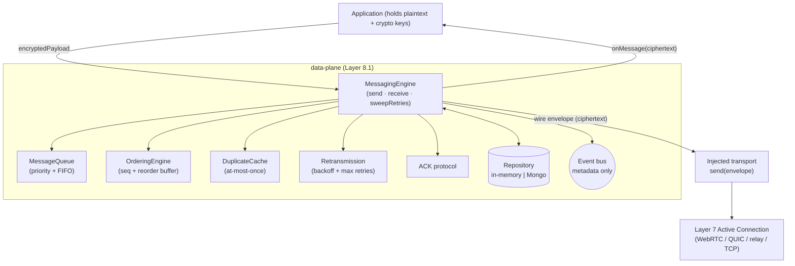
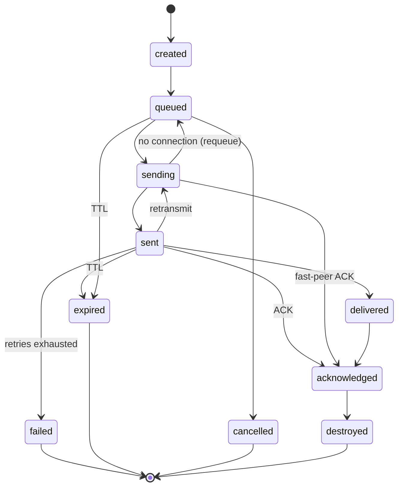
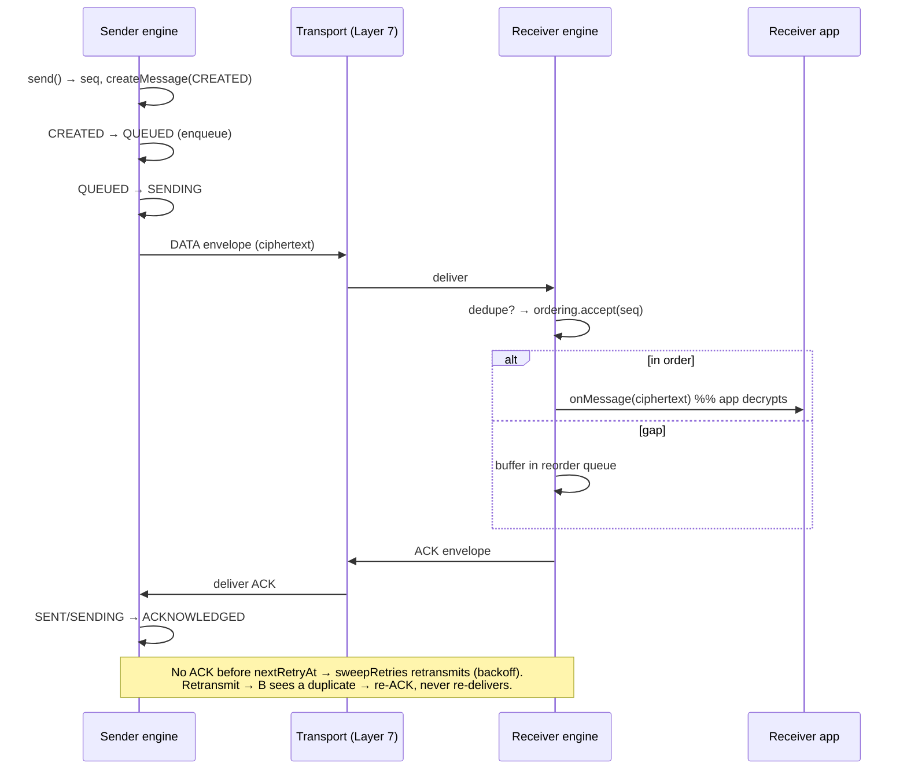

# Layer 8 · Sprint 1 — Reliable P2P Messaging Engine (Data Plane)

> **Status:** ✅ Complete · **Tests:** 82 data-plane tests (1212 project-wide, all green) · **New crypto:** none
>
> The first **data plane**. Everything below Layer 8 built the *secure channel* (identity, handshake,
> session keys, forward secrecy, per-message keys) and the *connectivity* (discovery, presence,
> endpoint selection, active connections, reliability). This sprint delivers the **reliable transport
> of already-encrypted application messages** across those Active Connections: guaranteed delivery,
> ordering, acknowledgements, retransmission, and duplicate detection.

---

## 1. Scope

**In scope (this sprint):** reliable delivery · message ordering · delivery tracking · ACK protocol ·
retransmissions · duplicate detection · message queues · a reusable, transport-independent engine ·
in-memory + Mongo repositories · a blind server relay · client integration · events · tests · docs.

**Explicitly OUT of scope (Layer 8, Sprint 2):** file transfer · chunking · fragmentation · streaming
· voice · video · media transport. The `fragment` slot on a message + the reorder-buffer machinery are
the inert seams Sprint 2 fills.

### The one invariant

> The data plane carries **opaque ciphertext ONLY.** It NEVER encrypts, decrypts, or inspects a
> payload — the crypto layer (Layers 2–5) already produced the ciphertext. No record, wire envelope,
> ACK, event, or DTO contains plaintext or key material.

This is enforced in code by `assertNoPlaintext()` (a cycle-safe deep scan for secret/plaintext key
names), invoked before every persist and before every wire envelope is built.

---

## 2. Architecture

The engine sends over an **injected transport** (`send(envelope) → Promise<void>`), so it reuses ANY
Layer-7 connection — WebRTC, QUIC, relay, or TCP — without change. One `MessagingEngine` runs per
device and both sends (outbound) and receives (inbound).



**Folders** (`server/data-plane/`): `types` · `errors` · `lifecycle` · `delivery` (message + dedupe) ·
`transport` (wire + loopback) · `ordering` · `acknowledgement` · `retransmission` · `queue` ·
`validators` · `serializers` · `events` · `repository` (in-memory + Mongo) · `models` · `manager`
(the engine) · `api` (service facade + blind relay).

---

## 3. Message model

A transported message binds a conversation + sender/receiver device to an **opaque** ciphertext, a
per-conversation sequence number, a delivery state, priority, retry bookkeeping, transport/audit
metadata, and an inert `fragment` placeholder. There is deliberately **no field** for plaintext or a
key.

| Field | Meaning |
|---|---|
| `messageId` | unique id |
| `conversationId` / `senderDeviceId` / `receiverDeviceId` | routing |
| `encryptedPayload` | **opaque ciphertext envelope** (Mixed; never inspected) |
| `sequenceNumber` | per-(conversation, sender) monotonic sequence |
| `priority` | `high` · `normal` · `low` (drives the send queue) |
| `state` | delivery FSM state (below) |
| `retryCount` · `nextRetryAt` · `expiresAt` | retransmission + TTL |
| `fragment` | `{ fragmented: false, reserved: true }` — Sprint 2 seam |

---

## 4. Delivery state machine



Every transition is validated by `assertDeliveryTransition()`. `acknowledged` / `failed` / `expired`
/ `cancelled` are terminal; `acknowledged` is the success terminal.

---

## 5. Reliable delivery + ACK workflow



**ACK types:** a normal `ack`, a `duplicate-ack` (re-ACK of an already-seen message so the sender
stops retrying), and a batched `delayed-ack`. A received **out-of-order** message is still ACKed — its
transmission succeeded; ordering is a receiver-internal concern.

**Retransmission:** a `SENT` message carries `nextRetryAt`. `sweepRetries(now)` finds due messages and
either retransmits (exponential backoff with deterministic jitter, capped, up to `maxRetries`), fails
them (`retry-exhausted`), or expires them (past TTL). Retransmission re-sends the **same** ciphertext
envelope — the receiver's `DuplicateCache` guarantees **at-most-once delivery to the app**.

---

## 6. Ordering + duplicate detection

- **Ordering** (`OrderingEngine`): per-conversation `expected` sequence + a reorder buffer. `seq ===
  expected` delivers and drains any now-contiguous run; `seq > expected` buffers (gap); `seq <
  expected` is a duplicate. If the buffer overflows its cap, the engine force-recovers past a
  permanently-missing sequence.
- **Duplicate detection** (`DuplicateCache`): a bounded LRU of seen message ids (per conversation) +
  seen ACK ids. A re-transmitted or re-ordered message whose id was already delivered is re-ACKed, not
  re-delivered. `checkReplay()` is an inert placeholder — cryptographic replay resistance already
  lives in Layer 5.

---

## 7. Server integration — the blind relay

The engine runs **peer-to-peer on the client**. On the server, `DataPlaneRelayService` is a **blind
store-and-forward relay** mounted at `/api/data-plane` (JWT-protected). It persists ciphertext +
delivery metadata and never decrypts.

| Method | Route | Who | Purpose |
|---|---|---|---|
| `POST` | `/relay` | sender | relay an encrypted message |
| `GET` | `/inbox/:conversationId` | receiver | pull undelivered messages (with ciphertext) → `DELIVERED` |
| `POST` | `/:messageId/ack` | receiver | acknowledge → `ACKNOWLEDGED` |
| `GET` | `/:messageId/status` | sender | delivery status |
| `GET` | `/pending/:conversationId` | sender | in-flight messages |
| `GET` | `/history/:conversationId` | any | delivery history (metadata) |
| `GET` | `/diagnostics/:conversationId` | any | aggregate delivery diagnostics |
| `GET` | `/status` | any | relay posture (`canDecrypt: false`) |

Ownership is enforced: only the sender reads its own status/pending; only the receiver pulls its inbox
and ACKs.

---

## 8. Client integration

`client/src/lib/messaging.js` — `MessagingClient` wraps `/api/data-plane` and provides the
send / receive / track surface. Encryption + decryption are **injected** hooks (the crypto layer); the
lib itself only ever transmits ciphertext.

```js
const mc = new MessagingClient({ axios, deviceId, encrypt, decrypt });
mc.onMessage(({ text, sender }) => showBubble(sender, text)); // decrypted delivery
mc.startInboxPolling("conversation-123");                     // pull → decrypt → ACK
const { messageId } = await mc.send({ conversationId: "conversation-123", receiverDeviceId: "bob", text: "hi" });
await mc.getStatus(messageId);                                // "acknowledged" once bob ACKs
```

---

## 9. Testing

DB-free (`node --test`), deterministic clock + id generator + seeded PRNG (no `Math.random`). Suites:
reliable delivery + ACK · ordering (gaps, reorder, force-recovery) · retransmission (backoff, max
retries, expiry, reconnect flush, **no double-delivery on lost ACKs**) · duplicate detection + priority
queue · lifecycle FSM + repository contract · validators + serializers (no-plaintext / no-payload-leak)
· service facade · blind relay · and high-throughput / concurrency / **adversarial reorder+dup fuzz** /
link-flap stress — each asserting exactly-once, in-order delivery.

```
node --test "data-plane/tests/**/*.test.js"
```

---

## 10. What's next (Layer 8, Sprint 2)

The reliable transport is stable and frozen for extension. Sprint 2 builds **file transfer + media**
on top of it: fragmentation/chunking (the `fragment` slot + reorder buffer are the seams), streaming,
and flow control — all reusing this engine's delivery, ordering, ACK, and retransmission guarantees.
