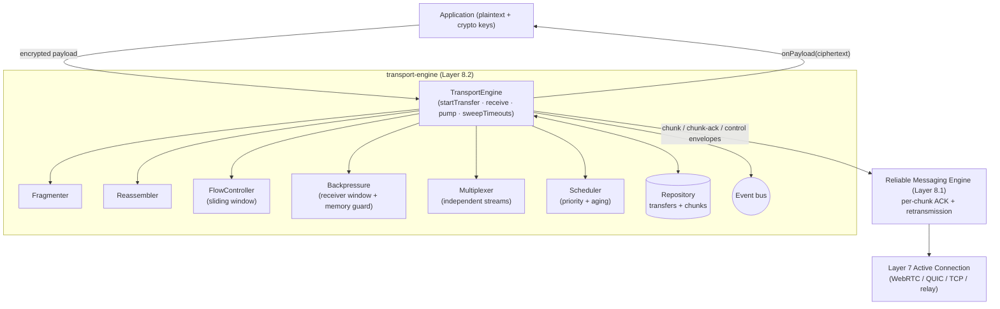
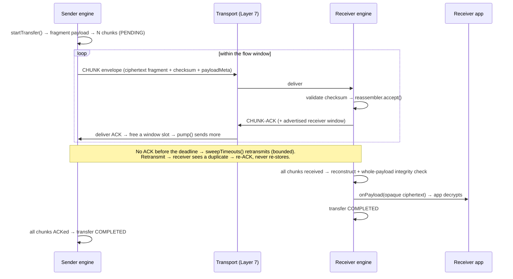
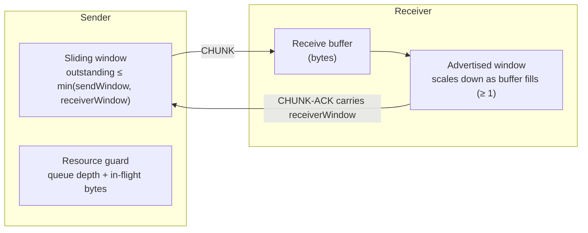

# Layer 8 · Sprint 2 — Large Payload Transport & Transport Optimization

> **Status:** ✅ Complete · **Tests:** 78 transport-engine tests (1290 project-wide, all green) · **New crypto:** none
>
> Sprint 1 delivered the **Reliable Messaging Engine** (guaranteed per-message delivery). Sprint 2
> builds the **Transport Engine** on top of it: efficient, reliable transport of *large* encrypted
> payloads — files, images, videos, voice notes, documents, and binary data — via fragmentation, flow
> control, backpressure, multiplexing, priority scheduling, and reassembly.

---

## 1. Scope

**In scope:** a reusable, transport-independent Transport Engine · fragmentation · reassembly · chunk
management · sliding-window flow control · backpressure · logical multiplexing · priority scheduling
with starvation prevention · in-memory + Mongo repositories · a blind server relay · client
integration · events · validation · comprehensive tests · docs.

**Explicitly OUT of scope (Layer 11):** voice calls · video calls · live streaming · media codecs ·
screen sharing. A *video file* or *voice note* is transported as opaque bytes — there is no live media
path. The `stream` metadata slot on a transfer is the inert seam Layer 11 fills.

### The one invariant (unchanged from Sprint 1)

> The transport engine carries **opaque ciphertext ONLY.** A payload arrives ALREADY ENCRYPTED (Layers
> 2–5); the engine slices the ciphertext into fragments and NEVER decrypts, inspects, or stores
> plaintext or key material. Per-chunk + whole-payload **checksums are integrity hashes over
> ciphertext** — not keys.

---

## 2. Architecture



**Folders** (`server/transport-engine/`): `types` · `errors` · `lifecycle` · `fragmentation` ·
`reassembly` · `chunks` · `scheduler` · `flow-control` · `buffering` · `multiplexing` · `priorities` ·
`transport` (wire + loopback) · `repository` (in-memory + Mongo) · `models` · `validators` ·
`serializers` · `events` · `manager` (the engine) · `api` (service facade + blind relay).

Each chunk crosses the wire as a **CHUNK envelope**; deliberately shaped so it can ride as ONE Sprint-1
reliable message (filling that layer's reserved `fragment` slot), inheriting per-chunk ACK +
retransmission + ordering for free. The Transport Engine adds the *transfer-level* concerns on top.

---

## 3. Transfer workflow



---

## 4. Chunk lifecycle + transfer state machine

```mermaid
stateDiagram-v2
  direction LR
  state "chunk" as C {
    [*] --> pending
    pending --> sent
    sent --> acked: chunk-ACK
    sent --> sent: retransmit
    sent --> failed: retries exhausted
  }
  state "transfer" as T {
    [*] --> created
    created --> fragmenting --> active
    active --> paused
    paused --> active
    active --> reassembling: (receiver)
    reassembling --> completed
    active --> completed
    active --> failed
    active --> cancelled
    active --> expired
  }
```

A chunk: `PENDING → SENT → ACKED` (retransmit loops on `SENT`; exhaustion → `FAILED`, which fails the
transfer). A transfer walks `CREATED → FRAGMENTING → ACTIVE → (REASSEMBLING) → COMPLETED`, and can
`PAUSE/RESUME`, `CANCEL`, `FAIL`, or `EXPIRE`. Every transition is FSM-validated.

---

## 5. Flow control + backpressure



- **Sliding window** — the sender keeps at most `effectiveWindow = min(sendWindow, receiverWindow)`
  chunks outstanding; each ACK frees a slot and pumps the next.
- **Receiver window** — advertised on every ACK; scales *down* as the receive buffer fills (memory
  pressure → SLOW), but never to zero for an in-flight transfer, so a single large transfer can't
  deadlock. An explicit pause (API/control) is the only 0-window path, and it is explicitly resumed.
- **Sender resource guard** — caps per-transfer queue depth + total in-flight bytes (memory
  protection); exceeding it pauses scheduling rather than buffering unboundedly.
- **Adaptive window + congestion awareness** are inert placeholders — this is application-level pacing
  layered over (not a replacement for) TCP/QUIC congestion control.

---

## 6. Multiplexing + priority scheduling

- **Multiplexing** — many concurrent transfers share one connection as independent logical streams,
  isolated per conversation, with a **round-robin rotation** for fairness among equal-priority streams.
- **Priority scheduling** — `control > chat > image > voice-note > document > file > background`. The
  scheduler picks the highest **effective weight**, where a waiting chunk's weight grows with its age
  (linear **aging**) so a low-priority transfer can never starve — past a threshold even a background
  chunk out-weighs a fresh high-priority one. Bounded priority inversion in exchange for guaranteed
  liveness.

---

## 7. Fragmentation + reassembly

- **Fragmentation** — splits the opaque ciphertext into ordered chunks of a (clamped) variable size;
  each chunk carries `transferId`, `chunkId`, `index`, `offset`, `size`, an integrity `checksum`, and
  retry metadata. An aggregate whole-payload checksum is computed once.
- **Reassembly** — collects chunks arriving in any order, rejects checksum-mismatched (corrupt) chunks,
  ignores duplicates, tracks progress + **missing indices** (for partial-recovery resend), detects
  completion, reconstructs the payload in order, and validates the whole-payload checksum before
  delivery.

---

## 8. Repositories, events, validation

- **Repositories** (in-memory + Mongo, identical contract): `transfers`, `chunks` (opaque fragments),
  `progress`, `history`, `audit`. 5 new Mongo collections; additive.
- **Events** (`TransportEventBus`): `transfer_started/fragmented`, `chunk_created/sent/received/
  acked/retried/failed`, `transfer_progress`, `transfer_paused/resumed`, `transfer_completed/failed/
  cancelled/expired`, `window_updated`, `backpressure_applied/released` — metadata only (a future
  Layer 11 consumes these).
- **Validation**: duplicate chunks, missing chunks, invalid ordering, transfer corruption, expired
  transfers, malformed metadata, repository consistency, a replay placeholder, and the no-plaintext
  deep scan enforced before every persist + wire build.

---

## 9. Server integration — the blind relay

The engine runs **peer-to-peer on the client**. On the server, `TransportRelayService` is a **blind
store-and-forward chunk relay** mounted at `/api/transport-engine` (JWT-protected). It stores opaque
ciphertext fragments, verifies only their integrity checksums, and never decrypts or reassembles.

| Method | Route | Who | Purpose |
|---|---|---|---|
| `POST` | `/transfers` | sender | open a transfer (register payload metadata) |
| `POST` | `/transfers/:id/chunks` | sender | relay one opaque chunk |
| `GET` | `/transfers/:id/inbox` | receiver | pull stored chunks (with ciphertext) |
| `POST` | `/transfers/:id/ack` | receiver | acknowledge chunks → complete |
| `POST` | `/transfers/:id/pause` · `/resume` · `/cancel` | participant | control |
| `GET` | `/transfers/:id` · `/progress` · `/chunks` | participant | reads |
| `GET` | `/transfers` | participant | active transfers |
| `GET` | `/diagnostics/:conversationId` · `/status` | participant | diagnostics / relay posture |

---

## 10. Client integration

`client/src/lib/transport.js` — `TransportClient` AUTOMATICALLY fragments (Web Crypto SHA-256), relays
with progress, and on the receiving side polls the inbox, reassembles + integrity-validates, ACKs, and
decrypts. Encryption/decryption are injected hooks; the lib transmits ciphertext only. `pauseTransfer`
/ `resumeTransfer` / `cancelTransfer` / `getProgress` / `listActiveTransfers` round out the surface;
`onMedia` is the inert Layer 11 seam.

```js
const tc = new TransportClient({ axios, deviceId, encrypt, decrypt });
const { transferId } = await tc.sendPayload({ conversationId, receiverDeviceId, payload: fileBytes, kind: "image", name: "cat.jpg", onProgress: setBar });
tc.onPayload(({ payload, payloadMeta }) => saveFile(payloadMeta.name, payload));
await tc.receiveTransfer(transferId, { onProgress: setBar });
```

---

## 11. Performance + testing

Chunking, reassembly, and flow control are O(n) over the payload with O(1) window + dedup checks;
progress is tracked by counters. The suite (DB-free, deterministic clock/idGen/seeded PRNG) covers
large file/image/document/video/voice-note/binary transfers · concurrent multiplexed transfers ·
fragmentation + reassembly · flow control + backpressure (incl. a payload larger than the receive
buffer — slow, never stalled) · priority scheduling + starvation prevention · retransmission + max-
retry failure + TTL expiry + pause/resume/cancel · repositories · validators · the blind relay · and a
4 MiB high-throughput transfer + **seeded adversarial-loss fuzz** (byte-exact recovery across 12 seeds)
+ a mixed concurrent-under-loss stress run.

```
node --test "transport-engine/tests/**/*.test.js"
```

---

## 12. What's next (Layer 8, Sprint 3)

Sprint 3 completes Layer 8 by **hardening the data plane**: transfer recovery + resume across sessions,
connection migration, observability + production monitoring (metrics/alerts/Prometheus), performance
optimization, and operational tooling — reusing this engine's fragmentation, flow-control,
multiplexing, and reassembly without redesign.
