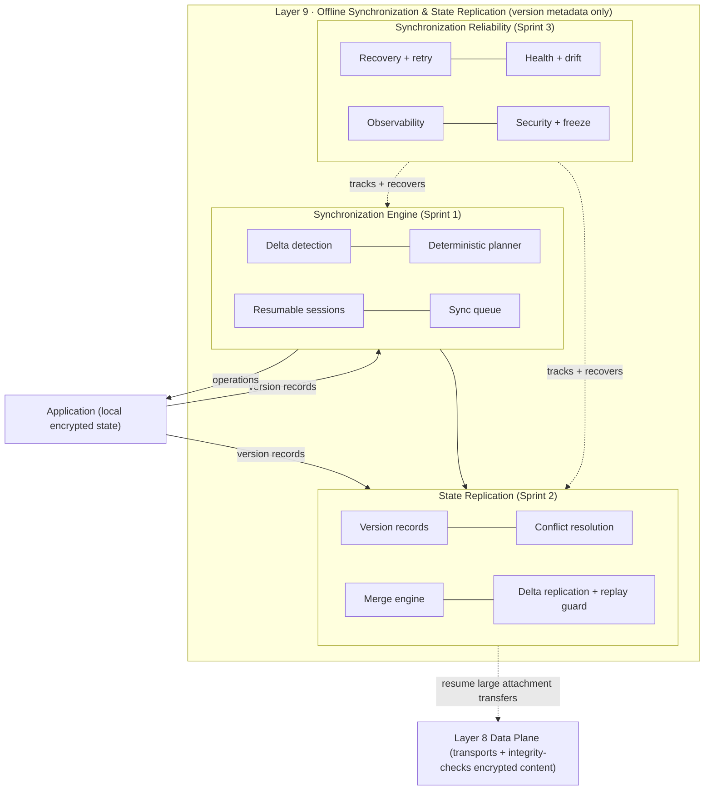
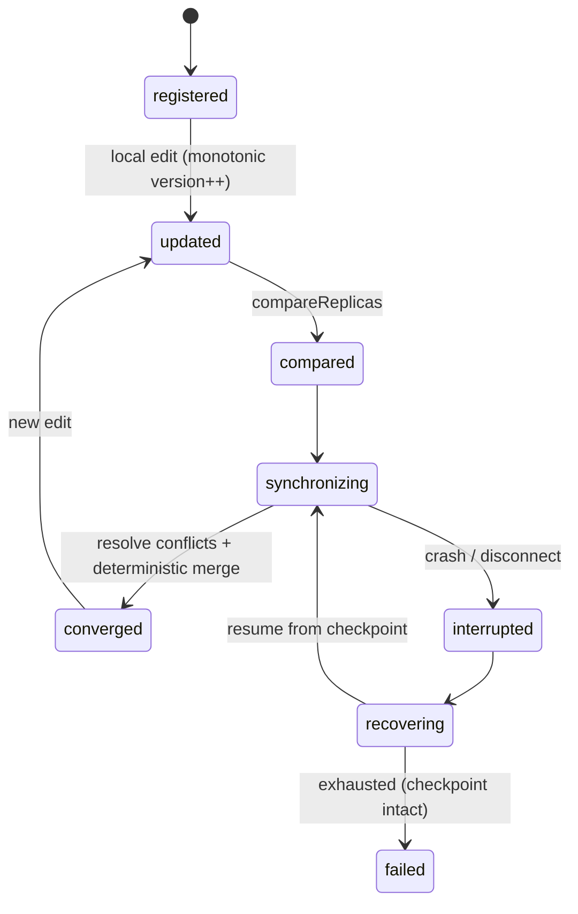
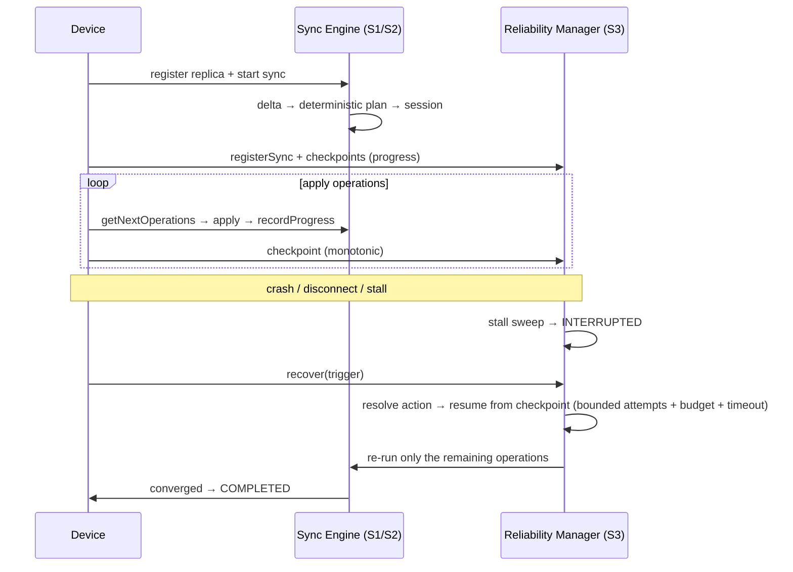
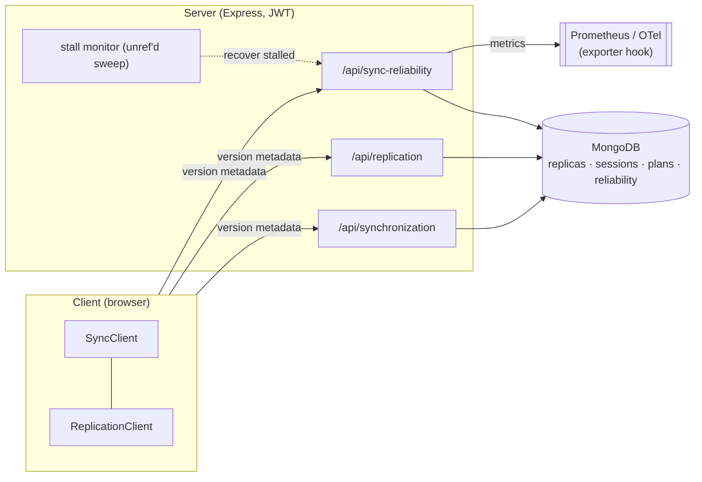

# LAYER 9 — Offline Synchronization & State Replication · FINAL

> **Status:** ✅ COMPLETE + FROZEN v1.0 · **Tests:** 1471 project-wide, all green · **New crypto:** none in Layer 9
>
> Layer 9 is the **offline-synchronization & state-replication layer**: it keeps a user's authenticated
> devices eventually consistent by computing what state each is missing, replicating it, resolving
> conflicts deterministically, and recovering reliably from interruptions — all over **version metadata
> only**, never plaintext.

Layer 9 was built in three sprints, each additive and each frozen here:

| Sprint | Subsystem | Delivers |
|---|---|---|
| **1** | `synchronization/` | Synchronization Engine — delta detection, deterministic plans, resumable sessions |
| **2** | `replication/` | State Replication — rich version records, conflict resolution, merge engine, delta replication |
| **3** | `synchronization-reliability/` | Reliability & Hardening — recovery, health monitoring, retry policies, observability, security, freeze |

---

## 1. Complete synchronization architecture

Every subsystem is **transport-independent** and additive. Layer 9 decides *what* is missing + *how* to
reconcile it; Layer 8 moves the already-encrypted bytes.

---

## 2. Replica lifecycle

A replica is a device's per-entity version records; a merge advances both replicas to the identical
converged state; recovery resumes from a monotonic checkpoint.

---

## 3. Synchronization + recovery workflow

**Recovery never corrupts a replica:** the checkpoint is monotonic + read-only during recovery, and on
exhaustion the sync fails *gracefully* with its checkpoint intact (resumable later).

---

## 4. Conflict resolution + merge (Sprint 2 recap)

Configurable per-category policies — **last-write-wins**, **server-authority**, **merge**, **custom** —
resolve concurrent divergence deterministically (every replica reaches the same winner). Mergeable
categories are lossless: read-receipt **union**, delivery **max-state**, attachment/metadata
**field-merge**. Merged records use an **idempotent** `max` version so gossip converges.

---

## 5. Recovery, retry & health (Sprint 3)

- **Recovery** — triggers (interrupted-sync / device-crash / app-restart / connection-loss /
  partial-sync / transfer-failure / stall) → actions (resume-from-checkpoint / retry / restart /
  graceful-fail), bounded by a max-attempt count, a **lifetime retry budget**, and a recovery timeout.
- **Retry policies** — immediate / exponential-backoff / fixed / none, with cooldown + auto-resume +
  per-record overrides.
- **Health** — a `[0,1]` score across progress / reliability (conflict rate) / **replica drift** /
  freshness, plus a periodic **stall sweep** that flags no-progress syncs for recovery.

---

## 6. Repositories

| Subsystem | Stores (in-memory + Mongo, identical contract) |
|---|---|
| `synchronization` | replicas · sessions · plans · deltaHistory · progress · audit |
| `replication` | replicas (snapshots) · conflict / merge / version / delta history · audit |
| `synchronization-reliability` | records · recoveryHistory · alerts · audit |

Storage-independent behind the same interfaces; TTL/expiry via `expiresAt`; concurrency via optimistic
`version` bumps; deep-copy isolation in-memory; `.lean()` reads in Mongo. All additive.

---

## 7. Observability

`SyncMetrics` (Prometheus text + OpenTelemetry export hook) tracks synchronization throughput + latency,
conflict rate, merge success rate, recovery success rate, resume + retry counts, replica drift, pending
operations, queue depth, concurrent syncs, and health score. `SyncMonitor` raises typed alerts (failure
spike, repeated recovery failure, unhealthy replica, stall, high conflict rate, high replica drift,
retry storm). Read-only endpoints: `/health`, `/metrics` (`?format=prometheus`), `/alerts`,
`/syncs/:id/diagnostics`, `/protocol`, `/security-audit`.

---

## 8. Security & threat model

**Invariant:** the synchronization layer reasons over **version metadata only** — no plaintext,
ciphertext, message content, or key material in any record, delta, event, or DTO (enforced by a
no-plaintext deep scan before every persist). The encrypted content is transported + integrity-checked
by Layer 8; cryptographic replay resistance lives in Layer 5.

| Threat | Mitigation |
|---|---|
| Content disclosure via sync metadata | Only versions / ids / counts / opaque content hashes are synced — never content |
| Unauthorized sync / replica access | JWT auth + owner-scoping — a device may only sync/recover its OWN replica |
| Replay (re-applying an old delta to forge state) | Delta `ReplayGuard` + monotonic checkpoint (a resume re-runs only remaining ops) |
| Conflict-resolution bias | Deterministic resolution — every replica reaches the same winner independently |
| Recovery hijack | Recovery is owner-scoped + preserves the checkpoint (replica consistency intact) |
| Abuse (sync storm) | Rate-limit extension point on sync/recover/resume; bounded attempts + retry budget |
| Resource exhaustion | TTL expiry, bounded histories, replica-drift + queue-depth signals |

The security posture is machine-readable (`/api/sync-reliability/security-audit`) and audited in tests.

---

## 9. Deployment

The engines run **on the client** (or the server as an authoritative replica); the server provides the
sync/replication control plane + the reliability manager. The stall monitor runs an `unref`'d periodic
sweep. All read-only observability is JWT-protected.

---

## 10. Testing

1471 tests project-wide, DB-free (`node --test`), deterministic clocks / id generators / seeded PRNGs.
Layer 9 adds: delta detection, deterministic planning, resumable sessions (Sprint 1); version records,
conflict resolution (all policies), merge determinism, delta replication + replay + a **convergence
fuzz** where N replicas with random edits reach the same fingerprint (Sprint 2); recovery, resume,
retry policies + budget, stall detection, health + drift scoring, metrics + alerts, security audit,
protocol freeze, long-offline + large-session recovery, and a randomized **checkpoint/interrupt/recover
protocol fuzz** asserting FSM legality + checkpoint monotonicity (Sprint 3).

---

## 11. Known limitations

- **Recovery hooks are optimistic by default** — the server tracks + orchestrates; the DEVICE re-runs
  the remaining operations + confirms via the next checkpoint. A production deployment injects concrete
  hooks bound to the Sprint 1/2 engines + Layer 8.
- **Scalar version stamps** — conflict detection uses same-version divergence; cross-version lineage
  conflicts need **vector clocks** (a documented seam, not built).
- **Single-user, directional/pairwise** — group replication across many users' replicas is Layer 10.
- **No CRDTs / distributed consensus** — merges are deterministic + policy-driven, not a consensus
  protocol.

---

## 12. Protocol freeze & Layer 10 integration

The whole synchronization layer is **frozen at v1.0** (`synchronization-reliability/freeze`,
`/api/sync-reliability/protocol`). Stable interfaces: the Synchronization + Replica managers + their
service facades, the version-record + delta models, the conflict/merge engines, the event buses, and
the reliability manager + checkpoint/resume seams.

**Layer 10 (secure group communication) builds on this WITHOUT modifying the synchronization
architecture:**

- reuse the per-entity version records + conflict policies across many members' replicas (group
  replication);
- drop **vector clocks** into `compareStamps` for group causality;
- fan a group sync out to per-member deterministic plans (`createSyncPlan`);
- recover a group sync member-by-member from the same checkpoint model;
- drive group state off the `ReliabilityEventBus` + `ReplicationEventBus`.

Layer 9 deliberately does **not** implement: group messaging, group replication, CRDTs, distributed
consensus, vector clocks, or voice/video.

---

## 13. The stack today

- ✅ **Production Cryptographic Layer** (Layers 2–5)
- ✅ **Production Networking Control Plane** (Layer 6)
- ✅ **Production Connectivity Layer** (Layer 7)
- ✅ **Production Peer-to-Peer Data Plane** (Layer 8)
- ✅ **Production Offline Synchronization & State Replication Layer** (Layer 9 — this document)

Next: **Layer 10 — Secure Multi-Device Group Communication**, on top of a mature, frozen synchronization
architecture.
