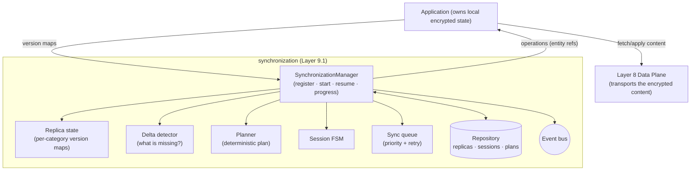
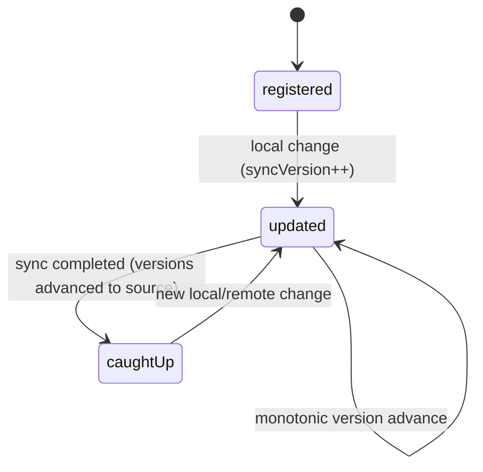
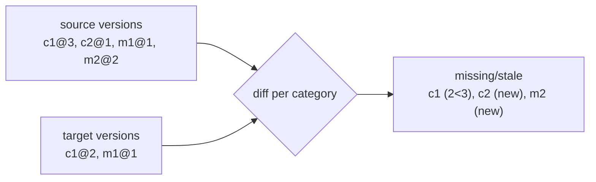
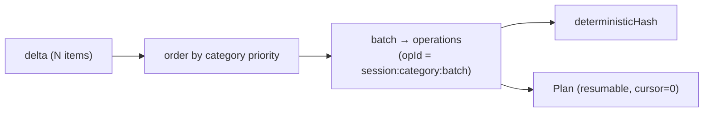
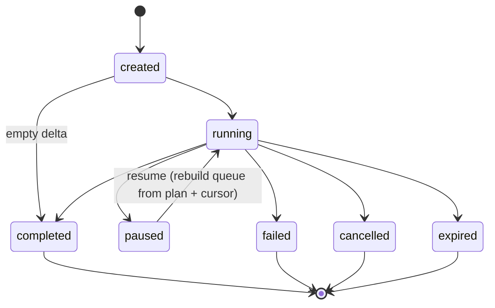
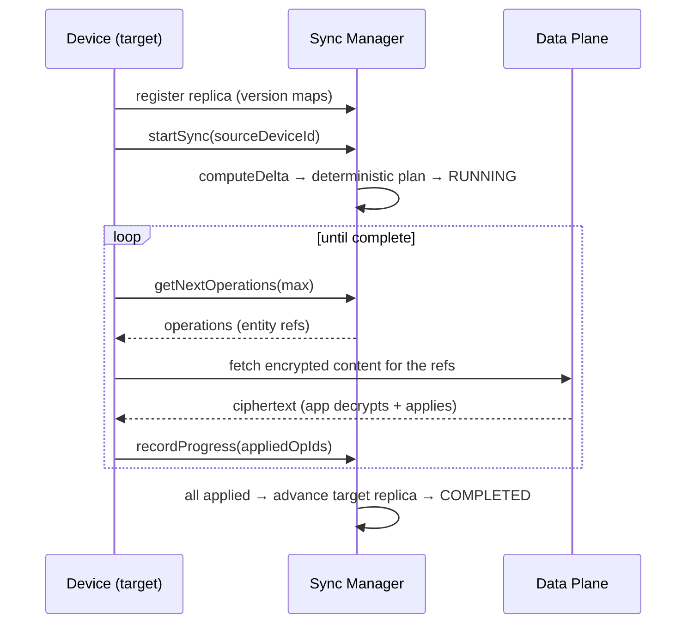

# Layer 9 · Sprint 1 — Offline Synchronization Engine

> **Status:** ✅ Complete · **Tests:** 41 synchronization tests (1389 project-wide, all green) · **New crypto:** none
>
> The first **synchronization** layer. Layers 1–8 built the secure channel, connectivity, and the
> reliable Data Plane that *moves* encrypted data. Layer 9 decides *which* data each device is missing
> and *how* to bring it up to date — securely synchronizing encrypted application state across a user's
> authenticated devices.

---

## 1. Scope

The engine answers exactly two questions — **"what state is missing?"** (delta detection) and **"how
should it be synchronized?"** (a deterministic plan) — and executes **resumable synchronization
sessions**. It synchronizes: messages · conversations · delivery state · read receipts · attachment
metadata · transfer metadata · device metadata.

**In scope (this sprint):** a reusable Synchronization Manager · replica state tracking · delta
detection · a deterministic Synchronization Planner · synchronization sessions · a synchronization
queue · in-memory + Mongo repositories · APIs · client integration · events · validation · tests · docs.

**Explicitly OUT of scope (Sprint 2):** conflict resolution · replica merge policies · distributed
consensus · group synchronization. The `conflict` hooks + delta-`compression` seam are inert.

### The invariant

> The engine reasons over **version metadata + entity IDs ONLY** — never plaintext, ciphertext, or key
> material. The already-encrypted content is transported by the Layer-8 Data Plane; Layer 9 only decides
> what is missing and how to sync it (enforced by a no-plaintext deep scan before every persist).

---

## 2. Architecture



**Folders** (`server/synchronization/`): `types` · `errors` · `events` · `state` (replica) · `delta` ·
`planner` · `sessions` (FSM) · `queue` · `repository` (in-memory + Mongo) · `models` · `validators` ·
`serializers` · `manager` · `api`. Transport-independent — the client executes operations over any
Layer-7/8 transport.

---

## 3. Replica state model

Each device maintains a **replica**: per-category **version maps** (`entityId → version`) plus a
category high-water version, a monotonic `syncVersion`, and `lastSuccessfulSync`.

| Category | What it versions |
|---|---|
| conversations · messages · delivery · read-receipts | core chat state |
| attachments · transfer-metadata | attachment/transfer METADATA (bytes move via Layer 8) |
| device-metadata | device info |

A replica holds versions + counts only — no content. Applying learned versions is **monotonic** (never
regresses), so a stale/duplicate update can never corrupt a replica.



---

## 4. Delta detection

Comparing a **source** replica's version maps to a **target**'s yields exactly what the target is
missing or has stale — per category, as entity refs + versions.



Deterministic (sorted entity refs), supports **incremental** sync (a per-category `since` cursor), and
a category filter. Delta compression is a future seam.

---

## 5. Synchronization planner

A delta becomes a **deterministic** plan: categories ordered by priority (device metadata + conversations
first, attachments last), each category's entities batched into fixed-size operations, with a transfer
estimate and a `deterministicHash` (same delta → same plan). A delta over the item cap yields a
**partial** plan (the rest syncs in a follow-up session).



Determinism is what lets a paused session resume from a cursor without re-planning, and lets two
replicas agree on the same plan.

---

## 6. Synchronization sessions



A session carries its plan + progress + resume cursor. The **queue** dispenses operations by priority,
tracks applied/retry, and — because it is rebuilt from the persisted plan + cursor — a resume re-sends
only the not-yet-applied operations. On completion the target replica's versions advance to include
every synced entity + `lastSuccessfulSync` is set.

### Synchronization workflow



---

## 7. Repositories, events, validation

- **Repositories** (in-memory + Mongo, identical contract): `replicas`, `sessions`, `plans`,
  `deltaHistory`, `progress`, `audit`. 3 new Mongo collections + small delta/progress/audit collections;
  additive.
- **Events** (`SyncEventBus`): `replica_registered/updated`, `sync_started/planned`, `delta_generated`,
  `sync_progress`, `sync_paused/resumed`, `sync_completed/failed/cancelled`, `operation_applied/failed`
  — metadata only (Sprint 2 consumes these).
- **Validation**: duplicate operations (queue-idempotent), missing versions, malformed deltas, invalid
  plans (+ determinism-hash check), expired sessions, unauthorized sync, repository consistency, a
  replay placeholder, and the no-plaintext deep scan.

---

## 8. API endpoints (`/api/synchronization`, JWT)

| Method | Route | Purpose |
|---|---|---|
| `POST` | `/replicas` · `GET /replicas/me` | register/update + read this device's replica |
| `POST` | `/delta` | compute what this device is missing |
| `POST` | `/sessions` · `GET /sessions` | start a sync · list active sessions |
| `GET` | `/sessions/:id/operations` | pull the next operations to apply |
| `POST` | `/sessions/:id/progress` | report applied/failed operations |
| `POST` | `/sessions/:id/pause` · `/resume` · `/cancel` | control |
| `GET` | `/sessions/:id` · `/status` · `/diagnostics` | reads |
| `GET` | `/health` | aggregate control-plane health |

---

## 9. Client integration

`client/src/lib/synchronization.js` — `SyncClient` advertises the device's version maps, starts a
session, drains its operations (applying each by fetching encrypted content over Layer 8), and reports
progress. Supports automatic / **background** / **reconnect** sync, pause/resume, and failure recovery.
`buildVersions` + `applyOperation` are injected hooks; `onConflict` is the inert Sprint 2 seam.

```js
const sync = new SyncClient({ axios, deviceId, buildVersions, applyOperation });
await sync.synchronize({ sourceDeviceId: "server" });
sync.startBackgroundSync({ sourceDeviceId: "server", intervalMs: 30000 });
```

---

## 10. Performance & testing

Delta detection is O(source entities) with sorted iteration; planning is O(items); the queue is O(1)
per op. Verified with a 5 000-message initial sync, incremental syncs, three-device fan-out, and a
seeded **randomized pause/resume fuzz** that always converges (target ends up matching the source).
41 synchronization tests, DB-free, deterministic.

```
node --test "synchronization/tests/**/*.test.js"
```

---

## 11. What's next (Layer 9, Sprint 2)

Sprint 2 extends this with **distributed state replication, conflict resolution, replica version
management, merge policies, and concurrent multi-replica synchronization** — reusing the version maps,
deterministic plans, sessions, and the `SyncEventBus` + `onConflict` seams WITHOUT redesigning this
engine.
