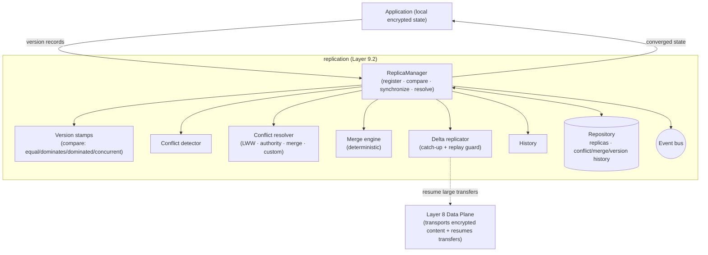
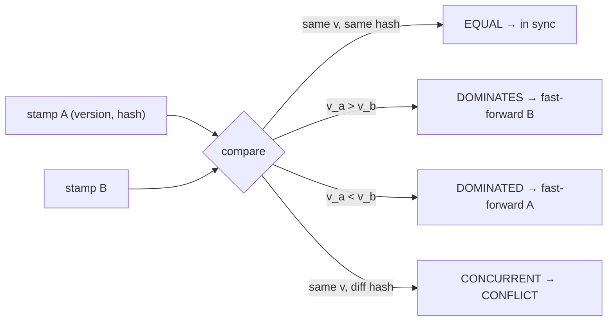
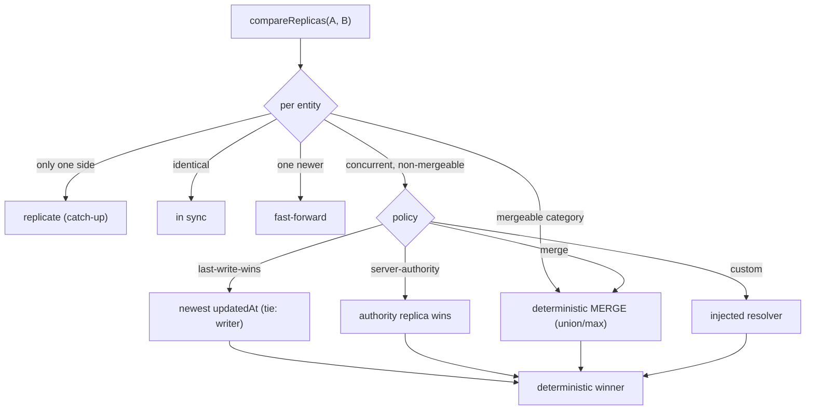
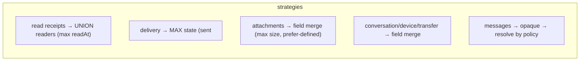
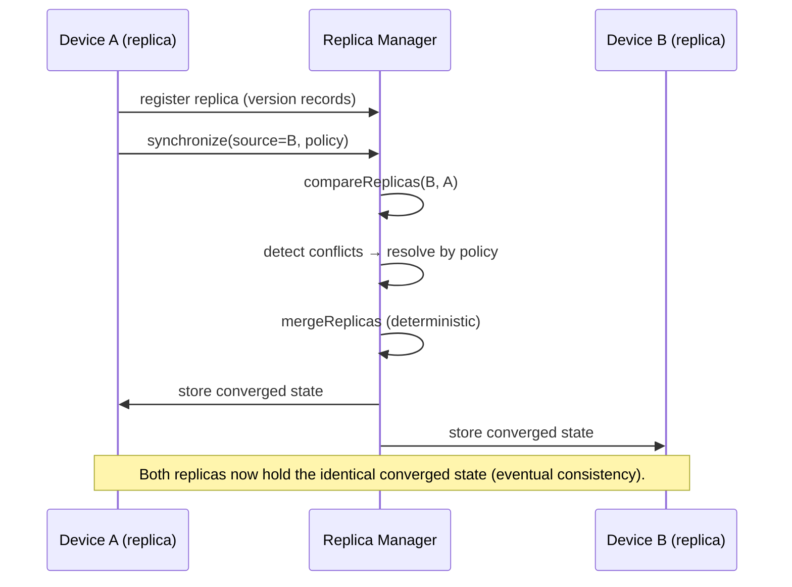

# Layer 9 · Sprint 2 — State Replication & Conflict Resolution

> **Status:** ✅ Complete · **Tests:** 46 replication tests (1435 project-wide, all green) · **New crypto:** none
>
> Sprint 1 gave *directional* synchronization (a device catches up to a source). Sprint 2 makes every
> authenticated device a **secure encrypted replica** and keeps replicas *eventually consistent* —
> comparing them, detecting conflicts, resolving them by configurable policy, and applying deterministic
> merges — all without exposing plaintext.

---

## 1. Scope

**In scope:** a reusable Replica Manager · replica versioning · a configurable Conflict Resolution
Engine · a deterministic Merge Engine · delta replication (with replay protection) · resumable
synchronization (integrating Layer 8) · repositories · APIs · client integration · events · validation.

**Explicitly OUT of scope:** production monitoring · observability · performance hardening · distributed
consensus · CRDTs · vector clocks (Sprint 3 / a later layer). The scalar version stamp is a documented
**vector-clock seam**; the `compression` + group-replication hooks are inert.

### The invariant

> A replica holds **version records + entity IDs + non-secret merge metadata ONLY** — never plaintext,
> ciphertext, or key material. The `contentHash` is an opaque divergence detector; the encrypted content
> is transported by the Layer-8 Data Plane, not here (enforced by a no-plaintext deep scan).

---

## 2. Architecture



**Folders** (`server/replication/`): `types` · `errors` · `events` · `versions` · `replicas` ·
`conflicts` (detector + resolver) · `merge` · `delta` · `history` · `repository` (in-memory + Mongo) ·
`models` · `validators` · `serializers` · `manager` · `api`. Transport-independent.

---

## 3. Replica versioning

Each replica tracks, per category, an entity **version record** — `version` (a scalar counter),
`writerReplicaId`, `updatedAt`, an opaque `contentHash`, an optional tombstone, and category-specific
**merge metadata** (read-receipt readers, delivery state, attachment size/mime/checksum). The stamp
comparison yields the four vector-clock relations:



This sprint uses the scalar stamp; `compareStamps` is the seam a future **vector clock** drops into
without changing callers.

---

## 4. Conflict resolution flow



Policies are **configurable per category** (an explicit request policy overrides the built-in default),
and every resolution is **deterministic** — every replica resolving the same conflict reaches the same
winner independently, which is what yields eventual consistency without a coordinator.

---

## 5. Merge engine (deterministic)



Merges are **pure + idempotent**: the merged `version = max(a, b)` (not `max+1`), so re-merging
already-converged replicas is a no-op — gossip converges. Read receipts + delivery are *lossless* (a
union / max, nobody "un-reads" or regresses). `mergeFingerprint` proves determinism.

---

## 6. Delta replication + transfer resume

- **generateReplicationDelta** — the incremental records a target lacks or is behind on.
- **applyDelta** — mergeable categories merge (lossless); others adopt monotonically (a divergent
  record is never overwritten by a raw delta — conflicts go through the merge path). Safe + resumable.
- **ReplayGuard** — an applied delta id can't be replayed to forge state.
- **planTransferResume** — for large attachment entities, references the Layer-8 `transferId` +
  checkpoint so an interrupted replication resumes the underlying content transfer (via injected hooks).

---

## 7. Replica synchronization workflow



---

## 8. Repositories, events, validation

- **Repositories** (in-memory + Mongo, identical contract): `replicas` (snapshots) + conflict / merge /
  version / delta / replica-lifecycle history + audit. 2 new Mongo collections (one keyed by `kind`);
  additive.
- **Events** (`ReplicationEventBus`): `replica_registered/updated/compared`, `conflict_detected/
  resolved`, `merge_started/completed`, `delta_replicated`, `synchronization_resumed` — metadata only
  (a future Layer 10 consumes these).
- **Validation**: duplicate replicas, version conflicts, invalid merges, corrupted deltas, replay
  attempts, malformed metadata, repository consistency, unauthorized synchronization, and the
  no-plaintext deep scan.

---

## 9. API endpoints (`/api/replication`, JWT)

| Method | Route | Purpose |
|---|---|---|
| `POST` | `/replicas` · `GET /replicas/me` | register/update + read this device's replica |
| `POST` | `/compare` | compare against a source replica |
| `POST` | `/synchronize` · `/merge` | synchronize (resolve + merge) |
| `POST` | `/resolve` | resolve a single conflict |
| `POST` | `/delta` · `/resume` | replicate a delta · resume interrupted sync |
| `GET` | `/replicas/:id/version-history` · `/conflict-history` · `/diagnostics` | reads |
| `GET` | `/health` | aggregate control-plane health |

---

## 10. Client integration

`client/src/lib/replication.js` — `ReplicationClient` advertises the device's version records, compares/
synchronizes, surfaces conflicts (`onConflict`), applies the converged state (`applyMerged`), and
supports automatic + reconnect replication. `buildReplica` + `applyMerged` are injected hooks;
`onGroupReplication` is the inert future seam.

```js
const repl = new ReplicationClient({ axios, deviceId, buildReplica, applyMerged });
repl.onConflict(({ category, entityId }) => notifyUser(category, entityId));
await repl.synchronize({ sourceDeviceId: "server", policy: "merge" });
```

---

## 11. Performance & testing

Comparison is O(union entities) with sorted iteration; merges + resolutions are O(1) per entity and
pure. 46 replication tests (DB-free, deterministic): version stamps, conflict detection, all resolution
policies, every merge strategy + determinism, delta replication + replay + resume + transfer resume,
repositories, validators, a 3 000-entity replication, and a seeded **convergence fuzz** where N replicas
with random edits all reach the same fingerprint after gossip.

```
node --test "replication/tests/**/*.test.js"
```

---

## 12. What's next (Layer 9, Sprint 3)

Sprint 3 completes Layer 9 by **hardening** the synchronization subsystem — recovery, monitoring,
observability, performance optimization, security validation, production testing, and stable public
interfaces — reusing the replica model, version stamps, conflict/merge engines, and the
`ReplicationEventBus` seams WITHOUT redesigning them. Group replication + vector clocks build on the
documented seams later.
