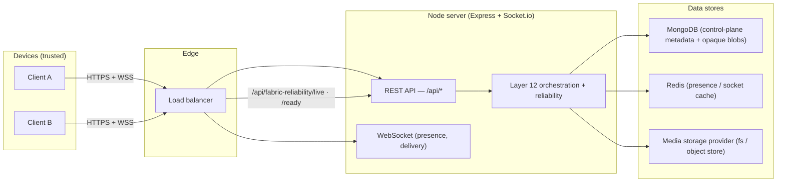

# Production Deployment & Operations Guide

> Operational guide for the Secure Distributed Communication Platform (Layers 1–12, v1.0.0). Covers
> deployment topology, configuration, health/readiness/liveness, observability, scaling, security
> operations, and runbooks.

---

## 1. Deployment topology



- **Clients** hold private keys + perform all encryption/decryption. The server never sees plaintext.
- **Server** is stateless per request for the control plane (decisions/scoring/planning are pure); durable
  state is in Mongo/Redis/media-provider.
- **Load balancer** uses `GET /api/fabric-reliability/live` (liveness) + `/ready` (readiness) for health
  checks and draining.

---

## 2. Prerequisites & install

```bash
# Server
cd server
npm install                 # express, mongoose, socket.io, ioredis, jsonwebtoken, bcryptjs, cloudinary, cors, dotenv
npm start                   # node server.js   (nodemon: npm run server)

# Client
cd client && npm install && npm run build
```

**Required environment (`server/.env`):**

| Var | Purpose |
|---|---|
| `PORT` | HTTP port (default 5000) |
| `MONGODB_URI` | MongoDB connection string |
| `JWT_SECRET` | JWT signing secret |
| `REDIS_URL` | Redis connection (presence cache) |
| `CLOUDINARY_*` | (optional) media storage provider creds |

> **Note:** the control plane is content-free — no key material or message content is ever configured,
> logged, or persisted server-side.

---

## 3. Configuration — Layer 12 tuning

All Layer-12 subsystems are configured via their manager constructors (wired in the controllers). Common
production knobs:

```js
// Reliability (server/controllers/fabricReliabilityController.js)
new FabricReliabilityManager({
  ...repo,
  config: {
    circuit:  { failureThreshold: 5, successThreshold: 2, resetTimeoutMs: 30_000 },
    retry:    { maxAttempts: 3, strategy: "exponential-jitter", baseDelayMs: 100, maxDelayMs: 5_000 },
    timeout:  { defaultMs: 10_000, perKind: { "communication-execute": 15_000 } },
    bulkhead: { maxConcurrent: 64, maxQueue: 1_000 },
    recovery: { recoveryTimeoutMs: 30_000, maxResumeAttempts: 2, stalledAfterMs: 60_000 },
  },
});

// Optimization (server/controllers/optimizationController.js)
new GlobalOptimizer({ ...repo, config: { budgets: { execution: 128, bandwidth: 1_000_000 }, laneCapacity: { background: 2_000 } } });

// Adaptive routing weights (server/controllers/adaptiveRoutingController.js)
new AdaptiveRoutingEngine({ ...repo, config: { weights: { "transport-availability": 4, cost: 2 } } });
```

Every policy / hook / scorer / strategy is **pluggable** — register custom ones against the frozen
extension points (`GET /api/fabric-reliability/freeze`) without forking the core.

---

## 4. Health, readiness & liveness

| Endpoint | Use | 200 when |
|---|---|---|
| `GET /api/fabric-reliability/live` | Liveness (restart if failing) | process is up |
| `GET /api/fabric-reliability/ready` | Readiness (route traffic / drain) | no component UNHEALTHY |
| `GET /api/fabric-reliability/health` | Component health rollup | always (payload has status) |
| `GET /api/status` | Layer-1 basic liveness | server live |

Kubernetes-style probes:

```yaml
livenessProbe:  { httpGet: { path: /api/fabric-reliability/live,  port: 5000 }, periodSeconds: 10 }
readinessProbe: { httpGet: { path: /api/fabric-reliability/ready, port: 5000 }, periodSeconds: 5 }
```

Each data-carrying layer also runs an **unref'd stall monitor** (transport / sync / group / media / fabric
reliability) that sweeps for interrupted operations → recovery, started at boot (see `server.js`).

---

## 5. Observability

- **Metrics (JSON):** `GET /api/fabric-reliability/metrics`
- **Metrics (Prometheus):** `GET /api/fabric-reliability/metrics?format=prometheus`
- **Diagnostics:** `GET /api/fabric-reliability/diagnostics` (health + circuits + bulkheads + recovery +
  alerts + metrics)
- **Per-operation inspection:** `GET /api/fabric-reliability/operations/:operationId` (checkpoint + audit)

Key metrics: `fabric_communication_throughput_total`, `fabric_operation_latency_ms`,
`fabric_decision_latency_ms`, `fabric_routing_latency_ms`, `fabric_scheduler_latency_ms`,
`fabric_execution_success_rate`, `fabric_recovery_success_rate`, `fabric_queue_depth`,
`fabric_qos_distribution_total`, `fabric_circuit_state`.

**Structured logging + tracing** are injectable: pass a `logger` sink + a `tracer` delegate (OpenTelemetry)
to `FabricReliabilityManager` — frozen extension points, no core change.

Prometheus scrape:

```yaml
scrape_configs:
  - job_name: communication-fabric
    metrics_path: /api/fabric-reliability/metrics
    params: { format: [prometheus] }
    static_configs: [{ targets: ["server:5000"] }]
```

---

## 6. Scaling

- **Vertical:** raise `bulkhead.maxConcurrent` + optimizer `execution` budget as CPU allows.
- **Horizontal (v1.0.0):** the control plane is stateless per request (pure decisions), so multiple
  instances behind a load balancer scale reads/decisions; durable state lives in Mongo/Redis. The optimizer
  + scheduler are per-instance in v1.0.0 (single-node coordination) — for cluster-wide fairness, the
  workload balancer exposes a `node` placement seam (future distributed backend).
- **Large media / large groups:** isolated by bulkhead compartment (`media`, `group`, `sync`, `messaging`)
  so a flood of one never starves the others; media is chunked with per-chunk hashes (Layer 11) and
  batch-scheduled (Layer 12 S3).
- **Repositories** are storage-independent — swap the Mongo backend for a distributed store without
  touching subsystem code.

---

## 7. Security operations

- **Key management:** none server-side — private keys never leave devices. Nothing to rotate on the server.
- **Authorization:** every orchestration operation authorizes caller = sender; centralised + audited in
  Layer 12 S4 (`SecurityValidator`). Custom `authorizer` + `rateLimiter` are injectable.
- **Replay protection:** idempotency keys (request ids) rejected on replay.
- **Audit:** every orchestration decision is recorded (control-plane only) in the reliability + per-layer
  audit trails.
- **Rate limiting:** plug a `rateLimiter(ctx)` predicate into the reliability manager (extension point).
- **No-content guarantee:** a deep scan rejects any content/key material before every control-plane persist
  — verify by inspecting audit records (they contain ids + classifications + numbers only).

---

## 8. Runbooks

**A component reports DEGRADED / UNHEALTHY**
1. `GET /api/fabric-reliability/health` → identify the component.
2. `GET /api/fabric-reliability/diagnostics` → check circuit states + recovery stats + alerts.
3. An OPEN circuit auto-probes (half-open) after `resetTimeoutMs`; a persistent open indicates a failing
   dependency — check that subsystem's own `*-reliability` diagnostics.

**Queue depth rising / backpressure**
1. `GET /api/optimization/scheduler-state` → per-lane depth + backpressure signal.
2. `POST /api/optimization/dispatch` (with `maxConcurrent`) to drain ready work.
3. If sustained, raise the optimizer `execution` budget or add instances.

**Operations stuck RUNNING after a crash**
- The stall monitor sweeps automatically (recover if resumable, else graceful-fail). Inspect via
  `GET /api/fabric-reliability/operations/:id`.

**Deferred communications not sending**
- Sprint 3 queues background/deferred traffic; drain with `POST /api/optimization/dispatch`. In production,
  run a supervised worker calling `dispatch()` on an interval (roadmap v1.1).

---

## 9. Deployment checklist

- [ ] `.env` configured (Mongo, JWT, Redis, media provider); secrets from a secret manager.
- [ ] HTTPS/WSS terminated at the edge; CORS locked to known origins (default `*` is dev-only).
- [ ] Liveness/readiness probes wired to the reliability endpoints.
- [ ] Prometheus scraping `/api/fabric-reliability/metrics?format=prometheus`; alerts on
      `fabric_execution_success_rate`, `fabric_circuit_state`, `fabric_queue_depth`.
- [ ] Structured `logger` + OTel `tracer` injected.
- [ ] Bulkhead / circuit / retry / timeout / budget config tuned for the instance size.
- [ ] Full test suite green (`cd server && npm test` → 1,917 passing).
- [ ] Backups for MongoDB + media provider.
- [ ] A dispatch worker (or scheduled `dispatch()` call) for deferred traffic.

The platform is **production-ready**; see `LAYER12_FINAL.md` for the readiness review + roadmap and
`SYSTEM_ARCHITECTURE.md` for the full architecture + threat model.
