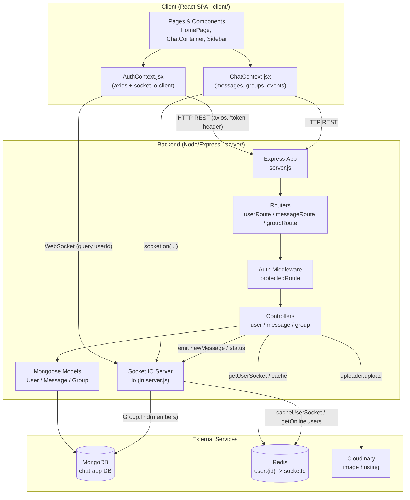
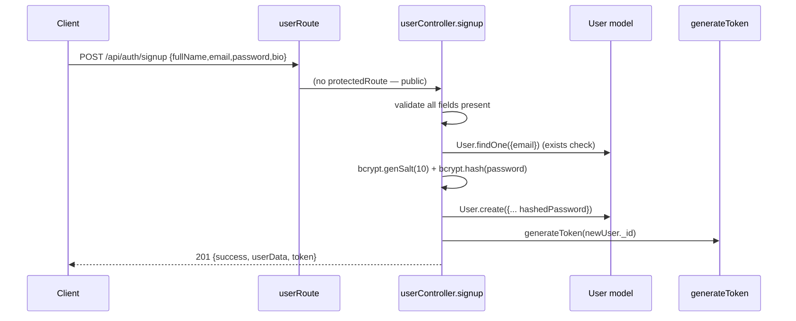
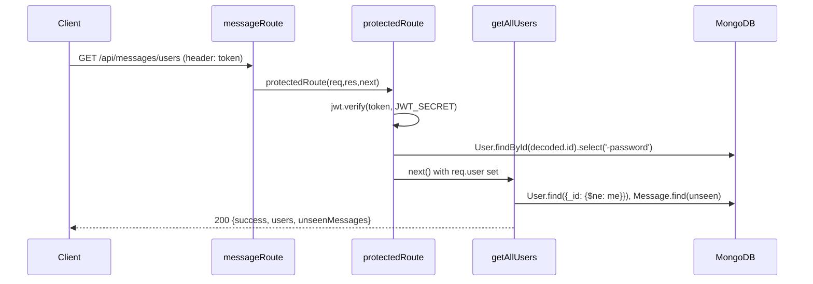
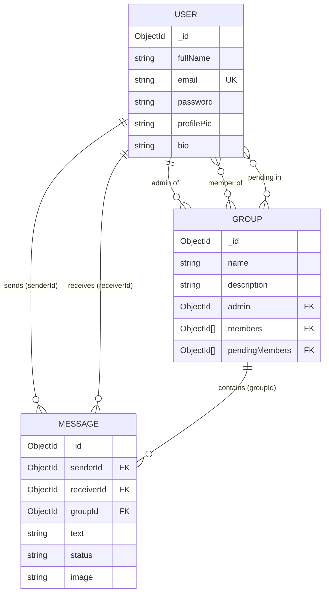
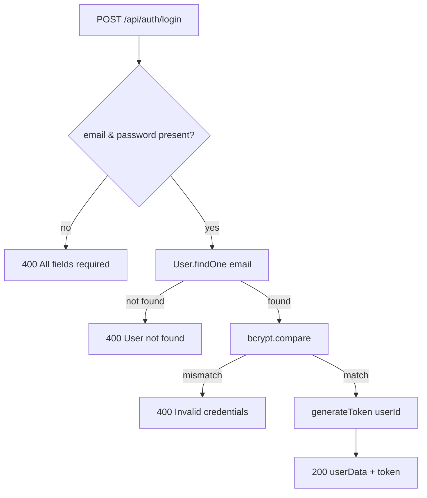
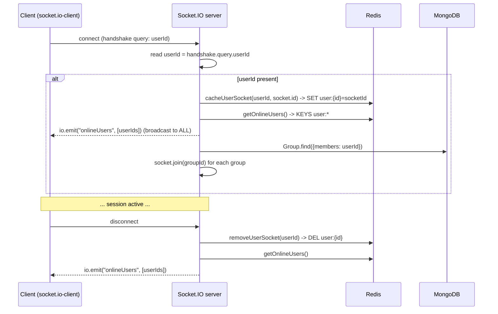
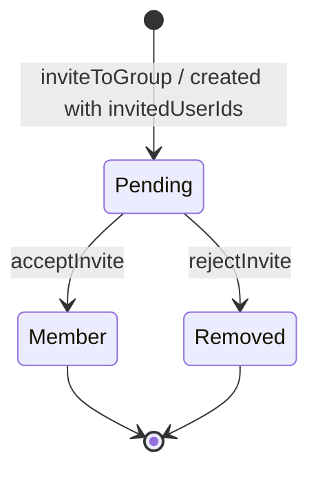
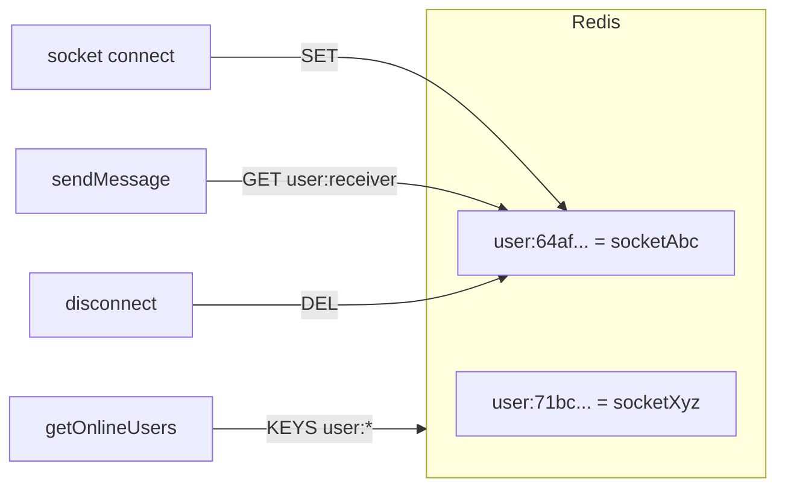
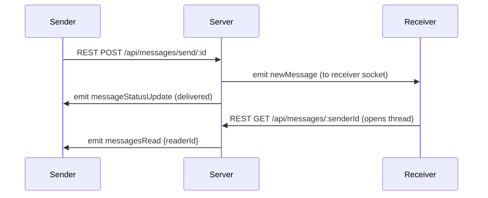
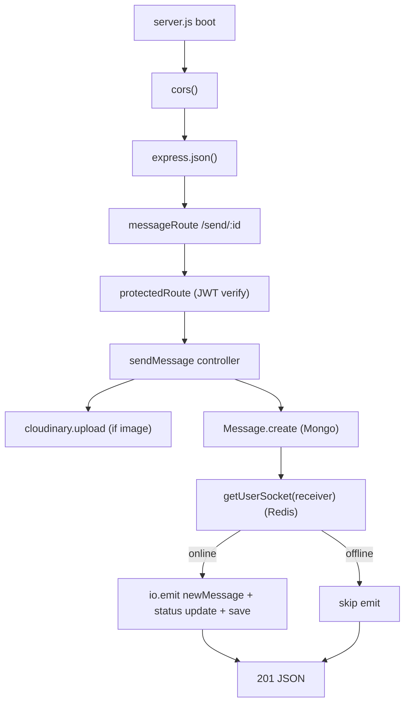

# PROJECT_KNOWLEDGE.md

> **Permanent Knowledge Base — Backend Reverse Engineering**
> Audience: Any engineer who will maintain this system for the next five years.
> Status of this document: Descriptive only. It documents *what exists today*. It does **not** propose changes, refactors, or the future Secure P2P work.
>
> **Ground rules honoured in this document**
> - Every claim is traced to a real file, function, route, event, or model.
> - Where behaviour is ambiguous, broken, or unverifiable from the code, it is called out explicitly with **⚠ UNCLEAR** or **🐞 BUG/INCONSISTENCY**.
> - Nothing here is guessed. If the code does not show it, the document says so.

---

## Table of Contents

1. [Project Overview](#section-1--project-overview)
2. [High Level Architecture](#section-2--high-level-architecture)
3. [Folder Structure](#section-3--folder-structure)
4. [Request Flow](#section-4--request-flow)
5. [Database Design](#section-5--database-design)
6. [Authentication](#section-6--authentication)
7. [WebSocket System](#section-7--websocket-system)
8. [Message Flow](#section-8--message-flow)
9. [Group Chat](#section-9--group-chat)
10. [Media System](#section-10--media-system)
11. [Redis](#section-11--redis)
12. [Background Jobs](#section-12--background-jobs)
13. [Security](#section-13--security)
14. [Configuration](#section-14--configuration)
15. [API Documentation](#section-15--api-documentation)
16. [WebSocket Events](#section-16--websocket-events)
17. [Code Organization](#section-17--code-organization)
18. [Current Limitations](#section-18--current-limitations)
19. [Dependency Analysis](#section-19--dependency-analysis)
20. [Complete Feature Inventory](#section-20--complete-feature-inventory)
21. [Execution Flow](#section-21--execution-flow)
22. [Project Health](#section-22--project-health)
23. [Glossary](#section-23--glossary)
24. [Current Architecture Baseline](#section-24--current-architecture-baseline)

---

## SECTION 1 — PROJECT OVERVIEW

### What this project is
This is a **real-time MERN-stack chat application**. The repository holds two independent applications in one monorepo:

- `client/` — a React 19 single-page application (Vite build), styled with Tailwind CSS 4.
- `server/` — a Node.js + Express 5 HTTP + WebSocket backend, backed by MongoDB (Mongoose), Redis (ioredis), and Cloudinary for image hosting.

The README (`README.md`, stored UTF-16 encoded) advertises it as *"A full-featured, real-time chat application built with the MERN stack, Socket.io for real-time capabilities, and Redis for scalable state management."* A live demo URL is referenced: `https://chat-app-with-others.vercel.app`.

### Overall objective
Let authenticated users exchange **direct (1:1) messages** and **group messages** in real time, share images, see online/offline presence, and see WhatsApp-style delivery/read receipts on direct messages.

### Features implemented (backend-verified)
- Email/password **signup and login** with bcrypt password hashing (`userController.js`).
- **JWT-based** stateless authentication via a custom `token` header (`middleware/authmiddleware.js`, `lib/utils.js`).
- **Direct messaging** with `sent → delivered → read` status lifecycle (`messageController.js`).
- **Group creation, invite, accept, reject, list, group messaging** (`groupController.js`).
- **Real-time delivery** via Socket.IO (`server.js`, controllers emit events).
- **Presence** (online users) tracked in Redis (`lib/redis.js`).
- **Image upload** to Cloudinary for direct messages and profile pictures.
- **Unread message counters** for direct chats (`getAllUsers`).
- **Profile update** (name, bio, profile picture).

### Current maturity
**Early prototype / learning project.** Indicators:
- No test suite of any kind (no test files, no test runner in `package.json`).
- No input validation library, no schema validation beyond Mongoose `required`.
- No logging framework — only `console.log`/`console.error`.
- No error-handling middleware; every controller has its own `try/catch`.
- Editing artifacts left in source (`// ... existing code ...` placeholders in `groupController.js` and `messageController.js`, and `[NEW]` comments in client context) indicate AI-assisted incremental edits rather than a hardened codebase.
- Several latent bugs remain (documented in §18).

### Production readiness
**Not production-ready.** Concrete blockers found in code:
- JWTs are signed **without expiry** (`lib/utils.js`).
- Socket.IO connections are **not authenticated** — identity is taken from a spoofable query parameter (`server.js:27`).
- CORS is fully open (`origin: "*"`) for both HTTP and WebSocket.
- Login/signup responses return the **full user document including the hashed password** (`userController.js`).
- No rate limiting, no CSRF protection, no security headers (helmet), no request validation.
- Deployment target is **Vercel serverless** (`server/vercel.json`), which is fundamentally incompatible with a long-lived Socket.IO server and Redis `KEYS`-based presence (see §18).

### Current architecture style
**Classic layered MVC-ish monolith**, but only partially layered:

- **Routes** (`routes/`) → **Controllers** (`controllers/`) → **Mongoose Models** (`models/`).
- **There is no service layer and no repository layer.** Controllers talk to Mongoose models directly and also directly import the Socket.IO `io` instance and Redis helpers. Business logic, data access, and transport (WebSocket) concerns are mixed inside controllers.
- The prompt's template (controllers → services → repositories) does **not** match reality; this is documented honestly throughout.

---

## SECTION 2 — HIGH LEVEL ARCHITECTURE

### Layer inventory (what actually exists)

| Conceptual layer | Present? | Where |
|---|---|---|
| Client | ✅ | `client/` (React SPA) |
| API layer (routing) | ✅ | `server/routes/*.js` |
| Authentication | ✅ | `server/middleware/authmiddleware.js`, `server/lib/utils.js` |
| Business layer (controllers) | ✅ | `server/controllers/*.js` |
| **Service layer** | ❌ | Not present |
| **Repository layer** | ❌ | Not present — controllers use Mongoose models directly |
| Database | ✅ | MongoDB via Mongoose (`server/models/`, `server/lib/db.js`) |
| Redis | ✅ (single use) | `server/lib/redis.js` — socket-id/presence store only |
| WebSocket layer | ✅ | `server/server.js` (Socket.IO `io`) |
| Background jobs | ❌ | Not present (no queue, no worker, no scheduler) |
| Media storage | ✅ | Cloudinary (`server/lib/cloudinary.js`) |
| External services | ✅ | MongoDB Atlas/local, Redis (Upstash/local), Cloudinary |

### System architecture diagram



### How layers communicate
- **Client → API:** `axios` with `baseURL = VITE_BACKEND_URL`. Auth token is sent as a **custom header named `token`** (not `Authorization: Bearer`). See `AuthContext.jsx:40,99`.
- **Client → WebSocket:** `socket.io-client` connects with `query: { userId }` (`AuthContext.jsx:79-83`).
- **Routes → Controllers:** Every route mounts `protectedRoute` (except signup/login/status) then the controller.
- **Controllers → DB:** direct Mongoose calls (`User.find`, `Message.create`, `Group.findById`, …).
- **Controllers → WebSocket:** controllers `import { io } from "../server.js"` and call `io.to(...).emit(...)`. This creates a **circular import** (`server.js` imports controllers via routers; controllers import `io` from `server.js`). It works because ESM resolves the binding lazily, but it is fragile coupling worth knowing.
- **Controllers/IO → Redis:** through helper functions in `lib/redis.js`.

---

## SECTION 3 — FOLDER STRUCTURE

Actual tree (excluding `node_modules`, `.git`):

```
MERN-Stack-Chat-App/
├── README.md                 # UTF-16 encoded project readme
├── .gitignore
├── client/                   # React 19 + Vite SPA
│   ├── index.html
│   ├── vite.config.js
│   ├── vercel.json           # SPA rewrite to index.html
│   ├── eslint.config.js
│   ├── package.json
│   ├── context/
│   │   ├── AuthContext.jsx    # auth state, axios config, socket connection
│   │   └── ChatContext.jsx    # chat/group state, socket event subscriptions
│   └── src/
│       ├── main.jsx
│       ├── App.jsx
│       ├── index.css
│       ├── assets/assets.js
│       ├── lib/utils.js       # formatMessageTime helper
│       ├── components/
│       │   ├── ChatContainer.jsx
│       │   ├── CreateGroupModal.jsx
│       │   ├── RightSidebar.jsx
│       │   └── Sidebar.jsx
│       └── pages/
│           ├── HomePage.jsx
│           ├── LoginPage.jsx
│           └── ProfilePage.jsx
└── server/                   # Node.js + Express 5 backend
    ├── server.js             # ENTRY POINT: Express + HTTP + Socket.IO + DB connect
    ├── package.json
    ├── vercel.json           # serverless build config
    ├── controllers/
    │   ├── userController.js      # signup, login, isAuthenticated, updateProfile
    │   ├── messageController.js   # getAllUsers, sendMessage, getAllMessages, markMessageAsSeen
    │   └── groupController.js     # createGroup, inviteToGroup, acceptInvite, rejectInvite, getMyGroups, getGroupMessages, sendGroupMessage
    ├── models/
    │   ├── User.model.js
    │   ├── Message.model.js
    │   └── Group.model.js
    ├── routes/
    │   ├── userRoute.js       # /api/auth/*
    │   ├── messageRoute.js    # /api/messages/*
    │   └── groupRoute.js      # /api/groups/*
    ├── middleware/
    │   └── authmiddleware.js  # protectedRoute
    └── lib/
        ├── db.js              # connectDB (Mongoose)
        ├── redis.js           # ioredis client + socket/presence helpers
        ├── cloudinary.js      # Cloudinary SDK config
        └── utils.js           # generateToken (JWT)
```

### `server/` (backend root)
- **Purpose:** the maintained system for this exercise.
- **`server.js`** — the single entry point and composition root. Creates the Express app, the raw `http.Server`, the Socket.IO server, wires middleware (`cors`, `express.json`), mounts the three routers, connects to MongoDB, and starts listening. Also contains the **entire Socket.IO connection lifecycle inline** (no separate socket module). Exports `io` (named) and `server` (default, for Vercel).

### `server/controllers/`
- **Purpose:** request handlers. This is where **all business logic lives** — validation, DB access, image upload, and socket emission.
- **Interacts with:** models (data), `lib/redis.js` (socket lookup), `lib/cloudinary.js` (uploads), and `io` from `server.js` (real-time).
- **Important files:** `userController.js`, `messageController.js`, `groupController.js` (detailed in §15).

### `server/models/`
- **Purpose:** Mongoose schemas defining the three collections: `User`, `Message`, `Group`.
- **Interacts with:** MongoDB (via Mongoose), imported by controllers and by `server.js` (Group).

### `server/routes/`
- **Purpose:** Express routers mapping HTTP method + path → middleware + controller.
- **Interacts with:** `middleware/authmiddleware.js` and the controllers.

### `server/middleware/`
- **Purpose:** cross-cutting HTTP concerns. Contains exactly one middleware: `protectedRoute` (JWT verification + user attach).

### `server/lib/`
- **Purpose:** infrastructure adapters / config.
  - `db.js` — MongoDB connection.
  - `redis.js` — ioredis client + four presence helpers.
  - `cloudinary.js` — Cloudinary SDK config (image storage).
  - `utils.js` — `generateToken` (JWT signing).
- **Interacts with:** controllers and `server.js`.

### `client/context/`
- **Purpose:** React global state via Context API.
  - `AuthContext.jsx` — auth token, current user, socket connection, online users, axios base config.
  - `ChatContext.jsx` — messages, users, groups, selection state, and **all Socket.IO event subscriptions** (`newMessage`, `messageStatusUpdate`, `messagesRead`).
- **Why relevant to the backend doc:** the client defines the *other half* of the WebSocket event contract and the exact HTTP calls the backend must serve (see §15, §16).

> **Folders in the prompt's example that do NOT exist here:** `/services`, `/repositories`, `/websocket`, `/config`, `/utils` (as a top-level folder — utils live in `lib/`), `/events`, `/jobs`, `/uploads`. This project has none of them. Media is stored on Cloudinary, so there is no local `/uploads` folder.

---

## SECTION 4 — REQUEST FLOW

The generic template *Router → Middleware → Controller → Service → Repository → Database → Response* only partially applies: **there is no service and no repository layer.** The real path is:

```
Client (axios) → Express app → Router → protectedRoute middleware → Controller → Mongoose Model → MongoDB
                                                                          ↓ (side effects)
                                                                Cloudinary / Redis / Socket.IO emit
                                                                          ↓
                                                                    JSON Response
```

### Feature: Signup (`POST /api/auth/signup`)

Steps: no auth middleware → field presence check → duplicate-email check → hash password → create doc → sign JWT → respond. **Note:** `userData` includes the hashed `password` field (not stripped).

### Feature: Any protected request (e.g. `GET /api/messages/users`)


### Feature: Send direct message (`POST /api/messages/send/:id`)
Router → `protectedRoute` → `sendMessage` → (optional Cloudinary upload) → `Message.create` → Redis `getUserSocket(receiver)` → if online: `io.to(socket).emit('newMessage')`, set `status=delivered`, notify sender → respond. Full detail in §8.

### Feature: Send group message (`POST /api/groups/send/:groupId`)
Router → `protectedRoute` → `sendGroupMessage` → `Message.create({groupId})` → populate sender → `io.to(groupId).emit('newMessage')` → respond. (Note: no Cloudinary upload here — see §10.)

---

## SECTION 5 — DATABASE DESIGN

**Database:** MongoDB, database name **`chat-app`** (hardcoded in `db.js`: `mongoose.connect(\`${MONGODB_URI}/chat-app\`)`). Three collections. MongoDB is schemaless at the engine level; the "schema" is enforced by Mongoose in the app layer.

### Collection: `users` (`models/User.model.js`)
**Purpose:** account records / identities.

| Field | Type | Constraints | Notes |
|---|---|---|---|
| `_id` | ObjectId | auto PK | |
| `fullName` | String | `required` | |
| `email` | String | `required`, **`unique`** | The only non-`_id` index in the whole schema |
| `password` | String | `required` | bcrypt hash |
| `profilePic` | String | optional | Cloudinary secure URL |
| `bio` | String | default `""` | |
| `createdAt`/`updatedAt` | Date | `timestamps:true` | |

- **Relationships:** referenced by `Message.senderId`, `Message.receiverId`, and `Group.admin/members/pendingMembers`.
- **Indexes:** `email` unique index (auto-created by Mongoose from `unique:true`) + default `_id`.
- **Constraints:** email uniqueness enforced at DB level.
- **Why it exists:** authentication + profile.
- **Potential bottlenecks:** none at this scale; unique-email index protects against duplicate accounts.

### Collection: `messages` (`models/Message.model.js`)
**Purpose:** stores both direct and group messages in one collection.

| Field | Type | Constraints | Notes |
|---|---|---|---|
| `_id` | ObjectId | auto PK | |
| `senderId` | ObjectId → `User` | `required` | |
| `receiverId` | ObjectId → `User` | optional (`required:false`) | present for **direct** messages |
| `groupId` | ObjectId → `Group` | optional (`required:false`) | present for **group** messages |
| `text` | String | optional | |
| `status` | String enum | `["sent","delivered","read"]`, default `"sent"` | **direct messages only** — see §8/§9 |
| `image` | String | optional | Cloudinary URL (direct) or raw passthrough (group) |
| `createdAt`/`updatedAt` | Date | `timestamps:true` | |

- **Discriminator:** a message is a **direct** message if `receiverId` is set, a **group** message if `groupId` is set. Nothing enforces exactly-one-of; both/neither are technically allowed by the schema.
- **Deprecated field:** the schema comments out `seen: Boolean` — superseded by `status`.
- **Relationships:** `senderId`/`receiverId` → `User`; `groupId` → `Group`.
- **Indexes:** **none declared** beyond `_id`. Every message query (`getAllMessages`, `getAllUsers` unread counts, `getGroupMessages`) is an unindexed scan.
- **Why it exists:** message persistence + receipt tracking.
- **Potential bottlenecks:**
  - `getAllUsers` runs **one `Message.find` per other user** in a `Promise.all` (N+1 query pattern) to compute unread counts (`messageController.js:17-27`).
  - No index on `{senderId, receiverId, status}` or `{groupId}` → collection scans as message volume grows.

### Collection: `groups` (`models/Group.model.js`)
**Purpose:** group-chat definition + membership.

| Field | Type | Constraints | Notes |
|---|---|---|---|
| `_id` | ObjectId | auto PK | Also used as the Socket.IO room name |
| `name` | String | `required` | |
| `description` | String | default `""` | |
| `admin` | ObjectId → `User` | `required` | group creator |
| `members` | [ObjectId → `User`] | array | admin auto-added on create |
| `pendingMembers` | [ObjectId → `User`] | array | invited-but-not-accepted |
| `createdAt`/`updatedAt` | Date | `timestamps:true` | |

- **Relationships:** all three user fields reference `User`.
- **Indexes:** none declared beyond `_id`. `Group.find({members: userId})` (used on every socket connect and in `getMyGroups`) scans unindexed.
- **Constraints:** `name` and `admin` required; membership arrays are unbounded.
- **Why it exists:** group chat + invitation workflow.
- **Potential bottlenecks:** `Group.find({members: userId})` runs on **every socket connection** (`server.js:38`) — unindexed array-membership scan.

### Entity relationship diagram


---

## SECTION 6 — AUTHENTICATION

### Model
**Stateless JWT.** No sessions are stored server-side; every request re-verifies the token and re-loads the user from MongoDB.

### Token generation — `lib/utils.js`
```js
export const generateToken = (id) => jwt.sign({ id }, process.env.JWT_SECRET);
```
- Payload: `{ id: <userId> }`.
- Signing secret: `JWT_SECRET`.
- **No `expiresIn`** → tokens never expire (algorithm defaults to HS256). This is the single most important auth fact to know.

### Signup flow — `userController.signup`
1. Require `fullName, email, password, bio` (all four, else 400).
2. `User.findOne({email})` — reject if exists (400).
3. `bcrypt.genSalt(10)` → `bcrypt.hash(password, salt)`.
4. `User.create({...})`.
5. `generateToken(newUser._id)`.
6. Respond `201 {success, userData, token}`. **`userData` includes the hashed password.**

### Login flow — `userController.login`
1. Require `email, password`.
2. `User.findOne({email})` — reject if not found (400 "User not found").
3. `bcrypt.compare(password, user.password)` — reject if mismatch (400 "Invalid credentials").
4. `generateToken(user._id)`.
5. Respond `200 {success, userData, token}` (again includes hashed password).



### Access token vs refresh token
- **Access token:** the single JWT described above.
- **Refresh token:** **not implemented.** There is no refresh endpoint, no rotation, no token store. Because the access token never expires, the app never needs to refresh it.

### Authorization / role checks
- **There are no roles.** The `User` model has no `role` field.
- The only authorization primitive is `protectedRoute` (authenticated vs not).
- **Group "admin" is a data field, not an enforced permission.** No controller checks `req.user._id === group.admin`. Notably `inviteToGroup` lets **any authenticated user** invite anyone to **any** group (`groupController.js:29-49`), and `sendGroupMessage` does **not** verify the sender is a member of the group.

### Password hashing
- `bcryptjs` with a generated salt of cost factor **10** (`userController.js:29-30`). Verification via `bcrypt.compare`.

### Middleware — `protectedRoute` (`middleware/authmiddleware.js`)
```js
const token = req.headers.token;              // custom header, NOT Authorization
const decode = jwt.verify(token, JWT_SECRET); // throws if invalid → 401
const user = await User.findById(decode.id).select("-password");
if (!user) return 400;
req.user = user; next();
```
- Reads the token from a header literally named **`token`**.
- On any failure (missing/invalid/expired token) → `401 Unauthorized`.
- Attaches the password-stripped user document to `req.user`.

### Protected vs public routes
- **Public:** `POST /api/auth/signup`, `POST /api/auth/login`, `GET/ANY /api/status`.
- **Protected (`protectedRoute`):** everything else — `/api/auth/update-profile`, `/api/auth/check`, all `/api/messages/*`, all `/api/groups/*`.
- **WebSocket:** **not protected at all** — see §7.

---

## SECTION 7 — WEBSOCKET SYSTEM

All WebSocket logic lives inline in `server/server.js:19-54`. The Socket.IO server is created with `cors.origin: "*"`.

### Connection lifecycle


### Handshake & authentication
- **Handshake:** default Socket.IO handshake (polling → upgrade to WebSocket). The client passes `query: { userId }` (`AuthContext.jsx:79-83`).
- **Authentication: NONE.** The server trusts `socket.handshake.query.userId` verbatim (`server.js:27`). No JWT is checked on the socket. Any client can claim any `userId`, receive that user's presence broadcast, and be joined into that user's group rooms. This is the most significant WebSocket security fact.

### Events (server-side)
Registered handlers: `connection` and `disconnect`. Emitted events: `onlineUsers`, `newMessage`, `messageStatusUpdate`, `messagesRead` (the last three are emitted from controllers, not from `server.js`). Full catalogue in §16.

### Message flow / broadcast flow
- **Direct message:** emitted **only to the receiver's socket** by looking up `getUserSocket(receiverId)` in Redis and calling `io.to(receiverSocketId).emit("newMessage", …)` (`messageController.js:61-63`). Sender also gets `messageStatusUpdate` on their own socket.
- **Group message:** emitted to the **room named `groupId`** via `io.to(groupId).emit("newMessage", …)` (`groupController.js:153`). All sockets that joined that room on connect receive it.
- **Presence:** `onlineUsers` is broadcast to **everyone** (`io.emit`) on every connect/disconnect.

### Room management
- Rooms are Socket.IO rooms keyed by **the group's `_id` string**.
- Joins happen **once, at connection time** (`server.js:37-44`), based on `Group.find({members: userId})`.
- **No dynamic room join on group creation/accept.** If a user creates or joins a group *after* connecting, they are **not** joined to the room until they reconnect. (🐞 documented inconsistency — real-time group delivery only works after a reconnect for newly-joined members.)

### Typing indicator
- **Not implemented.** No `typing`/`stopTyping` events exist anywhere in server or client.

### Presence
- Presence = existence of a `user:{id}` key in Redis. `getOnlineUsers()` does `KEYS user:*` and strips the prefix (`redis.js:29-32`). Broadcast as `onlineUsers`.

### Read receipts
- Implemented for **direct messages** via the `status` field and the `messageStatusUpdate` / `messagesRead` events (see §8). Not a socket event on its own — driven by REST calls that then emit socket events.

### Reconnection
- Handled by **Socket.IO client defaults** (automatic reconnection). On reconnect, the whole connect handler re-runs (re-caches socket id, re-joins rooms). No custom reconnection logic.

### Heartbeat
- **Socket.IO built-in ping/pong** only (default `pingInterval`/`pingTimeout`). No application-level heartbeat.

### Failure handling
- Group-room join is wrapped in `try/catch` that only `console.error`s (`server.js:42-44`).
- If Redis is down, `cacheUserSocket`/`getOnlineUsers` reject; there is no catch around them in the connection handler, so the rejection surfaces to the top-level `process.on("unhandledRejection")` logger (`server.js:79`). Presence/delivery silently degrade.

---

## SECTION 8 — MESSAGE FLOW (direct message, full lifecycle)

**Scenario:** User A sends a text+image direct message to User B, who is online.

```mermaid
sequenceDiagram
    participant A as A (browser)
    participant API as sendMessage controller
    participant Cloud as Cloudinary
    participant DB as MongoDB
    participant R as Redis
    participant IO as Socket.IO
    participant B as B (browser)

    A->>API: POST /api/messages/send/:B_id {text, image(base64)}
    Note over API: protectedRoute already set req.user = A
    API->>Cloud: uploader.upload(image)  (if image present)
    Cloud-->>API: {secure_url}
    API->>DB: Message.create({senderId:A, receiverId:B, text, image, status:"sent"})
    DB-->>API: newMessage
    API->>R: getUserSocket(B)  -> B's socketId (or null)
    alt B online
        API->>IO: io.to(B_socket).emit("newMessage", newMessage)
        IO-->>B: newMessage (status still "sent" in payload)
        API->>DB: newMessage.status = "delivered"; save()
        API->>R: getUserSocket(A)
        API->>IO: io.to(A_socket).emit("messageStatusUpdate", newMessage[delivered])
        IO-->>A: status update -> UI shows "delivered"
    end
    API-->>A: 201 {success, message:newMessage}
    Note over A: sendMessage() also optimistically appends message locally
```

### Function-by-function
1. **`ChatContext.sendMessage(messages)`** (client) — because `selectedGroup` is null and `selectedUser` set, POSTs to `api/messages/send/:selectedUser._id`, then optimistically `setMessages(prev => [...prev, data.message])` (`ChatContext.jsx:118-141`).
2. **`protectedRoute`** — verifies JWT, sets `req.user`.
3. **`sendMessage`** (`messageController.js:39-79`):
   - Reads `text, image` from body, `receiverId` from `:id`, `senderId` from `req.user._id`.
   - If `image` present → `cloudinary.uploader.upload(image)` → `secure_url`.
   - `Message.create({...status:"sent"})`.
   - `getUserSocket(receiverId)` (Redis).
   - If online: emit `newMessage` to receiver; set `status="delivered"`; `save()`; look up sender socket; emit `messageStatusUpdate` to sender.
   - Respond `201`.
4. **Receiver side — `ChatContext.subscribeToMessages` → `socket.on("newMessage")`** (`ChatContext.jsx:147-179`):
   - If it's a direct message and `senderId === selectedUser._id` (chat open): sets `status="read"` locally, appends, and fires `PUT /api/messages/mark/:selectedUser._id` to persist read state.
   - Else increments the unread counter for that sender.
5. **`getAllMessages`** (when B opens the conversation, `messageController.js:82-113`): loads the full 2-way thread AND `updateMany(... status:"read")` for messages B received; if any were updated, emits `messagesRead` to A's socket.
6. **Sender side — `socket.on("messagesRead")`** (`ChatContext.jsx:189-198`): marks A's local messages to B as `read` (blue ticks).

### Status transition summary
```
create: "sent"
  └─(receiver online at send time)→ "delivered"  + messageStatusUpdate → sender
receiver opens thread (getAllMessages) OR markMessageAsSeen
  └─ updateMany → "read"  + messagesRead → sender
```

> **🐞 Known break in this flow:** `markMessageAsSeen` reads `req.params.userId`, but its route is defined with param `:id` (`messageRoute.js:14`). So `userId` is `undefined`, the `updateMany` filter `{senderId: undefined,…}` matches nothing, and the manual mark-as-seen endpoint is effectively a no-op. The read-receipt path that *does* work is the side effect inside `getAllMessages`. See §18.

---

## SECTION 9 — GROUP CHAT

All in `controllers/groupController.js` + `models/Group.model.js`.

### Group creation — `createGroup`
- Body: `{name, invitedUserIds, description}`; `admin = req.user._id`.
- Creates `Group{ name, description, admin, members:[admin], pendingMembers: invitedUserIds||[] }`.
- Responds `201 {success, group}`.
- The creator is immediately a member; invitees start as pending.

### Member management (invitation workflow)

- **`inviteToGroup`** — body `{groupId, userId}`. Rejects if already member/pending; otherwise pushes to `pendingMembers`. **No check that the inviter is admin or even a member.**
- **`acceptInvite`** — body `{groupId}`, `userId = req.user._id`. Requires the user to be in `pendingMembers`; moves them from `pendingMembers` to `members`.
- **`rejectInvite`** — body `{groupId}`, removes `req.user._id` from `pendingMembers`.
- **`getMyGroups`** — returns groups where the user is a member **or** pending, with `members`, `pendingMembers`, and `admin` populated (passwords stripped).

### Permissions / admin controls
- **`admin` is stored but never enforced.** There is no "remove member", "delete group", "promote admin", "kick", or "leave" endpoint. No admin-only guard exists. The only special thing about the admin is being auto-added as the first member.

### Message delivery
- **`getGroupMessages`** — `Message.find({groupId})` populated with sender `fullName profilePic`. **No membership check** — any authenticated user who knows a `groupId` can read its messages.
- **`sendGroupMessage`** — creates `Message{senderId, groupId, text, image}` (**note:** `status` is left at its default `"sent"` and is unused for groups), populates sender, and emits `newMessage` to the `groupId` room. **No membership check** — any authenticated user can post to any group id.

### Storage
- Group messages live in the **same `messages` collection** as direct messages, distinguished by having `groupId` set instead of `receiverId`.

### Real-time caveat (repeated from §7)
Room membership is computed only at socket-connect time. A member who joins a group after connecting won't receive that group's live messages until they reconnect.

---

## SECTION 10 — MEDIA SYSTEM

### Image upload (direct messages & profile pics)
- Client sends the image **as a base64 data string** in JSON (not multipart). `express.json({limit:"10mb"})` bounds request size (`server.js:57`).
- **`sendMessage`** (direct): `cloudinary.uploader.upload(image)` → stores `secure_url` in `Message.image` (`messageController.js:47-50`).
- **`updateProfile`**: same pattern for `profilePic` (`userController.js:134-141`).

### Video upload
- **Not implemented.** No video handling anywhere. (README does not claim video either.)

### Storage & serving
- All media is stored **on Cloudinary**, not on the server. The DB only stores the returned URL string. Files are served directly by Cloudinary's CDN. There is **no `/uploads` directory** and no static-file serving.

### Metadata
- The only "metadata" persisted is the URL string in `Message.image` / `User.profilePic`. No width/height/mime/size stored.

### Security & limits
- **Limits:** only the global 10 MB JSON body limit. No per-file size/type checks.
- **Validation:** **none.** The raw `image` string is passed straight to Cloudinary; there is no MIME/type/extension validation, no malware scanning, no dimension limits.
- **🐞 Group image inconsistency:** `sendGroupMessage` does **not** upload to Cloudinary. It assigns `imageUrl = image` directly (`groupController.js:132-137`, with an explicit comment noting the upload is skipped), so a group image would be stored as whatever the client sent (potentially a raw base64 blob) rather than a Cloudinary URL. Direct-message and group-message image handling diverge.

---

## SECTION 11 — REDIS

**Client:** `ioredis`, connecting to `process.env.REDIS_URL || "redis://localhost:6379"` (`lib/redis.js:5`). Connection events logged on `connect`/`error`.

### The only Redis usage: socket-id / presence store
| Helper | Redis command | Purpose |
|---|---|---|
| `cacheUserSocket(userId, socketId)` | `SET user:{userId} = socketId` | map user → current socket |
| `getUserSocket(userId)` | `GET user:{userId}` | find where to emit a direct message |
| `removeUserSocket(userId)` | `DEL user:{userId}` | clear on disconnect |
| `getOnlineUsers()` | `KEYS user:*` then strip prefix | presence list |

### What Redis is **NOT** used for here
- **Caching:** ❌ no query/result caching.
- **Sessions:** ❌ auth is stateless JWT; no session store.
- **Rate limiting:** ❌ none.
- **Pub/Sub:** ❌ **not used.** There is **no Socket.IO Redis adapter.** This means the socket-routing scheme only works on a **single server process** (a socket id stored by one instance is meaningless to another).
- **Temporary storage / queues:** ❌ none.
- **TTL:** ❌ keys are set **without expiry**. If a process crashes without firing `disconnect`, `user:{id}` keys leak and the user appears permanently "online" until overwritten or manually deleted.



---

## SECTION 12 — BACKGROUND JOBS

**There are none.** Confirmed by dependency and code review:
- No BullMQ, Bee-Queue, Agenda, node-cron, or any queue/scheduler dependency in `server/package.json`.
- No worker process, no `jobs/` folder.
- **Queues:** none. **Workers:** none. **Retry:** none. **Dead-letter queue:** none. **Scheduling:** none.

All work happens synchronously inside the HTTP request or the socket handler (including the blocking Cloudinary upload inside `sendMessage`).

---

## SECTION 13 — SECURITY

Documented factually (what exists / what does not), no recommendations.

| Concern | State | Evidence |
|---|---|---|
| **JWT** | Implemented, **no expiry**, HS256 default | `lib/utils.js` |
| **Token transport** | Custom `token` header (not `Authorization: Bearer`) | `authmiddleware.js:8`, `AuthContext.jsx:40` |
| **Password hashing** | bcryptjs, salt rounds 10 | `userController.js:29-30` |
| **Input validation** | Only presence checks in signup/login; **no** sanitization, no schema validation, no type checks | controllers |
| **Input sanitization** | ❌ none (raw body fields go straight to Mongoose / Cloudinary) | — |
| **Rate limiting** | ❌ none | — |
| **Authentication (HTTP)** | ✅ `protectedRoute` on protected routes | `authmiddleware.js` |
| **Authentication (WebSocket)** | ❌ none — identity from spoofable query param | `server.js:27` |
| **Authorization / roles** | ❌ no roles; group admin unenforced; group send/read/invite lack membership checks | `groupController.js` |
| **File upload validation** | ❌ none; 10 MB JSON limit only | `server.js:57`, `messageController.js:47` |
| **CORS** | Wide open `origin:"*"` for HTTP (`cors()`) and Socket.IO | `server.js:22,56` |
| **CSRF** | ❌ no protection (mitigated somewhat because auth uses a custom header + JSON, not cookies) | — |
| **Replay prevention** | ❌ none (no nonce, no timestamp checks; non-expiring JWT is fully replayable if leaked) | — |
| **Security headers (helmet)** | ❌ not installed | `package.json` |
| **Secrets** | Read from env vars; `.env` files git-ignored (`.gitignore`) | — |
| **Password leakage** | 🐞 login/signup responses include the **hashed password** field | `userController.js:41-46, 84-89` |

---

## SECTION 14 — CONFIGURATION

### Environment variables (server)
Loaded via `dotenv/config` (imported at the top of `server.js:2`). No central config module — env vars are read ad-hoc wherever needed.

| Variable | Used in | Purpose |
|---|---|---|
| `PORT` | `server.js:72` | HTTP port (default `5000`) |
| `MONGODB_URI` | `lib/db.js:8` | Mongo connection base (DB `chat-app` appended) |
| `JWT_SECRET` | `lib/utils.js`, `authmiddleware.js` | JWT sign/verify secret |
| `REDIS_URL` | `lib/redis.js:5` | Redis connection string (default `redis://localhost:6379`) |
| `CLOUDINARY_CLOUD_NAME` | `lib/cloudinary.js` | Cloudinary account |
| `CLOUDINARY_API_KEY` | `lib/cloudinary.js` | Cloudinary auth |
| `CLOUDINARY_API_SECRET` | `lib/cloudinary.js` | Cloudinary auth |

### Environment variables (client)
| Variable | Used in | Purpose |
|---|---|---|
| `VITE_BACKEND_URL` | `AuthContext.jsx:7` | axios baseURL + socket.io server URL |

### Config loading
- **No config layer / validation.** Env vars are consumed directly. Missing vars fail lazily (e.g. Redis falls back to localhost; Mongo/JWT/Cloudinary will error at use time).

### Development vs production mode
- **Dev:** `npm run server` → `nodemon server.js`. Client: `npm run dev` (Vite, port 5173).
- **Prod (intended):** `npm start` → `node server.js`; Vercel serverless build per `server/vercel.json` (`@vercel/node`, includes `dist/**` which does not exist in the repo). Client deployed as a static SPA on Vercel with a catch-all rewrite to `index.html` (`client/vercel.json`).
- There is **no code branching on `NODE_ENV`** anywhere in the server.

---

## SECTION 15 — API DOCUMENTATION

Base path prefixes: `/api/auth` (userRoute), `/api/messages` (messageRoute), `/api/groups` (groupRoute), plus `/api/status`. **Auth header for protected routes: `token: <jwt>`.**

### Auth / Users — `routes/userRoute.js`

| Method | Route | Controller | Auth | Request body | Success response | Errors |
|---|---|---|---|---|---|---|
| POST | `/api/auth/signup` | `signup` | ❌ | `{fullName,email,password,bio}` | `201 {success,userData,token,message}` | 400 missing fields / user exists; 500 |
| POST | `/api/auth/login` | `login` | ❌ | `{email,password}` | `200 {success,userData,token,message}` | 400 missing / not found / invalid creds; 500 |
| PUT | `/api/auth/update-profile` | `updateProfile` | ✅ | `{profilePic?,fullName,bio}` | `200 {success,message,user}` | 404 user not found; 500 |
| GET | `/api/auth/check` | `isAuthenticated` | ✅ | — | `200 {success,user,message}` | 401 (middleware) |

### Messages — `routes/messageRoute.js`

| Method | Route | Controller | Auth | Request | Success response | Errors |
|---|---|---|---|---|---|---|
| GET | `/api/messages/users` | `getAllUsers` | ✅ | — | `200 {success,users,unseenMessages}` | 500 |
| GET | `/api/messages/:id` | `getAllMessages` | ✅ | `:id` = other user | `200 {success,messages}` (also marks received msgs read + emits `messagesRead`) | 500 |
| PUT | `/api/messages/mark/:id` | `markMessageAsSeen` | ✅ | `:id` = sender | `200 {success,message}` | 500 — 🐞 reads `req.params.userId` (undefined), so no-op |
| POST | `/api/messages/send/:id` | `sendMessage` | ✅ | `:id`=receiver; body `{text,image?}` | `201 {success,message}` | 500 |

### Groups — `routes/groupRoute.js`

| Method | Route | Controller | Auth | Request body | Success response | Errors |
|---|---|---|---|---|---|---|
| POST | `/api/groups/create` | `createGroup` | ✅ | `{name,invitedUserIds?,description?}` | `201 {success,group}` | 500 |
| POST | `/api/groups/invite` | `inviteToGroup` | ✅ | `{groupId,userId}` | `200 {success,message}` | 404 group not found; 400 already invited; 500 |
| POST | `/api/groups/accept` | `acceptInvite` | ✅ | `{groupId}` | `200 {success,message,group}` | 404; 400 no invite; 500 |
| POST | `/api/groups/reject` | `rejectInvite` | ✅ | `{groupId}` | `200 {success,message}` | 404; 500 |
| GET | `/api/groups/my-groups` | `getMyGroups` | ✅ | — | `200 {success,groups}` (populated) | 500 |
| GET | `/api/groups/:groupId/messages` | `getGroupMessages` | ✅ | `:groupId` | `200 {success,messages}` (populated sender) | 500 |
| POST | `/api/groups/send/:groupId` | `sendGroupMessage` | ✅ | `:groupId`; body `{text,image?}` | `201 {success,message}` + emits to room | 500 |

### Misc

| Method | Route | Auth | Response |
|---|---|---|---|
| ANY | `/api/status` | ❌ | `"Server is live"` (plain text) |

> Note: `/api/status` is mounted with `app.use`, so it matches **any** method and any sub-path under `/api/status`.

---

## SECTION 16 — WEBSOCKET EVENTS

Namespace: default `/`. Transport: Socket.IO 4.

### Connection handshake payload
- **Incoming (client → server) query:** `userId` — carried on the handshake (`AuthContext.jsx:79-83`, read at `server.js:27`).

### Server → Client (outgoing) events

| Event | Emitted from | Scope | Payload | Purpose |
|---|---|---|---|---|
| `onlineUsers` | `server.js:34,51` | `io.emit` (all clients) | `string[]` of userIds | broadcast presence list on every connect/disconnect |
| `newMessage` | `messageController.js:63` (direct), `groupController.js:153` (group) | direct: `io.to(receiverSocket)`; group: `io.to(groupId)` room | the Message document (group version has populated `senderId`) | deliver a new message in real time |
| `messageStatusUpdate` | `messageController.js:70` | `io.to(senderSocket)` | updated Message (now `delivered`) | tell sender their message was delivered |
| `messagesRead` | `messageController.js:104,131` | `io.to(senderSocket)` | `{readerId}` | tell sender the reader read their messages |

### Client → Server (incoming) events
- **Only the built-in `connection` and `disconnect`.** The application defines **no custom inbound socket events** (no `sendMessage`, no `typing`, etc.). All message sending is done over **REST**, and the server then pushes via sockets.

### ⚠ Client/server event-name mismatch
The client registers a listener for **`getOnlineUsers`** (`AuthContext.jsx:86-88`) **and** for `onlineUsers` (`:89-91`). The server only ever emits `onlineUsers`. The `getOnlineUsers` listener is **dead code** — it never fires. Presence works only because the second listener (`onlineUsers`) matches. Worth knowing when debugging presence.



---

## SECTION 17 — CODE ORGANIZATION

### Dependency Injection
- **None.** No DI container, no constructor injection. Modules import their dependencies directly (`import io from ...`, `import User from ...`). Coupling is by ES module import.

### Service Layer
- **Does not exist.** "Service" responsibilities (orchestration, business rules) live inside controllers.

### Repository Layer
- **Does not exist.** Controllers call Mongoose models directly. Mongoose itself is the closest thing to a data-access abstraction.

### Utilities
- `server/lib/utils.js` — `generateToken` (JWT). That is the only server utility function.
- `client/src/lib/utils.js` — `formatMessageTime` (client-only).

### Shared modules / helpers
- `server/lib/redis.js` — presence/socket helpers shared by `server.js` and controllers.
- `server/lib/cloudinary.js` — configured Cloudinary singleton.
- `server/lib/db.js` — `connectDB`.
- The **`io` singleton** exported from `server.js` is the shared real-time bus, imported by both message and group controllers (circular import, noted in §2).

### Cross-cutting concerns
- **Auth:** the one Express middleware (`protectedRoute`).
- **Error handling:** per-controller `try/catch` with `console.log` + a JSON error body. No centralized error middleware, no error class hierarchy.
- **Logging:** `console.log` / `console.error` only.

---

## SECTION 18 — CURRENT LIMITATIONS

*Documented, not solved.*

### Single-server / scaling
- **No Socket.IO Redis adapter / Pub-Sub.** Direct-message routing stores a socket id in Redis, but Socket.IO cannot deliver to a socket living on another process. The system is correct **only on a single node**. Horizontal scaling would silently drop cross-node deliveries.
- **`KEYS user:*` for presence** (`redis.js:31`) is O(N) and blocks Redis; unsuitable at scale and discouraged in production Redis.
- **N+1 query in `getAllUsers`** — one `Message.find` per user for unread counts.
- **No indexes** on `messages` or `groups` beyond `_id` → collection scans grow with data.
- **`Group.find({members})` on every socket connect** — unindexed, runs for every connection.

### Serverless incompatibility
- `server/vercel.json` deploys to `@vercel/node` (serverless functions). A persistent Socket.IO server, in-process `io` singleton, and Redis-`KEYS` presence **do not work** on ephemeral serverless invocations. The demo's real-time features are unlikely to work as-is on Vercel serverless. The `includeFiles: dist/**` also references a non-existent directory.

### Centralized dependencies (single points of failure)
- MongoDB, Redis, and Cloudinary are all hard dependencies with no fallback/circuit-breaker. Redis has a localhost default; the others fail at call time if unconfigured.

### Missing monitoring / observability
- No metrics, tracing, health-check beyond `/api/status`, structured logging, or alerting.

### Missing encryption / privacy
- **No end-to-end encryption.** Messages are stored in plaintext in MongoDB and traverse the server in cleartext.
- **No transport hardening in code** (TLS is deployment-dependent; CORS is `*`).

### Missing peer-to-peer communication
- **No P2P, no WebRTC, no signaling.** All traffic is client↔server. This is the greenfield area for the upcoming Secure P2P phase.

### Correctness bugs (verified from code)
- 🐞 **`markMessageAsSeen` is a no-op** — reads `req.params.userId` while the route param is `:id` (`messageRoute.js:14`, `messageController.js:120`).
- 🐞 **Late group joiners get no live messages** until reconnect — rooms joined only at connect time (`server.js:37`).
- 🐞 **Group images not uploaded to Cloudinary** — passthrough of raw input (`groupController.js:132-137`).
- 🐞 **Password hash returned** in signup/login responses (`userController.js`).
- ⚠ **Dead client listener** `getOnlineUsers` (server never emits it).
- ⚠ **No membership/authorization checks** on `inviteToGroup`, `getGroupMessages`, `sendGroupMessage`.

### Robustness gaps
- `connectDB` swallows connection errors with `console.log` and does not exit or retry (`db.js`).
- No graceful shutdown; Redis keys leak on unclean exit (no TTL).
- Editing placeholders (`// ... existing code ...`) remain in committed source.

---

## SECTION 19 — DEPENDENCY ANALYSIS

### Server (`server/package.json`)

| Dependency | Version | Why it exists / how it's used |
|---|---|---|
| `express` | ^5.1.0 | HTTP server, routing, JSON body parsing. Core API layer. |
| `socket.io` | ^4.8.1 | WebSocket server for real-time message/presence delivery (`server.js`, controllers). |
| `mongoose` | ^8.18.3 | ODM for MongoDB — schema definition + all data access (`models/`, controllers). |
| `ioredis` | ^5.9.2 | Redis client for socket-id/presence store (`lib/redis.js`). |
| `jsonwebtoken` | ^9.0.2 | Sign/verify JWTs (`lib/utils.js`, `authmiddleware.js`). |
| `bcryptjs` | ^3.0.2 | Password hashing/verification (`userController.js`). |
| `cloudinary` | ^2.7.0 | Image hosting/upload for messages + profile pics (`lib/cloudinary.js`). |
| `cors` | ^2.8.5 | Enables cross-origin HTTP requests (`app.use(cors())`). |
| `dotenv` | ^17.2.3 | Loads `.env` into `process.env` (`dotenv/config`). |
| `nodemon` | ^3.1.10 | Dev auto-restart (`npm run server`). (Listed under dependencies, not devDependencies.) |

**Not present (explicitly): no Postgres, no Prisma/TypeORM/Drizzle (this is MongoDB/Mongoose), no BullMQ, no helmet, no express-validator/zod/joi, no @socket.io/redis-adapter, no multer.**

### Client (`client/package.json`) — for contract context
`react` 19, `react-dom` 19, `react-router-dom` 7, `axios` (REST), `socket.io-client` 4.8.1 (must match server major), `react-hot-toast` (notifications), `tailwindcss` 4 + `@tailwindcss/vite`, Vite 7 toolchain.

---

## SECTION 20 — COMPLETE FEATURE INVENTORY

Legend: ✅ Implemented · ⚠ Partial/broken · ❌ Not implemented

### Authentication & Users
- ✅ Signup (email/password, bcrypt)
- ✅ Login (JWT issue)
- ✅ Auth check (`/api/auth/check`)
- ✅ Update profile (name, bio, profile pic)
- ✅ Protected-route middleware (JWT via `token` header)
- ❌ Token expiry / refresh tokens
- ❌ Roles / RBAC
- ❌ Password reset / email verification / OAuth
- ⚠ Response hygiene (password hash leaked in responses)

### Direct Messaging
- ✅ Send text message
- ✅ Send image message (Cloudinary)
- ✅ Fetch conversation history
- ✅ Real-time delivery to online receiver
- ✅ Status: sent → delivered → read
- ✅ Unread counters per user (`getAllUsers`)
- ⚠ Manual mark-as-seen endpoint (broken param → no-op)

### Group Chat
- ✅ Create group
- ✅ Invite user (⚠ no authorization check)
- ✅ Accept / reject invite
- ✅ List my groups (members + pending, populated)
- ✅ Fetch group messages (⚠ no membership check)
- ✅ Send group message + room broadcast (⚠ no membership check, ⚠ image not uploaded)
- ⚠ Real-time to late joiners (only after reconnect)
- ❌ Group read receipts / delivery status
- ❌ Leave / remove member / delete group / admin controls

### Presence & Real-time
- ✅ Online-users broadcast (Redis-backed)
- ✅ Auto reconnect (Socket.IO default)
- ❌ Typing indicators
- ❌ Last-seen timestamps
- ❌ WebSocket authentication

### Media
- ✅ Image upload (direct msg + profile) via Cloudinary
- ❌ Video / file / audio
- ❌ Upload validation / limits beyond 10 MB JSON

### Infrastructure
- ✅ MongoDB persistence
- ✅ Redis presence store
- ✅ Cloudinary storage
- ❌ Background jobs / queues
- ❌ Caching, rate limiting, pub/sub
- ❌ Tests, monitoring, structured logging
- ❌ End-to-end / message encryption
- ❌ Peer-to-peer / WebRTC

---

## SECTION 21 — EXECUTION FLOW

**Chosen real request: `POST /api/messages/send/:id` (send a direct text+image message), receiver online.** Exact file/function order:

1. **`server/server.js`** (process boot) — before any request: `dotenv/config` loads env; Express app + `http.Server` + Socket.IO `io` created; `cors()` and `express.json({limit:'10mb'})` registered; routers mounted; `connectDB()` awaited; `server.listen(PORT)`.
2. **Incoming HTTP request** hits Express. `cors()` runs first, then `express.json()` parses the body into `req.body`.
3. **Router match** — `app.use("/api/messages", messageRouter)` → `messageRouter.post("/send/:id", ...)` (`routes/messageRoute.js:15`).
4. **`middleware/authmiddleware.js → protectedRoute`** — reads `req.headers.token`; `jwt.verify(token, JWT_SECRET)`; `User.findById(decoded.id).select('-password')`; sets `req.user`; calls `next()`. (On failure → `401` and the chain stops.)
5. **`controllers/messageController.js → sendMessage`**:
   1. Destructure `text, image` from `req.body`; `receiverId = req.params.id`; `senderId = req.user._id`.
   2. If `image`: **`lib/cloudinary.js`** → `cloudinary.uploader.upload(image)` (network call to Cloudinary) → `secure_url`.
   3. **`models/Message.model.js`** → `Message.create({...status:'sent'})` (Mongoose → MongoDB write).
   4. **`lib/redis.js → getUserSocket(receiverId)`** → `GET user:{receiverId}` (Redis read).
   5. If a socket id is returned: **`server.js` `io`** → `io.to(receiverSocketId).emit("newMessage", newMessage)`; then `newMessage.status = "delivered"; await newMessage.save()` (second Mongo write); `getUserSocket(senderId)`; `io.to(senderSocketId).emit("messageStatusUpdate", newMessage)`.
   6. `res.status(201).json({success, message: newMessage})`.
6. **Response** returns to the client's `ChatContext.sendMessage`, which appends the message to local state.
7. **Asynchronously**, the receiver's browser (`ChatContext.subscribeToMessages`) fires `socket.on("newMessage")`, and — if that chat is open — calls `PUT /api/messages/mark/:id`, and separately `getAllMessages` marks messages read → server emits `messagesRead` back to the sender.



---

## SECTION 22 — PROJECT HEALTH

*Evaluation only — no remediation proposed.*

| Dimension | Assessment |
|---|---|
| **Architecture** | Simple layered monolith (routes→controllers→models). No service/repository layers; controllers mix business logic, data access, and transport. Circular `io` import. Adequate for a small app; not designed for scale. |
| **Code organization** | Consistent folder layout; small files; readable. Weakened by leftover edit placeholders, `[NEW]` comments, and duplicated read-receipt logic across `getAllMessages` and `markMessageAsSeen`. |
| **Maintainability** | Low ceremony, easy to read for a newcomer, but no abstraction boundaries means changes ripple. No tests to catch regressions. Repeated try/catch boilerplate. |
| **Scalability** | Single-node bound: no Socket.IO adapter, `KEYS`-based presence, N+1 unread query, unindexed collections, blocking uploads in request path. Serverless deploy target conflicts with the stateful socket model. |
| **Security** | Weak: non-expiring JWT, unauthenticated sockets, open CORS, no rate limiting/validation/CSRF/helmet, password hash leaked in responses, missing authorization on group ops. Passwords are properly bcrypt-hashed (the one strong point). |
| **Performance** | Fine at tiny scale; degrades with data due to missing indexes and N+1 queries; synchronous Cloudinary upload blocks the request. |
| **Testing** | None. No unit/integration/e2e tests, no CI. |
| **Documentation** | README present (UTF-16) with setup + feature list; inline comments sparse and sometimes stale. This document is the first internal deep reference. |

---

## SECTION 23 — GLOSSARY

- **MERN stack** — MongoDB, Express, React, Node.js. The app's foundation.
- **Repository Pattern** — an abstraction that isolates data-access code behind an interface. **Not used here**; controllers call Mongoose directly.
- **Service Layer** — a layer holding business logic between controllers and data access. **Not used here**; logic lives in controllers.
- **Controller** — an Express request handler (`controllers/*.js`) that processes a request and produces a response.
- **Middleware** — a function `(req,res,next)` in the Express chain. Here: `protectedRoute` for auth, plus `cors`/`express.json`.
- **Mongoose / ODM** — Object-Document Mapper translating JS objects ↔ MongoDB documents; defines schemas/models.
- **JWT (JSON Web Token)** — a signed token carrying claims (here just `{id}`). Verified statelessly on each request. In this app it has **no expiry**.
- **bcrypt** — adaptive password-hashing function; here via `bcryptjs` with cost 10.
- **WebSocket** — a persistent, bidirectional TCP connection for real-time messaging.
- **Socket.IO** — a library over WebSocket (with polling fallback) providing rooms, auto-reconnect, and event emit/on semantics.
- **Socket.IO Room** — a server-side grouping of sockets; `io.to(room).emit(...)` broadcasts to all members. Here rooms are group `_id`s.
- **Socket.IO Adapter** — component that lets multiple server instances share rooms/events (typically via Redis pub/sub). **Not installed here.**
- **Redis Pub/Sub** — Redis publish/subscribe messaging, commonly used to fan out socket events across nodes. **Not used here.**
- **Presence** — tracking who is online; here a `user:{id}` key existing in Redis.
- **Horizontal Scaling** — running multiple server instances behind a load balancer. This app is not currently safe to scale horizontally (see §18).
- **Connection Pooling** — reusing DB connections. Mongoose manages a connection pool internally by default.
- **Caching** — storing computed/fetched data for reuse. **Not implemented** (Redis here is presence-only).
- **Read Receipt** — indicator that a message was delivered/read; here the `status` field + `messagesRead`/`messageStatusUpdate` events (direct messages only).
- **Cloudinary** — third-party image CDN/host; the app stores only returned URLs.
- **N+1 query** — issuing one query per item in a loop instead of a single aggregate query; seen in `getAllUsers` unread counting.
- **Optimistic update** — the client appends a sent message to the UI before/without waiting for the socket echo (`ChatContext.sendMessage`).

---

## SECTION 24 — CURRENT ARCHITECTURE BASELINE

*A factual snapshot to anchor the upcoming Secure P2P Communication phase. No P2P design is proposed here.*

### What already exists
- A single-process Node/Express 5 backend with three REST route groups (`/api/auth`, `/api/messages`, `/api/groups`) and an inline Socket.IO server.
- Stateless JWT authentication over a custom `token` header, `protectedRoute` guarding all non-auth REST routes.
- MongoDB (`chat-app`) with three collections: `users`, `messages` (direct + group in one), `groups`.
- Redis storing only `user:{id} → socketId` for presence and direct-message routing (single-node).
- Cloudinary for image storage; images passed as base64 in JSON.
- A React 19 client whose `AuthContext`/`ChatContext` define the exact REST + Socket.IO contract the server must honour.

### Which modules are stable (well-defined, low-churn, dependable to build on)
- **`models/*.model.js`** — clear, minimal Mongoose schemas; the canonical data shapes.
- **`middleware/authmiddleware.js` + `lib/utils.js`** — the auth verification/issuance pair; small and self-contained.
- **`lib/cloudinary.js`, `lib/db.js`** — thin, stable infrastructure adapters.
- **Routing files** (`routes/*.js`) — declarative and unlikely to churn.

### Which modules are reusable (can be leveraged as-is by future work)
- **`generateToken` / `protectedRoute`** — reusable identity verification for any new HTTP surface (and a natural basis for authenticating a signaling/socket channel later).
- **`lib/redis.js` helpers** — a working presence/registry primitive (currently single-node).
- **The `io` singleton (server.js)** — the existing real-time bus; any future real-time/signaling messages would ride the same Socket.IO server.
- **`Message`/`Group` models** — persistence for metadata even if payloads change.

### Which modules will likely interact with future Secure P2P features (identified, not designed)
- **`server.js` Socket.IO layer** — the only bidirectional, low-latency channel present; the natural place any peer-discovery/signaling exchange would attach. It currently lacks authentication, which future work will encounter directly.
- **`AuthContext.connectSocket` + `protectedRoute`** — identity establishment that any secure peer session must be tied to.
- **`lib/redis.js` presence** — knowing which peers are online is a prerequisite the current presence store partially provides.
- **`messageController.sendMessage` / `Message` model** — the current server-relayed message path that a P2P path would sit alongside or partially bypass; the `status` lifecycle and event contract (`newMessage`, `messageStatusUpdate`, `messagesRead`) define existing client expectations.
- **`User` model** — the identity record; any per-user cryptographic material would relate to it.

### Known baseline constraints future work inherits (documented in full in §18)
- Single-node socket routing (no Redis adapter), unauthenticated sockets, non-expiring JWTs, open CORS, no message encryption, no tests, and a Vercel-serverless deploy target incompatible with the stateful socket model.

---

## SECTION 25 - SKILLS IT DEMONSTRATES


### Backend
- REST APIs
- WebSockets
- Authentication
- Authorization
- File uploads
- Group management
- Notifications
- Media handling

###Distributed Systems
- P2P networking
- State replication
- Synchronization
- Conflict resolution
- Reliable messaging
- Adaptive routing
- QoS
- Scheduling
- Recovery
- Retry
- Resource management
- Communication orchestration

### Security
- End-to-End Encryption
- Secure Handshake (SHS)
- Identity verification
- Device trust
- Forward secrecy
- Key hierarchy
- Per-message encryption
- Group key management

### Networking
- NAT traversal
- STUN
- TURN
- Peer discovery
- Presence
- Capability negotiation

### Production Engineering
- Health monitoring
- Recovery
- Retry policies
- Circuit breakers
- Bulkheads
- Observability
- API versioning
- Documentation
- Testing
- Architecture freeze
---
*End of PROJECT_KNOWLEDGE.md — descriptive baseline only.*
