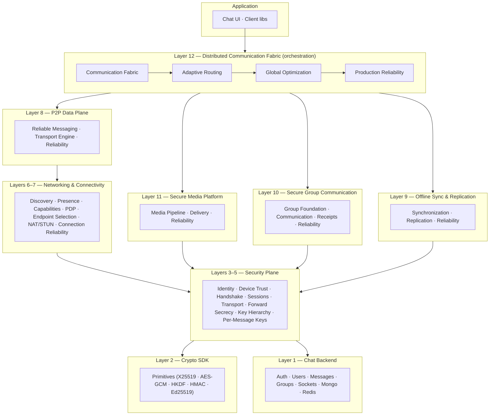
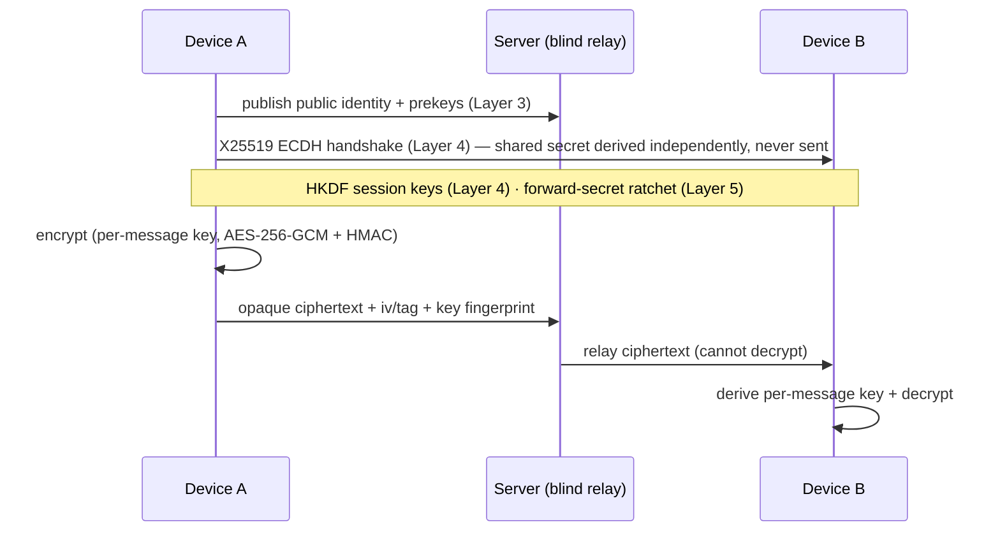

# System Architecture — Secure Distributed Communication Platform

> **Status:** ✅ Complete (Layers 1–12) · **Version:** v1.0.0 (frozen). This document is the authoritative
> architecture reference for the whole platform: a layered, end-to-end-encrypted, peer-to-peer communication
> system with intelligent, globally-optimized, production-hardened orchestration.

---

## 1. The layered architecture

The platform is built as **12 layers**, each a self-contained plane that consumes only the *frozen*
interfaces of the layers below it. Higher layers never reach around lower ones; lower layers never depend
on higher ones.



| Layer | Plane | Subsystem(s) |
|---|---|---|
| **1** | Chat backend | Production MERN backend — auth, users, messages, groups, sockets, Mongo, Redis |
| **2** | Crypto | Crypto SDK (X25519, AES-256-GCM, HKDF, HMAC, Ed25519) — private keys never leave the device |
| **3** | Security | Secure Identity, Device Trust, Verification & Trust |
| **4** | Security | Secure Handshake, Key Agreement (ECDH), Secure Sessions, Secure Transport (first E2E) |
| **5** | Security | Forward Secrecy, Automatic Rekeying, Key Hierarchy, Per-Message Keys, Crypto Hardening |
| **6** | Networking control plane | Discovery, Presence, Capability Exchange, Peer Discovery Protocol, Endpoint Selection, Hardening |
| **7** | Connectivity | Network Discovery (STUN/NAT), Connection Reliability |
| **8** | P2P data plane | Reliable Messaging, Large-Payload Transport Engine, Data-Plane Reliability |
| **9** | Sync | Offline Synchronization, State Replication & Conflict Resolution, Sync Reliability |
| **10** | Groups | Group Foundation, Group Communication, Group Receipts, Group Reliability |
| **11** | Media | Secure Media Pipeline, Distributed Media Delivery, Media Reliability |
| **12** | Orchestration | Communication Fabric, Adaptive Routing, Global Optimization, Production Reliability |

---

## 2. The security plane (Layers 2–5)

**End-to-end encryption is the platform's foundation.** Private keys are generated + held device-side and
**never** reach the server. The server is always a **blind relay** — it stores + forwards opaque ciphertext
+ non-secret metadata (ivs, tags, key *fingerprints*), and it can never decrypt.



- **Forward secrecy** (Layer 5): a one-way HKDF generation-secret chain; fresh keys per evolution; old keys
  destroyed — a compromised key cannot decrypt past traffic.
- **Per-message keys** (Layer 5): each message uses a unique key derived from a chain key, used once, then
  destroyed; replay rejected.
- **Group encryption** (Layer 10): device-local group keys, rekeyed on membership departure; the server
  relays opaque group ciphertext only.
- **Media encryption** (Layer 11): a per-file device-local AES-GCM key, never sent; the server stores an
  opaque blob + fingerprint.

---

## 3. Control plane vs data plane

A strict invariant across **all 12 layers**: the **control plane** (decisions, routing, scheduling,
health, metadata) is **content-free**. Every control-plane subsystem runs a **no-content deep scan**
before any persist, rejecting any plaintext / ciphertext / key material. The **data plane** (Layer 8
transport, Layer 11 media) moves the encrypted bytes; the orchestration layers (12) only decide *which*
data-plane subsystem runs and *when* — they never touch bytes.

---

## 4. Layer 12 — the orchestration fabric

See `LAYER12_FINAL.md` for the full treatment. In brief:

```mermaid
flowchart LR
  Req["request"] --> Ctx["context (immutable)"] --> Pol["policies"] --> Dec["decision"]
  Dec --> Score["adaptive route scoring"] --> Sel["strategy + route"]
  Sel --> QoS["QoS + resources + schedule"] --> Plan["execution plan + timeline"]
  Plan --> Orch["orchestrate → subsystem adapters"]
  Orch --> Exec["frozen data-plane subsystems"]
  All["reliability wrapper"] -.wraps.-> Req
```



- **Decision** emerges from **weighted route scores** (capability match · security · policy · cost · sync ·
  availability), never hardcoded conditionals.
- **Scheduling** classifies every communication into a **QoS lane** (critical/high/normal/background) and
  picks immediate/deferred/background/batch, dispatched by **weighted-fair + aging**.
- **Reliability** wraps each operation with **circuit breaker → bulkhead → retry → timeout → recover →
  degrade**, plus metrics, tracing, and audit.

---

## 5. Component interaction (a group media message, end-to-end)

```mermaid
sequenceDiagram
  participant U as User (client)
  participant Fab as Communication Fabric (L12)
  participant Med as Media Platform (L11)
  participant Grp as Group Comm (L10)
  participant TxA as Transport (L8)
  participant Sec as Security (L4/5)
  U->>Sec: encrypt media (per-file key, device-local)
  U->>Fab: execute({ type: media-transfer, groupId, mediaType })
  Fab->>Fab: decision → MEDIA strategy; optimizer → QoS "normal", batch schedule
  Fab->>Med: deliver-media (opaque blob + fingerprint)
  Med->>TxA: chunked, per-chunk-hash transport (blind relay)
  Fab->>Grp: fanout media-ref to group members
  Grp->>Grp: per-member delivery + receipts (Layer 10 receipts)
  Note over Fab: reliability records metrics + audit; recovers on failure
```

---

## 6. Threat model

| Threat | Mitigation |
|---|---|
| **Server compromise / honest-but-curious server** | Server is a blind relay; E2E encryption (L2–5); control plane is content-free; keys never leave devices. |
| **Passive network eavesdropper** | All payloads AES-256-GCM + HMAC; no plaintext on the wire. |
| **Message replay** | Per-message keys used once + replay guard (L5); idempotency + replay protection in the reliability layer (L12 S4). |
| **Forward compromise** (key theft) | Forward secrecy (L5) — old keys destroyed; a stolen key cannot decrypt past traffic. |
| **Sender spoofing** | Authorization enforced at every orchestration layer (caller = sender); audited (L12 S4). |
| **Group intruder after leaving** | Group rekey on departure (L10) — a departed member cannot read new messages. |
| **Media tampering** | Per-file fingerprint + per-chunk hash integrity verification (L11). |
| **Downgrade / protocol attacks** | Downgrade + integrity + protocol-freeze hardening (L4/5); frozen protocol manifest (L12 S4). |
| **Resource exhaustion / DoS (control plane)** | Bulkhead isolation + circuit breakers + rate-limit hooks + backpressure (L12 S3/S4). |
| **Cascading failure** | Circuit breakers + graceful degradation + per-compartment isolation (L12 S4). |
| **Data loss on crash** | Checkpoint-based recovery + stall sweep across every reliability layer. |

**Trust boundary:** the device is trusted; the server is untrusted for content (trusted only for relay +
control-plane metadata). Cryptographic guarantees do not depend on server honesty.

---

## 7. Data + storage architecture

- **MongoDB** — durable control-plane metadata + opaque ciphertext blobs. Every subsystem uses a
  **storage-independent repository** contract (in-memory reference + Mongo backend), so the store is
  swappable (future distributed/Redis backends are a one-line change).
- **Redis** — online-user / socket presence cache (Layer 1).
- **Pluggable media storage provider** (Layer 11) — in-memory + filesystem; blobs live in the provider,
  not the DB.
- **No content in the control plane** — decisions, plans, schedules, health, audit are metadata-only.

---

## 8. Cross-cutting patterns (consistent across all 12 layers)

- **Storage-independent repositories** (in-memory + Mongo, identical contract).
- **Typed event buses** (specific type + wildcard) — each layer emits; the layer above consumes.
- **Pluggable interfaces** — strategies, policies, scorers, scheduling policies, recovery strategies,
  adapters, probes.
- **`*-reliability` hardening** — every data-carrying layer (8–12) has recovery + health + retry +
  observability + protocol freeze.
- **No-content invariant** — a deep scan guards every control-plane persist.
- **Deterministic + pure decision paths** — reproducible, cache-friendly, concurrency-safe.

---

## 9. Testing

**1,917 automated tests, 0 failures**, all DB-free (`node --test`) with deterministic clocks + in-memory
repositories. Coverage spans unit, integration, concurrency (100+), stress, fuzz, failure-injection, and
recovery across every layer. See each layer's `*_FINAL.md` + `PRODUCTION_DEPLOYMENT.md`.

---

## 10. Known limitations & non-goals

- **Non-goals (by design):** voice calls, video calls, federation, multi-cluster deployment, machine
  learning. These are future major versions; the architecture declares their extension seams.
- **Single-node** orchestration in v1.0.0 (cluster-ready seams present).
- **Dev-sandbox note:** `mongoose` is not installed in the current sandbox; DB-free suites run green and
  the Mongo repositories mirror the frozen in-memory contracts.

See `LAYER12_FINAL.md` §7–8 for the full production-readiness checklist + roadmap, and
`PRODUCTION_DEPLOYMENT.md` for operations.
