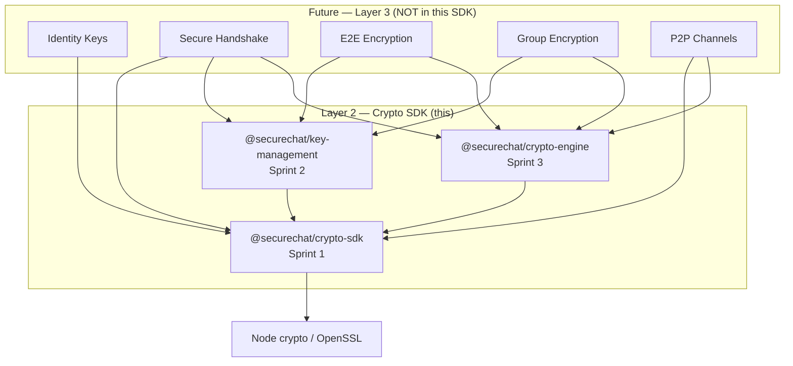
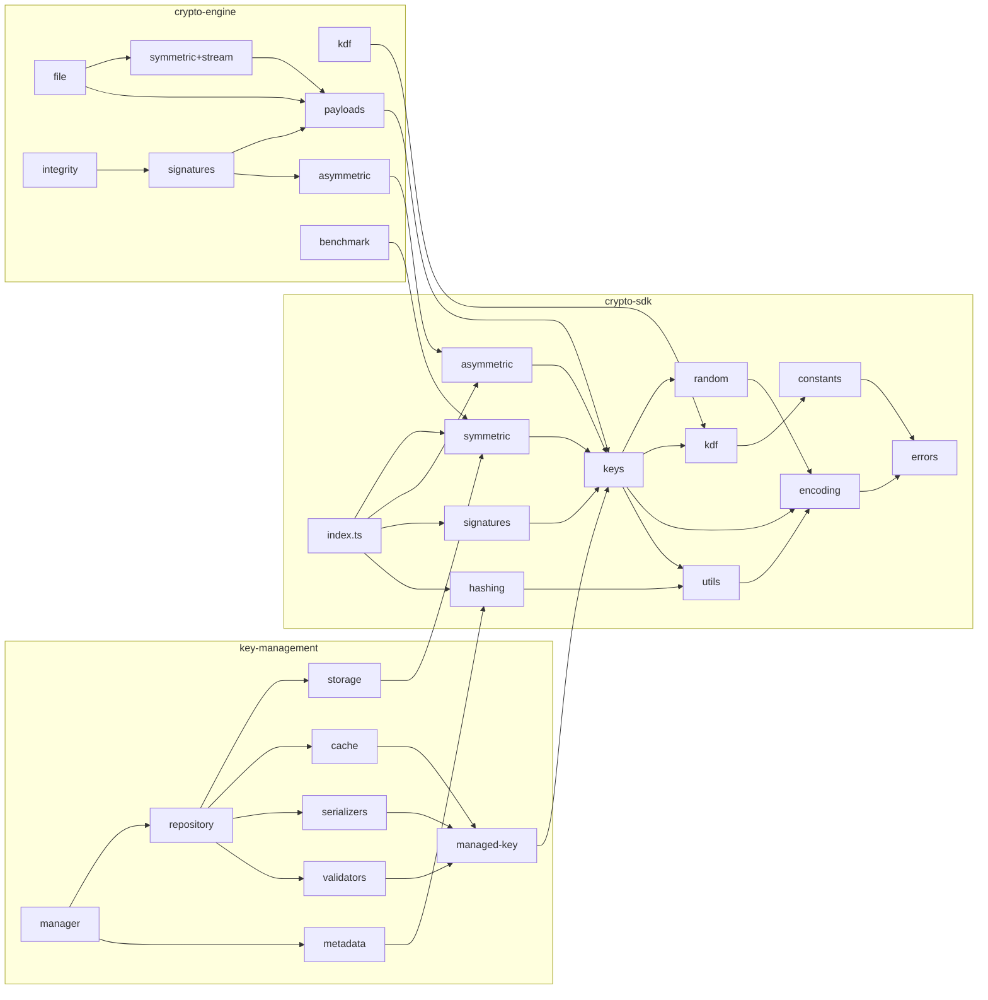
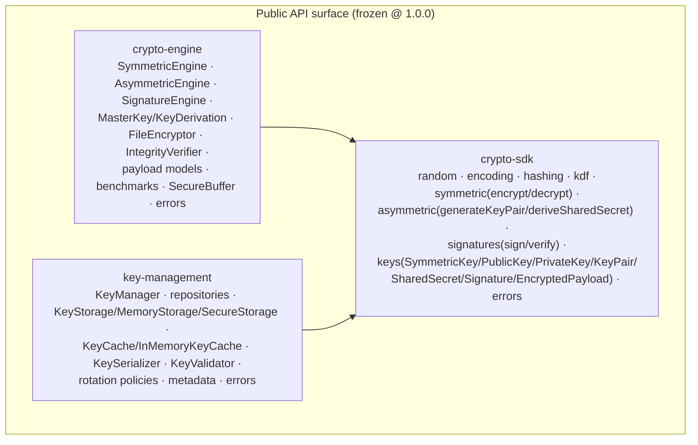
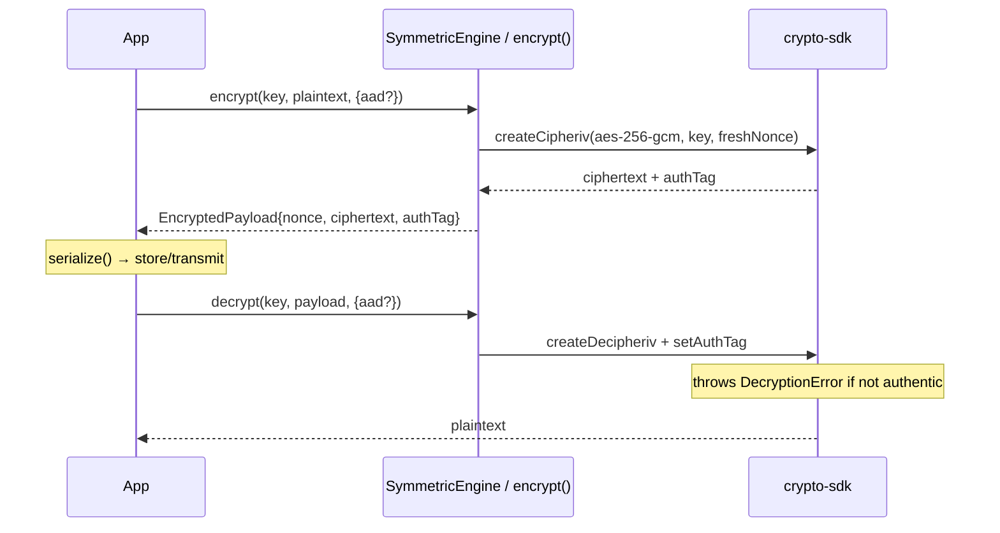
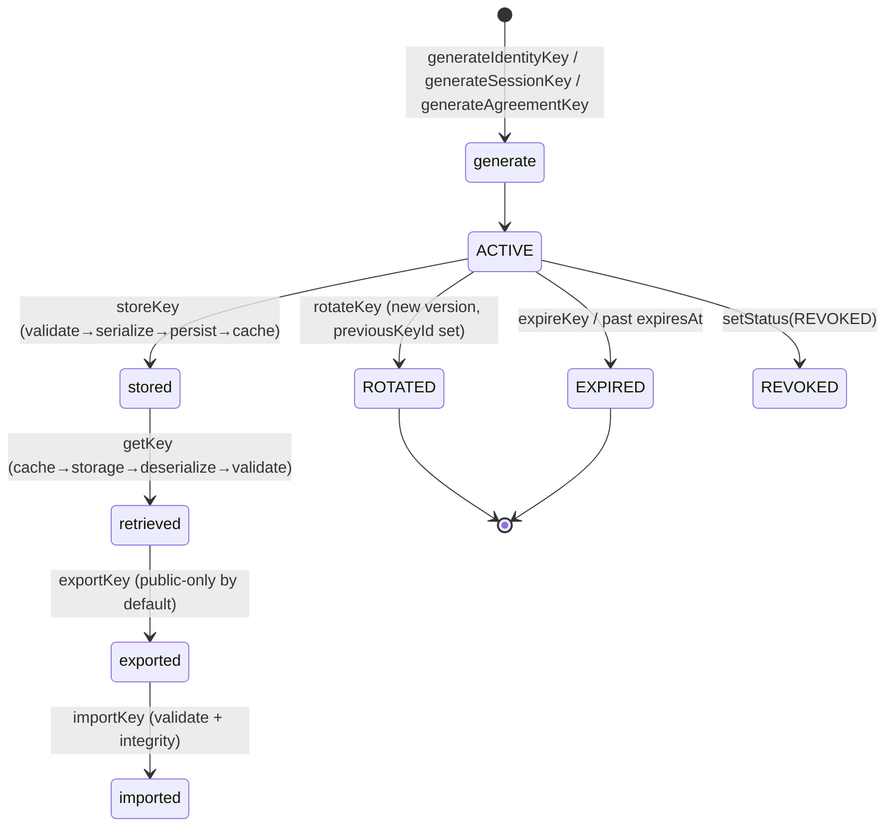
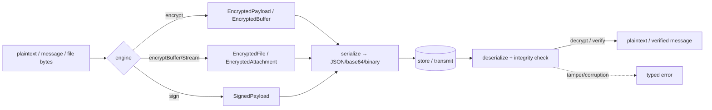

# CRYPTO_SDK.md — Layer 2 Crypto SDK (Complete Reference)

> **Status: STABLE (v1.0.0). Layer 2 complete.**
> This is the single top-level reference for the Crypto SDK stack produced across
> Layer 2 (Sprints 1–4). It is a **standalone cryptographic library** with no
> dependency on — and no modification of — the chat backend (`server/`, `client/`),
> authentication, JWT, REST, WebSockets, MongoDB, or Redis.
>
> Future layers (Identity Keys, Secure Handshake, End-to-End Encryption, Group
> Encryption, P2P) **MUST consume this SDK** rather than implement new
> cryptographic primitives.

Per-module deep-dives:

- [`docs/MODULE_1_FOUNDATION.md`](./docs/MODULE_1_FOUNDATION.md) — primitives
- [`key-management/docs/MODULE_2_KEY_MANAGEMENT.md`](./key-management/docs/MODULE_2_KEY_MANAGEMENT.md) — key lifecycle
- [`crypto-engine/docs/MODULE_3_CRYPTO_ENGINE.md`](./crypto-engine/docs/MODULE_3_CRYPTO_ENGINE.md) — engine
- [`SECURITY.md`](./SECURITY.md) — security review & assumptions
- [`INTEGRATION.md`](./INTEGRATION.md) — how Layer 3 consumes this SDK
- [`CHANGELOG.md`](./CHANGELOG.md) — versions & API stability

---

## 1. Architecture overview

The SDK is **three layered packages**, each independently built/tested, composed
bottom-up. Higher packages depend only on lower ones; no cycles.

| Package                                 | Role                                                                                                                               | Depends on                   |
| --------------------------------------- | ---------------------------------------------------------------------------------------------------------------------------------- | ---------------------------- |
| `@securechat/crypto-sdk` (Sprint 1)     | Primitives: random, encoding, hashing, KDF, AES-GCM, X25519, Ed25519, key/payload value objects, typed errors                      | Node `crypto` (OpenSSL) only |
| `@securechat/key-management` (Sprint 2) | Key lifecycle: storage, cache, repositories, metadata, serialization, validation, rotation                                         | crypto-sdk                   |
| `@securechat/crypto-engine` (Sprint 3)  | Engine: symmetric/streaming, file encryption, signature & payload framework, key derivation, integrity, benchmarks, security utils | crypto-sdk                   |



---

## 2. Folder structure

```
crypto-sdk/                          # Sprint 1 package (also the stack root)
├── CRYPTO_SDK.md  SECURITY.md  INTEGRATION.md  CHANGELOG.md   # ← Sprint 4 docs
├── eslint.config.js  .prettierrc.json  .editorconfig          # ← Sprint 4 tooling
├── scripts/check-all.sh                                       # full quality gate
├── package.json  tsconfig*.json  vitest.config.ts
├── src/                     # primitives
│   ├── index.ts             # single public entry
│   ├── constants/  errors/  utils/  encoding/  random/
│   ├── hashing/  kdf/  symmetric/  asymmetric/  signatures/
│   └── keys/                # SymmetricKey, PublicKey, PrivateKey, KeyPair,
│                            #   SharedSecret, Signature, CipherText, EncryptedPayload
├── tests/                   # 97 tests (incl. property/malformed)
├── docs/MODULE_1_FOUNDATION.md
│
├── key-management/          # Sprint 2 package
│   ├── src/  { types, errors, managed-key, metadata, serializers, validators,
│   │           storage, cache, repository, rotation, recovery, migration, manager }
│   ├── tests/ (81)  docs/MODULE_2_KEY_MANAGEMENT.md
│
└── crypto-engine/           # Sprint 3 package
    ├── src/  { errors, types, security, kdf, payloads, symmetric(+stream),
    │           asymmetric, signatures, file, integrity, benchmark }
    ├── tests/ (87)  docs/MODULE_3_CRYPTO_ENGINE.md
```

---

## 3. Module dependency graph (internal, acyclic)



---

## 4. Public API structure

Each package exposes a **single entry point** (`dist/index.js` / `src/index.ts`)
with both flat named exports and grouped namespaces.



**API freeze policy (Semantic Versioning):** the exported names, signatures, and
serialized formats above are **stable at 1.0.0**. Additive changes (new exports,
new optional params) are minor; any change to an existing signature, return type,
enum value, or wire format is major. Serialized envelopes carry explicit version
fields (`EncryptedPayload` v1, KMS key format v1, engine payload v1, encrypted-file
v1) so future formats can be migrated, not broken.

---

## 5. Algorithm choices

| Purpose         | Algorithm                        | Rationale                                              |
| --------------- | -------------------------------- | ------------------------------------------------------ |
| CSPRNG          | OS `crypto.randomBytes`          | kernel entropy; never `Math.random()`                  |
| Symmetric AEAD  | **AES-256-GCM**                  | NIST SP 800-38D; AES-NI accelerated; conf.+integrity   |
| Key agreement   | **X25519**                       | constant-time ECDH; small keys; TLS1.3/Signal standard |
| Signatures      | **Ed25519**                      | deterministic EdDSA; no nonce footgun; 64-byte sigs    |
| KDF (secrets)   | **HKDF-SHA256**                  | RFC 5869 extract-then-expand; `info` domain separation |
| KDF (passwords) | **scrypt**                       | memory-hard; off the transport path                    |
| Hashing         | **SHA-256/384/512, BLAKE2b**     | integrity, fingerprints, checksums                     |
| Encoding        | base64 / base64url / hex / utf-8 | validated serialization boundary                       |

No primitive is hand-rolled; all delegate to OpenSSL via Node `crypto`.

---

## 6. Encryption flow



For **files/streams**, a per-stream key is derived (`HKDF(baseKey, streamSalt)`)
and each chunk is sealed with a counter nonce + AAD binding `index|isFinal`,
giving reorder/truncation/duplication protection (see MODULE_3 §3).

---

## 7. Signing flow

```mermaid
sequenceDiagram
    participant Signer
    participant SE as SignatureEngine / sign()
    participant Verifier
    Signer->>SE: signPayload(privKey, message, {attach})
    SE-->>Signer: SignedPayload{signature, metadata, payload?}
    Note over Signer,Verifier: transmit serialize()
    Verifier->>SE: verifyPayload(pubKey, signed, message?)
    Note over SE: attached→embedded payload; detached→message required
    SE-->>Verifier: true / false  (tamper ⇒ false)
```

---

## 8. Key lifecycle

Managed by `@securechat/key-management` (`KeyManager`). Status is metadata only —
the SDK never auto-transitions.



---

## 9. Payload lifecycle



All payload models are versioned, self-describing, integrity-checked, and
chat-agnostic.

---

## 10. Error hierarchy

```mermaid
graph TD
    E[Error]
    E --> CE[CryptoError  .code]
    CE --> ENCd[EncryptionError] & DEC[DecryptionError] & IK[InvalidKeyError]
    CE --> ISig[InvalidSignatureError] & ICt[InvalidCiphertextError]
    CE --> KIm[KeyImportError] & KEx[KeyExportError] & RG[RandomGenerationError]
    CE --> ENd[EncodingError] & HE[HashingError] & KD[KeyDerivationError] & VE[ValidationError]
    CE --> ENGe[CryptoEngineError]
    ENGe --> ST[StreamError] & FE[FileEncryptionError] & IE[IntegrityError]
    ENGe --> PKV[PublicKeyValidationError] & DER[DerivationError] & PE[PayloadError] & BE[BenchmarkError]
    KME[KeyManagementError  .code]
    KME --> KNF[KeyNotFoundError] & DK[DuplicateKeyError] & KV[KeyValidationError]
    KME --> KEXP[KeyExpiredError] & SF[StorageFailureError] & SER2[SerializationError]
    KME --> IMP[ImportError] & EXP[ExportError] & ROT[RotationError] & REC[RecoveryError]
    KME --> UV[UnsupportedVersionError] & MIG[MigrationError]
```



- `crypto-sdk` and `crypto-engine` errors share one family (`CryptoError`);
  engine errors also subclass it — catch `CryptoError` broadly, branch on
  `instanceof` / stable `.code`.
- `key-management` uses its own `KeyManagementError` family (decoupled).

---

## 11. Usage examples (all runnable — see `scripts/examples.mjs`)

```ts
// Primitives (Sprint 1)
import {
  generateKeyPair,
  deriveSharedSecret,
  encrypt,
  decrypt,
  bytesToUtf8,
} from "@securechat/crypto-sdk";
const a = generateKeyPair(),
  b = generateKeyPair();
const key = deriveSharedSecret(a.privateKey, b.publicKey).deriveKey({ info: "demo" });
bytesToUtf8(decrypt(key, encrypt(key, "hello"))); // "hello"

// Key management (Sprint 2)
import { KeyManager } from "@securechat/key-management";
const km = new KeyManager();
const id = await km.generateIdentityKey({ owner: "user-1" });
const { current } = await km.rotateKey(id.keyId);

// Engine (Sprint 3)
import { FileEncryptor, SignatureEngine, KeyDerivation } from "@securechat/crypto-engine";
import { generateSigningKeyPair } from "@securechat/crypto-sdk";
const fkey = KeyDerivation.random().deriveSessionKey("peer-42");
const enc = new FileEncryptor().encryptBuffer(new Uint8Array([1, 2, 3]), fkey);
const kp = generateSigningKeyPair();
const sig = new SignatureEngine().signDetached(kp.privateKey, enc.serialize());
```

---

## 12. Testing strategy

| Layer          | Suites   | Highlights                                                                                                                                         |
| -------------- | -------- | -------------------------------------------------------------------------------------------------------------------------------------------------- |
| crypto-sdk     | 97 tests | KAT vectors (NIST SHA, RFC 5869 HKDF), property/randomized, malformed-input fuzzing, large/binary/UTF-8                                            |
| key-management | 81 tests | lifecycle, corrupted/duplicate keys, cache LRU/TTL, rotation history, encrypted-at-rest, 1000-key scale                                            |
| crypto-engine  | 87 tests | streaming tamper/reorder/truncation, file round-trips, KDF separation, X25519 small-order rejection, perf-regression guards, stress (5000 enc/dec) |

**Total: 265 tests.** Determinism: timestamp-sensitive assertions use injected
clocks; large-array comparisons use native `Buffer.equals` to avoid slow deep
equality. Property tests assert universal invariants over random inputs;
performance-regression tests use generous bounds (catch catastrophes, not jitter).

Run everything: `npm run check:all` (lint + format + typecheck + test + build ×3).

---

## 13. Performance notes

AES-256-GCM and Ed25519 are hardware/OpenSSL-accelerated. Indicative local numbers
(via `crypto-engine` `benchmark*` helpers; environment-dependent, not contractual):
sub-millisecond for typical message-sized AEAD ops and Ed25519 sign/verify;
1 MiB encrypt+decrypt well under a second (asserted by a regression guard). Object
allocation is minimized by returning defensive copies only at API boundaries;
serialization cost is dominated by base64 + JSON and is linear in payload size.

---

## 14. Security assumptions (summary — full list in SECURITY.md)

- All security rests on the OS CSPRNG and OpenSSL being correct.
- AEAD nonce safety: single-shot uses fresh random 96-bit nonces (keep <2³²
  messages/key); streams derive a unique per-stream key so counter nonces never
  repeat.
- Secret-bearing objects (`SymmetricKey`, `PrivateKey`, `SharedSecret`,
  `MasterKey`, `SecureBuffer`) redact themselves in logs and offer best-effort
  wiping (V8 GC caveat).
- Constant-time comparison (`timingSafeEqual`) for tags/fingerprints/keys.
- X25519 small-order points rejected; all-zero shared secrets rejected.
- Serialization is versioned and integrity-checked; deserializers reject
  malformed input with typed errors and never execute input.

---

## 15. Current limitations

- No protocol: no handshake, prekeys, ratchet, identity binding, or Signal
  protocol (that is Layer 3).
- Key persistence backends beyond memory/encrypted-memory are interface-only
  placeholders (`DatabaseStorage`/`HardwareStorage`/`CloudKmsStorage`).
- No automatic rotation firing, no real recovery/backup (hooks only).
- Single AEAD/curve set (AES-256-GCM, X25519, Ed25519); no post-quantum.
- File encryption operates on buffers/async-iterables, not disk/upload I/O.
- Best-effort memory wiping only.

---

## 16. Future integration points

See [`INTEGRATION.md`](./INTEGRATION.md) for the detailed extension-point map for
Identity Keys, Secure Handshake, E2E Encryption, Group Encryption, and P2P. None
of these are implemented here — the SDK only provides the primitives and clear
seams they will consume.
