# INTEGRATION.md — Consuming the Crypto SDK in Layer 3

> This document maps the **extension points** future layers use. It does **not**
> implement identity, handshake, messaging, groups, or P2P — it shows which
> existing SDK APIs each will consume, so Layer 3 never re-implements crypto.

## 0. Golden rule

Layer 3 imports from the three packages; it MUST NOT call Node `crypto`,
`libsodium`, or any low-level library directly, and MUST NOT add new primitives.
If something is missing, extend the SDK (a new minor version) rather than bypass it.

## 1. How Layer 3 consumes the SDK (general)

```mermaid
graph LR
    subgraph L3["Layer 3 modules"]
        ID[Identity] --> HS[Handshake] --> SESS[Session] --> E2E[Messaging]
        SESS --> GRP[Groups]
        HS --> P2P[P2P]
    end
    subgraph SDK["Layer 2 SDK"]
        SIG[signatures]:::e
        ASY[asymmetric]:::e
        KDFm[kdf: MasterKey/KeyDerivation]:::e
        SYM[symmetric/file engines]:::e
        KM[KeyManager + repositories]:::k
        PAY[payload models]:::e
    end
    ID --> SIG & KM
    HS --> ASY & SIG & KDFm
    SESS --> KDFm & KM
    E2E --> SYM & PAY & KM
    GRP --> SYM & KM
    P2P --> ASY & SYM & PAY
    classDef e fill:#243,stroke:#7c7;
    classDef k fill:#234,stroke:#79c;
```

## 2. Identity Keys → what they use

- **Generate:** `KeyManager.generateIdentityKey({ owner })` → an Ed25519
  `ManagedKey` (`KeyType.IDENTITY`). Persisted, rotatable, exportable public-only.
- **Sign/verify:** `crypto-sdk` `sign`/`verify`, or `crypto-engine`
  `SignatureEngine` for `SignedPayload`s with metadata.
- **Fingerprint / safety numbers:** `crypto-engine` `fingerprint` /
  `fingerprintSegments`.
- **Distribute public key:** `KeyManager.exportKey(id, { includePrivate: false })`.
- **Rotate:** `KeyManager.rotateKey` (preserves lineage via `previousKeyId`).

## 3. Secure Handshake → what it uses

- **Ephemeral keys:** `AsymmetricEngine.generateKeyAgreementKeyPair()` (X25519).
- **Validate peer key:** `AsymmetricEngine.validatePublicKey` (small-order
  rejection) before use.
- **Agree:** `AsymmetricEngine.agree(myPriv, theirPub)` → `SharedSecret`
  (rejects all-zero results).
- **Authenticate the exchange:** sign the transcript/prekeys with the identity key
  (`SignatureEngine.signPayload`), verify the peer's.
- **Derive handshake/root keys:** `SharedSecret.deriveKey({ info })` or
  `KeyDerivation`/`MasterKey` with `context="handshake"`, versioned labels.
- **Store negotiated material:** `KeyManager.storeSharedSecret` /
  `preKeys`/`signedPreKeys`/`oneTimeKeys` repositories (already typed & ready).

## 4. End-to-End Encryption → what it uses

- **Session keys:** `deriveSessionKey(sharedSecret, contextId)` (engine) or
  `MasterKey.deriveSymmetricKey({ context, purpose: ENCRYPTION })`. Separate MAC/
  metadata keys via distinct `purpose` values.
- **Encrypt/decrypt messages:** `SymmetricEngine.encrypt/decrypt` →
  `EncryptedPayload`/`EncryptedBuffer`; bind metadata via AAD.
- **Forward secrecy / ratchet:** repeated ephemeral agreement
  (`generateKeyAgreementKeyPair` then `agree`) with HKDF chaining; persist ratchet
  state as `ManagedKey`s and rotate.
- **Wire format:** `EncryptedPayload.serialize()` / `EncryptedBuffer.serialize()`;
  versioned, integrity-checked, transport-agnostic.

## 5. Group Encryption → what it uses

- **Sender/group keys:** `KeyManager.storeRawKey({ type: KeyType.GROUP })` or
  `groupKeys` repository; symmetric group key via `SymmetricKey`.
- **Distribute group key to members:** encrypt it to each member's session/agreed
  key with `SymmetricEngine` (key wrapping — `DerivationPurpose.KEY_WRAPPING`).
- **Encrypt group messages:** `SymmetricEngine` with the group key; rotate the
  group key on membership change via `KeyManager.rotateKey`.

## 6. Media / Attachment Encryption → what it uses

- **Encrypt files:** `FileEncryptor.encryptBuffer` / `encryptStream`
  (chunked, memory-bounded, reorder/truncation-safe) → `EncryptedFile` /
  `EncryptedAttachment`.
- **Integrity/dedup:** `computeChecksum` / `hashFile` (SDK).
- The **key** for a media blob is a per-file `SymmetricKey`, itself wrapped/shared
  via §4/§5. File encryption is not wired to disk/uploads — Layer 3 supplies I/O.

## 7. P2P Secure Channels → what it uses

- The **same** agreement (`AsymmetricEngine`), derivation (`KeyDerivation`), and
  AEAD (`SymmetricEngine`/`FileEncryptor`) stack, independent of any server relay.
- Peer identity/authentication via `SignatureEngine` + fingerprints.
- Channel framing uses the streaming primitives (header + authenticated chunks).

## 8. Backend touch-points (context only — NOT modified by Layer 2)

Per `PROJECT_KNOWLEDGE.md`, when Layer 3 wires E2EE into the product, ciphertext/
payloads produced by these engines will ride the **existing, unchanged** message
and Socket.IO pipeline (`server/controllers/messageController.js`,
`groupController.js`, `server/server.js`). Keys and plaintext never leave the
Layer 3 client boundary; the server relays opaque `EncryptedPayload` bytes. This
SDK deliberately stops short of that wiring.

## 9. Stability guarantee for integrators

The public API and serialized formats are frozen at **1.0.0** (see CHANGELOG.md).
Integrate against the package entry points (`@securechat/crypto-sdk`,
`@securechat/key-management`, `@securechat/crypto-engine`) and the versioned
payload formats; internal file paths are not part of the contract.
