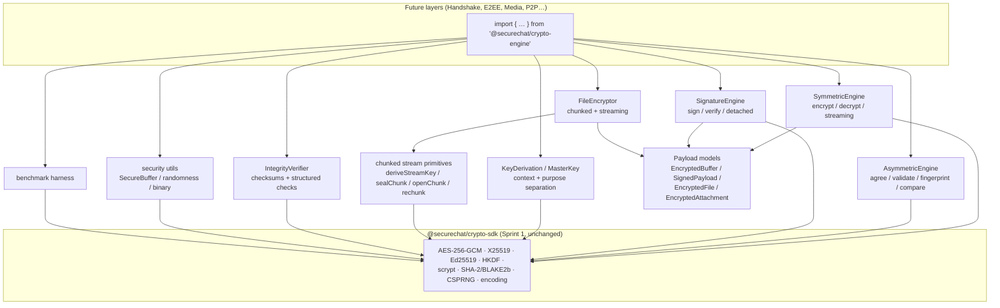
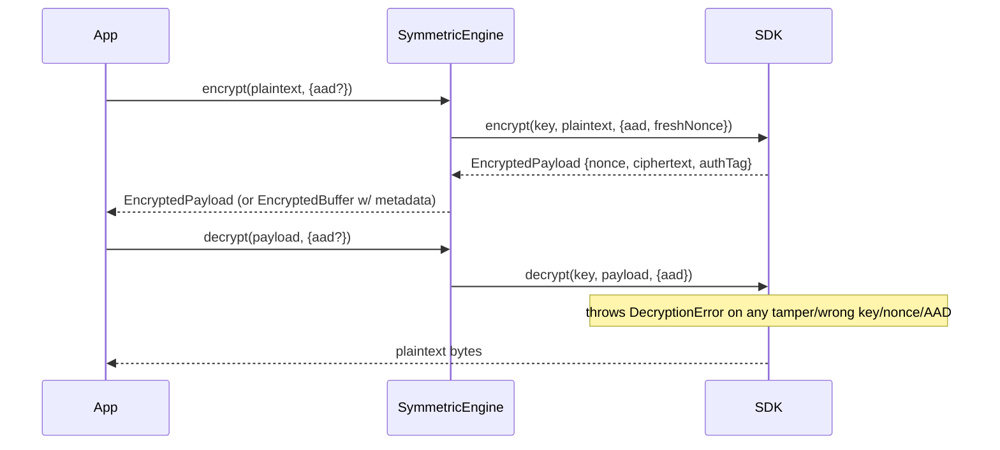
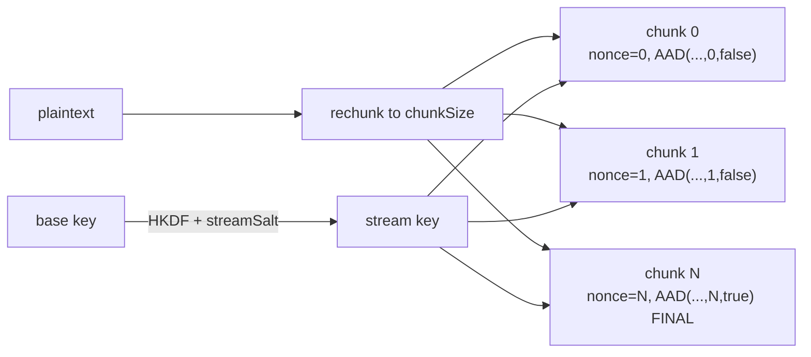
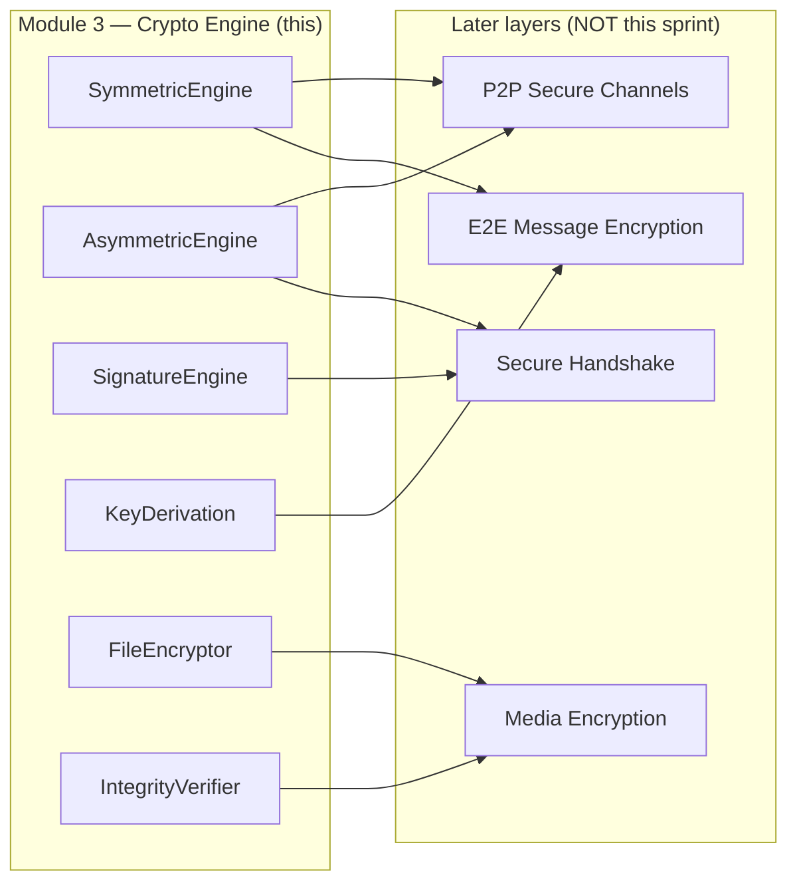

# MODULE 3 — Cryptographic Engine

> **Layer 2 (End-to-End Encryption) · Sprint 3**
> Package: `@securechat/crypto-engine`
> Builds on: `@securechat/crypto-sdk` (Sprint 1) — **unchanged**.
> Status: complete, isolated, tested (81 tests; Sprint 1's 86 and Sprint 2's 81 still pass).
>
> This sprint completes the reusable cryptographic capabilities that future layers
> consume. It does **not** integrate with chat, does **not** encrypt chat messages,
> and does **not** modify any backend logic, auth, JWT, MongoDB, Redis, or Socket.IO.
> It implements no handshake, identity-key, or Signal-protocol logic.

---

## 0. Isolation guarantees

- ❌ No change to chat / REST / WebSockets / MongoDB / Redis / auth / JWT.
- ❌ No handshake, identity keys, or Signal protocol.
- ❌ **No change to Sprint 1 or Sprint 2.** The engine is a new package
  (`crypto-sdk/crypto-engine/`) whose only dependency is `@securechat/crypto-sdk`.

Verify:

```bash
git status --porcelain server client            # backend untouched
cd crypto-sdk && npm test                        # Sprint 1: 86
cd crypto-sdk/key-management && npm test          # Sprint 2: 81
cd crypto-sdk/crypto-engine && npm test           # Sprint 3: 81
```

---

## 1. Architecture

The engine is a set of focused, composable engines and value objects over the
Sprint 1 primitives. Nothing here re-implements cryptography — every operation
delegates to the SDK (OpenSSL-backed).



### Folder structure

```
crypto-sdk/crypto-engine/
├── src/
│   ├── index.ts          # public surface (flat + namespaced)
│   ├── errors/           # CryptoEngineError family (extends SDK CryptoError)
│   ├── types/            # enums + data interfaces
│   ├── security/         # SecureBuffer, randomness sanity, binary validation
│   ├── kdf/              # MasterKey, KeyDerivation, deriveSessionKey
│   ├── payloads/         # EncryptedBuffer, SignedPayload, EncryptedFile, EncryptedAttachment
│   ├── symmetric/        # SymmetricEngine (index.ts) + stream.ts (chunk primitives)
│   ├── asymmetric/       # AsymmetricEngine + fingerprints + small-order rejection
│   ├── signatures/       # SignatureEngine
│   ├── file/             # FileEncryptor (buffer + streaming)
│   ├── integrity/        # checksums + IntegrityVerifier
│   └── benchmark/        # benchmark harness
├── tests/                # 81 tests across 10 files
└── docs/MODULE_3_CRYPTO_ENGINE.md
```

---

## 2. Algorithms

All inherited from Sprint 1 (audited, OpenSSL-backed); the engine adds structure,
not new primitives.

| Capability                         | Algorithm                                    | Where used                     |
| ---------------------------------- | -------------------------------------------- | ------------------------------ |
| Authenticated symmetric            | **AES-256-GCM** (AEAD)                       | `SymmetricEngine`, file chunks |
| Key agreement                      | **X25519** (ECDH)                            | `AsymmetricEngine.agree`       |
| Signatures                         | **Ed25519** (EdDSA)                          | `SignatureEngine`              |
| Key derivation                     | **HKDF-SHA256** (+ **scrypt** for passwords) | `MasterKey` / `KeyDerivation`  |
| Hashing / checksums / fingerprints | **SHA-256** (SHA-384/512, BLAKE2b available) | integrity, fingerprints        |
| Randomness                         | OS **CSPRNG**                                | keys, nonces, salts            |

---

## 3. Encryption flow

### Single-shot (in-memory)



### Chunked file / stream

The file/stream construction (format v1) is the security-critical part:

- A random 16-byte **`streamSalt`** per file → **per-stream key** via
  `HKDF(baseKey, salt=streamSalt, info="securechat:file-stream:v1")`. Because each
  stream has a unique key, **counter nonces are safe** (no cross-stream reuse).
- Each chunk: 12-byte **big-endian counter nonce** (the chunk index).
- Each chunk's **AAD** binds `version | algorithm | chunkSize | streamSalt | index
| isFinal`, giving:
  - **reorder protection** (index bound),
  - **truncation protection** (only the last chunk has `isFinal = 1`; a cut stream
    never yields a valid terminator),
  - **duplication protection** (wrong index/flag).
- Stored chunk = `base64(ciphertext || authTag)`; the nonce is recomputed from the
  index, not stored.



---

## 4. Signature flow

```mermaid
sequenceDiagram
    participant Signer
    participant SE as SignatureEngine
    participant Verifier
    Signer->>SE: signPayload(privKey, message, {attach})
    SE-->>Signer: SignedPayload {signature, metadata{signerFingerprint, createdAt}, payload?}
    Note over Signer,Verifier: transmit serialize() (attached carries payload; detached does not)
    Verifier->>SE: verifyPayload(pubKey, signed, message?)
    Note over SE: attached → uses embedded payload (message optional, must match if given)<br/>detached → message REQUIRED
    SE-->>Verifier: true / false (tamper → false)
```

- **Attached** `SignedPayload` carries the signed bytes; **detached** does not
  (the verifier supplies the message).
- **Metadata**: `version`, `algorithm: "ed25519"`, `signerFingerprint`
  (SHA-256 of the signer's public key), `createdAt` (ISO).
- Serialization is versioned and JSON-safe.

---

## 5. Key derivation

`MasterKey` + `KeyDerivation` formalize **context** and **purpose** separation. The
HKDF `info` label is `"<namespace>:<context>:<purpose>:v<version>"`, so changing
any axis yields an independent key.

```ts
const kd = KeyDerivation.random("securechat");
const enc = kd.deriveSymmetricKey("session", DerivationPurpose.ENCRYPTION);
const mac = kd.deriveSymmetricKey("session", DerivationPurpose.MAC); // ≠ enc
const peer = kd.deriveSessionKey("peer-42"); // ≠ enc/mac
```

`MasterKey` sources: `random()`, `fromBytes()`, `fromSharedSecret()`,
`fromPassword()` (scrypt). Hierarchical sub-masters via `deriveMasterKey()`.
`deriveSessionKey(sharedSecret, context)` is the one-shot bridge from an X25519
agreement to a session key.

---

## 6. Payload models

Chat-agnostic, versioned, self-describing containers:

| Model                 | Wraps                                                  | Notes               |
| --------------------- | ------------------------------------------------------ | ------------------- |
| `EncryptedBuffer`     | `EncryptedPayload` + `ContentMetadata`                 | encrypted blob      |
| `SignedPayload`       | `Signature` + `SignatureMetadata` (+ optional payload) | attached/detached   |
| `EncryptedFile`       | header + base64 chunk frames                           | chunked file        |
| `EncryptedAttachment` | `EncryptedFile` with `contentType`                     | attachment metadata |

All expose `serialize()` / `static deserialize()` and `toJSON()` / `fromJSON()`.

---

## 7. File encryption foundation

`FileEncryptor` (chunk size configurable, default 64 KiB):

- **Buffer mode:** `encryptBuffer(data, key, {metadata?})` → `EncryptedFile`;
  `decryptBuffer(file, key)` → bytes. Verifies order + authenticated terminator.
- **Attachment:** `encryptAttachment(data, key, {contentType, name?})` →
  `EncryptedAttachment`.
- **Streaming mode (memory-bounded):** `encryptStream(source, key)` yields a header
  frame then chunk frames; `decryptStream(frames, key)` yields plaintext chunks and
  enforces header-first ordering, sequential indices, and a final-chunk terminator.

Empty input still produces one authenticated (empty, final) chunk, so every
file/stream has a terminator. Not integrated with uploads.

---

## 8. Integrity protection

Detects: modified payloads, corrupted ciphertext, wrong keys, wrong signatures,
invalid metadata, and version mismatches.

- **AEAD / Ed25519** already reject tampering (decrypt throws; verify returns false).
- **Checksums:** `computeChecksum` / `verifyChecksum` (constant-time) / `assertChecksum`
  for non-authenticated corruption detection.
- **`IntegrityVerifier`** (non-throwing, structured `{ ok, code, reason }`):
  `checkEncryptedPayload`, `checkVersion`, `tryDecrypt` (returns plaintext or an
  `authentication-failed` code), `verifySignedPayload`.

---

## 9. Performance layer

`benchmark` / `benchmarkSync` measure a function over N iterations (with warm-up)
and report `{ iterations, totalMs, meanMs, min/max, p50, p95, opsPerSecond,
throughputMiBps? }`. Convenience helpers: `benchmarkEncryption/Decryption/Signing/
Verification(payloadSize)`. `sampleMemory()` snapshots RSS/heap.

Results are environment-dependent diagnostics — **not** a correctness contract;
tests assert result _shape_, never absolute speed.

---

## 10. Security utilities

- **`SecureBuffer`** — holds sensitive bytes, returns copies, `wipe()`s on demand,
  and auto-wipes with `using` (implements `Symbol.dispose`).
- **`analyzeRandomness` / `assertRandomness`** — a _sanity_ check (length, all-equal,
  gross low-entropy). NOT a statistical certifier; a guard against broken inputs.
- **`toBytes` / `assertBinary`** — binary coercion/validation.
- Re-exports `constantTimeEqual` and `wipe` from the SDK.

---

## 11. Security assumptions

- **Cryptography is the SDK's / OpenSSL's.** The engine adds structure only.
- **Nonce safety for streams is by construction** — a fresh per-stream key means
  counter nonces never repeat under a key. For single-shot `SymmetricEngine`
  encryption, fresh random 96-bit nonces are used; keep messages-per-key well below
  ~2³² (or derive per-message keys, as future modules will).
- **Small-order X25519 keys are rejected** (blacklist + all-zero shared-secret
  guard) to prevent contributory-behaviour attacks.
- **Memory wiping is best-effort** (V8/GC caveats).
- **Randomness sanity checks are not proofs** of randomness.
- **`owner`/`name`/`contentType` are opaque** — no chat/user semantics.

---

## 12. Current limitations

- **No protocol.** No handshake, prekeys, ratchet, identity binding, or Signal
  protocol — deferred to later layers.
- **No I/O integration.** File encryption operates on buffers/async-iterables; it is
  not wired to disk, uploads, or storage.
- **Streaming serialization is frame-based** (caller frames the transport); a
  single-blob container is provided only for buffer mode (`EncryptedFile`).
- **Single AEAD / curves** — AES-256-GCM, X25519, Ed25519 (matching Sprint 1).
- **Password KDF (scrypt) is provided but not on the session/transport path.**
- **Benchmarks are indicative**, not regression gates.

---

## 13. Future integration points



- **Secure Handshake** → `AsymmetricEngine.agree` (validated peer keys) +
  `SignatureEngine` (authenticated key exchange) + `KeyDerivation`.
- **E2E Message Encryption** → `deriveSessionKey` + `SymmetricEngine` +
  `SignedPayload`.
- **Media Encryption** → `FileEncryptor` (chunked/streaming) + checksums.
- **P2P Channels** → the same engines, independent of any server relay.

**Where it will eventually touch the backend (context only — untouched now):** per
`PROJECT_KNOWLEDGE.md`, later layers pass engine-produced ciphertext/payloads
through the _existing, unchanged_ message/socket pipeline. Keys and plaintext never
leave the crypto layers.

---

## 14. Running it

```bash
cd crypto-sdk/crypto-engine
npm install          # links @securechat/crypto-sdk (file:..) + dev-deps
npm test             # 81 tests
npm run typecheck    # tsc --noEmit
npm run build        # emit dist/ (build the SDK first: cd .. && npm run build)
npm run bench        # run the benchmark test group
```

Test coverage: encryption, decryption, wrong key, wrong nonce, modified
ciphertext, modified signature, large payloads (5 MiB), binary & UTF-8 payloads,
files (buffer + streaming, tamper/reorder/truncation), key derivation separation,
X25519 small-order rejection, integrity checks, performance harness, and repeated /
stress operations (5000 encrypt-decrypt, 2000 sign-verify, 200 files).
