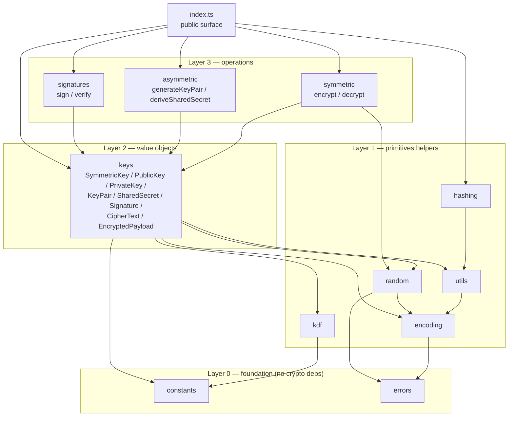
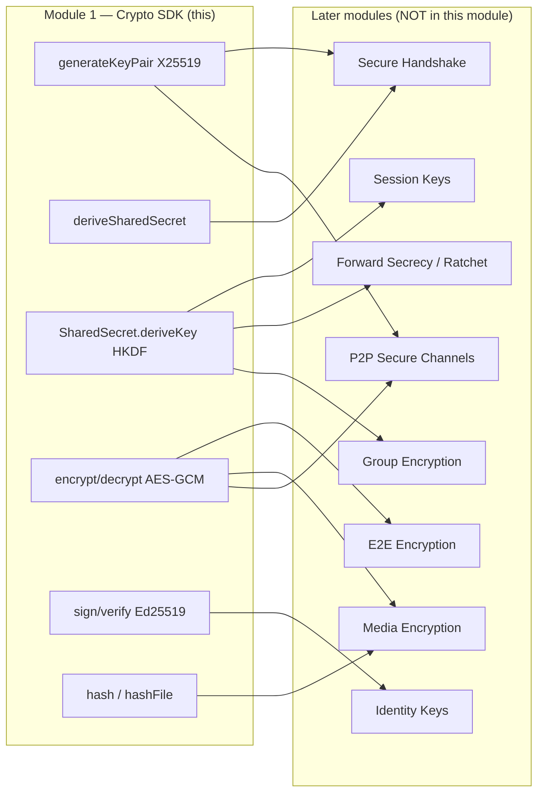

# MODULE 1 — Cryptography Foundation

> **Layer 2 (End-to-End Encryption) · Module 1 of N**
> Package: `@securechat/crypto-sdk`
> Status: complete, isolated, tested (86 tests passing).
>
> This module builds **only** the reusable cryptographic infrastructure — an
> internal "Crypto SDK". It does **not** implement chat encryption, and it is
> **not** wired into the existing backend in any way. Future modules (Identity
> Keys, Session Keys, Secure Handshake, E2EE, Forward Secrecy, Group Encryption,
> Media Encryption, P2P Secure Channels) will `import` from this SDK rather than
> re-implement cryptography.

---

## 0. Non-negotiable isolation guarantees

The following were **not touched** by this module, by design:

- ❌ No change to chat logic, controllers, or message flow.
- ❌ No change to any REST API or route.
- ❌ No change to the MongoDB schema or any model.
- ❌ No change to Socket.IO / WebSocket logic.
- ❌ No change to authentication or JWT.

The SDK lives in its own top-level package directory `crypto-sdk/`, has its own
`package.json`, its own dependency set (only dev-dependencies: TypeScript +
Vitest), and imports **nothing** from `server/` or `client/`. It has zero runtime
dependencies — it uses only the Node.js standard-library `crypto`, `fs`, and
`os` modules.

Verify isolation at any time with:

```bash
git status --porcelain server client   # should show no modifications
```

---

## 1. Architecture

### 1.1 Design shape

The SDK is a **layered, dependency-light TypeScript library**. Every capability
is a small, single-responsibility module that exposes pure functions and/or
immutable value objects. Higher layers depend only on lower layers; there are no
cycles.



### 1.2 The engine underneath

Every primitive delegates to **Node.js's built-in `crypto` module**, which is
backed by **OpenSSL** — a widely-audited, FIPS-capable, hardware-accelerated
implementation. **No cryptographic primitive is implemented by hand** anywhere in
this SDK. The SDK's job is to provide a *safe, typed, misuse-resistant* surface
over those primitives, not to reinvent them.

### 1.3 Core design principles

| Principle | How it shows up |
|---|---|
| **AEAD by default** | Symmetric encryption is only AES-256-GCM; there is no unauthenticated cipher and no "decrypt without verify" path. |
| **Immutable value objects** | `SymmetricKey`, `SharedSecret`, `EncryptedPayload`, etc. copy their inputs and return copies from getters, so internal state can't be mutated. |
| **Fail loud, fail typed** | Invalid input throws a specific `CryptoError` subclass with a stable `.code`. |
| **Chat-agnostic** | Nothing references messages, users, sockets, or the DB. The word "message" only appears as "the bytes being signed/hashed". |
| **Derive, don't reuse** | A raw ECDH `SharedSecret` cannot be used as a key directly — it only exposes HKDF-based derivation. |
| **Secrets don't leak** | Key/secret objects override `toJSON()`/return `"[SymmetricKey]"` so they don't spill into logs. |

---

## 2. Algorithms & rationale

Modern, audited, and boring-on-purpose. Each choice below is the mainstream,
well-reviewed option for its job.

| Purpose | Algorithm | Why this one |
|---|---|---|
| **Secure random** | OS CSPRNG via `crypto.randomBytes` / `randomInt` / `randomUUID` | Draws from the kernel entropy pool (`getrandom(2)` / `BCryptGenRandom`). The only correct source for keys, nonces, salts, and IDs. Never `Math.random()`. |
| **Symmetric encryption** | **AES-256-GCM** (AEAD) | NIST SP 800-38D standard; provides confidentiality **and** integrity in one pass; AES-NI hardware acceleration on virtually all servers; 256-bit key gives a large post-quantum safety margin for symmetric strength. 96-bit nonce, 128-bit tag. |
| **Key agreement** | **X25519** (ECDH on Curve25519) | Fast, constant-time by construction, small 32-byte keys, no fragile parameter choices, immune to many curve-validation pitfalls of NIST P-curves. The de-facto standard for modern key exchange (Signal, TLS 1.3, WireGuard, age). |
| **Digital signatures** | **Ed25519** (EdDSA) | Deterministic (no per-signature nonce to mishandle → avoids the PS3/Sony-style catastrophic RNG failures of ECDSA), fast verify, compact 64-byte signatures, constant-time. |
| **Key derivation (from secrets)** | **HKDF** (RFC 5869, SHA-256) | The standard extract-then-expand KDF for turning a high-entropy input (like an X25519 output) into one or more independent, uniformly-random keys, with domain separation via the `info` parameter. |
| **Key derivation (from passwords)** | **scrypt** | Memory-hard, deliberately slow; the right tool for the *separate* problem of stretching low-entropy human passwords. Provided for completeness; not on the session/transport path. |
| **Hashing** | **SHA-256 / SHA-384 / SHA-512 / BLAKE2b-512** | SHA-2 is the ubiquitous, audited default for integrity/fingerprinting; BLAKE2b offered as a fast modern alternative. (These are unkeyed digests — not MACs, not password hashes.) |
| **Encoding** | Base64, Base64URL (unpadded), Hex, UTF-8 | Deterministic, validated serialization at the binary↔text boundary. Base64URL (no padding) is used for JSON envelopes and JWK fields. |

### Why AES-256-GCM and not XChaCha20-Poly1305?

Both are excellent AEADs. AES-256-GCM was chosen because it is FIPS-approved and
hardware-accelerated on the server CPUs this platform runs on, and it is natively
available in Node/OpenSSL without an external dependency. The `SymmetricAlgorithm`
enum and the versioned `EncryptedPayload` envelope leave the door open to add
another AEAD later without breaking the wire format (see §7).

---

## 3. Folder structure

```
crypto-sdk/
├── package.json            # isolated package; devDeps only (typescript, vitest)
├── tsconfig.json           # typecheck config (src + tests)
├── tsconfig.build.json     # emit config (src -> dist)
├── vitest.config.ts        # test runner config
├── README.md               # quick-start + API cheat-sheet
├── docs/
│   └── MODULE_1_FOUNDATION.md   # ← this document
├── src/
│   ├── index.ts            # public surface (flat + namespaced exports)
│   ├── constants/          # algorithm ids, byte-length constants, versions
│   ├── errors/             # CryptoError hierarchy (typed, coded)
│   ├── encoding/           # utf8 / base64 / base64url / hex (validated)
│   ├── utils/              # validation, constantTimeEqual, wipe, coerceToBytes
│   ├── random/             # randomBytes, nonces, IVs, ids, uuid, randomInt
│   ├── hashing/            # hash / sha256 / sha512 / blake2b512 / hashFile
│   ├── kdf/                # hkdf, deriveKeyFromPassword (scrypt)
│   ├── keys/               # value objects (see below)
│   │   ├── symmetric-key.ts
│   │   ├── asymmetric-keys.ts   # PublicKey, PrivateKey, KeyPair
│   │   ├── shared-secret.ts
│   │   ├── signature.ts
│   │   ├── encrypted-payload.ts # CipherText, EncryptedPayload
│   │   └── index.ts
│   ├── symmetric/          # encrypt / decrypt (AES-256-GCM)
│   ├── asymmetric/         # generateKeyPair / deriveSharedSecret (X25519)
│   └── signatures/         # sign / verify (Ed25519)
└── tests/                  # 86 unit + integration tests (Vitest)
    ├── encoding.test.ts    ├── random.test.ts    ├── hashing.test.ts
    ├── utils.test.ts       ├── kdf.test.ts       ├── errors.test.ts
    ├── symmetric.test.ts   ├── asymmetric.test.ts├── signatures.test.ts
    └── integration.test.ts
```

---

## 4. Public API reference

Import either flat or namespaced:

```ts
import { encrypt, decrypt, generateKey } from "@securechat/crypto-sdk";
// or
import { symmetric } from "@securechat/crypto-sdk";
symmetric.encrypt(/* … */);
```

All byte inputs/outputs are `Uint8Array` (Node `Buffer` is accepted as input,
being a subclass). Functions that take "data" accept `Uint8Array | string`
(strings are treated as UTF-8).

### 4.1 `random`

| Export | Signature | Purpose | Throws |
|---|---|---|---|
| `randomBytes` | `(length: number) => Uint8Array` | CSPRNG bytes, `1..1_048_576` | `ValidationError`, `RandomGenerationError` |
| `generateNonce` | `(length = 12) => Uint8Array` | AEAD nonce (GCM size default) | `ValidationError` |
| `generateIV` | `(length = 12) => Uint8Array` | alias of `generateNonce` | `ValidationError` |
| `randomId` | `(byteLength = 16) => string` | URL-safe base64 id | — |
| `randomHexId` | `(byteLength = 16) => string` | hex id | — |
| `uuid` | `() => string` | RFC 4122 v4 UUID | `RandomGenerationError` |
| `randomInt` | `(min, max) => number` | uniform int in `[min, max)` | `ValidationError`, `RandomGenerationError` |

### 4.2 `encoding`

`utf8ToBytes`, `bytesToUtf8`, `toBase64`, `fromBase64`, `toBase64Url`,
`fromBase64Url`, `toHex`, `fromHex`. All validate input and throw
`EncodingError` on malformed data (unlike raw `Buffer.from`).

### 4.3 `hashing`

| Export | Signature |
|---|---|
| `hash` | `(data, algorithm = HashAlgorithm.SHA256) => Uint8Array` |
| `sha256` / `sha512` / `blake2b512` | `(data) => Uint8Array` |
| `hashHex` | `(data, algorithm?) => string` |
| `hashFile` | `(path, algorithm?) => Promise<Uint8Array>` (streams large files) |

### 4.4 `kdf`

| Export | Signature | Notes |
|---|---|---|
| `hkdf` | `(ikm, { salt?, info?, length = 32, hash = SHA256 }) => Uint8Array` | RFC 5869 |
| `deriveKeyFromPassword` | `(password, salt, { length = 32, cost = 32768, blockSize = 8, parallelization = 1 }) => Uint8Array` | scrypt |

### 4.5 `symmetric`

| Export | Signature | Notes |
|---|---|---|
| `generateKey` | `() => SymmetricKey` | AES-256 key |
| `encrypt` | `(key, plaintext, { aad?, nonce? }) => EncryptedPayload` | AEAD |
| `decrypt` | `(key, payload, { aad? }) => Uint8Array` | throws `DecryptionError` on any authentication failure |

**AAD note:** Associated Data is authenticated but not encrypted and is **not**
stored in the payload. The exact same `aad` must be passed to `decrypt`.

### 4.6 `asymmetric`

| Export | Signature | Notes |
|---|---|---|
| `generateKeyPair` | `(algorithm = X25519) => KeyPair` | X25519 (or Ed25519 for signing) |
| `deriveSharedSecret` | `(privateKey, publicKey) => SharedSecret` | X25519 ECDH; both keys must be X25519 |

### 4.7 `signatures`

| Export | Signature | Notes |
|---|---|---|
| `generateSigningKeyPair` | `() => KeyPair` | Ed25519 |
| `sign` | `(privateKey, message) => Signature` | requires Ed25519 key |
| `verify` | `(publicKey, message, signature) => boolean` | returns `false` on bad sig; throws only on wrong key type |

### 4.8 `keys` — value objects

- **`SymmetricKey`** — `generate()`, `fromBytes/fromBase64/fromHex`, `bytes`,
  `toBase64/toHex`, `destroy()`. Enforces 32 bytes.
- **`PublicKey`** — `fromRaw/fromBase64/fromDER/fromPEM/fromJWK`,
  `toRaw/toBase64/toDER/toPEM/toJWK`, `export(format)`, `equals()`, `native`.
- **`PrivateKey`** — `fromDER/fromPEM/fromJWK`, `toRaw/toDER/toPEM/toJWK`,
  `export(format)`, `toPublicKey()`, `native`. (RAW import unsupported — see §6.)
- **`KeyPair`** — `generate(algorithm)`, `fromPrivateKey()`, `{ publicKey, privateKey, algorithm }`.
- **`SharedSecret`** — `fromBytes()`, `deriveBytes(opts)`, `deriveKey(opts) => SymmetricKey`, `destroy()`.
- **`Signature`** — `fromBytes/fromBase64/fromHex`, `bytes`, `toBase64/toHex`, `length`, `isEd25519Length`.
- **`CipherText`** — `{ ciphertext, authTag, combined }`.
- **`EncryptedPayload`** — `{ algorithm, nonce, ciphertext, authTag, cipherText }`,
  `serialize()/toJSON()`, `EncryptedPayload.deserialize()/fromJSON()`. Envelope is
  versioned (`v: 1`).

### 4.9 `errors`

`CryptoError` (base) with subclasses: `EncryptionError`, `DecryptionError`,
`InvalidKeyError`, `InvalidSignatureError`, `InvalidCiphertextError`,
`KeyImportError`, `KeyExportError`, `RandomGenerationError`, `EncodingError`,
`HashingError`, `KeyDerivationError`, `ValidationError`. Each has a stable
`.code` (e.g. `ERR_DECRYPTION`) and forwards `.cause`.

### 4.10 `constants`

`SDK_VERSION`, `PAYLOAD_FORMAT_VERSION`, enums `SymmetricAlgorithm`,
`AsymmetricAlgorithm`, `HashAlgorithm`, `KeyFormat`, and byte-length constants
(`AES_256_GCM_KEY_BYTES`, `GCM_NONCE_BYTES`, `GCM_TAG_BYTES`, `X25519_KEY_BYTES`,
`ED25519_PUBLIC_KEY_BYTES`, `ED25519_SIGNATURE_BYTES`, `MAX_RANDOM_BYTES`).

---

## 5. Design philosophy

1. **Small, composable primitives over a monolithic "encryptMessage()".** The SDK
   gives building blocks (agree, derive, encrypt, sign). Protocol shape (who
   signs what, ratcheting, ordering) belongs to future modules, not here.
2. **Make misuse hard.** No nonce reuse footguns exposed by default (nonces are
   auto-generated), no unauthenticated cipher, no raw-shared-secret-as-key.
3. **Typed everything.** Full TypeScript types, JSDoc with examples and
   `@throws` on every public API. `.d.ts` is emitted for consumers.
4. **Deterministic serialization.** `EncryptedPayload` and all key/signature
   objects have explicit, versioned, validated (de)serialization so bytes can
   cross process/network/storage boundaries safely.
5. **Errors are part of the API.** Consumers branch on typed errors, never on
   string matching.

---

## 6. Security assumptions & limitations

### Assumptions

- **Platform CSPRNG is sound.** All security rests on `crypto.randomBytes` /
  OpenSSL being correctly seeded by the OS. On a misconfigured or entropy-starved
  host, guarantees weaken.
- **Private keys are stored/handled securely by the caller.** This SDK produces
  and (de)serializes keys; it does **not** provide at-rest key storage, an HSM/KMS
  integration, or access control. Those are out of scope for Module 1.
- **Callers manage nonce uniqueness per key.** With random 96-bit GCM nonces,
  keep messages-per-key well below ~2³² to stay within safe collision bounds.
  High-volume use should derive per-message keys (a later module's job).
- **AAD is supplied consistently.** Since AAD is not stored, encrypt/decrypt
  callers must agree on it out-of-band.

### Current limitations (documented, not "solved" here)

- **No protocol.** No handshake, no session/ratchet, no forward secrecy logic, no
  replay/ordering protection — these are explicitly deferred to later modules.
- **No key persistence / distribution / revocation / rotation.**
- **RAW import of *private* keys is unsupported.** Reconstructing a private
  `KeyObject` from only the 32-byte scalar needs a curve operation; to avoid
  hand-rolling curve math, use JWK/DER/PEM for private keys (all lossless). RAW
  *export* of the private scalar is supported.
- **`wipe()` / `destroy()` are best-effort.** In a GC'd runtime (V8) secret bytes
  may have been copied before zeroing; this is hygiene, not a guarantee.
- **No post-quantum primitives.** X25519/Ed25519 are classical ECC. (AES-256 has a
  reasonable symmetric PQ margin.)
- **AES-256-GCM only** for symmetric AEAD today (extensible via the enum/envelope).
- **Not a constant-time guarantee across the board.** Constant-time behaviour is
  inherited from OpenSSL for the sensitive operations and `timingSafeEqual` for
  comparisons; the SDK does not add timing hardening beyond that.

---

## 7. Future integration points

How later modules are expected to build on this SDK (design only — nothing is
wired yet):



- **Identity Keys** → long-term `Ed25519` `KeyPair` from `generateSigningKeyPair()`;
  sign prekeys/handshakes with `sign`/`verify`.
- **Session Keys / Secure Handshake** → `generateKeyPair()` (X25519) +
  `deriveSharedSecret()` + `SharedSecret.deriveKey({ info })` for domain-separated
  session keys.
- **E2E / Media Encryption** → `encrypt`/`decrypt` with `EncryptedPayload`
  envelopes; `hashFile` for media integrity/deduplication.
- **Forward Secrecy** → repeated ephemeral `generateKeyPair()` +
  `deriveSharedSecret()` + HKDF chaining (the ratchet lives in that module).
- **P2P Secure Channels** → the same agreement/derivation/AEAD stack, independent
  of the server relay.

**Where this touches the existing backend (for context only — untouched here):**
per `PROJECT_KNOWLEDGE.md`, the eventual integration surface is the message
send/receive path (`server/controllers/messageController.js`,
`groupController.js`) and the Socket.IO layer (`server/server.js`). Those modules
will pass already-encrypted `EncryptedPayload` bytes through the *unchanged* chat
pipeline. This module deliberately stops short of that wiring.

---

## 8. Running it

```bash
cd crypto-sdk
npm install          # dev-deps only (typescript, vitest); zero runtime deps
npm test             # run all 86 tests
npm run typecheck    # tsc --noEmit
npm run build        # emit dist/ (JS + .d.ts) for consumers
```

Test coverage spans: random generation, key generation, encrypt/decrypt,
sign/verify, **wrong key**, **tampered payload**, **tampered tag**, **wrong
nonce**, **wrong/missing AAD**, invalid input, large (1 MiB) payloads, binary
payloads, UTF-8 payloads, key import/export round-trips (RAW/DER/PEM/JWK), RFC
5869 and NIST hash known-answer vectors, and a full end-to-end integration
pipeline.
