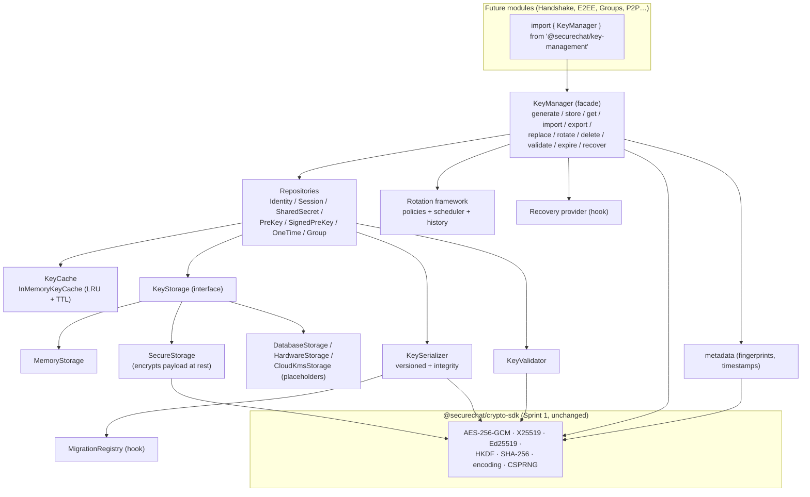
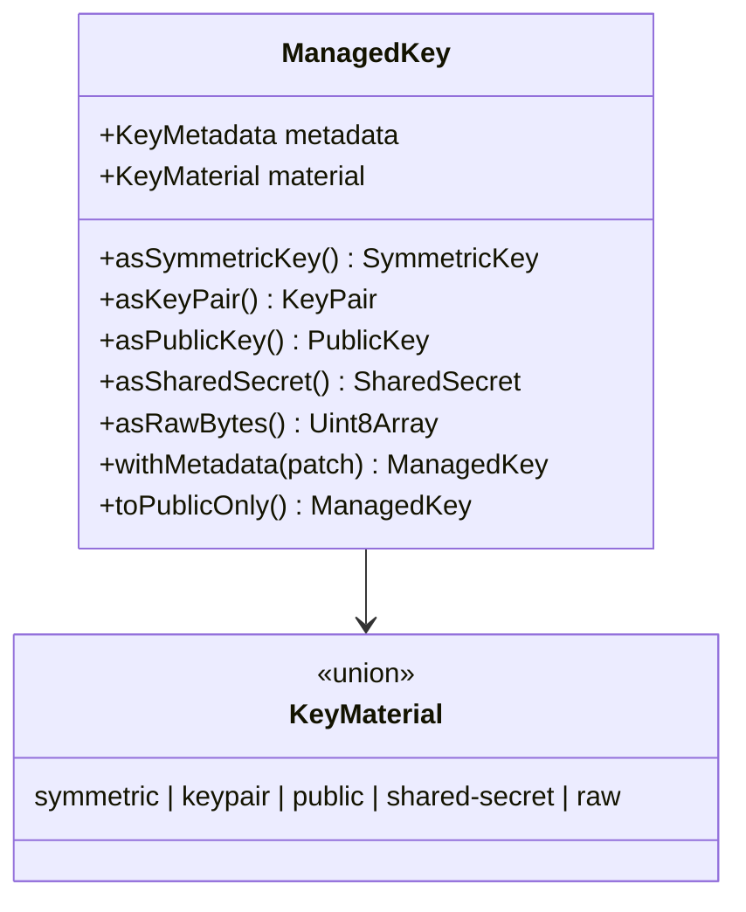
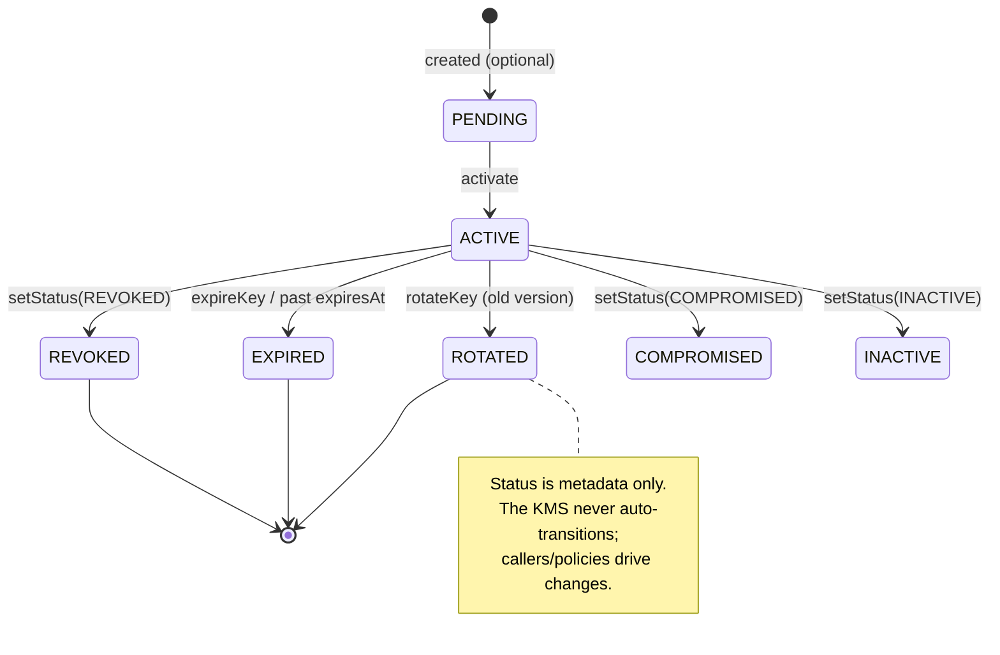
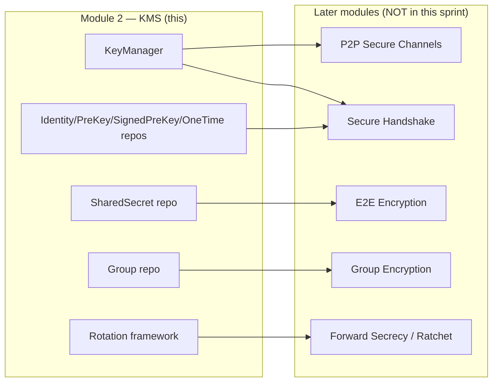

# MODULE 2 — Key Management System

> **Layer 2 (End-to-End Encryption) · Sprint 2**
> Package: `@securechat/key-management`
> Builds on: `@securechat/crypto-sdk` (Sprint 1) — **unchanged**.
> Status: complete, isolated, tested (81 tests passing; Sprint 1's 86 still pass).
>
> This layer **manages keys only**. It does not encrypt chat messages, implement a
> handshake or the Signal protocol, or touch authentication, sockets, or the
> database. It is the reusable key infrastructure that all future security layers
> build on without changing its architecture.

---

## 0. Isolation guarantees

Untouched by this sprint (verified):

- ❌ No change to chat logic, REST APIs, WebSockets, or MongoDB schemas.
- ❌ No change to authentication / JWT.
- ❌ No message encryption, no handshake, no Signal protocol.
- ❌ **No change to the Sprint 1 Crypto SDK** — not one file under `crypto-sdk/src`
  was modified. The KMS lives in its own package (`crypto-sdk/key-management/`),
  imports the SDK as `@securechat/crypto-sdk`, and is the SDK's _only_ dependency.

Verify:

```bash
git status --porcelain server client   # no output → backend untouched
cd crypto-sdk && npm test              # Sprint 1: 86 passing
cd key-management && npm test          # Sprint 2: 81 passing
```

---

## 1. Architecture

The KMS is a layered system. The **`KeyManager`** facade is the primary entry
point; everything beneath it is a small, swappable abstraction.



### Data model

A **`ManagedKey`** = immutable **`KeyMetadata`** + live **`KeyMaterial`** (a Sprint
1 SDK object). Material is a discriminated union:



Everything is immutable: metadata is copied on construction, lifecycle changes
produce a new `ManagedKey` via `withMetadata`, and value getters return copies.

---

## 2. Folder structure

```
crypto-sdk/key-management/
├── package.json            # depends only on @securechat/crypto-sdk (file:..)
├── tsconfig.json           # typecheck; paths → ../src (SDK source)
├── tsconfig.build.json     # emit; paths → ../dist (SDK built types)
├── vitest.config.ts        # alias @securechat/crypto-sdk → SDK source
├── docs/
│   └── MODULE_2_KEY_MANAGEMENT.md   # ← this document
├── src/
│   ├── index.ts            # public surface
│   ├── types/              # enums + data interfaces (no behaviour)
│   ├── errors/             # KeyManagementError hierarchy (12 typed errors)
│   ├── managed-key.ts      # ManagedKey value object
│   ├── metadata/           # createKeyMetadata, computeFingerprint, expiry
│   ├── serializers/        # KeySerializer (versioned + integrity)
│   ├── validators/         # KeyValidator
│   ├── storage/            # KeyStorage + Memory/Secure/placeholder backends
│   ├── cache/              # KeyCache + InMemoryKeyCache (LRU/TTL) + Noop
│   ├── repository/         # BaseKeyRepository + 7 typed repositories
│   ├── rotation/           # policies + scheduler + history (no auto-run)
│   ├── recovery/           # RecoveryProvider + Noop (future hook)
│   ├── migration/          # MigrationRegistry (future format upgrades)
│   └── manager/            # KeyManager facade
└── tests/                  # 81 tests across 11 files
```

---

## 3. Key lifecycle

Every operation the sprint requires, and where it lives:

| Operation                  | API                                                                                                     | Notes                                          |
| -------------------------- | ------------------------------------------------------------------------------------------------------- | ---------------------------------------------- |
| **Generate**               | `generateIdentityKey`, `generateSessionKey`, `generateAgreementKey`, `storeSharedSecret`, `storeRawKey` | uses SDK CSPRNG/keygen                         |
| **Store**                  | `storeKey` / repository `save`                                                                          | validates, serializes, inserts, caches         |
| **Retrieve**               | `getKey` / `findKey` / repository `findById`                                                            | cache → storage                                |
| **Import**                 | `importKey` (JSON / base64 / binary / object)                                                           | validates + integrity-checks                   |
| **Export**                 | `exportKey` (public-only by default)                                                                    | `includePrivate` to include secrets            |
| **Replace**                | `replaceKey` / repository `replace`                                                                     | update existing id                             |
| **Rotate**                 | `rotateKey`                                                                                             | new version + `previousKeyId`, old → `ROTATED` |
| **Delete**                 | `deleteKey` / repository `delete`                                                                       | storage + cache                                |
| **Validate**               | `validateKey` / `KeyValidator`                                                                          | metadata + material + fingerprint + expiry     |
| **Expire** (metadata only) | `expireKey` / `setStatus`                                                                               | never auto-transitions                         |
| **Recover** (future hook)  | `recoverKey` / `backupKey`                                                                              | delegates to `RecoveryProvider`                |



### Rotation mechanics

`rotateKey(keyId, { generator? })`:

1. Load the current key.
2. Produce new material — from `options.generator(previous)`, or a
   type-appropriate default (Ed25519 for identity, AES for session, X25519 for
   prekeys; shared-secret/group/raw require an explicit generator).
3. Create a new `ManagedKey`: `version + 1`, `rotationCount + 1`,
   `previousKeyId = old.keyId`, fresh `keyId`, `status = ACTIVE`, label/custom
   carried forward.
4. Store the new version; mark the old version `ROTATED`.
5. `getHistory(keyId)` walks the `previousKeyId` chain to reconstruct the lineage
   (oldest-first).

---

## 4. Storage abstraction

The rest of the project depends only on the async **`KeyStorage`** interface and
never on where keys live:

```ts
interface KeyStorage {
  readonly name: string;
  readonly available: boolean;
  set(record): Promise<void>; // insert; DuplicateKeyError if exists
  update(record): Promise<void>; // replace; KeyNotFoundError if absent
  get(keyId): Promise<StoredRecord | null>;
  has(keyId): Promise<boolean>;
  delete(keyId): Promise<boolean>;
  list(filter?): Promise<StoredRecord[]>;
  count(filter?): Promise<number>;
  clear(): Promise<void>;
}
```

Implementations:

| Backend               | State          | Notes                                                                                                                                                    |
| --------------------- | -------------- | -------------------------------------------------------------------------------------------------------------------------------------------------------- |
| **`MemoryStorage`**   | ✅ working     | `Map`-backed; deep-copies records for isolation. Default.                                                                                                |
| **`SecureStorage`**   | ✅ working     | Decorator that encrypts the `payload` at rest with AES-256-GCM (SDK), binding `keyId` as AEAD associated data. Index fields stay cleartext for querying. |
| **`DatabaseStorage`** | ⏳ placeholder | Conforms to the interface; every op throws `StorageFailureError`; `available = false`.                                                                   |
| **`HardwareStorage`** | ⏳ placeholder | HSM binding — future.                                                                                                                                    |
| **`CloudKmsStorage`** | ⏳ placeholder | AWS/GCP KMS / Vault — future.                                                                                                                            |

Because everything is behind `KeyStorage`, adding a real database backend later is
a new class — no consumer changes.

---

## 5. Repositories

`BaseKeyRepository` implements read/write over `storage + cache + serializer +
validator` for a single `KeyType`, always consulting the cache first. Seven typed
repositories pin the type:

- **Working now:** `IdentityKeyRepository`, `SessionKeyRepository`,
  `SharedSecretRepository`.
- **Architecture-ready (typed, fully functional via the base) for future protocol
  use:** `PreKeyRepository`, `SignedPreKeyRepository`, `OneTimeKeyRepository`,
  `GroupKeyRepository`.

All are reachable from the manager: `km.identityKeys`, `km.sessionKeys`,
`km.sharedSecrets`, `km.preKeys`, `km.signedPreKeys`, `km.oneTimeKeys`,
`km.groupKeys` — sharing the manager's storage and cache.

Each offers: `save`, `findById`, `getById`, `exists`, `replace`, `delete`,
`list`, `count`, `findByOwner`, `findActiveByOwner`.

---

## 6. Caching

`KeyCache` interface with `InMemoryKeyCache` (default) and `NoopKeyCache`.
`InMemoryKeyCache`:

- **LRU** eviction bounded by `maxSize` (default 1000); accessing an entry marks
  it most-recently-used (via `Map` re-insertion).
- **TTL** per entry (or a default), expired lazily on access plus an explicit
  `sweep()`. Uses an injectable clock for deterministic tests.
- **Stats:** `hits`, `misses`, `evictions`, `expirations`, `size`.

Repositories/the manager read cache → storage, and populate the cache on load.
The cache is bounded but never _loses_ data — a miss falls through to storage.

---

## 7. Metadata framework

Every key carries a complete `KeyMetadata` so future modules never invent their
own. `custom?: Record<string, unknown>` is the sanctioned extension point.

| Field                     | Meaning                                                             |
| ------------------------- | ------------------------------------------------------------------- |
| `keyId`                   | unique, stable id for this version                                  |
| `type`                    | `KeyType` (identity/session/shared-secret/prekey/…)                 |
| `version`                 | rotation version, from 1                                            |
| `algorithm`               | `"ed25519"` / `"x25519"` / `"AES-256-GCM"` / …                      |
| `purpose`                 | signing / key-agreement / encryption / derivation / authentication  |
| `status`                  | pending/active/inactive/rotated/expired/compromised/revoked/deleted |
| `owner`                   | opaque caller id (NOT tied to auth)                                 |
| `createdAt` / `updatedAt` | ISO-8601                                                            |
| `expiresAt?`              | ISO-8601 (metadata only)                                            |
| `rotationCount`           | times this lineage rotated                                          |
| `previousKeyId?`          | link to prior version                                               |
| `fingerprint`             | hex SHA-256 of public/identifying material                          |
| `label?` / `custom?`      | human label / extension fields                                      |
| `sdkVersion`              | Crypto SDK version that produced the key                            |

`computeFingerprint` hashes _public_ bytes for asymmetric material (safe to
expose) and a one-way hash of secret bytes for symmetric/shared/raw.

---

## 8. Validation

`KeyValidator` raises `KeyValidationError` (or `KeyExpiredError`) with a `details`
object naming the offending field. It checks:

- **Format / required fields / enum membership** (`validateMetadata`).
- **Material length vs algorithm** (`validateMaterial`) — 32-byte AES/curve keys, etc.
- **Fingerprint consistency** (`validateFingerprint`) — recomputes and compares in
  constant time; catches corruption and mismatched pairings.
- **Expiry** (`validateNotExpired`) — optional.
- **Unsupported version / corrupted serialization** — enforced by the serializer's
  integrity digest (see §9).
- **Duplicate keys** — enforced at storage insert (`DuplicateKeyError`).
- **Missing metadata** — required-field checks reject it.

---

## 9. Serialization

`KeySerializer` produces a portable, versioned, integrity-checked envelope:

```json
{
  "format": "securechat-kms-key",
  "formatVersion": 1,
  "metadata": { ... },
  "material": { "kind": "keypair", "algorithm": "ed25519", "publicKey": "b64", "privateKey": "b64(pkcs8-der)" },
  "integrity": { "algorithm": "sha256", "value": "<hex digest over canonical {metadata,material}>" }
}
```

- **Forms:** structured object, JSON string, base64, and raw binary — all lossless.
- **Integrity:** a SHA-256 digest over the _canonical_ (key-sorted) `{metadata,
material}` is embedded and re-checked (constant-time) on deserialize. Any
  tampering/corruption → `SerializationError`.
- **Material encoding:** public keys as raw 32-byte points; private keys as PKCS#8
  DER (the SDK does not import raw private keys); symmetric/shared/raw as base64.
- **Versioning:** `formatVersion` is checked; an unknown version is routed through
  the `MigrationRegistry`, else `UnsupportedVersionError`.

---

## 10. Rotation framework

A framework that decides _when_ to rotate and tracks history — it **never rotates
automatically and starts no timers**.

- **Policies** (`RotationPolicy`): `NeverRotatePolicy`, `ManualRotationPolicy`,
  `AgeBasedRotationPolicy(maxAgeMs)`, `UsageBasedRotationPolicy(maxUsage)`,
  `ExpiryRotationPolicy`, `CompositeRotationPolicy(policies, "any"|"all")`.
- **Scheduler** (`RotationScheduler`): pure `evaluate(keys, policy, context)` →
  `RotationDecision[]` (no side effects).
- **Driver** (`RotationSchedulerDriver` + `NoopSchedulerDriver`): the seam for a
  future timer/cron runner. Ships as a no-op.
- **Version tracking & history**: `version`, `rotationCount`, `previousKeyId` on
  each key; `buildHistoryChain` / `KeyManager.getHistory` reconstruct lineage.
- **Migration**: `MigrationRegistry` chains step migrations for future format
  bumps (empty today).

---

## 11. Errors

All extend `KeyManagementError` with a stable `.code` and optional `.cause` /
`.details`: `KeyNotFoundError`, `DuplicateKeyError`, `KeyValidationError`,
`KeyExpiredError`, `StorageFailureError`, `SerializationError`, `ImportError`,
`ExportError`, `RotationError`, `RecoveryError`, `UnsupportedVersionError`,
`MigrationError`.

---

## 12. Security assumptions

- **Cryptography is the SDK's.** All primitives (AES-256-GCM, X25519, Ed25519,
  HKDF, SHA-256, CSPRNG) come from Sprint 1 / OpenSSL. The KMS adds no crypto.
- **`SecureStorage` protects payloads at rest only.** Index metadata (owner, type,
  status, timestamps) is cleartext for querying; the `keyId` is bound as AEAD AAD
  so a ciphertext cannot be relocated to another record undetected. Callers needing
  metadata confidentiality must encrypt at the inner backend.
- **The master key is the caller's responsibility.** `SecureStorage` never persists
  it; it can be derived from a passphrase (SDK `deriveKeyFromPassword`) or supplied
  by an outer KMS.
- **Fingerprints of secrets are one-way hashes** — they identify a key without
  revealing it, but hashing high-entropy secrets is standard and considered safe.
- **`owner` is opaque** — the KMS never interprets it or connects it to auth.
- **In-memory secrets** live in the managed heap; `SymmetricKey.destroy()` /
  `SharedSecret.destroy()` are best-effort (V8 GC caveats apply, per Sprint 1).

---

## 13. Current limitations (documented, not solved here)

- **No persistence by default.** `MemoryStorage` is not durable; `DatabaseStorage`,
  `HardwareStorage`, and `CloudKmsStorage` are interface-only placeholders.
- **No automatic rotation.** The framework evaluates and reports; a scheduler
  driver that actually fires rotations is future work.
- **No real recovery/backup.** `NoopRecoveryProvider` throws; escrow / Shamir /
  social recovery are future.
- **No protocol.** No handshake, no prekey bundles, no Signal/Double-Ratchet, no
  message encryption. The prekey/group repositories exist but are not yet driven by
  any protocol.
- **Single-process.** Cache and memory storage are per-process; multi-node
  coordination is future.
- **RAW private-key import unsupported** (inherited from the SDK) — use JWK/DER/PEM.
- **Metadata not encrypted at rest** in `SecureStorage` (payload only).

---

## 14. Future integration points



- **Secure Handshake** → generate identity (Ed25519) + prekeys (X25519) via the
  manager; publish public-only exports; store the peer's keys.
- **E2E / Forward Secrecy** → persist derived `SharedSecret`s and ratchet keys as
  `ManagedKey`s; rotate via the rotation framework.
- **Group Encryption** → `GroupKeyRepository` + `storeRawKey` for sender keys.
- **P2P Channels** → the same lifecycle, independent of any server relay.

**Where it will eventually touch the backend (context only — untouched now):** per
`PROJECT_KNOWLEDGE.md`, encrypted payloads produced by later modules will ride the
_existing, unchanged_ message/socket pipeline. Key material stays inside this KMS.

---

## 15. Running it

```bash
cd crypto-sdk/key-management
npm install          # links @securechat/crypto-sdk (file:..) + dev-deps
npm test             # 81 tests
npm run typecheck    # tsc --noEmit
npm run build        # emit dist/ (requires the SDK built: cd ../ && npm run build)
```

Test coverage: key generation, import, export, serialization/deserialization,
validation, corrupted keys (integrity + fingerprint), duplicate keys, cache
behaviour (LRU/TTL/stats), rotation metadata + history, repository behaviour,
encrypted-at-rest storage, migration, and **1000-key scale**.
